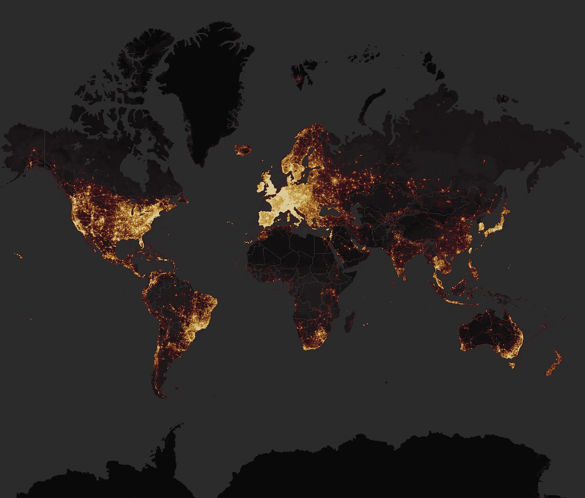
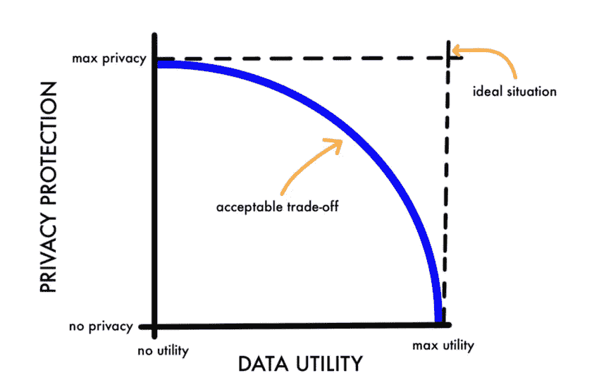
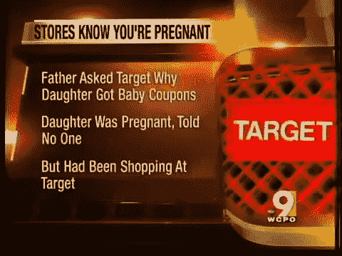
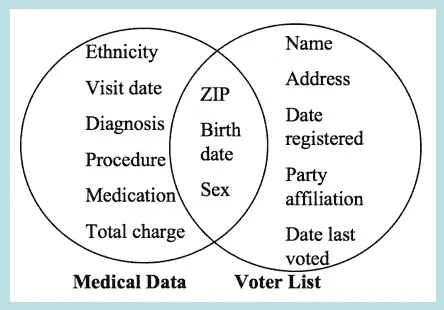
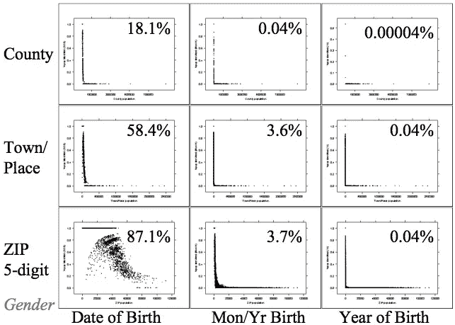
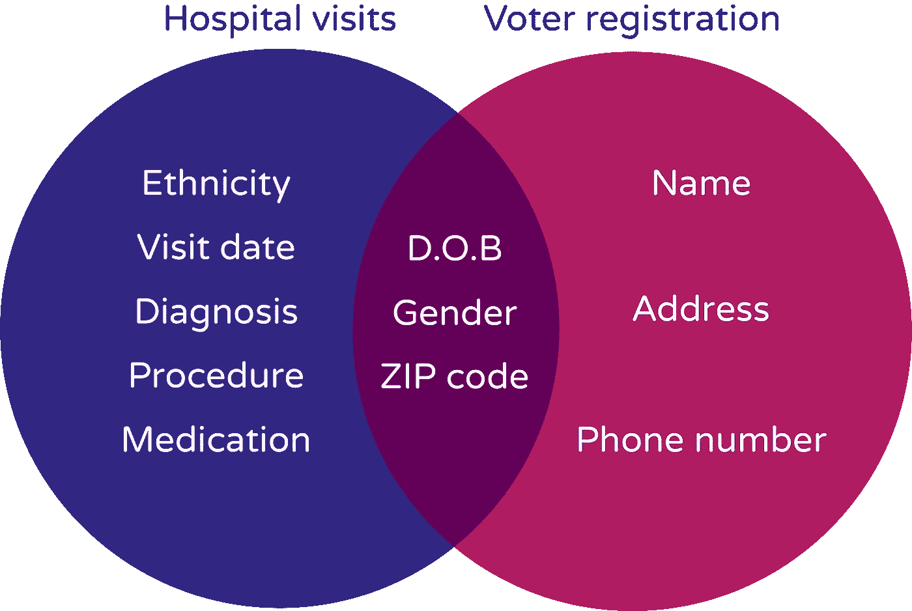
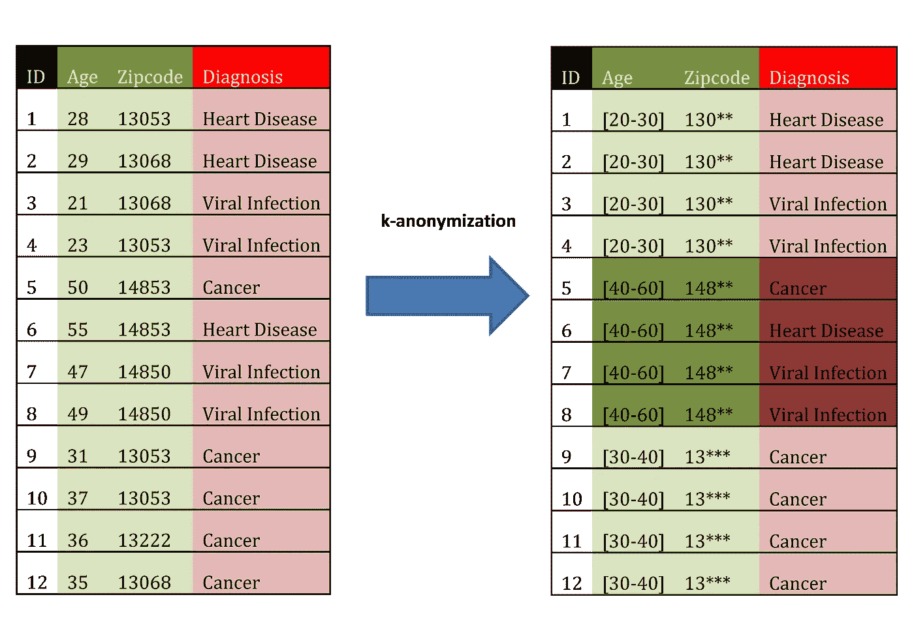
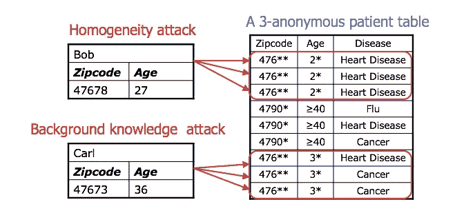
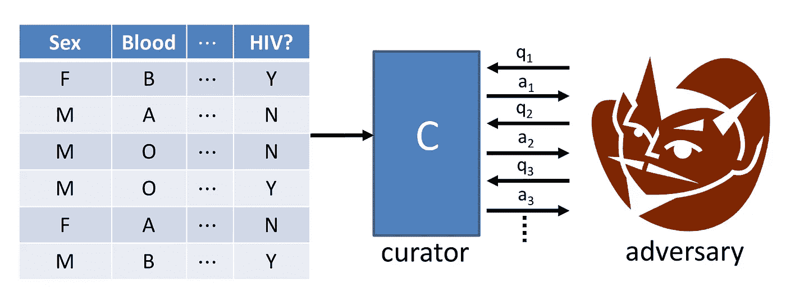

# 大数据时代的数据隐私

> 原文：<https://towardsdatascience.com/data-privacy-in-the-age-of-big-data-c28405e15508?source=collection_archive---------13----------------------->

## 了解你的隐私是多么的少，以及差别隐私是如何帮助你的。

> “争辩说你不在乎隐私权是因为你没什么好隐瞒的，这和说你不在乎言论自由是因为你无话可说没什么区别。”― **爱德华·斯诺登**

2017 年 11 月，跑步应用 Strava 发布了一个数据可视化地图，显示了曾经上传到他们系统的每个活动。这相当于超过 3 万亿个 GPS 点，来自从智能手机到 Fitbits 和智能手表等健身追踪器的各种设备。该应用的一个方面是，你可以看到主要城市的热门路线，或者找到偏远地区锻炼模式不同寻常的个人。

2017 年 11 月发布的 Strava 全球热图。[来源](https://blog.strava.com/zi/press/strava-community-creates-ultimate-map-of-athlete-playgrounds/)

与他人分享你的锻炼活动的想法可能看起来相当无害，但这张地图揭示了军事基地和现役人员的位置。其中一个地点是阿富汗赫尔曼德省的一个秘密军事基地。

阿富汗赫尔曼德省的一个军事基地，慢跑者走过的路线由 Strava 标出。照片:Strava 热图

这不是唯一暴露的基地，事实上，在叙利亚和吉布提等地的活动，用户几乎都是美国军事人员。因此，Strava 数据可视化在某种程度上是驻扎在世界各地的美国军事人员的高度详细的地图。

在这个数据不断增长的时代，保持任何形式的隐私都变得越来越困难。为了给我们的生活带来便利，我们现在不断向公司提供信息，帮助他们改善业务运营。

虽然这有许多积极的好处，例如 IPhone 知道我的位置，能够告诉我附近的餐馆或到达某个位置的最快路线，但它也可能被用于不利的方面，可能导致对个人隐私的严重侵犯。随着我们走向一个越来越数据驱动的社会，这个问题只会越来越严重。

图片由[福布斯](https://www.forbes.com/sites/tomcoughlin/2018/11/27/175-zettabytes-by-2025/#332366895459)提供。

在这篇文章中，我将谈论公开发布的数据集的隐私泄露方面的一些最大失误，可以对这些数据集进行的不同类型的攻击以重新识别个人，以及介绍当前我们在数据驱动的社会中维护隐私的最佳防御措施:*差分隐私*。

# 什么是数据隐私？

1977 年， [Tore Dalenius](https://archives.vrdc.cornell.edu/info7470/2011/Readings/dalenius-1977.pdf) 阐述了统计数据库的迫切需要:

> 没有任何关于个人的东西是可以从数据库中学习到的，如果不访问数据库就无法学习到。——***托雷纽斯***

这一想法希望将众所周知的语义安全概念扩展到数据库，语义安全概念是指当一条消息使用加密算法被编码成密文时，密文不包含潜在消息的任何信息，通常被称为明文。

然而，由于种种原因，哈佛大学计算机科学教授辛西娅·德沃克在一篇论文中已经证明，达勒纽斯提出的这个想法在数学上是不可能的。

这背后的一个原因是，虽然在密码学中，我们经常谈论两个用户在安全通道上通信，同时被保护免受不良行为者的影响，但在数据库的情况下，必须将用户本身视为不良行为者。

所以，我们没有太多的选择。我们可以做的一件事是确定我们的数据集在识别一个人时特别重要的方面，并以这样一种方式处理这些方面，即数据集有效地变得“匿名化”。

**数据集的匿名化/去标识化**本质上意味着不可能(至少表面上)识别数据集中的任何给定个人。我们使用术语**重新识别**来指代从匿名数据集中识别的个人。

## 可识别性的金字塔

个人数据存在于可识别的范围内。想象一个金字塔，在金字塔的顶端，我们有可以直接识别个人的数据:姓名、电话号码或社会保险号。

这些形式的数据统称为' ***直接标识符*。**

金字塔上的直接标识符下面是可以间接但明确地与个人联系在一起的数据。只需要少量数据就可以唯一地识别一个人，例如性别、出生日期和邮政编码，这些数据加起来可以唯一地识别 87%的美国人口。

这些数据统称为' ***间接标识符*** 或' ***准标识符。***’

在准标识符下面是可以与多人模糊关联的数据——身体测量、餐馆偏好或个人最喜欢的电影。

我们的金字塔的第四个阶段是不能与任何特定的人联系起来的数据——汇总的人口普查数据，或广泛的调查结果。

最后，在金字塔的底部，有些数据与个人完全没有直接关系:天气预报和地理数据。

数据的可识别性水平。[来源](https://georgetownlawtechreview.org/re-identification-of-anonymized-data/GLTR-04-2017/)

这样，更难与个人联系起来的信息在可识别性的金字塔上被放在较低的位置。然而，随着数据越来越多地去除个人信息，其对研究和分析的有用性直接下降。因此，隐私和效用在这个范围的两端——楼梯顶端的数据最有用，楼梯底端的数据最隐私。随着数据变得越来越难处理，它对分析的有用性降低了。

效用和隐私之间的权衡。[来源](https://www.researchgate.net/publication/318866074_Practical_Implications_of_Sharing_Data_A_Primer_on_Data_Privacy_Anonymization_and_De-Identification)

作为一名数据科学家，这似乎是一个不能令人满意的答案。我们总是希望我们的数据尽可能准确，以便我们可以做出最准确的推断。然而，从另一个角度来看，我们对个人了解得越少，对他们的隐私就越有利。

那么我们如何平衡这种权衡呢？我们注定会失去准确性或隐私吗？我们在玩零和游戏吗？我们会发现答案实际上是肯定的。然而，现在有一些方法可以从数学上确定数据集的隐私级别，这样我们就可以获得最大量的信息，同时为数据中的个人提供合适的隐私级别。稍后将详细介绍。

# **用于匿名化数据的清理技术**

有四种常用技术可用于取消数据集的标识:

**[1]删除或修订**

这种技术最常用于您不想发布的直接标识符，如电话号码、社会保险号或家庭住址。这通常可以自动完成，因为它直接对应于数据库中的主键。简单地说，删除意味着如果我们有一个 Excel 电子表格，我们将删除对应于直接标识符的列。

在下表中，可以删除第一列“姓名”，而不会影响数据对未来研究的有用性。

这种技术不是万无一失的。直接标识符往往没有明确标注，重要信息可能会被误认为个人信息而被意外删除。

**【2】假名化**

第二种方法只需要将“Name”类别更改为唯一的匿名值，例如列的哈希值或用户 ID。这些可以随机产生或通过算法确定。然而，这样做应该谨慎。如果你有一个学生名单，你用匿名 ID 发布他们的成绩，最好不要按字母顺序排列，因为这样很容易重新识别他们！

类似地，如果使用确定性算法来执行假名化，并且所使用的算法的性质被暴露，那么它会危及个人的匿名性。

例如，2014 年，纽约市出租车和豪华轿车委员会发布了一份当年纽约市所有出租车出行的数据集。在发布数据之前，出租车和豪华轿车委员会试图清除识别信息，特别是他们使用了出租车牌照号码和驾照号码的假名。然而，博客作者能够发现用于改变奖章号码的算法，然后逆转假名。

这种方法也有与第一种方法相同的缺点-直接标识符可能难以识别和替换，并且间接标识符会无意中留在数据集中。

如果在一个数据集内、多个数据集内或长时间内持续使用相同的唯一假名，假名也将失效。

**【3】统计噪声**

前两种方法几乎只适用于直接标识符，后两种方法几乎只适用于间接标识符。

我们可以设想第三种添加统计噪声的方法，将图像中某人的脸像素化。我们基本上允许数据仍然存在，但是它被随机噪声所掩盖。根据完成的方式，这可能是一种非常有效的技术。

将统计噪声引入数据集的一些方式包括:

*   **概括:**具体数值可报为一个范围。例如，患者的年龄可以报告为 70-80 岁，而不是给出完整的出生日期。
*   **扰动:**可以为数据集中的所有患者随机调整特定值。例如，系统地增加或减少患者接受护理的相同天数，或者从正态分布中添加噪声。
*   **交换:**数据可以在数据集中的单个记录之间交换。

正如您可能已经怀疑的那样，越多的直接或间接标识符被统计噪声删除和/或模糊，我们数据的准确性就越低。

**【4】聚合**

第四种方法类似于“统计噪声”部分讨论的一般化思想。不是发布原始数据，而是聚合数据集，只发布汇总统计数据或子集。

例如，数据集可能只提供接受治疗的患者总数，而不是每个患者的个人记录。然而，如果只释放一个小的子样本，重新识别的概率就会增加——比如一个子集只包含一个个体。

在聚合数据集中，个人的直接或间接标识符不会公布。但是，汇总数据必须基于足够广泛的数据范围，以便不会导致对特定个人的识别。例如，在上面的例子中，只有一名女性患者到医院就诊。如果数据中包括 30 名在医院呆过的女性，那么她将更容易被重新识别。

# 隐私泄露

我可以提出这么多隐私泄露的问题，这实际上非常令人担忧，所以我只挑选了其中的几个故事来说明某些重要的观点。

需要注意的是，我在这里谈论的不是*数据泄露*:一些坏人侵入公司或政府数据库，窃取客户的机密信息，尽管这也非常普遍，并且随着物联网(IoT)的出现，越来越令人担忧。

我们明确谈论的是公开可用的数据——即你可以(至少在当时)去下载它——或随后用于识别个人身份的商业数据。这也延伸到用于揭示个人信息的商业智能。

## Netflix 奖

价值 100 万美元的 Netflix 大奖是由网飞发起的一项竞赛，旨在改进该公司的电影推荐系统。在比赛中，该公司发布了一个大型匿名数据库，参赛者可以将其用作推荐引擎的输入数据。

来自奥斯丁大学的研究生 Arvind Narayanan 和 Vitaly Shmatikov 教授能够重新识别网飞发表的数据集中的两个人。

> “公布数据和删除姓名对隐私没有任何好处……如果你知道他们的名字和一些记录，那么你就可以在另一个(私人)数据库中找到那个人。” *—* ***维塔利·什马提科夫***

网飞没有在他们的数据集中包括名字，而是为每个用户使用一个匿名标识符。人们发现，当电影分级的收集与分级的公共数据库相结合时，就足以识别这些人。

纳拉亚南和什马蒂科夫通过使用互联网电影数据库(IMDb)中“几十个”人发布的公开评论来确定网飞数据中两个用户的电影评级，证明了这种危险。他们在网飞发布数据后不久发表了一篇论文。

曝光评论者认为是私人的电影分级可能会暴露该人的重要细节。例如，研究人员发现，其中一个人对一些自由主义和同性恋主题的电影有强烈的——表面上是私人的——观点，并且对一些宗教电影也有评级。

更一般地说，这项研究表明，一个人认为是良性的信息可以用来在其他私人数据库中识别他们。在隐私和情报界，这个结果已经被理解了几十年，但是这个案例让大众媒体看到了这个主题。

## **美国在线**

2006 年 8 月，AOL Research 发布了一个文件，其中包含了超过 658，000 个用户在 3 个月内提出的 2000 万个搜索关键词。该数据集旨在用于研究目的，但在获得重大恶名后 3 天后被删除。然而，此时为时已晚，因为数据已经被镜像并分布在互联网上。这一泄密事件最终导致首席技术官 Abdur Chowdhury 博士辞职。

哪里出了问题？这些数据被认为是匿名的，但被发现泄露了搜索者私人生活的敏感细节，包括社会安全号码、信用卡号码、地址，在一个案例中，显然是搜索者的[意图杀害他们的妻子](http://plentyoffish.wordpress.com/2006/08/07/aol-search-data-shows-users-planning-to-commit-murder/)。

从 AOL 数据集中提取的一些杂项查询。[来源](https://www.somethingawful.com/weekend-web/aol-search-log-2/3/)

虽然 AOL 没有明确指出用户的身份，但[个人身份信息](https://en.wikipedia.org/wiki/Personally_identifiable_information)出现在许多查询中。你试过谷歌自己吗？这就是导致隐私泄露的根本原因。有些人甚至天真到在搜索数据库中输入他们的社会安全号码和地址。

由于 AOL 将查询归因于特定的用户数字标识的账户，因此可以通过这样的信息来识别个人并将其与他们的账户和搜索历史进行匹配。《纽约时报》 通过交叉引用电话簿清单，能够从公布的匿名搜索记录中找到一个人。

## **目标少女怀孕泄密**

《纽约时报》作家查尔斯·杜希格在 2002 年发表的一篇文章中披露，塔吉特百货的一名统计学家安德鲁·波尔被要求开发一个产品预测模型，根据顾客在店内购买的商品来判断她是否怀孕。

WCPO 9 台关于塔吉特怀孕预测模型的新闻报道。[来源](https://www.youtube.com/watch?v=XH1wQEgROg4)

该系统将分析购买习惯，并利用这一点来辨别客户怀孕的可能性，然后将邮寄与怀孕相关的商品的优惠券和广告。这对许多人来说似乎是无害的，甚至是积极的事情。然而，一个开始收到优惠券的购物者是一个十几岁的女孩，她愤怒的父亲打电话到商店投诉广告。目标知道，但父亲不知道，十几岁的女孩怀孕了。

支持目标“怀孕”分类的数据与青少年的身份无关。相反，Target 的结论是基于这名青少年从一组 25 种与怀孕购物者相关的产品中购买的，如无味乳液和维生素补充剂。

虽然这些数据可能不会暴露购物者的身份，但塔吉特的大数据预测系统从她的购物模式中得出一个“令人毛骨悚然”且可能不受欢迎的推论。

这本质上是机器学习中分类任务的一个例子，你会惊讶地发现，使用看似无关的信息来预测年龄、性别、种族、政治派别等个人特征是多么容易。事实上，这基本上是剑桥分析公司在 2016 年美国总统选举期间使用脸书提供的数据所做的。

## 拉坦亚·斯威尼

1996 年，麻省理工学院的一名博士生拉坦娅·斯威尼(Latanya Sweeney)将 GIC 集团保险公司(Group Insurance Company)公开发布和匿名发布的医疗数据与公共选民记录(她花 20 美元购买)相结合，并能够从数据集中重新确定马萨诸塞州州长威廉·韦尔德的身份。

拉坦娅·斯威尼用来重新指认威廉·韦尔德州长的信息。

然后，她使用新获得的信息，向他的家庭地址发送了一封信，解释了她所做的事情，并指出数据匿名的方式显然是不够的。

她的再识别实验结果对以隐私为中心的政策制定产生了重大影响，包括健康隐私立法 HIPAA。

详细描述这些事件的完整文章可以在[这里](https://fpf.org/wp-content/uploads/The-Re-identification-of-Governor-Welds-Medical-Information-Daniel-Barth-Jones.pdf)找到。

这段时间以来，她发表了关于数据隐私话题的最重要的领域之一，名为[《简单的人口统计学常常唯一地识别人(数据隐私工作论文 3)匹兹堡 2000》](http://dataprivacylab.org/projects/identifiability/paper1.pdf)。

这篇论文的结论是，美国 87%的个人可以通过知道三条信息而被唯一地识别:性别、出生日期和邮政编码。

Latanya Sweeney 论文中的图表显示了通过不同的准标识符可识别的人口百分比。

拉坦亚现在是一名教授，在哈佛大学管理着[数据隐私实验室](https://dataprivacylab.org/)。本文稍后将概述一些匿名化数据集的技术，例如'[**k-匿名化**](https://en.wikipedia.org/wiki/K-anonymity) '。

## 金州黑仔

这个故事可能是最有趣的，也是影响最深远的。臭名昭著的金州黑仔是一名杀人犯和连环强奸犯，在 1978 年至 1986 年期间活跃在加利福尼亚州的萨克拉门托县，最终在 2018 年 4 月被捕，享年 72 岁，当时他的一名亲属将 23AndMe 个人基因组测试的遗传信息上传到公共在线数据库。

调查人员将罪犯的 DNA 上传到数据库，希望能找到部分匹配。令他们惊讶的是，他们做到了。调查人员开始研究家谱，以匹配从一个犯罪现场收集的 DNA。从那里，他们调查了那些树上的个体，以缩小嫌疑人的范围。

最终，他们在合适的年龄组中找到了一个人，他生活在金州黑仔活跃的地区。他们从詹姆斯·迪安杰罗扔掉的物品上收集了他的 DNA，然后在实验室进行分析，发现与凶手直接匹配。

虽然抓住一个连环杀手显然是一件积极的事情，但这种对遗传信息的使用引发了关于如何使用遗传信息的重大伦理问题:

其中最明显的是你的基因信息直接识别你——你不能使用数学技术来“匿名化”它，如果你这样做了，它将不再以任何方式代表你。

**【2】**第二个也是更令人难以忘怀的想法是，你的一个远房亲戚有能力侵犯你的隐私。如果你的表亲被发现有患卵巢癌的遗传倾向，并且这些信息在一个在线数据库中，保险公司可以直接将这些信息与你联系起来，以提高你的保费。这破坏了大多数数据收集过程中存在的知情同意的整个概念。

2008 年，美国出台了[基因信息保密法案(GINA)](https://en.wikipedia.org/wiki/Genetic_Information_Nondiscrimination_Act) ，禁止某些类型的基因歧视。该法案意味着健康保险提供者不能基于基因进行歧视。

例如，如果发现一个人有突变的 BRCA2 基因——这种基因通常与患乳腺癌的风险增加有关——他们将被禁止使用这些信息以任何方式歧视这个人。

然而，该法案对人寿保险政策、残疾保险政策或长期医疗保险政策中的歧视只字未提。如果你上传了一个个人基因组测试到一个在线的公共数据库，你最好相信你的人寿保险公司知道这件事。

# 重新识别攻击

在上一节中，我们看到即使匿名化的数据集也可能受到重新识别攻击。这可能会对数据集中的个人以及与分析或生成数据集相关的人员造成伤害。

在讨论的泄露事件中，有几起发生在出于研究目的或作为公司商业活动的一部分而发布的公共数据集中。

这对公司和学术界都提出了重大问题。仅有的两个真正的选择是:

**(1)** 不使用或严格限制公共数据，这在全球社会中是行不通的，会严重阻碍科学进步，或

**(2)** 制定可行的隐私保护方法，允许使用公共数据，而不会给作为公共数据一部分的个人参与者带来重大隐私风险。

然而，如果我们要开发隐私方法，我们需要知道个人能够对数据库进行什么类型的攻击。

## 联动攻击

链接攻击试图通过将数据与背景信息相结合来重新识别匿名数据集中的个人。“链接”使用两个集合中存在的准标识符，如邮政编码、性别、工资等，来建立识别连接。

许多组织没有意识到涉及准标识符的链接风险，尽管他们可能会屏蔽直接标识符，但他们通常不会想到屏蔽或推广准标识符。这正是拉坦亚·斯威尼找到威廉·韦尔德州长地址的方法，也是网飞在 Netflix 有奖竞赛中陷入麻烦的原因！

## 差异攻击

在这种攻击中，攻击者可以通过组合关于数据集的多个聚合统计信息来隔离单个值。这实质上攻击了数据清理方法一节中讨论的聚合方法。

一个简单的例子是查询一个关于患有癌症的用户的数据库。我们向数据库询问患有癌症的用户，然后向数据库询问患有癌症但名字不是 John 的用户。我们可以潜在地使用这些组合的查询结果来对 John 执行差异攻击。

这里是另一个例子，考虑一个虚构的忠诚卡数据产品，其中该数据产品包含所有客户在给定的一天花费的总金额和使用忠诚卡的客户子组花费的总金额。如果正好有一个顾客在购物时没有使用忠诚卡，那么对当天的两个统计数据进行一些简单的算术运算，就可以显示出这个顾客的精确消费总额，并且只发布总值。

这种攻击的一个更一般的版本被称为**复合攻击。**这种攻击涉及组合许多查询的结果来执行差异攻击。

例如，假设一个数据库使用统计噪声来干扰其结果。如果我们对数据库进行 10，000 次相同的查询，根据它产生统计噪声的方式，我们可能能够平均统计噪声数据，并获得接近真实值的结果。解决这个问题的一种方法可能是限制允许的查询数量，或者向相同的查询添加相同的噪声，但是这样做会给系统增加额外的问题。

## 同质攻击

对去标识数据库的同质性攻击示例。

同质性攻击利用了敏感数据属性的所有值都相同的情况。上表提供了一个例子，其中数据库的性别和邮政编码已被收回和概括，但我们仍然能够确定邮政编码为 537**的每个人的工资的一个相当好的想法。尽管事实上我们不能明确地识别个人，但我们仍然能够找出其中一个条目与他们有关。

## 背景知识攻击

背景知识攻击尤其难以防御。它们本质上依赖于个人的背景知识，这可能有助于在数据集中去识别某人。

例如，假设一个人知道他们的邻居去了一家特定的医院，还知道他们的某些属性，如邮政编码、年龄和性别，他们想知道他们可能患有什么疾病。他们发现数据库中有两个条目与这些信息相对应，其中一个条目患有癌症，另一个条目患有心脏病。他们已经在数据库中缩小了搜索结果的范围，但是他们能完全识别出这个人吗？

现在想象一下，邻居是日本人，这个人知道日本人比一般人患心脏病的可能性小得多。他们可以据此合理确定地断定该人患有癌症。

背景知识攻击通常使用贝叶斯统计来建模，贝叶斯统计涉及基于数据集中的属性的先验和后验信念，因为这本质上是个人在执行这种攻击时正在做的事情。一种称为贝叶斯最优隐私的条件有助于抵御这种攻击。

# k-匿名性、L-多样性和 T-紧密性

在这一节中，我将介绍三种技术，它们可以用来降低某些攻击发生的概率。这些方法中最简单的是**k-匿名**，其次是**l-多样性**，再其次是**t-紧密度**。有人提出了其他方法来形成一种字母汤，但这是三种最常用的方法。对于每一种情况，必须对数据集执行的分析变得越来越复杂，并且不可否认地对数据集的统计有效性有影响。

## k-匿名

正如拉坦娅·斯威尼在其开创性的论文中所说:

> 如果包含在发布中的每个人的信息不能与至少 k-1 个其信息也出现在发布中的个人相区分，则发布提供 k-匿名保护。

这实质上意味着，只要我的数据集包含至少 k 个给定准标识符集合的条目，那么它就是 k-匿名的。如果我们像前面一样使用邮政编码、性别和年龄的超级键，如果数据集中邮政编码、性别和年龄的每个可能组合中至少有 3 个条目，那么数据集将是 3-匿名的。

原始数据集(左)和 4-匿名数据集(右)。[来源](https://amnesia.openaire.eu/amnesiaInfo.html)

这有助于防止链接攻击，因为攻击者不能高度确定地链接到另一个数据库。然而，仍然有可能有人执行同质攻击，如在所有 k 个个体具有相同值的示例中。例如，如果三个年龄组、性别和邮政编码相同的人碰巧都患有同一种癌症，k-匿名不能保护他们的隐私。同样，它也不能防御背景知识攻击。

k-匿名数据集上的同质性和背景知识攻击的例子。[来源](https://elf11.github.io/2017/05/22/kanonymity.html)

k-匿名的可接受水平是多少？没有明确的定义，但一些论文认为 k=5 或 k=10 的水平是优选的。学术领域的大多数个人似乎都同意 k=2 是不够的，k=3 是保护隐私所需的最低限度(尽管不一定能保证隐私)。

您可能已经意识到，选择的 k 值越高，数据的效用就越低，因为我们必须执行泛化(减少列中唯一值的数量)、模糊化(模糊某些数据特征或组合它们)和抑制(在应用其他去标识方法后删除不能满足 k=3 的行元组)。可以添加合成行，从每列的边缘分布或所有列的联合分布中获取样本，而不是隐藏。

显然，所有这些机制都会严重扭曲或偏向数据集的统计数据，这些技术的权衡仍然是学术研究的主题。Olivia Angiuli 和 Jim Waldo 在出版物“ [*中讨论了 HarvardX 数据在大规模数据集*](https://ieeexplore.ieee.org/document/7552278) 的去识别中概括和抑制之间的统计权衡。

当准标识符的数量变大时，使数据集 k 匿名可能导致大部分数据丢失(80%的数据可以仅通过抑制来移除)或被添加(例如为数据集中当前的每一行添加 3 行以使其 4 匿名)，这在大多数大型公共数据集中都会发生。

在我自己尝试制作 k-anonymous 数据集之前，我可以告诉你，实现匿名并仍然拥有并非无用的数据绝非易事。

## l-多样性

一些人已经注意到可以在 k-匿名数据集上执行的攻击的可能性，因此隐私研究人员更进一步，提出了 l-多样性。作者将 l-多样性定义为:

> …要求敏感属性的值在每个组中得到很好的代表。

他们在数学细节上对此进行了扩展，本质上是指任何被认为是“敏感”的属性，如个人的医疗状况，或学生是否通过了某门课，在每个子集 k 内至少有 L 个不同的值。

更简单地说，这意味着如果我们从一个大学班级中取出四个人的数据块，发现这些数据块具有相同的准标识符(例如相同的邮政编码、性别和年龄)，那么在该组中必须至少有 L 个不同的值——我们不能让该组中的所有人都只有及格分数。

这有助于确保个体不会在同质攻击中被唯一地识别。然而，如果敏感属性的所有值都是不利的，例如在“等级”列中所有值都有不同但较低的等级，或者在“医疗状况”列中所有值都有不同类型的癌症，这仍然可能侵犯某人的隐私。

这并不能使事情变得完美，但它比 k-匿名更进了一步。然而，在对数据集执行这一操作后，它再次提出了关于数据集的统计有效性的其他问题，因为它将涉及抑制或添加行，这将改变数据的分布，并且也作为自采样偏差的一种形式。

例如，在 EdX 数据中，发现完成课程的学生比不经意的课堂观察者提供了更多关于他们自己的信息，因此这些学生中的大多数可以被唯一地识别。因此，当在数据集上使用 k-匿名和 l-多样性时，它删除了大多数已经完成课程的人！很明显，这不是一个理想的情况，并且仍然存在关于如何处理这种情况以最小化以这种方式向数据集引入偏差的公开问题。

## t-贴近度

作为 k-匿名和 l-多样性的另一种扩展，隐私研究人员还提出了 t-紧密度。他们将 t-封闭性描述为:

> 我们提出了一种新的隐私概念，称为 t-封闭性，它要求敏感属性在任何等价类中的分布都接近属性在整个表中的分布(即两个分布之间的距离应该不超过阈值 t)。我们选择使用推土机距离测量来满足我们的 t 接近度要求。

在上面的段落中，等价类意味着 k 个匿名子集中的 k 个个体。其思想实质上是确保不仅等价类中的值是 L-多样的，而且这 L 个不同值的分布应该尽可能接近总体数据分布。这将有助于消除引入 EdX 数据集中的一些偏见，这些偏见与删除成功完成课程的人有关。

以下是针对这些算法和其他旨在保护数据隐私的算法的参考科学论文:

[**k-匿名:一种保护隐私的模型**](https://dataprivacylab.org/projects/kanonymity/index.html)

[**ℓ-Diversity:隐私超越 k-匿名**](https://personal.utdallas.edu/~mxk055100/courses/privacy08f_files/ldiversity.pdf)

[**t-封闭性:超越 k 的隐私-匿名性和多样性**](https://www.cs.purdue.edu/homes/ninghui/papers/t_closeness_icde07.pdf)

[**m-不变性:面向隐私保护的动态数据集再发布**](http://citeseerx.ist.psu.edu/viewdoc/download?doi=10.1.1.100.3713&rep=rep1&type=pdf)

# 存在哪些规定？

存在许多隐私法规，它们可能有很大的不同，要写下并解释它们可能有点困难，所以我选择了 HIPAA 和美国 FERPA 法规作为比较的例子。

[**健康保险可携带性和责任法案(HIPAA)**](https://en.wikipedia.org/wiki/Health_Insurance_Portability_and_Accountability_Act)

该法规涵盖了美国的所有医疗数据，最初(1996 年发布时)规定在发布数据之前，必须从数据集中删除所有个人身份信息(PII)。根据我们前面的讨论，这对应于直接标识符，即直接识别您是谁的信息，如姓名、地址和电话号码。因此，HIPAA 只需从公开发布的数据中抑制(删除/移除)这些特性就可以满足。

此后，法规得到了更新，现在要求根据 HIPAA 隐私规则取消数据集的身份，该规则规定:

1.  删除上面列出的 18 个特定标识符(安全港方法)
2.  经验丰富的统计专家验证和记录重新识别的统计风险的专业知识非常少(统计方法)

[受保护健康信息](https://en.wikipedia.org/wiki/Protected_health_information)范围内的 18 个属性是:

1.  名称
2.  小于一个州的所有地理标识符，邮政编码的前三位数字除外，如果根据美国人口普查局当前公开可用的数据:由所有邮政编码和相同的前三位数字组合而成的地理单元包含超过 20，000 人。
3.  与个人直接相关的日期(年份除外)
4.  电话号码
5.  传真号码
6.  [电子邮件地址](https://en.wikipedia.org/wiki/Email)
7.  社会安全号码
8.  医疗记录号码
9.  健康保险受益人数
10.  账号
11.  证书/许可证号码
12.  车辆标识符和序列号，包括车牌号码；
13.  设备标识符和序列号；
14.  Web [统一资源定位符](https://en.wikipedia.org/wiki/Uniform_Resource_Locator)(网址)
15.  互联网协议(IP)地址号码
16.  生物标识符，包括指纹、视网膜和声纹
17.  全脸摄影图像和任何类似的图像
18.  任何其他独特的识别号、特征或代码，除了研究者指定的编码数据的独特代码

请注意，HIPAA 数据并不一定是 k 匿名的。

[**【FERPA 家庭教育权利与隐私法案】**](https://en.wikipedia.org/wiki/Family_Educational_Rights_and_Privacy_Act)

该法规涵盖了美国的所有教育数据，包括 K-12 和大学信息。该条例规定，不仅必须清除所有 PII，而且还必须确保任何人都不可能被高度肯定地认出。这意味着我们必须满足比 HIPAA 更严格的要求。如果我们查看大学医疗信息，必须遵循更严格的法规，因此在这种情况下，FERPA 将占主导地位，而不是 HIPAA。

使用 k-匿名可以满足 FERPA 的要求。

# 差异隐私

本文的主旨是让您了解不同的隐私，以及它计划如何在一个数据驱动的世界中彻底改变隐私的概念。谷歌、苹果、优步，甚至美国人口普查局都采用了不同形式的差别隐私。

我们已经看到，k-匿名、l-多样性和 t-紧密度方法绝不是完美的，它们也不能保证它们是面向未来的。我们希望能够对数据集进行统计分析，例如关于人口的推断、机器学习训练、有用的描述性统计，同时仍然保护个人级别的数据免受所有攻击策略和关于个人的辅助信息的影响。使用以前的方法，有人可以在 10 年内利用新技术或算法重新识别整个数据集——没有正式的隐私保证。

这就是差别隐私为我们提供的:隐私的数学保证，它是可测量的，是未来可预见的。差别隐私的目标是给每个人大致相同的隐私，因为他们的数据被删除。也就是说，在数据库上运行的统计函数不应该过度依赖于任何一个人的数据。

密码学不适用于数据集，因为潜在的对手是数据集用户本身。因此，隐私研究人员在假设数据分析师是对手的情况下开发了一个数学框架，旨在将敏感信息泄露给分析师的可能性降至最低，即使分析师对数据集提出了多个顺序查询。

当隐私研究人员不再试图确保隐私是数据输出的属性，而是开始认为它是数据分析本身的属性时，这一启示就出现了。这导致了差别隐私的形成，它提供了一种“设计隐私”的形式，而不是作为一种事后的想法在末尾标记隐私。

负责协调数据分析师(对手)与原始数据源(我们的数据库系统)之间的接口的管理员。

因此，我们的要求是，对手不应该知道任何个人的数据是否被任意更改。简单来说，如果我删除数据集中的第二个条目，对手将无法分辨两个数据集之间的区别。

我们使用称为ϵ.的变量来测量(1)具有个体 x 的数据集和(2)不具有个体 x 的数据集之间的差异

这是如何工作的？

让我们想象一下，我们的数据分析师问馆长，数据集中艾滋病毒阳性且血型为 b 型的人占多大比例。差分私有系统会回答这个问题，并向数据中添加已知水平的随机噪声。**算法是透明的**，所以数据分析师被允许确切地知道这个随机噪声是从什么分布中采样的，这对于算法隐私没有任何影响。

需要添加的噪声量是 1/n，以确保如果从数据集中删除一个人，数据分析师将无法分辨，其中 n 是数据集中的人数。这应该是有意义的，因为噪声水平为 2/n 意味着分析师无法判断个人数据是否被更改、添加或删除，或者它是添加到数据集的噪声的函数。

随着数据集中个体数量的增加，为保护单个个体的隐私而必须添加的噪声量会逐渐变小。

添加的噪声通常是拉普拉斯分布的形式，隐私的级别可以用我们称之为ϵ.的“隐私参数”来控制我们可以认为这个值是两个数据集之间的差异，这两个数据集只有一个不同:一个单独的 X 出现在其中一个数据集中，而不在另一个数据集中。

隐私参数的直观定义。

当ϵ的值非常小时，我们有更大的隐私-我们有效地向数据集添加了更大量的噪声，以掩盖特定个人的存在。当ϵ的值很大时，我们的隐私就更弱了。通常，ϵ的值小于 1，通常更接近于零，大约在 0.01-0.1 之间。

这里创造的是一种算法，它确保无论对手了解到我什么，它都可以从其他人的数据中了解到。因此，诸如吸烟和肺癌之间是否存在联系的推断仍然会在数据中清晰地出现，但关于特定个人是否吸烟或患有癌症的信息将被掩盖。

对于允许多个查询的数据集，这是如何工作的？

这是一个很重要的问题:如果我向数据集提出足够多的问题，它最终会向我坦白所有人的信息吗？这就是隐私预算概念的由来。

“机制”(我们与数据库和数据分析师交互的数据管理员)受到限制，不会泄露特定于个人的信息。每次你问一个问题，它就会回答你的问题，这就消耗了你的一些隐私预算。你可以继续询问关于同一组数据的问题，直到你达到最大隐私预算，此时该机制将拒绝回答你的问题。

请注意，这不会阻止您再次询问有关数据的问题，这意味着该机制将强制您访问的数据必须添加新的噪声量，以防止隐私泄露。

隐私预算的概念起作用的原因是隐私参数的概念构成得很好——来自后续查询的隐私值可以简单地加在一起。

因此，对于 k 个查询，我们有 kε的差分隐私。只要 kε <有隐私预算，该机制仍然会响应查询。

希望，到这一点，你开始意识到这样一个数学上保证的隐私算法的含义，并且现在理解为什么它优于 k-匿名、l-多样性和 t-封闭性的概念。这已经由公司以不同的形式实施，我们将快速查看配方之间的差异。

## 全局差分隐私

这是我在上面的例子中提到的最直观的差分隐私形式，其中数据库由公司或政府管理员在一个集中(单一)的位置管理。

例如，美国人口普查局正计划在 2020 年美国人口普查中使用全球差异隐私。这意味着该局将得到所有的数据，并把它放入一个数据库中。在此之后，研究人员和感兴趣的团体将能够查询人口普查数据库并检索关于人口普查数据的信息，只要他们不超出他们的隐私预算。

一些人担心全球差异隐私，因为数据以原始形式存在于其来源。如果一家私人公司这么做了([优步](https://arxiv.org/pdf/1809.07750.pdf)是目前我所知道的唯一一家使用全球差分隐私的公司)，那么如果这些数据被传唤，该公司将不得不交出个人的敏感信息。幸运的是，对于美国人口普查局来说，他们在加入该局时发誓绝不通过人口普查数据侵犯个人隐私，所以他们对此非常重视。此外，该局不允许被任何政府机构传唤，即使是像联邦调查局或中央情报局这样的机构，所以你的数据在相当安全的手中。

## 本地差分隐私

这种形式的差别隐私被[谷歌用于他们的 RAPPOR 系统](https://static.googleusercontent.com/media/research.google.com/en//pubs/archive/42852.pdf)用于谷歌 Chrome，以及[使用 IOS 10](https://www.apple.com/privacy/docs/Differential_Privacy_Overview.pdf) 及以上版本的苹果 IPhones。这个想法是，信息从个人的设备发出，但噪音是在源头添加的，然后以掺假的形式发送到苹果或谷歌的数据库。因此，谷歌和苹果无法访问原始和敏感的数据，即使他们被传唤，这些数据是由他人获得的，也不会侵犯你的隐私。

局部和全局差分隐私的区别。[来源](https://www.accessnow.org/understanding-differential-privacy-matters-digital-rights/)

# 最终意见

恭喜你到文章结尾了！这是对数据隐私的一次相当深入的探讨，我敦促你跟上隐私世界正在发生的事情——了解你的数据在哪里以及如何被公司和政府使用和保护，可能会成为未来数据驱动社会的一个重要话题。

> "独处是现代世界中最珍贵的东西。"
> ― **安东尼·伯吉斯**

## 时事通讯

关于新博客文章和额外内容的更新，请注册我的时事通讯。

 [## 时事通讯订阅

### 丰富您的学术之旅，加入一个由科学家，研究人员和行业专业人士组成的社区，以获得…

mailchi.mp](https://mailchi.mp/6304809e49e7/matthew-stewart)