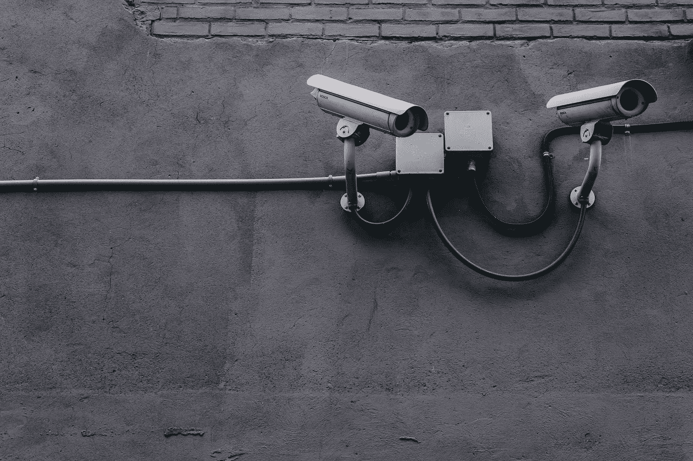

# 数据隐私、安全和新冠肺炎

> 原文：<https://towardsdatascience.com/data-privacy-safety-and-covid-19-1a9412052eaf?source=collection_archive---------29----------------------->

照片由来自[佩克斯](https://www.pexels.com/photo/equipment-pavement-security-security-camera-430208/?utm_content=attributionCopyText&utm_medium=referral&utm_source=pexels)的[斯科特·韦伯](https://www.pexels.com/@scottwebb?utm_content=attributionCopyText&utm_medium=referral&utm_source=pexels)拍摄

# 安全性和数据隐私之间的权衡

数据被广泛用于对抗新冠肺炎。大部分数据是个人数据:

*   **各州**正在聚集力量加强对我们行动和健康状况的监控。以台湾为例，它全面强制跟踪手机，以监控被隔离的个人。西班牙现在推出了一个公共卫生监测应用程序，要求个人报告他们的每日体温，以帮助更准确地绘制传播图，并为早期病例提供支持
*   私营企业正在通过应用程序收集数据，包括体温、既往病史、姓名、电话号码等，以支持对抗这种疾病的快速研究进展
*   个人自愿向私营和公共部门提供个人数据，以帮助绘制地图、追踪、跟踪和摧毁新冠肺炎。通过每天报告我们的体温，我们允许卫生服务部门快速识别冠状病毒阳性病例，并尽早解决它们。这种大规模数据报告还允许更准确地绘制扩散图和根病例定位图。但我们也在与雇主分享比平时更多的个人数据，以确保我们继续工作的能力，并与其他为新冠肺炎研究做出贡献的私营公司分享

作为个人，我们正在我们的安全和数据隐私之间进行权衡。

可以理解。今天不分享你的个人数据可能会导致人类死亡，包括你和你所爱的人，当我们的生存依赖于分享个人信息时，降低我们对隐私的担忧似乎是合理的。

但这是一个特殊的情况和一个明确的目的，不是一概的许可，也不是承认我们愿意放弃我们的隐私权。

# 新冠肺炎期间的数据隐私

人们有理由担心，在这场危机之后，数据隐私可能无法恢复。

历史上的许多例子表明，虽然国家在攫取权力方面速度很快，但一旦被攫取，它通常很不愿意放手。

为了避免这种情况，这种全社会范围的个人数据共享行为需要在同意的障碍下理解。

必须遵循《一般数据保护条例》( GDPR)中规定的同意原则。我们自愿提供数据的唯一目的是为了对抗新冠肺炎。

GDPR 案文第五条第一款概述的原则必须遵守。这些要求个人数据应:

*“(a)以合法、公平和透明的方式对个人进行处理(“合法、公平和透明”)；”*

*(b)为特定、明确和合法的目的收集，并且不以不符合这些目的的方式进一步处理；出于公共利益、科学或历史研究目的或统计目的的存档目的的进一步处理不应被视为与初始目的不相容(“目的限制”)；”*

*(c)充分、相关且仅限于处理目的所必需的内容(“数据最小化”)；”*

*(d)准确，并在必要时保持更新；必须采取一切合理措施，确保不准确的个人数据(考虑到处理这些数据的目的)立即被删除或更正(“准确性”)。”*

*(e)以允许识别数据主体的形式保存，保存时间不超过处理个人数据所需的时间；个人数据可以存储更长时间，前提是个人数据的处理仅用于出于公共利益、科学或历史研究目的或统计目的的存档目的，但需执行 GDPR 要求的适当技术和组织措施，以保护个人的权利和自由(“存储限制”)；”*

*(f)使用适当的技术或组织措施(“完整性和保密性”)，以确保个人数据适当安全的方式进行处理，包括防止未经授权或非法的处理以及防止意外丢失、破坏或损坏。”*

在这种特殊情况下，我们提供数据的唯一目的**是为了**抗击这种病毒*(“目的限制”)*；我们期望**我们的数据不会被非法**使用，并要求了解这些数据的用途*(“合法、公平和透明”)*；实施的监测措施应**仅整理和分析相关的和需要**用于此目的的数据，例如无人驾驶飞机、电话 GPS 跟踪等……*(“数据最小化”)；*我们希望我们的数据在任何时候都不会受到未经授权的访问*(“完整性和保密性”)*

# 新冠肺炎会议后的数据隐私工作

在克服这一危机之后，数据隐私方面的工作必须允许个人了解谁拥有他们的数据，在哪里，出于什么目的，并行使他们的数据主体权利。

所需的一些工作包括:

a) **由于冠状病毒危机期间的数据共享，盘点哪些数据保存在哪里**。类似于 GDPR 生效时企业所做的工作。目前整理个人数据的公共和私营机构需要清点冠状病毒爆发期间从数据主体持有的数据(结构化和非结构化数据)，以审核其是否符合存储限制、准确性和完整性以及保密性的原则。

**获取个人的同意。**公共和私人代理都需要确保对持有的任何个人数据以及在不确定的情况下应该再次收集的个人数据进行同意。目前，政府和私人公司都被默许访问和使用个人数据来对抗新冠肺炎病毒。在这种情况下，议会授予的特殊权力和个人自愿提供数据就足够了。然而，在此之后，将需要获得用户的明确同意，以继续持有和/或使用经过整理的数据，特别是在目的发生变化时。

c) **允许个人行使其数据权利。**为了抗击冠状病毒，个人应该有机会对危机期间收集的任何数据行使删除、遗忘、纠正等权利。

随着人工智能技术的普及和数据在未来几年成为重要的价值来源，保护数据隐私和个人决定使用自己数据的权利应该成为每个人的首要任务。

不管情况如何，我们应该总是要求机制来收回我们的数据并重新访问我们的同意。新冠肺炎就是这样一个例子，在那里，我们放松数据隐私要求的意愿是准时的，并且是为了特定的目的。