# 使用 Python 的数据处理示例

> 原文：<https://towardsdatascience.com/data-processing-example-using-python-bfbe6f713d9c?source=collection_archive---------8----------------------->

## 只是为分析和机器学习准备数据集所涉及的一些步骤。

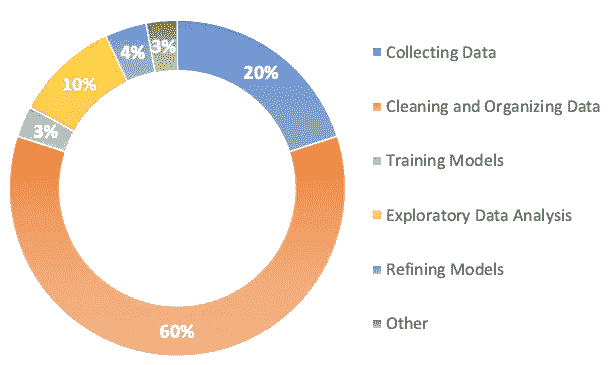

来源:图片由作者创建

《福布斯》的调查发现，数据科学家工作中最不愉快的部分占据了他们 80%的时间。20%用于收集数据，另外 60%用于清理和组织数据集。就我个人而言，我不同意 80%是我们工作中最不愉快的部分。我经常将数据清理任务视为一个开放式问题。通常，每个数据集可以根据手头的问题以数百种不同的方式进行处理，但我们很少能够将同一组分析和转换从一个数据集应用到另一个数据集。我发现构建不同的处理管道并研究它们的差异如何影响模型性能是我工作中令人愉快的一部分。

也就是说，我想花点时间向您介绍准备数据集进行分析的代码和思考过程，在这种情况下，这将是一个回归(即。多元回归)。

# 资料组

关注我的人都知道，我对人力资源数据集特别感兴趣，因为我大部分职业生涯都在这个行业工作。

> **如果你有一个罕见的人力资源数据集，请与我们分享:)**

我们将使用 310 名在职和离职员工的数据集，以及婚姻状况、性别、部门、工资率、州、职位等信息。由于我们正在为回归分析准备数据，我们的目标功能是 **EngagementSurvey。**

我们数据集的代码本可以在[这里](https://rpubs.com/rhuebner/HRCodebook-13)找到。

# 分析

```
import numpy as np
import pandas as pd
import datetime
import matplotlib.pyplot as plt
import seaborn as sns
from sklearn.pipeline import make_pipeline
from feature_engine import missing_data_imputers as mdi
from feature_engine import categorical_encoders as ce
from sklearn.model_selection import train_test_split%matplotlib inlinewith open('HRDataset.csv') as f:
    df = pd.read_csv(f)
f.close()df.head()df.info()
```

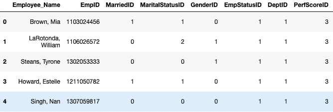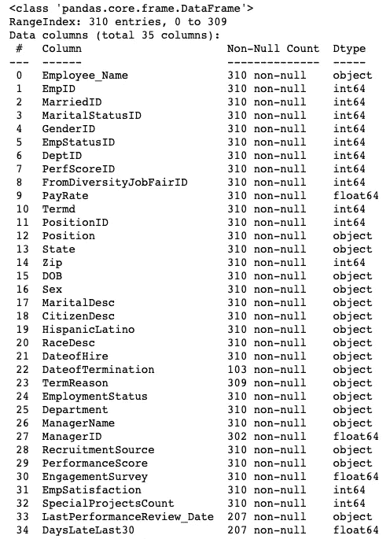

加载数据后，我们可以看到许多独特的要素类型。我们有分类特征，例如“雇员姓名”和“职位”。我们有二进制特征，比如“MarriedID”。我们有持续的功能，如“支付率”和“员工满意度”。我们有离散的功能，如“DaysLateLast30”，最后我们有日期功能，如“LastPerformanceReview_Date”。

## 高或低特征可变性

我通常采取的第一步是检查每个要素值的唯一计数，以确定是否有任何要素会由于非常高或非常低的可变性而被快速删除。换句话说，我们是否有任何具有与数据集长度一样多的唯一值的要素，或者只有一个唯一值的要素？

```
for col in df.columns:
    print(col, df[col].nunique(), len(df))
```

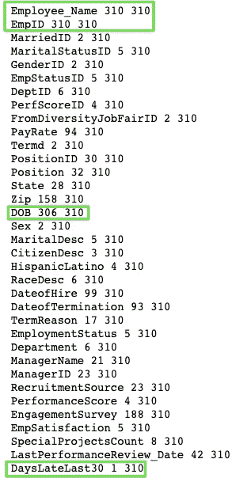

```
df.drop(['Employee_Name'], axis=1, inplace=True)
df.drop(['EmpID'], axis=1, inplace=True)
df.drop(['DOB'], axis=1, inplace=True)
df.drop(['DaysLateLast30'], axis=1, inplace=True)
```

我们可以安全地删除“雇员姓名”、“雇员 ID”、“出生日期”，因为大多数(如果不是全部的话)值对于每个特性都是唯一的。此外，我们可以删除“DaysLateLast30 ”,因为该特性只包含一个唯一值。

## 重复特征

接下来，通过检查包含每个特性的定义的码本，我们可以看到我们有许多重复的特性。例如，“MarriedStatusID”是一个数字特征，它生成与“MaritalDesc”特征中的已婚雕像相匹配的代码。我们可以放弃这些功能。

```
df.drop(['MaritalStatusID', 'EmpStatusID', 'DeptID'], axis=1, inplace=True)
df.drop(['GenderID'], axis=1, inplace=True)
df.drop(['PerformanceScore'], axis=1, inplace=True)
df.drop(['MarriedID'], axis=1, inplace=True)
```

你可能会问自己“那么‘Position id’，‘Position’，‘manager id’和‘manager name’呢？".从上面的输出可以看出，这些特征对的唯一值计数不匹配。“位置 ID”有 32 个唯一值，而“位置”有 30 个。

```
df[['PositionID', 'Position']].sort_values('PositionID')[50:70]
df[['ManagerName', 'ManagerID']].sort_values(by='ManagerID').tail(50)df.drop('PositionID', axis=1, inplace=True)
df.drop('ManagerID', axis=1, inplace=True)
```

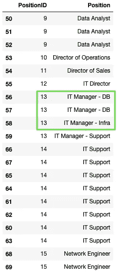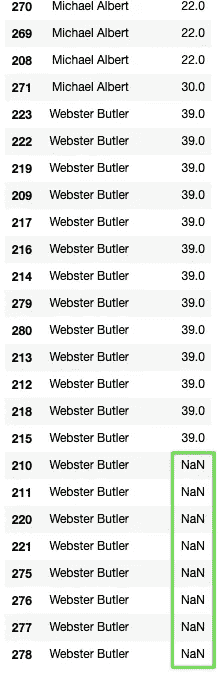

我们将删除“PositionID ”,因为它不维护所有可用的位置；我们将删除“ManagerID ”,因为“ManagerName”不包含任何缺失值。

## 奇数值和数据收集错误

接下来，让我们检查每个特性的单个唯一值。这将有助于我们看到任何赔率值和需要修复的错误。

```
for col in df.columns:
    print(col, df[col].unique(), len(df))
```

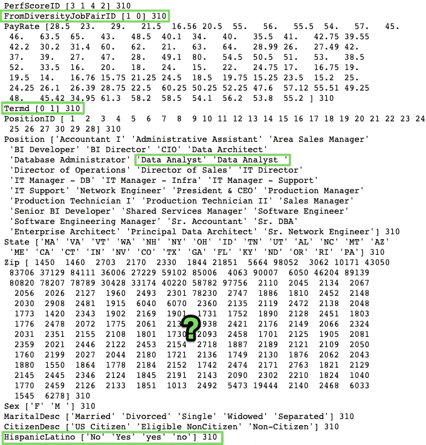

从码本中，我们知道诸如“FromDiversityJobFairID”和“Termd”的特征是“是”和“否”的二进制编码。为了简化我们的分析和帮助格式化，我们需要将二进制转换成字符串。我们还看到需要删除“数据分析师”和“生产”部门的尾随空格。最后，我们看到一个需要纠正的“西班牙裔拉丁人”的编码错误。

```
diversity_map = {1: 'yes', 0: 'no'}
termd_map = {1: 'yes', 0: 'no'}
hispanic_latino_map = {'No': 'no', 'Yes': 'yes', 'no': 'no', 'yes': 'yes'}df['FromDiversityJobFairID'].replace(diversity_map, inplace=True)
df['Termd'].replace(termd_map, inplace=True)
df['HispanicLatino'].replace(hispanic_latino_map, inplace=True)df['Position'] = df['Position'].str.strip()
df['Department'] = df['Department'].str.strip()
```

你可能会问自己“为什么有些邮政编码是 5 位数，而有些只有 4 位数？”。在美国，所有的邮政编码都是 5 位数。经过一点谷歌搜索，许多马萨诸塞州的邮政编码实际上是从零开始的，默认情况下，python 去掉了零，产生了 4 位数的邮政编码。因为我们将把邮政编码视为分类特征，所以长度并不重要。

## 处理日期时间功能

信不信由你，但是日期时间特性通常包含大量的信息等待被释放。当一个人熟悉数据来源的行业时，这一点尤其明显。

```
df['DateofHire'] = pd.to_datetime(df['DateofHire'])
df['DateofTermination'] = pd.to_datetime(df['DateofTermination'])
df['LastPerformanceReview_Date'] = pd.to_datetime(df['LastPerformanceReview_Date'])df['DateofHire_month'] = df['DateofHire'].dt.month
df['DateofHire_day'] = df['DateofHire'].dt.day 
df['DateofHire_year'] = df['DateofHire'].dt.year
df['DateofHire_quarter'] = df['DateofHire'].dt.quarter
df['DateofHire_day_week'] = df['DateofHire'].dt.day_name()
df['DateofHire_weekday'] = np.where(df['DateofHire_day_week'].isin(['Sunday','Saturday']),'yes','no')df['DateofTerm_month'] = df['DateofTermination'].dt.month
df['DateofTerm_day'] = df['DateofTermination'].dt.day
df['DateofTerm_year'] = df['DateofTermination'].dt.year
df['DateofTerm_quarter'] = df['DateofTermination'].dt.quarter
df['DateofTerm_day_week'] = df['DateofTermination'].dt.day_name()
df['DateofTerm_weekday'] = np.where(df['DateofTerm_day_week'].isin(['Sunday','Saturday']),'yes','no')df['LastPerform_month'] = df['LastPerformanceReview_Date'].dt.month
df['LastPerform_day'] = df['LastPerformanceReview_Date'].dt.day 
df['LastPerform_year'] = df['LastPerformanceReview_Date'].dt.year 
df['LastPerform_quarter'] = df['LastPerformanceReview_Date'].dt.quarter
df['LastPerform_day_week'] = df['LastPerformanceReview_Date'].dt.day_name()
df['LastPerform_weekday'] = np.where(df['LastPerform_day_week'].isin(['Sunday','Saturday']),'yes','no')df['tenure_termed'] = df['DateofTermination'] - df['DateofHire']
df['tenure'] = datetime.datetime.today() - df['DateofHire']
df['days_since_review'] = datetime.datetime.today() - df['LastPerformanceReview_Date']df.drop(['DateofHire', 'DateofTermination', 'LastPerformanceReview_Date'], axis=1, inplace=True)df.head()
```

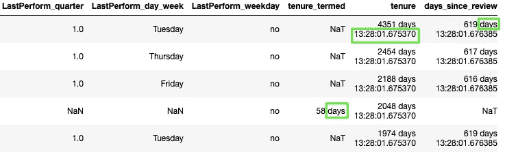

首先，我们需要将我们的特性转换成日期时间格式。接下来，使用“datetime”库，我们可以从原始的 datetime 特性中提取新的特性，包括月、日、年、季度、工作日字符串，甚至当天是否是周末。最后，我们可以将各个日期相减，计算出任期(终止日期—聘用日期)和任期(今天的日期—聘用日期)。一旦我们提取了必要的信息，我们可以放弃原来的功能。

```
df['days_since_review'] = df['days_since_review'].astype(str)
df['days_since_review'] = [i[0:3] for i in df['days_since_review']]df['days_since_review'] = df['days_since_review'].astype(str)
df['days_since_review'] = [i[0:3] for i in df['days_since_review']]df['tenure_termed'] = df['tenure_termed'].astype(str)
df['tenure_termed'] = [i[0:2] for i in df['tenure_termed']]for var in df.columns:
    df[var].replace(to_replace=['NaT','Na'], value=np.nan, inplace=True)df.head()
```

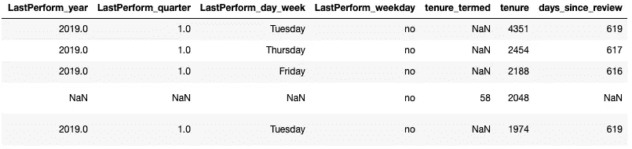

也许我有点强迫症，但我喜欢整洁的数据集，因此，让我们从这些新功能中删除不相关的信息，如“天”和时间戳。最后，我们将 NaT 和 Na 转换为真正的 numpy NaN。

## 检查基数

```
for var in df.columns:
    print(var, '\n', df[var].value_counts()/len(df))df.drop(['CitizenDesc', 'DateofHire_weekday', 'DateofTerm_weekday', 
         'LastPerform_quarter', 'LastPerform_weekday', 'LastPerform_year'], axis=1, inplace=True)
```

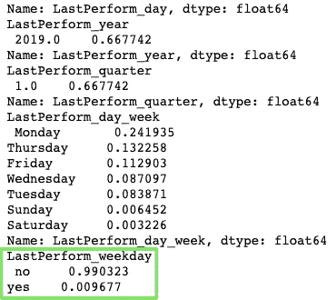

## **低方差**

基数是指每个特性的唯一值/类别的数量。数字特征，尤其是连续特征，将具有非常高的基数，但是我们主要需要关注分类特征。首先，我们需要识别包含吸收所有方差的值/类别的特征。换句话说，90%以上的观察值属于一个或两个值。例如，“CitizenDesc”有三个唯一的值，但我们看到“美国公民”包含所有观察值的 95%。不幸的是，展示这种模式的其他功能是我们新设计的功能，如“DateofHire_weekday”、“DateofTerm_weekday”、“LastPerform_quarter”、“LastPerform_weekday”和“LastPerform_year”。我们可以放心地放弃这些特性，因为它们没有提供足够的可变性，没有意义。

## **稀有值/类别**

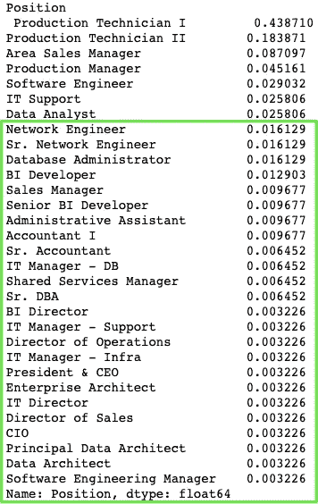

使用与上面相同的代码，我们再次将注意力转向分类特征，但这一次我们要寻找我们认为“罕见”的值。你如何定义“稀有”真的取决于你，但我发现这个决定必须根据不同的特性来做。如果某些值出现的时间少于 1%，那么它们可能很少见。在其他特性中，阈值可能是 2%甚至 5%。我们的最终目标是将这些价值组合成一个新的价值/类别，称为“稀有”。此过程减少了特征的整体基数，如果您选择一次性编码您的类别特征，此方法将大大减少新创建的“虚拟”特征的数量。

*   **声明**:低于 **1%** 的任何东西都将被视为‘稀有’
*   **位置**:任何低于 **2%** 的情况都将被视为“罕见”
*   **Zip** :任何低于 **2%** 的都将被视为“罕见”
*   **RaceDesc** :任何低于 **2%** 的都将被视为“罕见”
*   招聘来源:低于 2% 的任何东西都将被视为“稀有”
*   **三天的日期**:任何低于 **2%** 的日期都将被视为“罕见”
*   DateofTerm_month :小于 **2%** 的任何数据都将被视为“罕见”
*   **DateofTerm_day** :小于 **2%** 的任何数据都将被视为“罕见”
*   **LastPerform_day** :任何低于 **2%** 的情况都将被视为“罕见”
*   **LastPerform_day_week** :小于 **2%** 的任何内容都将被视为“罕见”
*   **一年中的日期**:任何小于 **2%** 的日期都将被视为“罕见”
*   **DateofTerm_year** :小于 **2%** 的任何数据都将被视为“罕见”
*   **经理姓名**:任何低于 **5%** 的都将被视为‘罕见’

## 缺少值

决定如何处理缺失值是数据科学家将做出的最重要和最有争议的决定之一。

```
for var in df.columns:
    if df[var].isnull().sum()/len(df) > 0:
        print(var, df[var].isnull().mean().round(3))df.drop('tenure_termed', axis=1, inplace=True)
```


TermReason 是一个分类特征，只有一些缺失的数据点。我们可以使用模式估算该数据，因为这不会改变特征的分布。此外，我们可以有把握地假设，缺少 TermReason 仅仅意味着该雇员仍然有效。剩下的带有缺失数据的特征就是我们所说的“非随机缺失”(MNAR)。换句话说，这些特征的缺失是有潜在原因的。首先，缺失值的百分比似乎在重复，这给了我们一个线索，即这些缺失值有一个可辨别的模式。其次，我们从数据中了解到，大约 67%的员工是在职的，不会有离职日期。最后，在最近的绩效考核周期后雇用的员工通常不会有与其上次绩效考核日期相关联的日期。如果您希望了解更多关于缺失值的信息，请参考此[资源](https://stefvanbuuren.name/fimd/sec-MCAR.html)。

有些人会认为 67%的缺失值实际上使特性变得无用，我同意我们的“任期”特性的这种观点。输入这个数字特征可能会在我们的数据中引入太多的误差方差/偏差。然而，诸如“DateofTerm_month”和“LastPerform_month”之类的特征在本质上是分类的，它们的缺失数据具有明确的模式。我想通过用字符串“missing”输入所有缺失值来捕捉缺失值的重要性。通过这种方式，我们为每个特性引入了另一个值/类别，它恰当地捕捉到了缺失值背后的模式。

另一方面，“天数 _ 自 _ 回顾”是一个数字特征，它是 MNAR。换句话说，为了捕捉这些缺失值的重要性，我们将估算一个任意的数字(即-9999)并创建一个新特征，该新特征将指示该特征的观测值是否缺失。

*   术语原因:用模式估算
*   DateofTerm_month:使用' missing '进行估算以创建新类别
*   DateofTerm_day:用' missing '估算以创建新类别
*   DateofTerm_year:用' missing '估算以创建新类别
*   DateofTerm_quarter:用' missing '估算以创建新类别
*   DateofTerm_day_week:用' missing '估算以创建新类别
*   LastPerform_month:用' missing '估算以创建新类别
*   LastPerform_day:用' missing '估算以创建新类别
*   LastPerform_day_week:用' missing '估算以创建新类别
*   任期 _ 期限:由于大量数据缺失而下降
*   审查以来的天数:任意插补和缺失指标特征

## 处理异常值

离群值是另一个需要思考的有争议的话题。有许多处理异常值的方法。如果您有一个非常大的数据集和相对较少的离群值，您可以简单地删除它们。我通常对这种方法持谨慎态度，因为它会改变所述特征的分布，这可能会导致新值成为异常值。也就是说，这是一个经常使用的选项。其他方法包括添加指示要素，使用 np.log()重新缩放整个要素，以及通过应用离散化将异常值包含在一个条柱中来将连续要素转换为离散要素。

首先，我们需要确定是否有异常值。用于识别异常值的最著名的方法是 z-score 方法，该方法将特征值标准化为均值为零，标准差为一，任何低于 3 个标准差(正或负)的值都被视为异常值。就个人而言，我认为这种方法是有缺陷的，因为 z 值依赖于特征的平均值和标准差。均值和标准差都受到现有异常值的严重影响。均值和标准差计算中包含的任何异常值都将扩大 z 值的范围，并可能忽略现有的异常值。这个问题可以通过使用中间值而不是平均值来解决。

让我们利用一个更稳健的方法，它依赖于四分位距和中位数。您可以调整此方法，并使用(3 * IQR)仅识别极端异常值。

```
def outlier_treatment(feature):
    sorted(feature)
    q1,q3 = np.percentile(feature , [25,75])
    IQR = q3 - q1
    lower_range = q1 - (1.5 * IQR)
    upper_range = q3 + (1.5 * IQR)
    return lower_range,upper_rangeoutlier_treatment(df['PayRate'])
lower_range, upper_range = outlier_treatment(df['PayRate'])df[(df['PayRate'] < lower_range) | (df['PayRate'] > upper_range)]
```

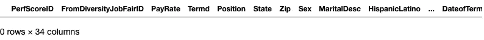

## 训练/测试分割

```
X = df.drop('EngagementSurvey', axis=1)
y = df['EngagementSurvey']X_train, X_test, y_train, y_test = train_test_split(X, y, test_size=0.2, random_state=42)
```

## 数据处理流水线

```
**# impute categorical features with more than 5% missing values w/ a new category 'missing'**
process_pipe = make_pipeline(
    mdi.CategoricalVariableImputer(variables=['DateofTerm_month', 'DateofTerm_day','DateofTerm_quarter', 'DateofTerm_day_week',
'LastPerform_month', 'LastPerform_day','LastPerform_day_week', 'DateofTerm_year'], imputation_method='missing'),

**# Imputing categorical features with less than 5% missing values w/the mode**
    mdi.CategoricalVariableImputer(variables=['TermReason'], imputation_method='frequent'),

**# Imputing missing values for numerical feature 'days_since_review' with an arbitrary digit**
    mdi.ArbitraryNumberImputer(arbitrary_number = -99999, variables='days_since_review'),

**# We are adding a feature to indicate (binary indicator) which records were missing**
    mdi.AddMissingIndicator(variables=['days_since_review']),

**# Encoding rare categories (less than 1% & the feature must have at least 5 categories)**
    ce.RareLabelCategoricalEncoder(tol=0.01, n_categories=5,
                                   variables=['State']),

**# Encoding rare categories (less than 2% & the feature must have at least 5 categories)**
    ce.RareLabelCategoricalEncoder(tol=0.02, n_categories=5,
    variables=['Position', 'Zip', 'DateofTerm_day', 'LastPerform_day_week', 'DateofTerm_year', 'RaceDesc', 'TermReason', 'RecruitmentSource','DateofHire_day', 'DateofTerm_month', 
'LastPerform_day', 'DateofHire_year']),

**# Encoding rare categories (less than 5% & the feature must have at least 5 categories)**
    ce.RareLabelCategoricalEncoder(tol=0.05, n_categories=5,
                                   variables=['ManagerName']),

**# Target or Mean encoding for categorical features**
    ce.OrdinalCategoricalEncoder(encoding_method='ordered',
    variables=['FromDiversityJobFairID', 'Termd','Position', 'State','Zip','Sex', 'MaritalDesc','HispanicLatino', 'RaceDesc', 'TermReason','EmploymentStatus', 'Department', 'ManagerName', 
'RecruitmentSource', 'DateofHire_month','DateofHire_day', 'DateofHire_day','DateofHire_quarter', 'DateofHire_day_week', 
'DateofTerm_month', 'DateofTerm_day','DateofTerm_year', 'DateofTerm_quarter','DateofTerm_day_week', 'LastPerform_month', 
'LastPerform_day', 'LastPerform_day_week'] 
))
```

我们还没有讨论的一个话题是分类特征编码。我通常尝试并避免使用一键编码，因为它有极大扩展特征空间的趋势。如果我们使用一次性编码,“稀有”值/类别的编码当然有助于解决这个问题。也就是说，我选择使用目标或均值编码，因为它不会扩展特性集。这种方法用从 0 到 k-1 的数字替换类别。我们首先为每个类别的每个分类特征计算目标变量的平均值，然后根据平均值大小用上述数字替换平均值。例如，我们有一个二元目标，第一个分类特征是性别，它有三个类别(男性、女性和未公开)。让我们假设男性的平均值是 0.8，女性是 0.5，未披露的是 0.2。编码值将是男性=2，女性=1，未公开=0。

## 资料处理

```
process_pipe.fit(X_train, y_train)X_train_clean = process_pipe.transform(X_train)
X_test_clean = process_pipe.transform(X_test)X_train_clean.head()
```

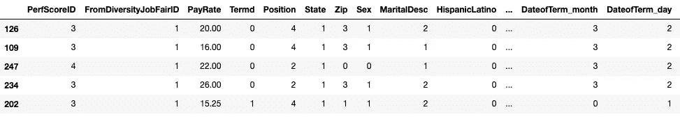

## 摘要

如果您认为我可能错过了某个重要步骤，请随时提供反馈。感谢阅读！