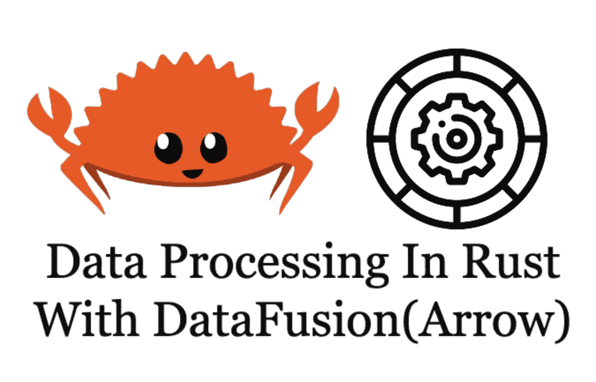

# Rust 中的数据处理与数据融合(箭头)

> 原文：<https://towardsdatascience.com/data-processing-in-rust-with-datafusion-arrow-56df5432de68?source=collection_archive---------25----------------------->



Rust 中的数据处理与数据融合(作者提供图片)

Rust 是最受喜爱的语言，据 stack overflow 称，它连续四年高居榜首！有了 Apache Spark 这样的框架，数据处理变得越来越简单和快速。然而，数据处理领域竞争激烈。data fusion(Arrow now 的一部分)是将数据处理引入 Rust 的最初尝试之一。如果您有兴趣学习 Rust with DataFusion 中数据处理的某些方面，我将展示 Rust with DataFusion 中的一些代码示例，并比较 DataFusion 和 Pandas 之间的查询性能。

*更新:我最初在*data fusion*0 . 15 . 0 版本中写了这篇文章。在 DataFusion 和 Arrow 的 1.0.0 版本中，我添加了代码和基准，因此我们可以看到改进。*

# 数据融合

[安迪·格罗夫](https://github.com/andygrove)创造了[数据融合](https://github.com/andygrove/datafusion)，他有一些关于构建现代分布式计算的伟大文章，例如[如何构建现代分布式计算平台](https://andygrove.io/how_to_build_a_modern_distributed_compute_platform/)。正如 Andy 提到的，DataFusion 项目还不适合生产环境，

> “这个项目是学习构建查询引擎的一个很好的方式，但这还很早，还不能用于任何现实世界的工作。”

该项目于 2019 年 2 月捐赠给 Apache Arrow 项目，更多人开始为 Arrow 版本的 [DataFusion](https://github.com/apache/arrow/tree/master/rust/datafusion) 做贡献。

> DataFusion 是一个内存查询引擎，它使用 Apache Arrow 作为内存模型。它支持对 CSV 和 Parquet 文件执行 SQL 查询，也支持直接查询内存中的数据。

项目描述可能不会带来太多的兴奋，但由于整个项目都是在 Rust 中完成的，它为您提供了关于在 Rust 中编写分析 SQL 的想法。此外，您可以轻松地将 DataFusion 作为库添加到 Rust 项目的 Cargo 文件中。

# 初始设置

为了用 DataFusion 测试运行一些代码，首先，我们需要创建一个新的 Rust 包

```
cargo new datafusion_test --bin
```

然后在 Cargo.toml 文件中引入 DataFusion 作为依赖项

```
[dependencies]
arrow = "1.0.0"
datafusion = "1.0.0"
```

# 测试数据集

网上有很多可用的数据集， [Kaggle](https://www.kaggle.com) 是我经常去探索新数据集的地方之一。我们将使用[的电影数据集](https://www.kaggle.com/rounakbanik/the-movies-dataset?select=ratings.csv)，该数据集的完整版本约为 676.68 MB。电影数据集具有以下模式

```
userId: intmovieId: intrating: doubletimestamp: long
```

为了处理 CSV 文件格式，DataFusion 过去需要我们在这里提供模式，因为 1.0.0 版本引入了模式推断，这不再需要。

```
let schema = *Arc*::new(*Schema*::new(vec![ *Field*::new(“userId”, *DataType*::UInt32, false), *Field*::new(“movieId”, *DataType*::UInt32, false), *Field*::new(“rating”, *DataType*::Float64, false), *Field*::new(“timestamp”, *DataType*::Int16, false)]));
```

# 初始选择(版本 1.0.0)

随着 1.0.0 版本中引入更多特性，DataFusion API 带来了许多激动人心增强。您会看到诸如模式推断、更容易打印结果等改进。代码非常简洁，易于阅读。

DataFusion 1.0.0 的代码示例

# DataFusion 与 Pandas 的性能比较

这不是一个公平的比较，因为数据融合是全新的，缺乏大量的优化。但看到 DataFusion 的当前状态并将其与 pandas 等成熟的数据处理包进行比较仍然很有趣。

*免责声明:我在我的个人 Mac 13 (* 2 GHz 四核英特尔酷睿 i5 *)上运行它来执行基准测试，结果可能会有偏差。因为最初的基准测试是在调试模式下发布的，所以注意到发布模式下的性能有很大的不同。*

## 查询 1:选择前 10 行

```
**Query**: “SELECT userId,movieId,rating FROM ratings LIMIT 10”**DataFusion**: 0.7s**Pandas**: 6.15s
```

数据融合在随机存取 10 行上运行得非常快。另一方面，熊猫要慢 6s 左右。

## 查询 2:获得每个用户的平均评分

```
**Query**: “SELECT userId, AVG(rating) FROM ratings GROUP BY userId”**DataFusion**: 18.57s**Pandas**: 6.24s
```

由于熊猫在引擎盖下使用 NumPy，所以看到熊猫方面的良好表现就不足为奇了。在数据融合方面，虽然它比 Pandas 慢，但性能对于执行这些类型的聚合也是合理的。

## 问题 3:最高评分是多少

```
**Query**: “SELECT MAX(rating) FROM ratings”**DataFusion**: 15.28s**Pandas**: 5.97s
```

由于前面的分析查询看起来很慢，因此该查询在数据融合端也会很慢。

# 最后的想法

正如我们首先讨论的，DataFusion 是 Rust 进入竞争激烈的数据计算市场的一次令人兴奋的尝试。由于 DataFusion 项目仍处于早期阶段，需要更多的贡献，所以在某些类型的查询上看到一些缓慢的性能并不奇怪。此外，如项目自述文件中所述，缺少一些关键特性，因此您必须小心您编写的 SQL 命令，并仔细检查它当前是否受支持。

总的来说，DataFusion 是 Rust 对数据世界的一个有吸引力的开始，尤其是它现在是 Apache Arrow 的一部分，DataFusion 可以轻松利用 Arrow 生态系统的功能。我希望在 DataFusion 的未来版本中看到显著的性能改进和更多受支持的 SQL 特性。

希望这个故事对你有帮助。本文是我的工程&数据科学系列的**部分，目前包括以下内容:**


[赵承志](https://chengzhizhao.medium.com/?source=post_page-----56df5432de68--------------------------------)

## 数据工程和数据科学故事

[View list](https://chengzhizhao.medium.com/list/data-engineering-data-science-stories-ddab37f718e7?source=post_page-----56df5432de68--------------------------------)47 stories

你也可以 [**订阅我的新文章**](https://chengzhizhao.medium.com/subscribe) 或者成为 [**推荐媒介会员**](https://chengzhizhao.medium.com/membership) 可以无限制访问媒介上的所有故事。

如果有问题/评论，**请不要犹豫，写下这个故事的评论**或者通过 [Linkedin](https://www.linkedin.com/in/chengzhizhao/) 或 [Twitter](https://twitter.com/ChengzhiZhao) 直接**联系我。**