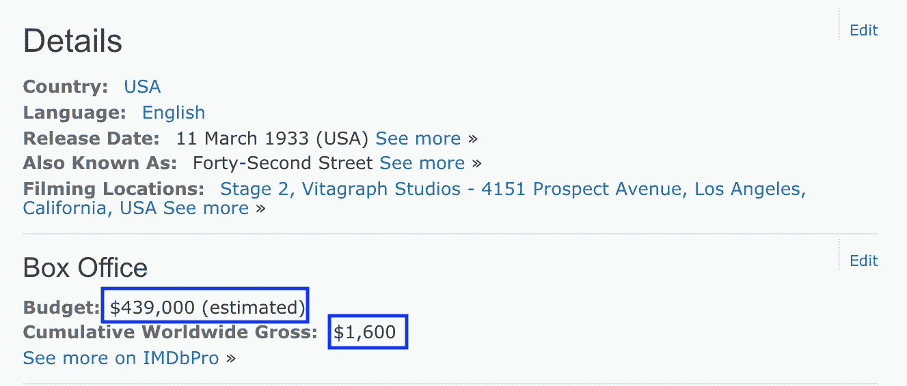
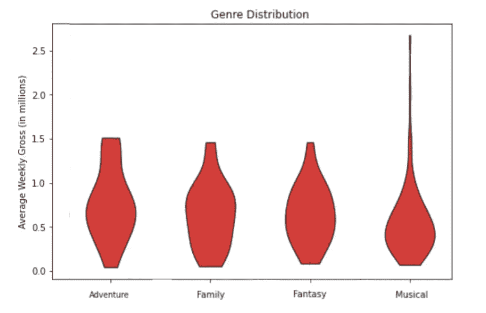
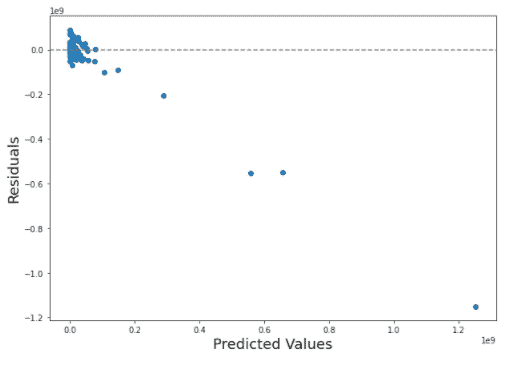

# 纯度如何定义您的数据科学项目

> 原文：<https://towardsdatascience.com/data-purity-why-it-makes-or-breaks-a-project-3-easy-ways-to-ensure-it-a55b3e869ae0?source=collection_archive---------52----------------------->

## [入门](https://towardsdatascience.com/tagged/getting-started)

## 使用一部电影→ **百老汇回归模型来证明对良好数据的需求**

一个丢失的数据点(或字母！)能让**都**与众不同(图片由 [Franki Chamaki](https://unsplash.com/@franki?utm_source=medium&utm_medium=referral) 、 [Unsplash](https://unsplash.com?utm_source=medium&utm_medium=referral) )

你不需要线性回归器来识别数据科学的核心租户之一— ***坏数据*** 导致 ***坏研究*** 。这在我与 Metis data science boot camp 的第二个项目中得到了生动的展示，这是一个线性回归模型，旨在根据电影的商业成功预测改编自百老汇戏剧或音乐剧的总收入。在本文中，我们将讨论数据纯度，以及为什么在这项研究中缺乏数据纯度导致了一个还不太适合这个阶段的模型。

(对于任何对螺母和螺栓感兴趣的人，请查看[项目回购](https://github.com/nickwilders/project_2)！)

# 什么是数据纯度？

**数据纯度**是我在学习 SQL 时第一次遇到的术语，特指某一列中的值超出了该列的范围。如果你有一列数字代表一周中的某一天，任何大于 7 的数字都会被认为是不纯的。一周有七天，所以任何超过七天的数字一定是由计算或人为错误造成的。这不一定代表异常值(就像“1”在一个充满周末的表格中代表星期一——6 和 7)，但更多的是指逻辑上和统计上不可能的数字(-9，或 900)。

当您处理从 web 上搜集的数据时，数据纯度变得尤为重要。网页抓取是一项细致但奇怪的令人满意的任务，最好的描述是编写成千上万个小机器人进入网页并提取数据。这对于一些巨大的数据收集任务也是必要的——例如，从 10，000+ [IMDB](http://www.imdb.com) 页面中抓取信息。这是我项目的第一步，除了其他特点，我还对每部电影的*和 ***国内外总收入*** 特别感兴趣。这些变量被认为是特征，可能被你的高中科学老师称为*自变量*。*

# *特征可变纯度*

*对于大多数正片长度的电影来说，这些信息在 IMDB 上很容易获得，而且相当可靠。2017 年翻拍的 [*美女&野兽*](https://www.imdb.com/title/tt2771200/) 是设计这部网络电影的完美参考，预计 1.6 亿美元的预算与 5.04 亿美元的国内总收入和 12.6 亿美元的国际总收入相比非常合理。然而，一些电影在信息方面并不那么可靠。就拿 1933 年的电影**来说，这个灵感来源于轰动一时的百老汇同名音乐剧。这部电影在预算和全球票房之间取得了有趣的平衡:***

******

***《第 42 街》是 1933 年最卖座的电影之一，它的表现并不理想。(图片:[*IMDB*](https://www.imdb.com/title/tt0024034/)*)****

***你试着向投资者解释一下利润。***

***当然,*42 街*在其商业寿命中赚了 1600 多美元。事实上，它已经赚了 1000 多倍，达到了[220 万美元](https://www.the-numbers.com/movie/42nd-Street#tab=summary)。这些错误并不总是被额外的研究纠正；事实上，经常交叉引用的来源有一些明显错误的信息，而 IMDB 有正确的数据。然而，通常情况下，这些信息在任何地方都不存在*。有时会有[国内毛额信息](https://www.imdb.com/title/tt0036613/)(但没有预算)，有时会有[预算信息](https://www.imdb.com/title/tt0070121/?ref_=fn_al_tt_1)(但没有毛额)。事实证明，当“砒霜和旧花边”的预算总额不容易获得时，并没有太大的轰动。****

**这当然是最重要的问题。在最终的数据集中，几乎一半的**只在这两个特征中含有杂质。国内总收入虽然不是舞台改编成功的可靠预测指标，但却是相关性最高的变量，但国内总收入仅适用于约三分之二的报废电影。这项研究受益于百老汇票房的铁证金融数据(感谢这个 [Kaggle](https://www.kaggle.com/jessemostipak/broadway-weekly-grosses?select=synopses.csv) 数据集，来自[百老汇联赛](https://www.broadwayleague.com/home/)挑剔的周票房记录)，但所有的特征变量都来自电影表现。****

****确保数据纯度的最简单方法是确保*准确的*数据存在于您的特征中，并在您的模型中仅使用该准确的数据。几乎每个数据集都存在缺失值，但在相对较小的样本中，你必须确保所有数据的都是准确的。当我意识到我的数据有问题时，我花了几个小时在网上搜索，手动输入那些没有通过网络搜索的值。这很有帮助，但是我仍然有数百个空值。那些空值可以用来做什么？****

# **目标可变纯度**

**在从 IMDB 中抓取和清理了 10，000 部电影的数据后，是时候与上面提到的百老汇总数据集(1986 年以来的所有节目)合并了。光是名字就找到了 27064 个匹配！正如你所想象的，这些年来有相当多的对《美女》和《野兽》的改编，包括 2010 年《T2》的黎巴嫩版《T3》，这让一位评论家写下了《让野兽呆在笼子里》。经过几个阶段的缩减，数据集变成了 521 部独特的电影，其中大约一半仍然没有可靠甚至完整的财务信息。我发现了[鼠标](https://cran.r-project.org/web/packages/miceRanger/vignettes/miceAlgorithm.html)，这是一个*非常*方便的算法，通过使用其周围的值来处理缺失值，比使用平均值要复杂和彻底得多。**

**幸运的是，潮流开始流行起来。涉及电影类型的网络抓取要成功得多，从其 IMDB 页面指定指定的类型。不出所料，本质上是“音乐剧”的电影导致了一些高票房的舞台改编——音乐剧通常反映了每周最高票房的百老汇作品，仅《汉密尔顿》一部就经常占到周票房的近 10%。有趣的是，“冒险”电影似乎取得了相对成功的舞台改编——《李尔王》和《冬天的狮子》被恰当地称为具有成功舞台改编的冒险电影。然而，不知何故《灰姑娘》溜进了这一类，它可能更适合类似的“幻想”或“家庭”类别。**

****

**不同类型电影的视觉表现，以及它是如何影响舞台电影的周票房的**

**这些因素，加上总的和预算的信息(无论是真实的还是由 MICE 算法推断出的)，使得一个可服务的模型得以完成。利用线性回归，我创建了一个算法，根据电影的成功来预测百老汇演出的总收入。**

****

****残差图**，可视化预测值和实际值之间的(巨大)差异**

**结果可以在左边找到，可能足以让任何有自尊的数据科学家感到不安。这个图表显示了预测值和实际值之间的差异。那些为数不多且影响深远的异常值代表了票房大大低于预期的节目。这些是像*猫*和*歌剧魅影*这样的节目——长期播放的作品，在几十年的播放中有机会比像*发胶*或*合法金发女郎*这样的音乐剧赚更多的钱——商业上成功的作品，更“正常”地播放 1-3 年。人们可以推断，运行时间的长短是商业成功的一个方面，而“烘焙”这一元素将有助于算法。在更长的时间里赚更多的钱意味着更成功，对吗？事实证明，它确实阻碍了模型试图大量制造目标变量，而不是让平均每周总收入代表节目的成功。**

**这就引出了我们的第二点**——您的目标(预测或相关)变量中的数据纯度可以通过一个简单且无权重的目标来实现。当确定你到底想要预测什么时，最好不要在计算关系之前就加入额外的因素。甚至考虑到消费者价格指数(代表每年的通货膨胀和市场情绪)实际上损害了这个模型。*简单的目标创造更有效的模式*。对于像运行长度或通货膨胀率这样的因素，试着将它们视为特征而不是目标变量，或者更好的是，实现一个 ***广义线性模型*** ，在这篇[有用的文章](/generalized-linear-models-9cbf848bb8ab)中 [Yuho Kida](https://medium.com/u/9f24ea22c94f?source=post_page-----a55b3e869ae0--------------------------------) 对其进行了完美的分解。这一简单但重要的步骤将帮助您的残差图看起来更像下图，表明预测错误的分布信息更丰富。****

****

**一个更好的(尽管不完美)残差图，恢复了对该模型未来的信心**

# **问题的纯粹性——我在解决什么？**

**这项研究的初衷是预测一部长篇电影的舞台改编的成功。给定有限的样本量，一个感觉不可能考虑的因素是第一个出现的*。该数据集有大约 400 部电影在成为百老汇戏剧或音乐剧之前是电影，只剩下 120 部舞台改编电影。简单来说，这是两个独立的问题。电影业历来胜过商业戏剧业(顺便说一下，商业戏剧业仍然是旅游业和经济的发电站，仅在纽约市百老汇区，2018-2019 年就产生了据报道的[120 亿美元](https://www.youtube.com/watch?v=TZ47V58StiQ&t=19s)——这要感谢 [Yaakov Bressler](https://medium.com/u/1f63176e7c59?source=post_page-----a55b3e869ae0--------------------------------) 的最新统计数据！).一部电影的广泛知名度往往会导致成功的舞台改编；电影改编只有在百老汇大受欢迎的情况下才有可能被改编。电影到音乐到电影再到商品，如*自由*和*发胶*，还有一些因素在这里发挥作用，超出了这个项目的范围。***

*对数据纯度同样重要的是保持问题的纯度——我们的第三个也是最后一个建议是**始终** **记住你的“可解决的”问题。**当我努力确保项目的样本量足够大时，继续解决同样的问题变得越来越困难，如果不是不可能的话。这是一个可解的问题，关系确实存在。如果我们花时间去注意数据的不纯，那么数据的纯度通常是一个可以克服的问题。数据科学家必须在服务于他们项目的前端找到支持数据，而不是最终会破坏模型的变化无常和未经证实的数据。*

**

*《西区故事》最近的复兴是在百老汇上映前几天，当时新冠肺炎关闭了纽约市*

# *这种模式的未来*

*随着更多的手动输入，网络搜集之外的广泛研究，筛选副本的更精细过程，以及复杂的广义线性模型，我看到了制作人确定舞台改编的财务可行性的真正有用的工具的可能性。我期待着今年晚些时候重新审视这一模式，并打算整合我从准备这篇博客以及在 Metis 工作中学到的所有知识。*

*发布这些结果和提示而不注意到这些数据可能在一段时间内没有用处，感觉很笨拙。由于新冠肺炎的感染率和不确定性，百老汇重新开放数据的时间越来越晚，很难知道这种数据何时会再次变得重要。然而，随着我们在 2021 年及以后实现大规模复苏，百老汇每天都将面临这类问题。这一过程得到了加强，而没有受到来自商业剧院的可用数据的威胁。凭借纯粹的数据、开放的思维和对百老汇剧院变革力量的承诺，任何逻辑回归都无法捕捉到，复苏不仅是可能的；迫在眉睫。*