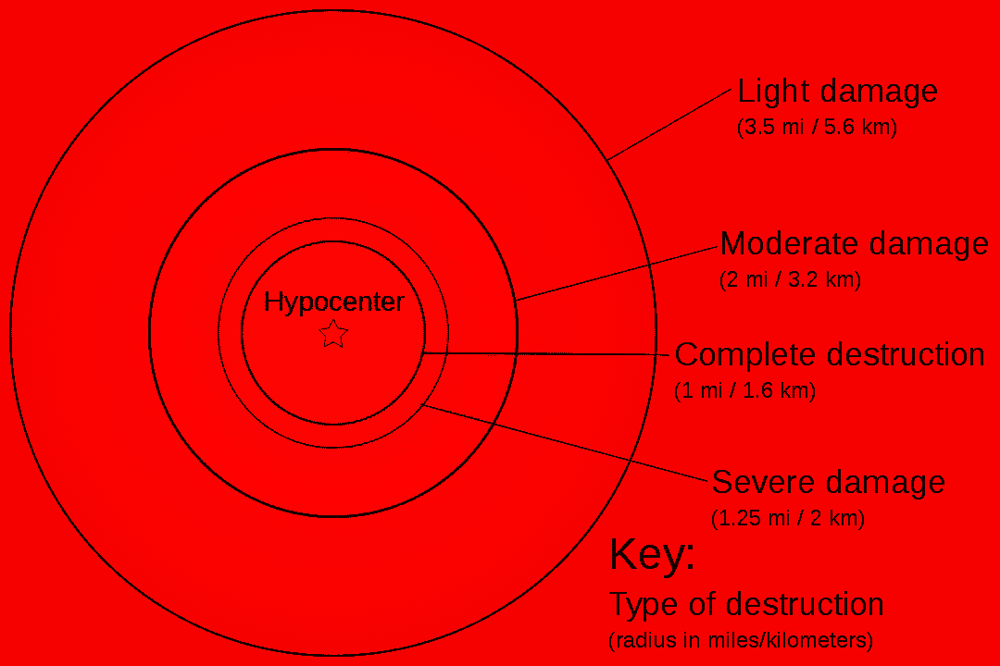

# 数据质量、数据运营和信任爆炸半径

> 原文：<https://towardsdatascience.com/data-quality-dataops-and-the-trust-blast-radius-4b0e9556bbda?source=collection_archive---------32----------------------->

## 缺乏信任将极大地影响您实现数据驱动的努力，除非您主动限制数据质量事件的爆炸半径。

动摇某人对数据的信任只需要一个小问题，但要让他们意识到这只是一个问题，而不是更大的问题，需要付出大量的努力。影响的差异是问题的“爆炸半径”，即使是最成熟的数据组织也可以更好地将其最小化。

图片来源:美国空军( [via 维基媒体](https://upload.wikimedia.org/wikipedia/commons/6/67/BLU-82_Daisy_Cutter_Fireball.JPG))

根据 Gartner 的数据，尽管近 98%的组织正在对其成为数据驱动的能力进行重大投资，但数据质量仍然会导致组织平均每年损失 1500 万美元的不良决策，根据 Experian 的数据,[会影响 90%的公司](http://www.ibmbigdatahub.com/infographic/four-vs-big-data)。虽然我在之前的文章中报道了一些[数据质量的恐怖故事，但是数据质量问题拖垮整个公司的情况并不常见。此外，现在有许多现代工具(](/how-to-do-data-quality-with-dataops-90c1ab94e626) [Soda](https://soda.io) 、 [ToroData](https://torodata.io) 、 [Trifacta](https://www.trifacta.com) )和实践([主要是 DataOps](/how-to-do-data-quality-with-dataops-90c1ab94e626) )使得数据质量最佳实践的应用比以前容易得多。

然而，我不认为我会冒险说数据质量永远不会成为一个解决的问题。我还认为，到目前为止，数据质量问题的最大影响不是基于糟糕数据的决策的直接影响，而是整个组织对数据和为数据提供服务的数据平台的信任丧失。特别是在那些*过去已经受到* 糟糕的数据质量影响的组织中，经常反复地，并不需要重大事件就能让“又来了”的消息在整个组织中回响。

事实上，IBM 的一项研究表明，整整三分之一的企业高管不信任他们的数据，他们认为平均 32%的数据是不正确的。要估计回归直觉决策的成本几乎是不可能的，但它可能非常重要。这次来自 Forrester 的另一项研究发现，由于缺乏信任，三分之一的数据分析师[花费超过 40%的时间逐个领域地审查数据](https://www.forrester.com/report/Build+Trusted+Data+With+Data+Quality/-/E-RES83344)的质量问题。这些时间成本很可能没有计入上述 1500 万美元的硬性成本。

## 信任爆炸半径是多少？

> 爆炸半径(名词)——爆炸发生时受影响源的距离。

来源:[维基媒体](https://upload.wikimedia.org/wikipedia/commons/thumb/8/8c/Abombdamage1945.svg/1080px-Abombdamage1945.svg.png)原子弹的爆炸半径

子弹和炸弹的区别在于影响范围。虽然一颗子弹实际上只能消灭一个目标，但一枚炸弹的爆炸可以夷平一座拥有数百万人口的城市。炸弹的冲击力与其爆炸半径成正比。近年来，术语“爆炸半径”在 IT 架构领域越来越流行，团队致力于尽量减少因单个系统故障而离线的额外系统的数量。

回到数据质量的话题，我很难相信一个普通组织中有三分之一的数据是坏的。更合理的数字可能是 10%*左右，尽管这可能会因数据领域的不同而有很大差异。10%的实际坏数据和 32%的假设坏数据之间的 22%的差距就是我定义的**信任爆炸半径**。

> 信任爆炸半径—单个数据质量问题破坏的额外信任量

因此，TBR 是对组织中不良数据量和整个组织中不信任数据量之间差距的度量。一旦一个人经历了动摇其信任的事件，恐惧、不确定性和怀疑会通过交流迅速传播给其他人，这是一个简单的事实。

正如我们在过去几个月里所了解到的，仅仅依靠遏制的策略注定要失败，并且很可能会产生很大的爆炸半径。不幸的是，几乎所有关于数据质量的文章都集中在预防、检测和快速纠正数据质量问题上。相反，如果我们接受数据质量问题总是会出现，尽管我们尽了最大努力来防止它们，并从预防的态度转变为预防的态度*和爆炸半径最小化，*我们将在推动数据驱动的文化方面更加成功。

> **信任爆炸半径** = *数据质量问题的数量*在没有上下文的情况下关于问题的对话的数量*之前对数据质量的负面体验的数量*

# 如何最小化信任爆炸半径

几年前，我负责为一个处理大规模 IOT 数据的非常复杂的系统开发一个[故障模式和影响分析](https://en.wikipedia.org/wiki/Failure_mode_and_effects_analysis)(简称 FMEA)。我发现系统方法在提高系统的可靠性方面是有效的。作为背景，FMEA 最初是在 20 世纪 50 年代由美国军方开发的，用于核武器计划，然后被负责复杂系统的其他组织大量采用(NASA、飞机&汽车制造、半导体、医疗保健等)。它首先详细说明系统的组件(或流程步骤)和子组件，然后列出每个子组件可能出现故障的方式，最后检查故障的下游影响，并推荐一种控制机制来防止或最小化每个故障的影响。

举一个汽车行业的简单例子，内燃机的一个潜在故障点是[正时皮带](https://cartreatments.com/timing-belt-symptoms-and-replacement-cost/)，如果它断裂会导致灾难性的发动机故障。正时皮带本身只是一条简单的橡胶带，带有像齿轮一样的齿。更换一个只需要大约 50 美元。如果一颗牙齿磨损了，它可能会脱落。这会导致发动机发出轻微的滴答声，这可能很烦人，但肯定不是灾难性的。然而，它也具有在缺齿点增加皮带磨损的副作用。如果磨损持续太长时间，更多的齿将失效，导致发动机中的气门和活塞之间更严重的正时失调，熄火。过一会儿，皮带会突然断裂，导致发动机随机启动阀门和活塞，字面意思是[从内部自我毁灭](https://youtu.be/fKFLCHbeRGg)。为了避免这个问题，所有的车辆都应该在 60 公里左右进行定期维护，以防止问题的发生。此外，当发动机中的传感器检测到正时皮带磨损的潜在迹象时，检查发动机灯亮起。关键是及早发现并解决问题，以避免发动机内皮带故障的更大爆炸半径。

虽然这些技术是为影响具有某种确定性的机器设计的，但它们为分析复杂系统提供了有用的指导，该复杂系统是一个正在经历向数据驱动转变的组织。

从数据和分析组织的主要职能开始:*使企业能够从其数据资产中获得最大价值，通常是通过帮助数据驱动的决策制定，*我们开始列举失败。

1.  数据产品中包含一条无效数据，导致做出无效决策。例如，对于一小部分客户来说，客户满意度计算不正确，看起来好像不满意的客户非常满意。这导致你的公司向他们发送额外的交叉销售广告，而不是跟进，进一步疏远这些客户。
2.  数据产品的消费者检测到报告的数据点之一无效(即，与之前相同的场景，但是营销中的某人在发出广告之前注意到了该问题)。
3.  多个数据产品以不同的方式表示相同的概念，消费者不知道哪一个是正确的。例如，运营报告将活动客户定义为上周使用过系统的客户，而计费报告将其定义为支付订购费用的客户。
4.  数据产品的消费者不知道导致源和目的地之间转换的需求，并认为它是不正确的。例如，一份营销报告正确地过滤掉了所有选择退出沟通的客户，但是一位选择退出的客户的客户成功代表认为该报告一定是错误的，因为他们的客户不见了。

有许多潜在的失败，我们无法在一篇文章中涵盖。关键是，在每一种情况下，初始故障点的影响都不是很大。然而，如果不加以控制，它们会引发一连串的问题，造成巨大的影响。让我们看一看每一个，看看如果不加检查会发生什么

# 利用 C4 有效地塑造信任爆炸

来源:[维基共享资源](https://commons.wikimedia.org/wiki/File:Shaped_charge.gif)

为了不离题并使这些更容易记住，我将称它们为 C4，它有一个有趣的特性，可以用来制作[聚能射孔弹](https://youtu.be/K-3cTsvI7ss?t=198)。**C4 技术** : **捕捉、编目、纠正和治愈**，类似地塑造数据质量问题的爆炸，使其更有生产力，同时最小化爆炸半径。

**捕获** —这是指由具有采取以下步骤的知识和权限的人捕获问题。理想情况下，在任何数据消费者意识到这些问题之前，可以通过在您的数据平台中进行监控来检测这些问题。然而，不可能捕捉到所有问题，正如上面的例子所示，一些未被发现的问题会导致爆炸半径的急剧扩大。因此，让您的数据消费者有发言权是至关重要的，并且他们相信为什么他们使用他们的发言权来提出问题，问题将会得到解决。这使他们能够以富有成效的方式发泄他们的沮丧，而不是与同样无力改善情况的同龄人一起开一个回音室。首先，确保组织中的每个数据消费者都可以访问一个地方来提出数据问题。同样重要的是，他们还必须知道如何使用这个工具。最后，他们必须看到他们的问题得到了解决，这将导致剩下的步骤。

**目录** —一旦发现问题，让那些将要受到影响的人知道是非常重要的。在一个害怕承认失败的文化中，这通常是违反直觉的。如果目标是让数据消费者的默认思维模式保持信任而不是不信任，那么最好是告诉人们什么时候有什么需要担心的。回到正时皮带的例子，如果不清楚正时皮带何时出现故障，也没有检查发动机灯告诉你何时该担心，你会默认总是担心你的发动机可能在任何时候出现故障，并对你的汽车的可靠性失去信任，并告诉很多人这件事来发泄你的沮丧。

让人们在日常工作流程中能够看到数据问题的文档是非常重要的。如果您提供一个一致的位置来查找给定数据产品的数据质量说明，这是最容易的。例如，让您的数据消费者通过您的数据目录启动他们的 BI 报告，这为您提供了在他们打开报告之前在报告页面上显示任何数据质量警告的机会。然而，许多人可能会将他们最重要的报告加入书签，然后直接启动它们。这意味着您需要将警报直接推送到报告上(最好是在一致的位置)，以引起他们的注意，并将他们引回到目录中的详细信息。显然，这种技术只有在数据管道非常可靠的情况下才有效。如果检查引擎灯每个月都亮，你也不会认为你的车很可靠。

编目什么*应该*被信任和记录什么现在不应该被信任同样重要。这实际上是检查发动机灯的弱点之一。可能是油箱盖没盖紧，或者你的引擎在接下来的 10 分钟内就要自我毁灭了。因为你不知道，你的反应必须从最坏的情况出发。相反，如果你可以打开一个应用程序，看看哪些引擎检查通过了，哪些导致了警告，那么你就能够做出明智的决定，下一步该做什么。在 DataOps 领域，这涉及到列出在部署到生产中之前为验证给定管道而运行的数据测试，以及那些为确保数据符合关键预期而持续运行的测试。在您的数据测试中使用 [BDD 风格命名](https://medium.com/javascript-scene/behavior-driven-development-bdd-and-functional-testing-62084ad7f1f2),并在数据质量注释和警告旁边显示测试状态，让您的数据消费者能够基于对数据当前状态的深刻理解来决定做什么。

**正确—** 对数据的当前状态(好的和坏的)进行编目和提升，有助于将数据消费者的默认心态从不信任转变为信任。需要的最后一份文件是关于*正在采取行动让事情变得更好的文件。*通过这种方式，使用工作单系统来跟踪数据问题比简单地将问题直接记录在目录中更有效。一旦你让数据消费者相信你是透明的，他们就不太可能通过询问组织中的所有人来确定他们上周发现的问题是否已经得到纠正，从而形成一个爆炸半径。

我的循环图显示了解决数据问题的行动和更新

这将我们带到最小化信任爆炸半径的下一个阶段，即快速纠正问题。这里的关键是超越简单地纠正问题，增加对问题已被纠正的信任。考虑下面的信任爆炸半径场景:一位营销分析师发现客户地址有问题，并询问 5 个人该向谁报告，然后向负责客户地址管道的数据工程师发送一封电子邮件。该工程师意识到他的最新更改导致了格式问题，修复了该问题，并通过电子邮件通知营销分析师该问题已经解决。现在，尽管分析师认为地址是正确的，但她与之交谈的另外 4 个人不知道该修复(甚至不知道问题的细节)，并且很可能不太信任地址数据。

如果您的数据平台提供了前两个 Cs 所涵盖的功能，并且您的数据团队实践了测试驱动的开发，那么这四个人将能够看到在工程师修复问题时添加的新测试正在通过，并且没有针对地址数据的未结票据，从而恢复他们的信任，而不需要与数据工程师直接对话。

**解决—** 最后一步是通过首先解决导致数据问题的系统问题来阻止问题再次出现。这绝对是最复杂的事业，但也有最高的回报。

对票证执行趋势和根本原因分析，以发现系统性问题

将问题单与“系统修复”单联系起来，后者通常是新数据平台功能的开发，但也包括数据运营运营模式中的流程改进，可在开发生命周期的早期发现问题

我的其他文章中有这类改进的例子:

*   基于模式测试在主数据中应用的标准数据质量规则(参见[Data ops 文章](/how-to-do-data-quality-with-dataops-90c1ab94e626))。
*   改善控制数据捕获的分析团队和应用程序开发团队之间的协作(有关更多详细信息，请参见关于[为数据所有者赋权](https://medium.com/swlh/empower-data-owners-to-become-a-data-driven-enterprise-39a1271ce4f)的文章)
*   创建数据催化剂角色，以增加数据产品开发团队在源数据方面的详细知识(参见[使用数据催化剂进行数据转换](https://medium.com/swlh/speed-up-your-data-transformation-with-data-catalysts-741cc1f5412)一文)

提供对这些类型的改进的可见性并不像纠正数据问题或捕获数据测试那样简单，但也不是不可能的。您可以从以一种可以与数据目录和票据相互链接的方式记录您的数据流程开始。使用可以直接嵌入到目录中的灵活的流程图表工具，可以将流程更改与它们要解决的系统数据问题一起记录下来。然后，你可以在新的工作方式上运行微型学习会话，记录它，[通过人工智能转录](/using-ai-transcription-to-build-blog-posts-form-the-presentations-you-already-give-a4cf9faf9aef)运行它，并将记录和转录嵌入目录中。

您可以使用相同的技术来获取和嵌入关于正确使用目录查找上述信息的培训，并将其放入您的目录主页。为了推动文化变革，您可以显示直接在数据目录中提出的数据问题的总体趋势，该数据目录充当“所有数据的大门”。由于此 KPI 呈下降趋势，请突出显示您的组织对推动改进的数据方法进行的系统性修复。在此基础上，您可以启动一个数据管理计划，更直接地激励人们改进数据文档和质量。

# 结论

到目前为止，几乎地球上的每个人都上了一堂流行病学的课。很少有人认识到，对其组织投资的数据资产的不信任会以非常相似的方式传播。利用这些知识，我们可以将数据策略透镜应用于医疗社区中使用的相同技术，以确定如何应对。

一如既往，我愿意与任何对提高组织从数据中提取价值的能力充满热情的人讨论这些想法。

我找不到一项研究对组织中实际上糟糕的数据百分比进行了严格的报告。最接近的是 2007 年 Gartner 的一项研究**指出 27%的财富 1000 强公司的数据是“有缺陷的”，但他们对有缺陷的定义包括重复数据。让我们假设这种趋势一直持续，重复数据占 27%中的 17%，剩下 10%是真正的坏数据。这意味着，平均而言，信任差距是坏数据量的近两倍。**