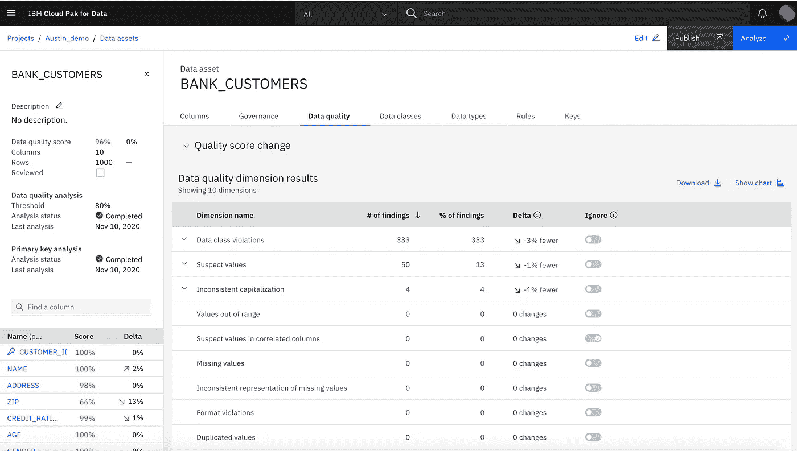
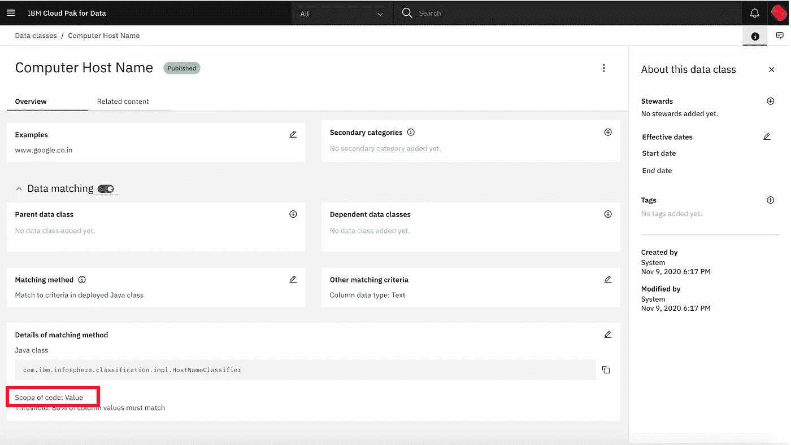
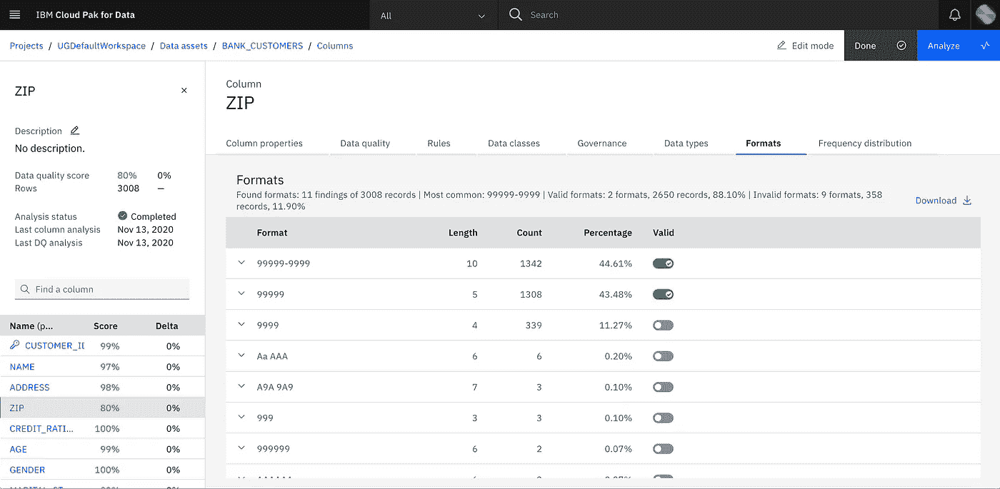
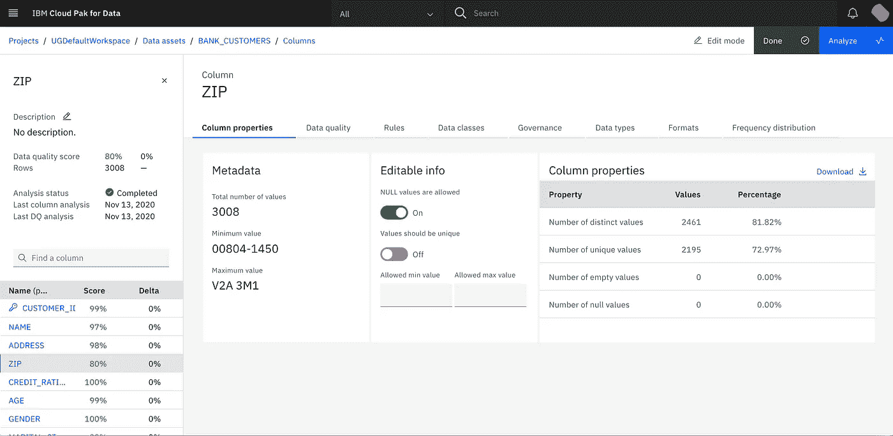
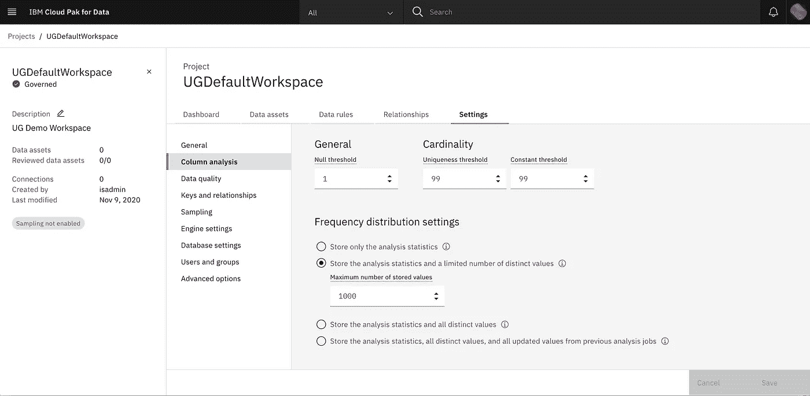
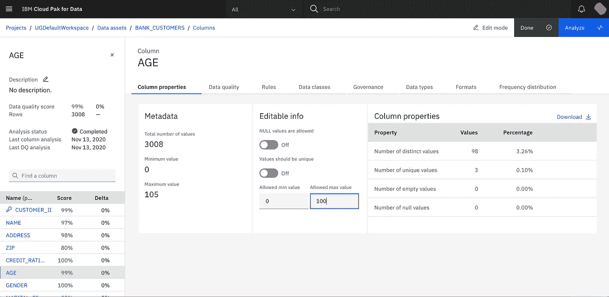
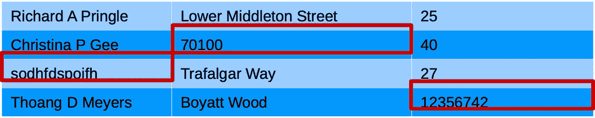

# IBM Watson 知识目录中的数据质量维度

> 原文：<https://towardsdatascience.com/data-quality-dimensions-in-ibm-watson-knowledge-catalog-79cd0aaf0af2?source=collection_archive---------27----------------------->

## [入门](https://towardsdatascience.com/tagged/getting-started)

## 理解 IBM Cloud Pak 用于数据和 IBM Infosphere Information Server 的标准数据质量维度。

图片由 saulhm 从 pix abay(【https://pixabay.com/users/saulhm-31267/】T2)拍摄

在之前的[文章](https://ysaillet.medium.com/how-to-quantify-data-quality-743721bdba03)中，我详细解释了 [IBM Cloud Pak for Data](https://www.ibm.com/products/cloud-pak-for-data) 和[IBM info sphere Information Analyzer](https://www.ibm.com/products/infosphere-information-analyzer)如何为每个分析的数据集计算统一的数据质量分数:

简而言之，数据集的数据质量分数是通过应用寻找不同类型的数据质量问题的算法来计算的。每当数据不满足给定的期望时，就识别出数据质量问题。可以针对数据集的单个单元格、完整的行、列或整个数据集报告此类问题。数据质量问题的类型在用户界面中显示为“**数据质量维度**

沃森知识目录中的数据质量维度结果

IBM 随其产品发布了一个标准数据质量维度列表。在 Watson Knowledge catalog 或 Information Server 中分析数据集时，会自动应用这些现成的维度。这可以在深入研究所选数据资产的数据质量的数据质量项目中完成，也可以作为数据发现和摄取过程的一部分完成——请看我以前的文章[“用 IBM Watson 知识目录解锁您的数据”](https://medium.com/swlh/unlock-your-data-with-ibm-watson-knowledge-catalog-6a6305d2525a)以了解这种发现过程是如何工作的。

在这篇新文章中，我将详细解释这些标准数据质量维度中的每一个，它们测量什么以及它们执行起来有多昂贵。

# 数据质量维度的成本

并非所有的数据质量维度都同样昂贵。某些类型的数据质量问题在逐行的基础上很容易识别，其他一些可能需要更多的工作和多次通过数据，因此可能对分析时间产生不可忽略的影响。

就性能而言，数据质量维度的成本主要取决于识别所搜索的数据质量问题所需的数据传递次数。一些数据质量维度不需要读取数据，因为它们可以重用在数据质量分析发生之前由数据分析预先计算的统计信息。大多数数据质量维度需要对数据进行一次遍历。有些人需要读取整个数据集来计算一些统计数据，然后再次对所有记录进行第二次检查，以便识别问题。

# 数据质量维度的范围

正如我在上一篇文章中所解释的，数据质量问题可以针对单个值、完整的行、完整的列或整个数据集进行报告。这就是我在本文中称之为数据质量维度的**范围**。

维度的范围越细，计算的数据质量分数就越准确，因为可以避免重复计算问题。
为了说明这一点，假设在同一列中有 10%的数据类违规和 10%的格式违规。如果这两个数据质量维度的范围在列级别，也就是说，如果问题是针对整个列报告的，则无法确定 10%数据类违规中有多少与格式违规的值相同。这意味着该列的数据质量分数将被计算为 90% * 90% = 89%。
实际上，这两个维度可以在价值层面上确定问题。最有可能的情况是，当一个值没有预期的数据类时，它也没有预期的格式，因此许多违反数据类的值可能与违反格式的值相同。
在这种情况下，由于错误值就是错误值，无论它有多少问题，数据质量分数都会被计算为 90%，这表明 10%的值有问题。

这个例子表明范围值的数据质量维度是最准确的。然而，对于一些问题来说，确定有问题的精确值是不可行的或者太昂贵了。因此，一些数据质量维度仅在列级别报告它们的问题。

现在，让我们来看看每个单独的数据质量维度。

# 没有任何数据传递的维度

## 重复值-范围:列

此维度在应该只包含唯一值的列中查找重复值，例如在主键列中。由于作为数据质量分析的一部分，搜索重复项的开销太大，因为这需要对所有列进行排序，所以该维度重用了在数据分析(列分析)期间预先计算的统计信息。这样做的好处是，维度不需要再次查看数据，但它只能报告列作为一个整体出现问题的频率，而不能确定哪一行受到了问题的影响。正因为如此，不排除影响相同数值的多个问题被重复计算。

为了找出包含重复项的确切行，您可以使用数据规则。

# 需要对数据进行一次传递的维度

## 数据类违规-范围:值

此数据质量维度报告与其列的推断或选择的数据类不匹配的任何值。

但是您需要知道，并不是所有的数据类都可以用于在值级别识别域违规。与数据质量问题一样，数据类有一个范围来指示它们是适用于值级，还是仅适用于列级。

在值级别工作的数据类(例如基于正则表达式或值列表的所有数据类)可以为每个测试值返回完全匹配或不匹配的决策，因此可用于在数据质量分析期间验证值。
在列级工作的数据类——例如 person name 之类的数据类——只计算列作为一个整体属于给定类的置信度，但不能测试任何单个值。
由于这个原因，如果分配给列的数据类的范围是*列*，则数据质量分析将忽略该数据类，并且不会在该特定列上搜索数据类违规。

您可以通过查看其定义 Watson 知识目录来检查数据类的范围:

查看 Watson 知识目录中数据类的范围

## 数据类型冲突-范围:值

此维度计算与其推断或选择的数据类型不兼容的列的值:

在数据分析期间，列分析确定每个列的推断数据类型。推断的数据类型独立于源中定义的数据类型，表示最具体的数据类型，它可以包含列的所有值。

为了说明这个概念，让我们想象在 SQL 数据库的表中定义的列，数据类型为 VARCHAR(255)。该数据类型是在数据源上定义的数据类型，但实际上，列的值可能包含编码为字符串的日期。在这种情况下，根据值的格式，推断的数据类型可以是日期或时间戳。
再比如，如果同一列包含字符串，但最长的字符串只有 40 个字符长。那么推断的类型将是 VARCHAR(40)。
如果列包含不同类型的混合，例如日期、字符串和数字，那么推断的数据类型将是可以表示所有这些值的最具体的类型，在本例中是 VARCHAR(n)，n 是最长值的长度。

用户可以覆盖推断的数据类型，以指示应该使用哪种数据类型。例如，如果选定的数据类型设置为 DATE，则任何不是本机日期值或者不是可被解析为日期的字符串或数字的值都将被视为违规。

## 格式冲突-范围:值

此维度计算某一列的值，该列的格式已被用户标记为对此列无效。

这意味着该维度将只查找已识别格式被用户声明为无效的列的问题。为此，您需要在数据质量项目中打开列的分析结果，并转到“格式”选项卡以查看所有已识别格式的列表。然后，您可以进入编辑模式，将不需要的格式标记为无效。

编辑列的有效格式列表

通过这样做，您可以在列上添加一个约束，指示哪些格式是有效的，哪些是无效的。这将使当前数据质量分数无效，当重新计算时，该分数将反映基于新约束的结果。

## 不一致的大写-范围:值

该维度首先检查列的大多数值是否遵循字符串中关于大小写用法的任何约定。列的大写规则可以是下列规则之一:

*   **大写**:数值只写大写。比如:
    *这是一个值*
*   **小写**:数值仅以小写书写。例如:
    " *这是一个值*"
*   **名称大小写**:数值中每个单词的第一个字母都是大写，其余的都是小写。例如:
    *这是一个值*
*   **句子大小写**:每个值的第一个字母大写，其余小写。比如:
    *这是一个值*
*   **任意大小写**:大小写混淆，无法识别规则。比如:
    *这是一个值*

如果列中的大多数值使用这些大写规则之一，则不遵循相同大写规则的值被视为数据质量问题。
如果数据在使用的资本化规则中没有显示任何强模式，那么分析将假设资本化不受约束，并且不会搜索任何该类型的发行。

## 缺少值的表示不一致—范围:值

如果在同一列中同时发现 null 值和空值或仅包含空格的值，则此维度会报告问题。

## 缺少值-范围:值

此维度在不应该包含缺失值的列中搜索为 null 或空的值。

您可以在列分析结果的“列属性”选项卡中设置标志，指示对于给定的列，缺失值是否可接受。

指定列中是否允许缺少值

请注意，与 UI 所建议的相反，这不仅仅是关于空值，而是一般的缺失值，也包括包含空字符串或仅包含空格的值。

如果没有指定约束，那么分析将通过查看列中缺少的值的数量来尝试推断列的可空性标志。如果缺失值(空值和空值)的数量低于可空性阈值，则该列被视为不可空，任何缺失值或空值都将被视为数据质量问题。如果该列包含的缺失值多于阈值所允许的值，则分析将假定缺失值在该列中是预期的，并且默认情况下不会报告问题。

默认的可空性阈值是 1%，这意味着只有包含少于 1%的缺失值的列才被认为是不可空的。您可以在项目的数据质量设置中设置此阈值。

## 值超出范围-范围:值

仅当指定了列的最小和/或最大允许值的范围约束时，才使用此维度。

您可以通过打开列的分析结果并在“Column Properties”选项卡中进入编辑模式来定义这样的约束，如下一个屏幕截图所示。您可以设置最小值和/或最大值。任何超出指定范围的值都将被报告为有数据质量问题。

指定列的最小和/或最大允许值

## 违反规则-范围:值

数据规则和质量规则是定义自定义维度的最简单方法。

数据质量分析将考虑所有数据规则或质量规则，这些数据规则或质量规则被绑定到所分析的数据集的列，并且不需要与其他数据集的任何连接操作。如果规则与这些标准匹配，则在数据质量分析期间，将在分析的行上评估其逻辑。

每当数据集的一行没有通过规则时，将为绑定到给定行的规则的每一列报告数据质量问题。每个规则在其自己的数据质量维度下报告。

请注意，没有必要单独运行数据规则来评估它们的逻辑，作为数据质量分析的一部分。包含规则的逻辑作为对数据集的约束将是自动的。

# 需要两遍数据的尺寸

## 可疑值-范围:值

这个数据质量维度不太容易解释，但同时它也是一个相当强大的维度。
基本上，这个维度搜索看起来不像与同一列的其他值属于同一个域的值。在某种意义上，这类似于搜索异常值，但是异常值的概念不仅扩展到值本身，还扩展到它的格式和属性。

为了更好地解释这是如何工作的，假设您看到一个打印的电话号码列表。如果不看单个的值，您很有可能一眼就认出这些值是电话号码，因为它们看起来就像电话号码。
人脑不会评估每一个单独的值，但会提取一些关于格式的模式，即它们主要由数字组成的事实，值的长度等，并将这些模式与我们从过去了解到的电话号码通常的样子进行匹配。
与此同时，如果在一长串电话号码中间，有一个值不是电话号码，而可能是电子邮件地址，人类大脑会立即发现其中一个值显然是错误的，而不必读取任何单个值。

在这个简单的例子中，怀疑值维度试图模拟大脑在做什么。为此，它首先为一个列计算一个*域指纹*，该域指纹包含似乎表征值域的已识别模式。一旦指纹被计算出来，它会对数据进行第二次处理，试图识别出哪个个体值似乎与这些识别出的模式有很大偏差。

该决策中考虑的值的属性是多种多样的，并且根据数据的性质而不同。它可以考虑值的格式、值中更频繁出现的标记、关于长度、标记数量、值中发现的字符类型、值的二元模型分布等的各种统计数据。

在下面的示例中，第一列中突出显示的值将被检测为可疑值，因为它的二元模型分布和令牌数与其他值不一致。在第二列中，该值将被标记为可疑，因为它是包含字符串的列中的一个数字。在第三列中，突出显示的值将被标记为可疑，因为它是数值异常值。

可疑值示例

此维度可用于检测不明显的数据质量问题，如果指向这些问题，人们将能够看到，但这些问题可能隐藏在许多行的中间，因此可能难以识别。
这个维度的缺点是成本更高，因为它需要一遍学习什么应该被认为是预期的，以及一遍检测可疑值。
您还应该理解的是，当一个值被认为可疑或不可疑时，这个维度不提供确定性规则。它基于概率和大多数值的比较。这当然可能会产生误报或遗漏错误的值，就像人脑可能会出错一样。

## 相关列中的可疑值—范围:值

这个维度是对前一个维度的补充。虽然“可疑值”维度仅查看同一列的值在其列中是否是同质的，但此维度查看单行中的值组合放在一起是否合理。

为此，它首先在第一遍中搜索列之间是否有任何相关性。如果一列的值可以由另一列的值确定，则这两列是相关的。例如，如果一列包含组合一个或多个其他列的运算结果，则可能是这种情况。如果一列对另一列具有包含依赖关系，也可能是这种情况。

作为一个具体的例子，假设您有一个数据集，其中一列包含城市名，另一列包含州名。对于任何给定的城市，通常只有一个州。这意味着这些列之间存在相关性。该分析可以从数据集的记录中学习关联规则，并识别城市和州似乎不匹配的数据质量问题，因为它们的组合会违反关联规则。

简而言之:如果大多数以旧金山为城市的行也以加利福尼亚为州，那么一行{旧金山；Arizona}将被报告为可疑，因为这是一个值的组合，它破坏了在查看所有行时在两列之间检测到的关联规则。

与前面的维度一样，这种方法基于统计而不是布尔规则，可能会产生误报。计算这个维度也比其他维度更需要内存——尤其是在具有大量列的数据集上——因为在分析期间需要计算每对列之间的相关表并将其保存在内存中。

另一方面，启用这个维度可以检测出重要的问题，这些问题在一次查看一列时是看不到的。这是一个数据质量维度，在对所选数据集进行深入的数据质量分析时，您可能希望启用该维度，对于大型数据发现作业，最好禁用该维度，因为在这种情况下，保持作业速度很重要。

# 摘要

我们已经看到，并非所有的数据质量维度都同样昂贵。有些相当简单，不会使分析慢很多。有些需要多次通过数据，可能会使分析时间加倍，但可能有助于识别不明显的问题。不同的场景可能需要启用不同类型的维度。

我们还看到了每个标准数据质量维度的一些细节。

最后，我们看到可以通过使用数据规则来添加定制的数据质量维度。

Information Analyzer 还允许您通过在 Java 中实现数据质量维度来编程和部署自己的数据质量维度。在当前版本(撰写本文时为 3.5 版本)中，Cloud Pak 尚不支持此功能。但也许这是一个扩展点，将来会被移植到 Cloud Pak 以获取数据…

您认为应该在标准维度列表中添加什么新的数据质量维度？给这篇文章添加一些评论，让我知道。