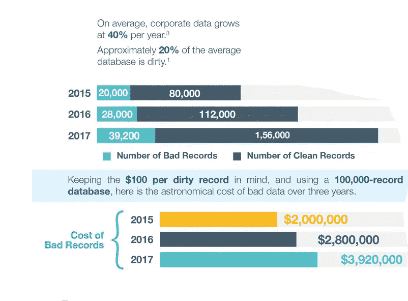
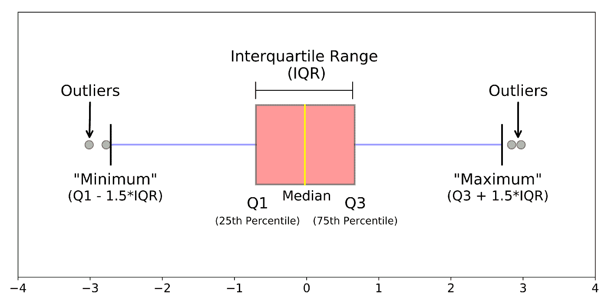

# 日常分析的数据质量

> 原文：<https://towardsdatascience.com/data-quality-for-everyday-analysis-d3aa1442c31?source=collection_archive---------15----------------------->

## [入门](https://towardsdatascience.com/tagged/getting-started)

## 什么是数据质量，为什么它很重要，以及如何正确处理！


由[兰迪父亲](https://unsplash.com/@randyfath?utm_source=medium&utm_medium=referral)在 [Unsplash](https://unsplash.com?utm_source=medium&utm_medium=referral) 上拍摄的照片

## 我们不信任的数据！

不久前，我的一个朋友提交了一份令人信服的分析，说服了一家中型公司的经理根据新成立的数据科学团队的建议做出了一系列决策。然而，不久之后，百万美元的损失揭示了这些见解是错误的。进一步的调查表明，虽然分析是合理的，但使用的数据是错误的。

对于我的朋友来说，意识到数据而不是分析方法是个问题是一种解脱。然而，该报告导致对他能力的负面看法，并损害了他的声誉；他花了一段时间才恢复过来。

我朋友的故事可以发生在任何使用数据的人身上。对最先进的工具和技术、我们想要产生的影响感到兴奋，或者有时被截止日期赶得很急，我们可能会忽略在任何分析之前的基本步骤*:评估数据质量。否则，无论多么先进的方法学*坏数据*肯定会浪费时间和资源以及错误和误导的结果。数据分析和预测模型是*垃圾进，垃圾出的真实体现！*用托马斯·莱德曼[的话说](https://hbr.org/2018/04/if-your-data-is-bad-your-machine-learning-tools-are-useless)，*

> 如果你的数据不好，你的机器学习工具就没用了。

坏数据的产生有许多原因:ETL 过程中的错误、手动输入、数据集成、专业知识的丧失、不断变化的业务逻辑和遗留数据都可能导致数据质量问题。

无论 ETL 过程多么严格，它仍然不能捕捉所有的数据问题。一个原因是，只有使用数据时，才能发现许多类似不准确的问题。因此，很少有数据科学家(如果有的话)能够幸运地从一个干净现成的数据集开始分析。数据集通常充满了需要修复的错误和不一致。因此，虽然评估数据质量不像训练机器学习模型那样有趣，但它是任何分析中最关键的部分。

因此，任何数据用户都需要对数据可能发生的各种问题有一个基本的了解，并具备检测、解决和交流这些问题的工具和技术。这就是为什么评估数据是**完整的**、**独特的**、**及时的**、**一致的**、**有效的**和**准确的**应该是任何分析的先决条件。

在这里，我将介绍数据质量背后的基本概念，讨论坏数据的成本，回顾数据质量评估的六个方面，并介绍可用于处理出现的质量问题的工具和技术。

## 什么是数据质量？

数据质量是对数据的有用性和可靠性的评估。为了更清楚起见，请考虑以下场景:

*   当数据集不包括最新记录时。
*   当从两个不同来源读取的收入数字不匹配时！
*   当一个数据集有许多同一个国家的名称，如“美国”、“美国”、“美利坚合众国”……加上所有的错别字。
*   当数据集缺少值时。

在上面的第一个例子中，数据不是及时的(最新的)。在第二种情况下，数据不一致，在第三和第四种情况下，数据分别无效和不完整。我们将很快在数据质量的背景下回到这些概念。

## 坏数据的代价

使用坏数据的后果远不止是一些不完整的行或不一致的记录。简单来说，

> 当数据有任何缺陷时，完成一项工作的成本是数据完美时的 10 倍。

[Ringlead](https://www.ringlead.com/blog/true-cost-of-bad-data/) 根据数据记录的数量可视化坏数据的成本。根据这一估计，不良记录的成本约为 100 美元:10 万条不良记录每年要花费 200 万美元，这还不包括添加到数据中的新记录。对于像 Google 这样拥有大量数据的组织来说，这些数字要高得多。



图表中的来源 1 和 3 分别来自 Sirius Decisions——不良数据对需求创造的影响和小企业协会 2013 年人口普查。

IBM 的另一项研究估计，在美国，每年坏数据的成本约为 3.1 万亿美元！托马斯·莱德曼解释了原因:

> [](https://hbr.org/2016/09/bad-data-costs-the-u-s-3-trillion-per-year)**坏数据成本如此之高的原因是决策者、经理、知识工作者、数据科学家和其他人必须在日常工作中适应它。这样做既费时又费钱。**

*另一个令人瞠目结舌的数字来自 Gartner:数据质量差是 40%的业务计划失败的原因，它还会影响多达 20%的劳动生产率。*

## *谁对数据质量负责？*

*通过定义角色、流程和技术来支持数据质量，提供数据生态系统的整体视图是整个组织的责任。然而，数字显示，这些组织在这方面做得并不出色！据 Experian[称，29%的组织数据不准确，同时 95%的企业难以实施数据治理计划。同一份报告指出，75%的受访者认为数据质量检查是业务用户的责任，而不是 IT 基础设施的责任。因此，如果您认为您可以信任现有的检查，并且评估数据质量不是您的责任，请三思！](https://www.edq.com/resources/data-management-whitepapers/2019-global-data-management-research/)*

*问题的另一方面是，在创建或存储数据时，并不是所有的问题都能被检测到。数据[生命周期中的两个重要时刻是数据被创建和消费的时刻。虽然数据在创建时就应该是固定的，但是在使用之前不会对其进行评估。这就是为什么分析师作为数据的消费者，在检测和解决缺陷方面发挥着重要作用。](https://hbr.org/2013/12/datas-credibility-problem?referral=03759&cm_vc=rr_item_page.bottom)*

*因此，我认为[数据质量评估是每个人的工作](https://hbr.org/2016/05/data-quality-should-be-everyones-job)；鼓励数据用户利用其技术专长和领域知识来发现不一致之处，并确保分析基于通过质量控制措施的可靠来源。*

## *质量数据的六个维度*

*到目前为止，我们回顾了数据质量评估的重要性，并量化了坏数据的成本。我们强调了分析师或一般来说数据用户在确保数据在被消费之前符合标准方面的关键作用。在本节中，我们将介绍数据应该满足的要求。*

*为了评估数据集的质量，需要从 6 个方面进行评估:*

1.  *质量数据是**完整的
    数据的完整性**意味着分析所需的主要特征/属性没有缺失值。缺失值会扭曲分析并导致误导趋势。*
2.  *质量数据是**唯一的** 重复会产生不利影响。它们占用存储空间，延长代码的运行时间，并扭曲分析。检查**的唯一性**保证了数据中每个观察只有一条记录。*
3.  *高质量的数据是**及时的** 地址、电话号码、电子邮件和信用卡都在不断变化，因此，上个月有效的数据记录现在可能不再有用。**及时性**确保数据是最新的，最新的记录反映了最新的变化。*
4.  *质量数据是**一致的**
    **一致**是指一个数据集内或[不同数据集之间](https://www.whitepapers.em360tech.com/wp-content/files_mf/1407250286DAMAUKDQDimensionsWhitePaperR37.pdf)没有矛盾。一个 5 英尺高的新生儿或销售和使用表之间的收入不匹配都是数据不一致的例子。*
5.  *质量数据是**有效的**
    **有效的**意味着数据具有正确的类型、格式和范围。如果数据符合一组预定义的标准和定义，则数据具有正确的类型和格式:当标准格式定义为 YYYY/mm/dd 时，08–12–2019 无效。同时，有效性保证数据在可接受的范围内。离群值是统计学和数据科学中的一个重要概念，是不符合这一要求的数据点。*
6.  *质量数据**准确**
    **准确**反映数据的正确性，如正确的出生日期和准确的售出数量等。你应该注意到准确性不同于有效性:后者侧重于类型、格式和范围，而前者旨在形式和内容。如[中所述，数据质量；准确性维度](https://books.google.com/books?hl=en&lr=&id=x8ahL57VOtcC&oi=fnd&pg=PP1&dq=Data+Quality:+The+Accuracy+Dimension&ots=pZUtmo02AZ&sig=phzHR5YwAUrcYLErN8PLd_JdO7A#v=onepage&q=Data%20Quality%3A%20The%20Accuracy%20Dimension&f=false)，准确性是关于正确性，而有效性是关于可能的准确值:对于一个 50k 工资的员工，45K 工资是不准确的，但是有效的(在可接受的范围内)。*

*在继续之前，我们应该注意，用真实数据满足 100%的数据质量要求几乎是不可能的。一种解决方法是为我们上面定义的每个维度定义一个阈值，低于该阈值的数据被评估为质量差。例如，只有当 10%的数据丢失时，90%的完整性才允许使用数据。在某种程度上，门槛取决于业务环境。阈值越高，用例的数据质量就越高。*

## *利用分析技术评估和提高数据质量*

*在这一节中，我们将介绍一些工具和技术，分析师可以使用这些工具和技术来检查和提高他们的数据质量。本节中的示例在 SQL 中。*

***完整性** 不完整的数据以缺失值的形式出现。衡量指标是分析所必需(非可选)的要素的缺失记录比率。例如，如果分析中 100 条记录中有 30 条缺少营销活动所需的行业特征，则数据的完整性为 70%。*

*首先，检查缺失值的数量:*

```
*SELECT 
 1 — COUNT(col_A) / COUNT(*)
FROM
 table_name;*
```

*或者，为了计算空单元的数量*

```
*SELECT 
 COUNT(col_A)
FROM
 table_name
WHERE 
 col_A = ‘’;*
```

*如果比率超出您可接受的阈值，您可能需要使用以下选项之一:*

*1.如果可能的话，使用其他数据来源:
当我在研究一个无监督的对外营销细分模型时，我需要知道该企业是否从事电子商务，特别是他们使用什么支付提供商。问题是这些记录中有 90%在数据库中丢失了。我们最终测试了来自多个提供商的数据集，并将其中一个与我们的数据合并。修复不完整记录的整个过程耗时约一个月。*

*2.插补
插补是机器学习中一种众所周知的方法，它从现有值中推断缺失值，例如用数据的均值、中值或众数替换缺失值。*

```
*SELECT
 COALESCE(col_A, AVG(col_A))
FROM
 table_name;*
```

*您也可以使用 IFNULL()。在 Python 中你可以使用 dropna()、fillna()、interpolate()等。有关更高级插补方法的概述，请查看[数据插补和示例](/6-different-ways-to-compensate-for-missing-values-data-imputation-with-examples-6022d9ca0779)。*

*3.手动修复
手动处理丢失的数据是有风险的、不可伸缩的，不推荐使用，只有当有少量丢失的值并且您非常了解业务逻辑时，才可以使用它。*

*4.删除缺失值
只有当数据集很大且缺失值很少，从而不会影响分析时，才可以删除空值。*

```
*SELECT
 *
FROM 
 table_A
WHERE
col_A IS NOT NULL;*
```

*注意丢失信息和趋势，因为丢失了一些重要的记录(比如离群值)。*

***唯一性** 统计包能够很好地处理重复值。要检查 SQL 中的重复值:*

```
*SELECT
 col_A, 
 col_B, 
 col_C, 
 COUNT(*) AS cnt
FROM
 table_A
GROUP BY 
 col_A, col_B, col_C
HAVING cnt > 1;*
```

*要删除重复项:*

```
*SELECT
 col_A, 
 col_B, 
 col_C
FROM
 table_A
GROUP BY 
 col_A, col_B, col_C;*
```

*其他消除重复的方法是使用 DISTINCT()、ROW_NUMBER()甚至自连接。在 Python 中，duplicated()告诉您重复值，drop_duplicates()负责删除它们。*

***及时性** 数据分析师需要检查数据的时间线，以确保它是最新的！使用一个没有被更新的表或者一个已经被改变但没有反映在数据中的记录会导致不希望的结果。虽然没有特定的技术工具，但是检查数据的最后更新时间，或者表中的最小和最大日期应该会有所帮助。*

```
*SELECT
 MIN(date), MAX(date)
FROM
 table_A;*
```

*如果您的数据是分区的，您可以用 partition_date 替换上面的日期。*

***一致性**
数据的不一致性可能发生在一个数据集内，也可能发生在数据集之间。编程语言使得相互检查数据集和检测不一致变得容易。最终，你将不得不使用你的商业判断，咨询领域专家或者将你的数据与可靠的来源进行比较。*

*作为个人经验，我研究了支付行业中被拒绝的交易，我必须解决来自两个不同组织的数据集之间的不一致。在缺乏唯一的真实来源的情况下，我最终研究了维护这些数据集的组织，并选择了拥有知名客户和更好声誉的组织。*

***有效期** 1。异常值
均值和标准差等几个重要的统计数据对极值、异常值非常敏感。因此，数据分析师需要特别注意识别和处理它们:它们是合法的极值，还是由于测量工具的缺陷而被记录下来的。*

*从使用业务知识和可视化技术(如散点图或箱线图),或者使用分析技术(如基于密度的聚类和隔离森林),有无数种技术可以处理异常值。查看[这篇文章](/a-brief-overview-of-outlier-detection-techniques-1e0b2c19e561)进行评论。*

*箱线图是识别异常值的简单方法。箱线图通过绘制五个重要的数字来显示分布:分布的最小值、最大值、第 25 个百分位数、中间值和第 75 个百分位数。要查找数据中的异常值，请查看小于第 25 个百分点或大于第 75 个百分点 1.5 IQR(四分位间距)的区域，其中 IQR 是第 75 个百分点和第 25 个百分点之间的距离。*

**

*(图片鸣谢:[了解方框图](/understanding-boxplots-5e2df7bcbd51))*

*一般来说，不建议删除异常值，因为并非所有异常值都是相同的！为了区分合法数据点和非法数据点，有时前者被标记为异常。然而，大多数时间异常值和异常值可以互换使用。*

*2.类型和格式*

*对于数据中的每个属性/要素，检查格式和数据类型(日期、整数、字符串)以确保其符合标准。检查 SQL 中的数据类型*

```
*SELECT COLUMN_NAME, DATA_TYPE 
FROM INFORMATION_SCHEMA.COLUMNS
WHERE 
 TABLE_NAME = table_A*
```

*在 Python 中，您可以简单地使用*

```
*df.dtypes*
```

*其中 df 是你的熊猫数据帧。*

*浏览输出是快速检查数据值和格式的一种方式。在 SQL 中，您可以使用类似*

```
*SELECT 
 col_A, 
 COUNT(*)
FROM 
 table_A
GROUP BY 
 col_A
ORDER BY 
 col_A ASC
LIMIT 100*
```

*其中合并`ORDER BY`和`LIMIT`允许您检查可能错误的值中的错误。在 Python 中，`value_counts()`可以给你一些关于你的输入的想法。*

***准确性** 使用领域知识以及将您的数据与另一个值得信赖的来源进行比对，可以获得数据的准确性。进行探索性分析，使用可视化和统计方法来识别*没有意义的趋势和数字*，并与领域专家进行讨论。*

## *最后的话*

*在学术界，在将我们的文章提交给期刊进行同行评审之前，我们通常会等待一两周，然后再次评审稿件。这种滞后通常会导致工作质量的大幅提高:我们修正了以前没有注意到的错误，改进了可视化效果，使一些段落更加清晰，并重新审视了数据和计算。最终，从长远来看，它帮助我们建立了创建高质量工作的声誉，同时减少了审查过程所花费的时间，这反过来又导致论文更快地发表。*

*我们是自己作品的最佳评判者，比任何人都更能识别我们所创造的作品的缺点和优点。对数据质量的评估可能是交付高质量和有影响力的工作的最重要的一步，这有助于改善整体业务。我希望这篇短文有助于提高对我们的工具和技术的认识，以便在您的分析工作中使用，并使您的工作更有质量！*