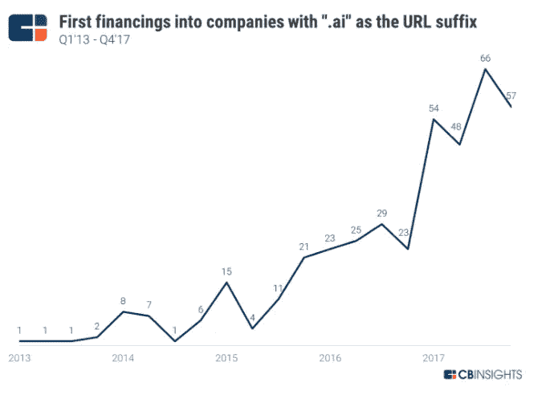

# 数据质量:垃圾输入垃圾输出

> 原文：<https://towardsdatascience.com/data-quality-garbage-in-garbage-out-df727030c5eb?source=collection_archive---------29----------------------->

## 纠正错别字和诸如此类的问题是一个 45 亿美元的市场

来源:[提莫·埃利奥特，](https://timoelliott.com/blog/cartoons/analytics-cartoons)经许可

几年前，我的第一份工作是为银行建立金融模型。那是在手工制作模型特征并由指导委员会批准的时候。深度学习前的日子。由于功能是手工制作的，广泛的数据质量检查是标准。我定期审计数据是如何从一个系统流向另一个系统的。我的前老板会说，垃圾进，垃圾出。

数据质量是个大问题。总是会有重复的、离群的、丢失的数据、损坏的文本或打字错误。但是，即使在数据工程和“人工智能”方面取得了多年的进步，数据质量仍然是一个大问题。事实上，这是一个日益严重的问题。但这也是为什么这是一个令人兴奋的问题。

和往常一样，我喜欢在我的文章开头写些无关紧要的内容:

*   这不是关于数据质量作为一个概念是什么以及如何解决的问题。已经有很棒的文章了:这里的，这里的，这里的
*   这侧重于结构化的表格数据。图像/视频、音频、文本等数据类型的数据质量问题的性质各不相同

## **为什么数据质量是一个日益严重的问题**

**更多的决策是基于数据。**Tableau 等 BI 工具、AppAnnie 等市场智能工具以及 Optimizely 等 A/B 测试工具的增长都指向了数据驱动决策的趋势。如果底层数据不可信，这些工具就没有用。如果数据质量问题不断出现，我们很快就会对这些工具失去信任。做出了错误的决定，失去了商业机会。Gartner 定期调查不良数据的成本，多年来，即使每年在数据质量工具上花费 20 万美元，每个企业的成本仍保持在 1000 万美元。

**更多的公司建立在数据之上。**一波又一波的机器学习公司都是建立在数据上的——看下图:)。如果你与机器学习工程师和数据科学家交谈过，你总是会听到好数据有多重要。

来源: [CB Insights](https://www.cbinsights.com/research/artificial-intelligence-startup-hype-ai-suffix/)

## **为什么数据质量仍然是个问题**

**大量数据但静态的一次性检查仍是现状。**云改变了思维模式，从只存储有用的数据转变为存储所有潜在有用的数据。Kafka 等流媒体技术和 Snowflake 等云数据仓库降低了存储更多数据的摩擦——以更高的速度、更广泛的种类和更大的容量。为了确保质量，指定范围和模式的数据规则由顾问或数据质量分析师手工编写。这是一个昂贵耗时的过程，通常只做一次。一劳永逸。这有两个问题。第一，大多数规则是在生产中学习的——当问题出现时。未知的未知情况。二是数据是动态的，要求规则是动态的。

**“可信”的数据来源仍然存在问题。**三个行业比其他任何行业都更重视数据质量:公共部门、医疗保健和金融服务。但这些行业继续受到不良数据的困扰。一家医疗保健公司的数据治理负责人告诉我，他们每月收到的政府数据错误百出。他们需要专门的员工来打扫。想象一下，我们正基于肮脏的数据被治理。在金融服务方面，来自一级数据提供商的股票数据经常会出现一些问题。众所周知，彭博的数据质量优于其他供应商，但我记得我不得不经常检查数据，并告诉客户支持人员这些数据没有意义。

**数据专业人员的专业化。**过去，数据专业人员更多地负责接收、转换、清理和分析/查询数据。现在我们有不同的专业人员处理每一步。数据工程师处理接收和转换。有时会跳过转换，直接将数据推入数据仓库。数据科学家建立模型，并忙于调整深度学习旋钮以提高准确性。和业务分析师查询并撰写报告。他们对数据应该是什么样子有更多的了解，但与编写和实现数据质量检查的数据工程师是分开的。

*Tldr:一个日益严重的问题，却没有很好的解决方案*

## **巨大的机会待价而沽**

当前的数据质量软件市场差不多有 20 亿美元。但真正的机会要大得多，为 45 亿美元，因为有大量的劳动力可以自动化。美国有 2.1 万个数据质量职位，每个职位的年薪为 8 万美元。这并不包括那些在职称为“顾问”的专业服务公司工作的人。假设直接人工部分乘以 1.5 倍，总人工部分为 25 亿美元。随着数据质量在 ML 应用和业务决策中变得越来越重要，市场将继续健康增长。

虽然 Informatica、SAP、Experian、Syncsort 和 Talend 目前主导着市场，但新一波创业公司正在崛起。当前的产品及其销售方式可以更好——从插入数据管道任何部分的交钥匙解决方案，到不需要 6 个月的实施期和 6 位数的前期承诺，到自动化数据质量规则编写和监控。