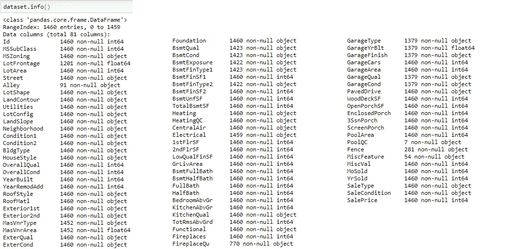
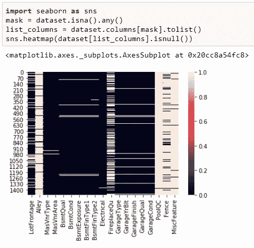
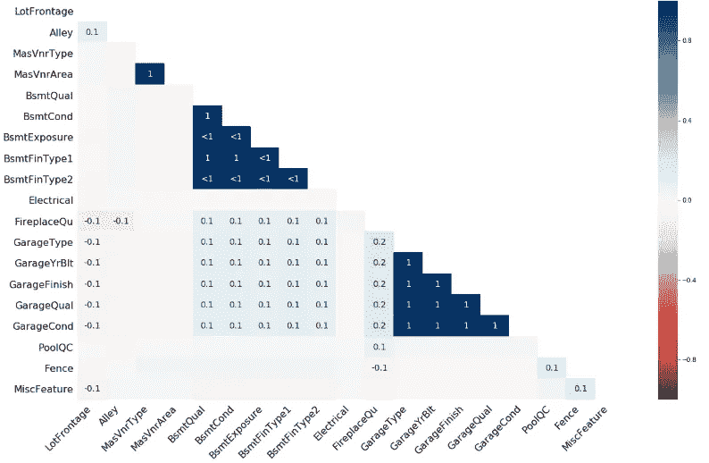
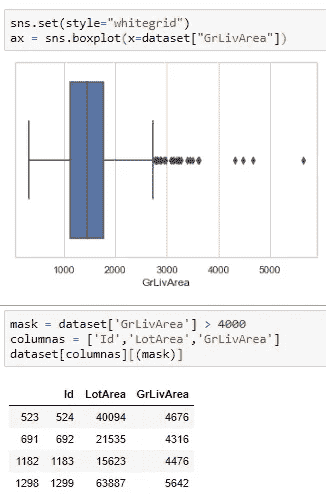

# 数据质量对数据集的影响

> 原文：<https://towardsdatascience.com/data-quality-impact-on-the-dataset-7dab41d36f8a?source=collection_archive---------11----------------------->

## 我们着眼于影响数据集维度的数据质量的不同方面，以及数据质量在产生数据的组织中的重要性。

在 [Unsplash](https://unsplash.com?utm_source=medium&utm_medium=referral) 上由 [Carlos Muza](https://unsplash.com/@kmuza?utm_source=medium&utm_medium=referral) 拍摄的照片

# 背景

去年，我在机器学习领域的介绍一直专注于学习如何解决给定数据集上的回归或分类问题。
当我们开始处理真实的用例时，我们发现我们收到的数据集是一个组织的结果，该组织开发了一项工作，能够对其进行阐述。
该数据集的质量与制造该数据集的组织以及该组织如何处理数据质量直接相关。
我们模型的可持续性也可能与组织中的数据质量有关。
除了数据工程、模型本身的准确性及其生产中的性能之外，如果它所服务的组织没有将数据质量作为优先事项，很可能该模型将无法长期持续。

## 那么，什么是数据质量呢？

首先，数据代表真实世界的对象，为了在本文中讨论数据质量，我们将研究数据集格式。每一列都是数据集的一个“数据集”，每个单元格都是数据集为一行获取的特定值。
通常，当我们考虑数据质量时，我们会考虑数据的价值及其准确性。然而，数据质量包含多个方面，这些方面被称为维度，我们将在后面更详细地讨论，但它们是数据的常见维度:准确性、唯一性、完整性、有效性和一致性。
数据质量最常见的定义是确定数据是否能够满足收集数据的功能。

## 重要性和益处

> 保持数据质量是一项困难但必要的任务。为了获得一致和可靠的数据，企业必须不断管理数据质量，以便建立信任并做出更快、更明智的决策*。*

数据质量差会对组织的效力和效率产生直接影响，特别是在任务的整个生命周期，数据不同方面的错误会导致财务损失或严重错误。
相比之下，致力于提高所收集和生成的数据质量的组织会在不同层面受益:

*   避免不完整或重复的信息。
*   节省通信和服务质量
*   节省了非质量数据的成本，从而导致数据质量的成本自付
*   显著提高未来模型或组织决策的结果和输入的质量

数据质量的重要性毋庸置疑；错误和好处的影响的严重程度因用例而异，因此如果不将它们直接应用到示例中，很难从概念上涵盖这些概念

# 数据集中的错误类型

为了开发此案例研究文章的内容以帮助我们确认这些概念，我们将使用众所周知的 Kaggle 数据集进行学习:【Kaggle Learn 用户的房价竞争

## 信息不完整导致的错误

它们可以引用数据中缺失的单元格(例如，Alley 字段仅包含 1460 条记录中的 91 条，或者更糟，包含“PoolQC”字段)。这些是著名的“null”或“NaN”字段。

但它们也可能是由于遗漏了一些可能与研究相关的数据而产生的错误。

具体来说，对于预测销售价格的练习，如果在设计的数据集中省略了“Neighborhood”或“LotArea”列，预测的质量将会受到很大影响。

使用 missingno 的空值可视化

关于缺失值位置的相关矩阵

## 语法错误

语法错误与数据的格式及其值的表示方式有关。例如，在 YearBuilt 字段中，我们找不到低于 1700 年或高于当前年份(2020 年)的值。

另一方面，街道数据可以支持以下值:
Grvl—Gravel
Pave—Paved
如果我们发现不同于这些值且不同于 null 的值，我们将面临语法错误。

如果日期字段的格式应该是 MM-DD-YYYY，而有些单元格是 YYYY-MM-DD 或 DD/MM/YYYY，那么我们也面临着语法错误。
由于这是一个用于教育的数据集，因此很难在数据中找到语法错误。不过，我们可以寻找异常值，例如，GrLivArea 列，它是出现在最后一个五分位数中的数据，可能是错误输入的数据。

## 语义错误

语义传达数据的含义。
如果我们在生产年份中输入销售年份，我们将从语法(一个有效的年份)的角度得到正确的数据，但从语义的角度来看却不是这样。

没有建造时间超过 10 年的房子

但是，如果我们查看装修年份，数据应该表明在建造后和出售前是否有改造。但是我们发现了一行重建的年份是在出售之后:

*yearremodaddd:改造日期(如果没有改造或增加，则与施工日期相同)*

在这种情况下，我们面临一个语法和语义上的错误:

*   如果没有改造，它是句法上的，因为根据定义，如果没有改造，年份必须等于建造年份
*   如果改造是 2008 年，这是一个语义错误，因为它不代表在建设和销售期间的改造。

一个明显的语义错误是，数据“销售价格”包含土地面积(数据输入错误)，或者销售价格对应于部分商业交易，例如，部分土地销售。

# 数据质量维度

在本文的开始，我们提到了质量的一些维度:准确性、唯一性、完整性、有效性、一致性。
一个**维度**是一组目的相同的质量因素；准确性作为一个维度由语义准确性(值与现实的接近程度)、句法和精确度(数据的适当规模)等组成。
一个**度量**是我们用来度量维度的一个因素的机制，例如，LotArea 数据的维度准确性中的语义正确性，我们将用实际值和输入到数据集的值之间的平方英尺差来度量它。
**测量**是实施度量以获得尺寸系数值的过程。在地块面积数据的相同示例中，尺寸准确度、精度因子、“平方英尺的差异”度量可以由专业人员测量，由评估人员使用诸如 GoogleMaps 等计算机工具进行估计。

琳达·佩雷斯·约翰森在 [Unsplash](https://unsplash.com?utm_source=medium&utm_medium=referral) 上拍摄的照片

随着时间的推移，度量过程会发生变化，或者根据问题类型的特征，应用于一个维度的相同度量可以用不同的方法进行度量，甚至可以作为验证或改进度量的方法。
维度因素可以与其值(例如准确性)以及其意图和方案(例如句法和语义正确性)相关。

## 数据质量的主要方面

定义对应于和应用于我们数据集的每个数据的维度的名称和方法可以根据上下文以及分析和定义它们的理论和概念框架而变化。

## 准确(性)

> 数据值 v 和数据值 v '之间的接近度，被认为是 v 试图表示的真实世界现象的正确表示。

**语义正确性**:属性的值 *v* 与其真实值*v’*的接近度。
如果我们有代表土地面积和单元面积的 LotArea 数据，但如果交易价格被错误地登记在这里，我们将有一个非常微弱的修正(除非价格和面积数据碰巧相似！).
另一方面，如果土地的平方英尺被输入到数据中，语义校正是强有力的。

**语法正确性**:表示一个属性的值 *v* 与该属性定义域的元素之间的接近程度。如果 YrSold 数据表示今天之后或数据集记录开始之前的年销售额，则不能包括在内。

**准确性**:捕捉数据的详细程度，使其对特定用途有用，或者使其能够与其他不同的数据区分开来。
如果地块面积数据是以公顷为单位，没有小数，那么在城市数据集中进行估计就不方便了。
如果你想测量生产过程的时间并且你没有存储“小时、分钟、秒”；如果只保存开始和结束日期，您将无法访问小时、分钟和秒的计算。

## 一致性

> 它捕获对定义在一组业务实体或其属性上的语义规则的违反。在关系模型中，完整性约束是这种语义规则的一个例子。

**实体间完整性:**它捕获不同业务实体的属性之间的规则满足度。也称为参照完整性，是指一个实体的属性与其他实体的一致性。
例如，在配方的项目列表中，产品代码与“产品”实体相关，如果配方中有不存在产品代码的项目，或者该项目已从产品实体中删除，则违反了该规则。

**实体内完整性:**捕获同一实体的属性之间的规则满足度。也称为关系完整性，指的是实体内部的完整性。
例如，一个带有区域的地址属于州。
或者在配方示例中，项目来自另一个配方或者一个程序不适用于一件事(例如，搅拌面粉)。

**域完整性:**捕获关于属性可能取值的规则的满足度
域完整性违规的例子是，如果输入表单上允许的身份文档类型可以是护照或 DNI，并且正在注册公民凭证。

## 完全

> 捕获关于属性可能取值的规则的满足度

**覆盖率:**获取给定数据集合中的实体数量与该集合中应存在的实体总数的比率。
覆盖测量可以在封闭域或开放域上进行。
覆盖率是领域中被覆盖的项目占总项目的比例。

**密度:**获取具有非零值的属性实例的数量与该属性实例总数的比率
密度比率将取决于关于某个数据的空值的假设标准。

## 独特性

> 它捕捉了真实世界数据的独特表现程度。

**不重复**:捕捉相同数据的重复程度。它是指一个元组在表示同一实体的数据集中重复的可能性。
在住房数据集的情况下，每个元组代表一个事务，因此唯一性的定义不是通过让两个元组引用同一个属性来给出的，而是对同一个属性的同一个事务。
例如，在俱乐部名单中，重复的情况是两行代表同一个人。

**不矛盾:**捕捉用矛盾数据表示的真实世界实体的相同实例的复制(或重复)程度。
例如，它是指一个俱乐部的会员资格，该会员资格有两个具有相似标识符的元组(例如，DNI 1971 449–3 和 1971 449–8)，这两个元组指的是具有相似姓名但不同地址或矛盾数据(不同性别)的人。

## 及时

> 捕捉现实世界的变化反映在更新数据中的速度

**新鲜度**是一种依赖于时间变量的非结构性准确性，这意味着在一个时间正确的数据在另一个时间可能不正确。

**现状:**捕捉真实世界的变化和相应的数据更新之间的时间延迟。
如果年龄以其数值表示，而不涉及出生日期，则系统地呈现出现实问题。
这同样适用于对活生物体的任何测量。

数据的性质可能存在一些外部变化；例如，电话公司决定从 3 月 1 日起给该地区的所有电话添加前缀。如果没有更新应用于数据，它会在当天自动过期。

**及时性:**捕捉数据更新和可供使用之间的延迟。
例如，如果我们进行一项关于去年销售演变的研究，而会议推迟了六个月，我们将不可避免地面临一个数据有效性的机会问题。

# 在组织里做什么？

照片由[马克西米利安·魏斯贝克尔](https://unsplash.com/@maximilianweisbecker?utm_source=medium&utm_medium=referral)在 [Unsplash](https://unsplash.com?utm_source=medium&utm_medium=referral) 拍摄

## 数据治理

> 公司业务流程交付的大量数据是一种信息来源，可以通过用定量、可靠和及时的元素支持决策制定来帮助产生价值。这种使用数据生成相关信息的需求需要建立一套定义、规则和流程来规范如何处理数据，这一套被称为数据治理。⁴

数据治理影响组织的不同方面，如结构、规则、决策、职责和数据管理的整个操作。

因此，组织数据治理计划旨在改进上述部分或全部方面。

通常，我们使用以下框架之一:

*   DMBOK——数据管理知识手册。它提供了定义、实现和操作数据管理和使用的具体细节。⁵
*   TOGAF——开放组架构框架。定义创建作为企业整体架构一部分的数据架构的过程。它可能是实现数据管理的先驱。⁶
*   信息和相关技术的控制目标。它将数据治理作为信息技术领域整体治理的一部分。它有一个模型来确定组织中使用的数据管理流程的成熟度。⁷
*   DGI 数据治理框架。这是一个生成数据治理的简单参考框架。它提供了一个逻辑结构来分类、组织和交流复杂的决策活动以及与企业数据相关的操作的执行。⁸

## 六西格玛方法

> 应用的方法称为 DMAIC(定义、测量、分析、改进、控制)，使用统计工具以及观察过程变量及其关系的设备，这有助于管理它们的特性。
> 简而言之，它是一种基于数据的方法，将质量提升到近乎完美的水平，与其他方法不同，因为它还能在问题发生之前就加以纠正。更具体地说，这是一项检查公司重复流程的训练有素的工作。⁹

欧洲委员会

# 摘要

我们试图开发一些与数据质量相关的定义，以在人工智能、机器学习或数据科学家爱好者中引入这一概念。

在专注于这些学科的不同课程和教程中，我们很少考虑数据集的来源以及交付数据集的组织为生成数据集所做的工作。

当我们处理现实生活中的用例以及必须用新信息进行反馈和再培训的模型时，我们会发现组织的数据质量水平可能会使我们的工作长期失败。

在将工作投入生产之前，我们必须关注所有这些因素，并帮助组织进行改进。

## 参考

[1]https://www . edq . com/glossary/data-quality-importance/

[2]T2]https://www . kag gle . com/c/home-data-for-ml-course/overview

[3]T4]https://www . gub . uy/agency-government-electronic-society-information-knowledge/sites/agency-government-electronic-society-information-knowledge/files/documents/publications/framework % 20 对于% 20% 20% 20 处理% C3 % B3 n % 20% 20% 20 质量% 20% 20 数据%20v1.0.pdf

[4][https://ms office . WordPress . com/2017/01/11/数据治理/](https://msaffirio.wordpress.com/2017/01/11/gobernabilidad-de-datos/)

[5][https://www . dama . org/content/body-knowledge](https://www.dama.org/content/body-knowledge)

[6][http://www . open group . org/subject areas/enterprise/toaf](http://www.opengroup.org/subjectareas/enterprise/togaf)

[7][http://www . isaca . org/cobit/pages/default . aspx](http://www.isaca.org/cobit/pages/default.aspx)

[8][http://www . data governance . com/the-dgi 框架/](http://www.datagovernance.com/the-dgi-framework/)

[9][http://trilenew . bloggespot . com/2015/03/6-sigma . html](http://triflenew.blogspot.com/2015/03/six-sigma.html)

## 资料来源

[捕捉:https://www . capt . edu . uy/inco/groups/gris/wiki/upload/project grado/valrdeblanchi-proygado . pdf](https://www.fing.edu.uy/inco/grupos/gris/wiki/uploads/ProyectosGrado/ValverdeBianchi-ProyGrado.pdf)

日积月累:https://www . gub . uy/agency-government-electronic-society-information-knowledge/sites/agency-government-electronic-society-information-knowledge/files/documents/publications/framework % 20 for % 20% 20 处理% C3 % B3 % n % 20% 20% 20 质量% 20% 20 数据%20v1.0.pdf

益百利:[https://www.edq.com/glossary/data-quality-importance/](https://www.edq.com/glossary/data-quality-importance/)

http://sigma-data.com/que-es-la-calidad-de-datos/[适马](http://sigma-data.com/que-es-la-calidad-de-datos/)

CPE —数据质量和机器学习课程