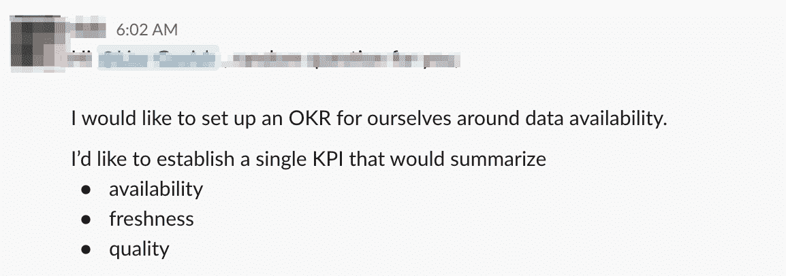

# 数据质量——你衡量它的方式是错误的

> 原文：<https://towardsdatascience.com/data-quality-youre-measuring-it-wrong-8863e5ae6491?source=collection_archive---------25----------------------->

## 还有一个更好的方法

奥利维尔·勒莫阿尔

我们的一位客户最近提出了这个问题:

> “我想为我们自己(数据团队)建立一个关于数据可用性的 OKR。我想建立一个单一的关键绩效指标，将总结可用性，新鲜度，质量。
> 
> 做这件事的最好方法是什么？"

我无法告诉你这个请求给我带来了多少快乐。作为一个痴迷于数据可用性的人——是的，你没看错:这些天来，我不再梦见绵羊，而是梦见空值和数据新鲜度——这是一个梦想成真。

# **这有什么关系？**

如果你从事数据行业，你要么正在从事一个数据质量项目，要么刚刚完成一个项目。这是坏数据的法则——坏数据总是越来越多。

[测量数据质量的传统方法](https://www.itpro.co.uk/business-intelligence-bi/29773/how-to-measure-data-quality)通常是时间和资源密集型的，跨越几个变量，从准确性(一个显而易见的问题)和完整性，到有效性和及时性(在数据中，没有时髦的迟到这回事)。但是好消息是有更好的方法来处理数据质量。

[数据停机时间](/the-rise-of-data-downtime-841650cedfd5) —数据不完整、错误、丢失或不准确的时间段——对于任何努力实现数据驱动的公司来说都是一个重要的衡量指标。这听起来可能是陈词滥调，但这是真的——我们努力收集、跟踪和使用数据，但我们经常不知道数据是否准确。事实上，公司经常以拥有[优秀的数据管道，但是糟糕的数据](/good-pipelines-bad-data-e55d9ba17920)而告终。那么，如果在一天结束时，我们不能实际使用数据，那么建立一个奇特的数据架构的所有这些努力又有什么价值呢？

通过测量[数据停机时间](/the-rise-of-data-downtime-841650cedfd5)，这个简单的公式将帮助您确定数据的可靠性，让您有信心使用它或失去它。

# **所以你想要它的 KPI？**

总的来说，[数据停机时间](/the-rise-of-data-downtime-841650cedfd5)是一个函数:

*   **数据事件数量(N)** —鉴于您依赖于团队“外部”的数据源，这一因素并不总是在您的控制之下，但它无疑是数据正常运行时间的驱动因素。
*   **检测时间(TTD)** —在发生事故时，您能多快得到警报？在极端情况下，如果没有合适的检测方法，这个数量可以在几个月内测量出来。错误数据造成的无声错误会导致代价高昂的决策，对您的公司和客户都有影响。
*   **解决时间(TTR)** —在一个已知事件发生后，您能多快解决它？

通过这种方法，数据事故指的是数据产品(例如，旁观者报告)是“不正确的”的情况，这可能是许多根本原因的结果，包括:

*   全部/部分数据不够新
*   全部/部分数据丢失/重复
*   某些字段缺失/不正确

下面是一些 ***不是*** 数据事件的例子:

*   不会“破坏”任何下游数据的计划中的模式更改
*   由于有意更改数据系统而停止更新的表(弃用)

综上所述，我建议**针对数据停机时间的正确 KPI** 是:

> **数据停机时间=数据事故数量 x**
> 
> **(检测时间+解析时间)**

(如果您想进一步了解这个 KPI，您还可以按严重程度对事件进行分类，并按严重程度对正常运行时间进行加权，但是为了简单起见，我们将把它留到以后的文章中。)

通过自动化、高级检测和无缝解决的正确结合，您可以通过减少 TTD 和 TTR 来最大限度地减少数据停机时间。甚至有减少 N 的方法，我们将在未来的帖子中讨论(剧透:这是关于获得正确的可见性以首先防止数据事件)。

测量数据停机时间是了解其质量的第一步，并由此确保其可靠性。随着花哨的算法和业务指标满天飞，我们如何衡量这一点很容易变得过于复杂。有时候，最简单的方法就是最好的方法。

**如果你想了解更多，** **伸出手去**[***巴尔摩西***](https://www.linkedin.com/in/barrmoses/) ***。***

*有兴趣加入数据可靠性运动吗？把手伸向* [*蒙特卡洛团队*](https://www.montecarlodata.com/request-a-demo/) *！*

