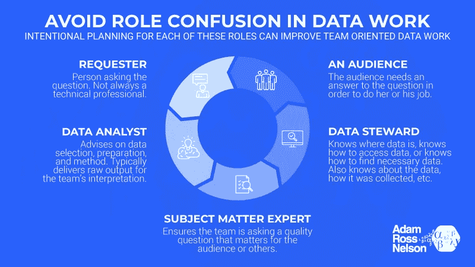

# 数据相关项目苦苦挣扎？

> 原文：<https://towardsdatascience.com/data-related-project-floundering-d04bff30c9d2?source=collection_archive---------39----------------------->

通用条形图的详细图像。图片来源:“Via Design Pickle”——[更多关于属性](https://adamrossnelson.medium.com/image-credit-attributions-a24efcc730ad)。

## 如果你有一个数据相关的项目停滞不前或举步维艰，考虑一下角色混淆是否是问题的一部分。

# 介绍

H 您是否有过一个困难的数据相关项目陷入停滞的经历？数据相关项目成功的一个常见障碍是角色混淆。角色混乱是指团队中的任何一个或多个人不确定项目需要他们自己做什么。

VentureBeat.comT4 报道称“87%的数据科学项目从未投入生产。”本文中的建议可以帮助您的项目避免这种命运。

当计划(或保存一个挣扎中的)数据相关项目时，考虑是否有一个或多个特定的人拥有以下角色(注意一些人可以“拥有”多个角色)。一般来说，每个角色至少需要一个人。本文将确定并解释每个角色。

## 1)申请人

这就是提问的人。这个人并不总是专业技术人员。可以是内部的(人力资源总监、设施总监、前台接待员)或外部的(印刷或广播媒体是常见的)。

## 2)主题专家

这个人是主题专家。SME 在确保问题是重要的质量问题方面发挥着重要作用。换句话说，中小企业有责任停止这个过程，直到每个人都完全相信手头的问题是正确的问题。申请人通常也是中小型企业，但并不总是如此。如果申请人对该主题不熟悉，该项目将受益于 SME 的加入。

## 3)观众

或者是你的观众的代理人。有时整个观众就是一个人。观众需要问题的答案，以便做好自己的工作，或者做得更好。如果你有很多观众，带上一名观众代表。

## 4)数据管家

数据管理员对于数据就像图书管理员对于书籍一样。管家有或者知道在哪里可以找到数据。数据管理员通常能够提供关于数据的重要信息(例如，特定数据列的含义、计算方式、收集数据的原因等)。).

## 5)数据分析师或技术人员

此人将对数据选择提出建议，此人还将对方法选择提出建议。通常这个人也会执行分析并产生原始输出。

# 数据驱动的团队动态

原始输出将由整个团队进行解释，以确定请求者的答案是什么。拥有一个团队的价值和好处是，当需要解释结果的时候，团队可以一起做出贡献。让团队中的任何一个成员来解释都是错误的。

 [## 加入我的介绍链接媒体-亚当罗斯纳尔逊

### 作为一个媒体会员，你的会员费的一部分会给你阅读的作家，你可以完全接触到每一个故事…

adamrossnelson.medium.com](https://adamrossnelson.medium.com/membership) 

# 结论

本文认为角色混淆是一个障碍，在处理与数据相关的项目时，它会阻碍团队的生产力。角色混乱是指团队中的任何一个或多个人不确定他们在项目中扮演什么角色。

成功的面向团队的数据相关工作通常需要的五种角色。来源:作者插图。

规划(或保存)数据相关项目时，考虑如何通过确保至少有一个特定的人负责 1)请求数据，2)主题专业知识，3)了解受众，4)提供或查找数据，以及 5)方法选择、数据分析和分析执行，来防止(或解决)角色混淆。

重要的是，整个团队在解释和传播结果方面都有自己的角色和贡献。

# 感谢阅读

如果你喜欢我要说的话，可以在:[adamrossnelson.medium.com](https://twitter.com/adamrossnelson)找到更多。

感谢阅读。把你的想法和主意发给我。你可以写信只是为了说声嗨。如果你真的需要告诉我是怎么错的，我期待着尽快和你聊天。推特:[@ adamrossnelson](https://twitter.com/adamrossnelson)| LinkedIn:[亚当·罗斯·纳尔逊](http://www.linkedin.com/in/arnelson) |脸书:[亚当·罗斯·纳尔逊](http://www.facebook.com/adamrossnelson)。