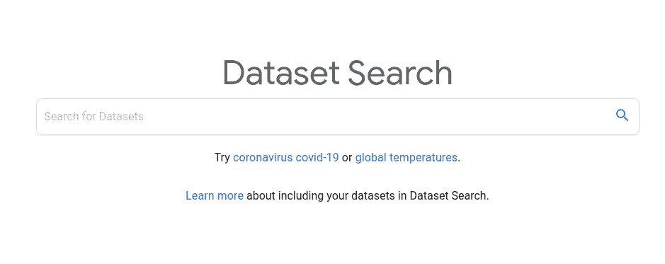
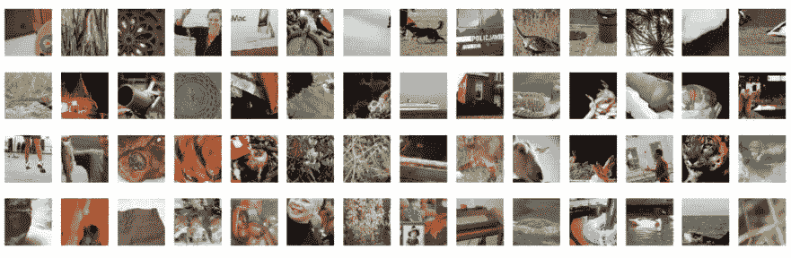
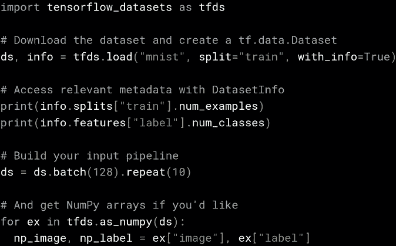

# 几乎每种数据科学项目的数据存储库

> 原文：<https://towardsdatascience.com/data-repositories-for-almost-every-type-of-data-science-project-7aa2f98128b?source=collection_archive---------17----------------------->

## 针对每种类型问题的数据存储库的综合列表

来自 Unsplash

鉴于我的工作性质，我每周都要处理新项目，解决不同的问题。我的工作要求我解析大量不同种类的数据集，以便为数据科学爱好者设计和开发指导。

这个博客包含了一些有用的数据集和数据仓库，按照不同的问题和行业进行分类。

# **网络上的数据仓库:**

谷歌数据集门户

*   [谷歌数据集搜索](https://toolbox.google.com/datasetsearch)——研究人员定位在线数据的搜索引擎。
*   [datasetlist](https://www.datasetlist.com/) —提供网络上最大的机器学习数据集列表。
*   [UCI](https://archive.ics.uci.edu/ml/datasets.php) —最古老的存储库之一，数据按照问题类型、属性类型、数据类型、研究领域等进行分类。
*   [fastai-datasets](https://course.fast.ai/datasets.html) —用于[图像分类](https://course.fast.ai/datasets.html#image-classification)、 [NLP](https://course.fast.ai/datasets.html#nlp) 和[图像定位](https://course.fast.ai/datasets.html#image-localization)的数据集
*   [NLP-datasets](https://github.com/niderhoff/nlp-datasets) —自然语言处理中使用的带有文本数据的自由/公共领域数据集的字母列表
*   [Bifrost](https://datasets.bifrost.ai/) —用于按任务、应用、类、标签和格式分类的可视化数据集。

# 图像数据集

打开数据集图像

*   [ImageNet](http://image-net.org/)—**ImageNet**是一个按照 [WordNet](http://wordnet.princeton.edu/) 层次结构(目前只有名词)组织起来的图像数据库，其中层次结构的每个节点都由成百上千的图像描述。
*   [CT 医学图像](https://www.kaggle.com/kmader/siim-medical-images) —设计用于测试不同的方法，以检查与使用对比剂和患者年龄相关的 CT 图像数据的趋势。这些数据由癌症影像档案中的一小部分图像组成。
*   [Flickr-Faces](https://github.com/NVlabs/ffhq-dataset)—Flickr-Faces-HQ(FFHQ)是一个高质量的人脸图像数据集，最初是作为生成对抗网络(GAN)的基准而创建的。
*   [object net](https://objectnet.dev/)——一种新的视觉数据集，借鉴了其他科学领域的控制思想。
*   [名人面孔](http://mmlab.ie.cuhk.edu.hk/projects/CelebA.html) —大规模名人面孔属性
*   [动物面孔-HQ 数据集(AFHQ)](https://github.com/clovaai/stargan-v2/blob/master/README.md#animal-faces-hq-dataset-afhq)-动物面孔数据集，由 15，000 张分辨率为 512×512 的高质量图像组成。

# NLP 数据集

[https://medium . com/@ ODSC/20-open-datasets-for-natural-language-processing-538 fbfaf8e 38](https://medium.com/@ODSC/20-open-datasets-for-natural-language-processing-538fbfaf8e38)

*   [nlp-datasets](https://github.com/niderhoff/nlp-datasets) —自然语言处理(nlp)中使用的带有文本数据的自由/公共领域数据集的字母列表。
*   [1 万亿 n-grams](https://catalog.ldc.upenn.edu/LDC2006T13) —语言学数据联盟。该数据预期对统计语言建模有用，例如用于机器翻译或语音识别，以及用于其他用途。
*   [litbank](https://github.com/dbamman/litbank) — LitBank 是一个包含 100 部英语小说作品的带注释的数据集，用于支持自然语言处理和计算人文学科的任务。
*   [BookCorpus](https://github.com/soskek/bookcorpus) —这些是自己复制 BookCorpus 的脚本。
*   rasa-nlu-training-data —用于开发和测试 Rasa NLU 模型的众包培训数据。
*   [Google book Ngram](https://books.google.com/ngrams) —这是一个在线搜索引擎，它使用 1500 年至 2019 年间在谷歌的英语、中文、法语、德语、希伯来语、意大利语、俄语或西班牙语文本语料库中印刷的来源中发现的 n 元语法的年度计数，绘制任何一组搜索字符串的频率。

# 情感分析

来自 Unsplash

*   **评论—** [亚马逊评论](https://www.kaggle.com/bittlingmayer/amazonreviews)， [Yelp 评论](https://www.kaggle.com/yelp-dataset/yelp-dataset)，[电影评论](http://www.cs.cornell.edu/people/pabo/movie-review-data/)，[美食评论](https://www.kaggle.com/snap/amazon-fine-food-reviews)，[推特航空](https://www.kaggle.com/crowdflower/twitter-airline-sentiment)，
*   [斯坦福情感树库](https://nlp.stanford.edu/sentiment/code.html) —这个[数据集](https://nlp.stanford.edu/sentiment/code.html)包含了来自烂番茄 HTML 文件的超过 10，000 条斯坦福数据。
*   [词典编纂器情感词典](http://www.lexicoder.com/) — **词典编纂器**对几乎任何语言的任何类型的文本进行简单的演绎内容分析。
*   [意见词库](https://www.cs.uic.edu/~liub/FBS/sentiment-analysis.html#lexicon) —英文正反意见词或情感词列表。
*   [会话数据集](https://github.com/PolyAI-LDN/conversational-datasets)—用于会话响应选择的大数据集集合。
*   更多—[NRC-情感-词库-词级](https://raw.githubusercontent.com/dinbav/LeXmo/master/NRC-Emotion-Lexicon-Wordlevel-v0.92.txt)， [ISEAR(17K)](https://github.com/PoorvaRane/Emotion-Detector/blob/master/ISEAR.csv) ， [HappyDB](https://megagon.ai/projects/happydb-a-happiness-database-of-100000-happy-moments/) ，[情感到表情映射](https://github.com/ErKiran/TwitterBot/blob/master/emoji.json)

# 声音的

[Audioset](https://research.google.com/audioset/index.html) —一个大规模数据集，由 632 个音频事件类的扩展本体和从 YouTube 视频中提取的 2，084，320 个人类标记的 10 秒声音剪辑组成。

# 金融与经济

来自 Unsplash

*   [Kaggle 金融数据集](https://www.kaggle.com/tags/finance) —金融数据集是关于金钱和投资的。如果您需要测试一些新的加密货币投资策略或抵御那些讨厌的信用卡欺诈爱好者，那么您来对地方了。
*   [CFPB 信用卡历史](https://data.world/adamhelsinger/cfpb-credit-card-history) —每月新开信用卡的数量和累计信用额度。
*   [顶级银行](https://data.world/arthur/banks) —该数据集包含全球最大银行的列表。
*   [学生贷款债务](https://data.world/finance/student-loan-debt) —学生贷款债务汇总数据的集合，包括按年龄、金额和债务类型划分的债务余额。
*   [国际货币基金组织](https://www.imf.org/external/index.htm)，[英国《金融时报》数据集](https://markets.ft.com/data/)，[世界银行数据](https://data.worldbank.org/)

# 卫生保健

来自 Unsplash

*   [ka ggle health care repository](https://www.kaggle.com/tags/healthcare)—医疗保健领域的人工智能正引起越来越多的关注。一个主要问题是如何将研究转化为应用。应该很容易吧？
*   [世卫组织](http://apps.who.int/gho/data/node.resources):全球卫生数据集。
*   疾病预防控制中心:把这个用于美国特有的公共卫生。
*   [data.gov](http://data.gov/):以美国为中心的医疗保健数据，可通过多种不同因素进行搜索。

# **科学研究**

来自 Unsplash

*   [re 3 data](https://www.re3data.org/):re 3 data 拥有超过 2000 个研究数据存储库，已经成为全球研究数据基础设施最全面的参考来源。
*   埃尔韦拉生物医学数据仓库:生物医学领域的高维数据集。它专注于期刊发表的数据(自然、科学和其他)。
*   [默克分子健康活动挑战](https://www.kaggle.com/c/MerckActivity/data):旨在通过模拟分子组合如何相互作用来促进药物发现的机器学习追求的数据集。
*   [SEER](https://seer.cancer.gov/explorer/) —由美国政府提供的按人口统计组排列的数据集。您可以根据年龄、种族和性别进行搜索。
*   [CT 癌症医学图像](https://analyticsindiamag.com/11-open-source-datasets-that-can-be-used-for-health-science-projects/) —设计用于测试不同的方法，以检查与使用对比剂和患者年龄相关的 CT 图像数据的趋势。这些数据是癌症影像档案中图像的一小部分。

# 航空航天和国防

来自 Unsplash

*   [NASA 的数据门户](https://data.nasa.gov/) —一个持续增长的公开可用的 NASA 数据集、API、可视化等目录。包括空间科学、航空航天、地球科学、应用科学和管理数据。
*   [航空数据项目](http://web.mit.edu/airlinedata/www/default.html) —来自麻省理工学院全球航空业项目的商业航空数据集
*   [天文数据服务](https://www.usno.navy.mil/USNO/astronomical-applications/data-services) —美国海军天文台(USNO)提供的各种天文数据。数据包括与太阳、月亮、行星和其他天体等相关的数据。
*   [天文年历的天文现象部分](http://asa.hmnao.com/SecA/Section_A.html) —各种天文现象，包括太阳、月亮、地心和日心。日出、日落和黄昏的表格以及日食和月食的数据都是可用的
*   [NASA 的小行星数据集](http://sbn.psi.edu/pds/archive/asteroids.html) —提供对小行星、尘埃、行星卫星、陨石等 PDS 数据的访问。

# 电子商务

*   [网络影响者营销](https://data.world/ahalps/online-influencer-marketing)，[电子商务搜索相关性](https://data.world/crowdflower/ecommerce-search-relevance)，[社会对购物的影响](https://data.world/ahalps/social-influence-on-shopping)

# 提供数据集的 Python 库

[https://blog . tensor flow . org/2019/02/introducing-tensor flow-datasets . html](https://blog.tensorflow.org/2019/02/introducing-tensorflow-datasets.html)

*   [TensorFlow 数据集](https://www.tensorflow.org/datasets) —一组现成的数据集。TensorFlow Datasets 是一个现成的数据集集合，可与 TensorFlow 或其他 Python ML 框架(如 Jax)一起使用。所有数据集都以`[tf.data.Datasets](https://www.tensorflow.org/api_docs/python/tf/data/Dataset)` 的形式公开，实现了易用、高性能的输入管道。要开始，请参见[指南](https://www.tensorflow.org/datasets/overview)和我们的[数据集列表](https://www.tensorflow.org/datasets/catalog)。
*   [S️klearn](https://scikit-learn.org/stable/datasets/index.html) —机器学习包。这个包还具有获取更大数据集的帮助器，这些数据集通常被机器学习社区用来对来自“真实世界”的数据进行算法基准测试。
*   ️️[nltk](https://www.nltk.org/book/ch02.html)t21】:自然语言工具包。自然语言处理中的实际工作通常使用大量的语言数据或语料库。
*   ️ [statsmodel](https://www.statsmodels.org/dev/datasets/index.html) :统计模型包。提供数据集(即数据*和*元数据)用于示例、教程、模型测试等。
*   [pydataset](https://pydataset.readthedocs.io/en/latest/) —主要用于教育目的的数据集。它试图帮助那些第一次接触 Python 数据科学的人，他们必须处理常见的(且耗时的)数据准备任务。
*   seaborn :数据可视化包，你也可以从在线存储库中加载一个示例数据集(需要互联网)。

如果有任何其他重要和真实的数据集或类别，你想让我添加到这个列表中，请随时回复这个故事！