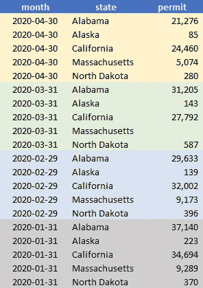
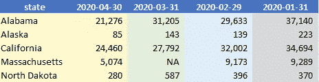
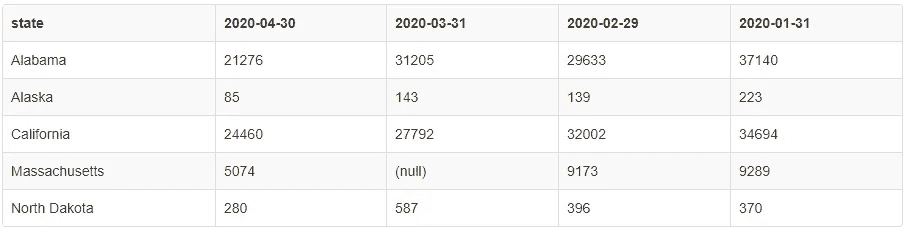

# SQL、R 和 Python 中的数据整形

> 原文：<https://towardsdatascience.com/data-reshaping-in-sql-r-and-python-d44ca19e71b8?source=collection_archive---------20----------------------->

## 关于长到宽和宽到长转换的有用指南

设想这样一个场景:您刚刚完成了一个 SQL 查询，为涉众生成了汇总统计数据，让我们以下面的表格为例，

长数据格式

这是一个纵向数据，跟踪每月和州的枪支许可证检查次数。原始数据是公开的，更多背景资料[链接于此](https://github.com/BuzzFeedNews/nics-firearm-background-checks)。所以你的项目是对枪支许可变化的时间序列分析，包括纵向跨时间和横向跨州。不难认识到，该分析需要转换数据，以便将***月*** 或 ***状态*** 变量放置在列上，如下所示:

宽数据格式

这种数据整形过程被称为旋转(即，长/堆叠到宽/扩散)，其逆过程是取消旋转(即，宽/扩散到长/堆叠)。将数据从一种格式转换为另一种格式是分析项目中最常见的数据操作步骤之一。因此，在这篇博客中，我们将探索如何有效地将数据从 long 转换为 wide(反之亦然)，我们将使用 SQL、R 和 Python 来完成这一过程。

******更新 2022:*** ***加入我们的 YouTube 社区🎦*** [***【数据说话带吉】***](https://www.youtube.com/channel/UCbGx9Om38Ywlqi0x8RljNdw) ***😄***

# **旋转:长到宽**

## **SQL:**

先说`PIVOT()`函数，Oracle 11g 和 MS server 2017 都有。为了方便访问，我还在这里的[SQL fiddle playground](http://sqlfiddle.com/#!18/14047/2)中对它进行了编码，

在该查询中，*允许*列被指定为要分摊的值，而*月*列被指定为新透视表的标签。其他列(即玩具数据中的*状态*列)被隐式地视为`GROUP BY`变量。回报正是我们所期望的，

在这里，您一定注意到了我们查询中的聚合函数`SUM()`。该功能无法消除，因为旋转是一种侵略性操作，因为[它将(可能的)多行合并成输出](https://docs.microsoft.com/en-us/sql/t-sql/queries/from-using-pivot-and-unpivot?view=sql-server-ver15)中的一行。

然而，在我们的例子中，由于每个月每个州只有一行，`SUM()`什么也不做，因此可以被其他 agg 替换。功能(如`AVG()`)。相反，如果我们有多行(对于每个月的每个州)要聚合，这些函数将通过避免额外的子查询而派上用场。

现在，转到其他 SQL 数据库，例如 MySQL 或 PostgreSQL，其中`PIVOT`操作符不可用，下面显示了查询( [SQL fiddle playground](http://sqlfiddle.com/#!9/36e0e5/1) )，

与`PIVOT`操作符一样，聚合函数也是指定的，但是随着月份的增加，这个查询很容易变得冗长。假设我们有 100 个月的记录，而不是 4 个月，我们将不得不手动键入 100 列标签！这肯定不是最佳解决方案。

## **R—shape()&pivot _ wider():**

R 中的数据帧本质上是矩阵，因此矩阵转置的公知思想是适用的。有很多 R 函数可以处理这个任务，我最喜欢的两个是包***【stats】***和***【tidyr】***中的`reshape(direction = 'wide')` 和`pivot_wider()` 。

请注意，`pivot_wider()`是`spread()`的更新功能，不再处于积极开发中(更多详细信息，请参见此处的)。

现在，下面的代码展示了如何使用`pivot_wider()`用 R 中的几行代码实现旋转。如果你也对`reshape()` 版本感兴趣，我在[我的 Github](https://github.com/YiLi225/Data_Reshaping) 中有它的链接，

这里:[1]我们将 **names_from** 参数设置为跨列分布的变量(即 *month* 变量)；[2]另一个有用的可选参数是 [**names_prefix**](https://rdrr.io/github/tidyverse/tidyr/man/pivot_wider.html) ，它指定每个列名的前缀词(例如，month _ 2020–01–31)。

## **Python — pivot_table()** :

同样，Python 中也有一个函数*恰如其分地命名为`pivot_table()`*

***这里:[1]我们用 0 替换缺失值，将 *permit* 列转换为整数(与默认 float64 相反)；[2]输出表的列被设置为类型字符串，以避免标签在 [reset_index](https://pandas.pydata.org/pandas-docs/stable/reference/api/pandas.DataFrame.reset_index.html) 之后被转换为日期时间(如 2020–01–31 00:00:00)；[3]此函数有一个可选参数**，可用于聚合多行(如`‘sum’, ‘count’`)。*****

# *****非旋转:从宽到长*****

*****现在让我们假设我们想要将宽数据转换回原始的长数据结构。**在 SQL** 中，除了我们用`unpivot()`替换了函数`pivot()`之外，查询几乎与旋转相同，并且 SQL 小提琴在这里链接，*****

## *******R—shape()&pivot _ longer():*******

*****对于这个演示，我们将再次关注来自 ***{tidyr}*** 的`pivot_longer()`，它的对等`reshape(direction = 'long')`版本可在我的 [Github repo](https://github.com/YiLi225/Data_Reshaping) 中获得。与`pivot_wider()`的情况类似，`pivot_longer()` 是对原有`gather()`功能的更新，不再开发。*****

*****下面是我们如何将数据从宽数据转换回长数据，*****

*****在这段代码中， **cols** 参数接受要堆叠成更长格式的列，即我们数据中的月份变量。这一行`colnames(wide_dat)[-1]`将排除第一个变量*状态*。这是输出，它符合我们的原始数据格式，*****

**********

*****一个问题是，如果聚合了多行，那么取消投票不会产生原始的表值。*****

## *******Python — melt():*******

********熊猫*** 也有，函数`melt()`执行宽到长的转换，*****

*****与 R 输出一样，这段代码的返回与我们的原始数据完全匹配。*****

********想要更多数据科学和编程技巧？使用*** [***我的链接***](https://yilistats.medium.com/membership) ***注册 Medium，获得我所有内容的全部访问权限。********

# *****最后的想法*****

*****正如我们刚刚了解到的，SQL 作为一种查询语言，在用于数据整形时会变得繁琐冗长。与 SQL 表不同，R 和 Python 中的数据框本质上是矩阵，其中行和列是可互换的；因此更适合像数据转换这样的任务。*****

*****关于 R 与 Python 的对比，我的经验是，通常一个任务可以使用 R 中不同的包以多种方式完成，而 Python 的开发方式是尽可能只提供一种功能。虽然一些数据科学家欣赏 R 中的这种灵活性，但其他人可能会发现它含糊不清、令人困惑。*****

*****此外，Python 被认为是比 R 稍低级的语言，它有更严格的数据类型要求。例如，一只*熊猫。系列*与 *numpy.array、*不同，因此它们不共享属性或方法。然而，在 R 中，不存在这样的区别，其中等价的概念只是一个*向量*或*矩阵*。这一特性使得统计/科学分析比 Python 中的分析更加方便。*****

*****毕竟，R 和 Python 的设计目的有些不同。我希望对这些区别的认识能使你更有效地选择最佳语言来解决你的具体问题。😀*****

********想要更多数据科学和编程技巧？使用*** [***我的链接***](https://yilistats.medium.com/membership) ***注册 Medium，获得我所有内容的全部访问权限。********

********还订阅我新创建的 YouTube 频道*** [***【数据谈吉】***](https://www.youtube.com/channel/UCbGx9Om38Ywlqi0x8RljNdw)*****

## ******更多有用的数据科学博客:******

****** [## 每个数据科学家都应该知道的 6 个 SQL 技巧

### 提高分析效率的 SQL 技巧

towardsdatascience.com](/6-sql-tricks-every-data-scientist-should-know-f84be499aea5)  [## 熊猫失败时将 Word 和 PDF 文件导入 Python 的 4 种简单方法

### 导入非结构化文本/图像数据的实用指南

levelup.gitconnected.com](https://levelup.gitconnected.com/4-simple-ways-to-import-word-and-pdf-files-into-python-when-pandas-fails-43cf81599461)******