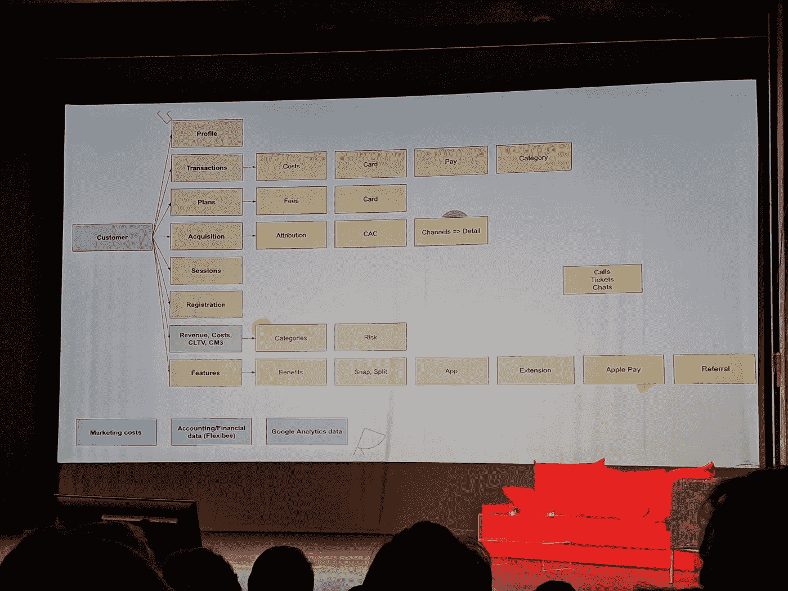
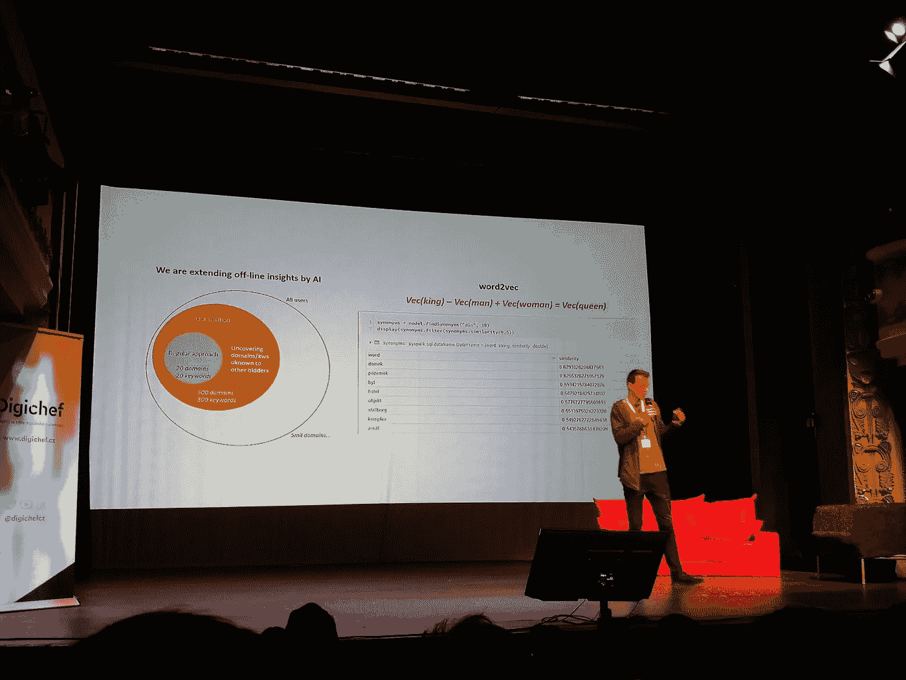

# 数据重启 2020

> 原文：<https://towardsdatascience.com/data-restart-2020-66c82733c045?source=collection_archive---------23----------------------->

## 3 月 5 日，我有机会参加了由 Taste 组织的为期一天的关于数据和营销的会议 [Data Restart 2020(布拉格)](https://www.datarestart.cz/)，以下是一些亮点。

图片来源 [www.datarestart.cz](https://www.datarestart.cz/)

该阵容包括来自代理商(Etnetera Activate、Optimics、DataSentics、Data Mind 和活动主办方——Taste)和内部团队(Twisto、Alza、Bonami)的 11 场演讲。这些平台以谷歌为代表，占据了整整两个发言时段。其中一位演讲者 Behavio 以一种方式脱颖而出，他说他们的核心业务是营销和社会学研究，而不是纯粹的数据分析。

主题和案例研究侧重于市场营销，但在数据分析方面非常容易理解。

## **营销数据凌乱**

*   25–35%的 web 流量数据在点击和 GA 报告之间丢失(大约。5%归因于防火墙，25%归因于广告拦截器，10%归因于浏览器在隐私保护方面的努力，未知%归因于 GA/GTM 实施中的错误)。**解决方案:**定期自我审计，了解你的数据丢失发生在哪里，是提高数据质量的第一步。

Etnetera 激活数据质量([图像源](https://rickdronkers.com/blog/im-working-with-tracedock-to-improve-your-data-accuracy/))

*   一些营销渠道只是不想共享数据。以播客平台为例:苹果、Spotify、Podtrac——无 API(手动导出、CSV)、Blubrry——付费且昂贵的 API(约。每月 1000 美元)。**解决方案:**寻找自动导出的方法，例如使用网页抓取。
*   其他营销平台使用不同的度量标准和维度定义，因此很难找到一种方法来比较“橙子和橙子”以及“苹果和苹果”。**解决方案:**将来自不同渠道的数据集中到一个地方，您可以根据自己的规则对其进行转换并进行比较，正如 Optimics for esk rozhlas 的案例研究所示。在谷歌云平台上，他们汇集了来自电台不同接触点(14 个电台、网站、播客、移动应用、社交媒体等)的数据。

Optimics 公司的 eský rozhlas 数据基础设施

*   但谷歌分析可能会有漏洞，永远不会给你全貌，所以要从整体上处理数据，把不同的数据源整合在一起。例如，fintech Twisto 的数据分析模型如下所示。他们还使用基于客户获得年份的队列分析。

Twisto 以客户为中心的数据模型

*   当心平均值，因为它们可能会误导人。再一次，Twisto 用一个例子证明了这一点:平均来说注册的转化率是 38%(这似乎是个好消息！).但现实可能是，一个在视频或帖子中展示如何使用该服务的影响者可能会推动 87%的转化率，而效果广告只有 7%的转化率。所以，始终要看渠道分布。

小心平均值(Twisto)

*   传统的 CRM 数据是静态的、交易性的，描述的是长期行为，但如果你想捕捉决策的瞬间，并了解哪些因素在起作用，那么就去看看数字“足迹”。这是雅各布·斯特奇在埃斯卡·spořitelna 案例研究中描述的方法。数字足迹是动态的、混乱的，很难捕捉和分析，但如果你破解了它，这是一种获得 360 度客户视角的方法(在 cs 的情况下，通过使用在线行为数据进行销售电话，贷款申请会大幅增加)。**解决方案:**使用上下文定位(查看 [Word2Vec](/introduction-to-word-embedding-and-word2vec-652d0c2060fa) 模型来分析文本)，为该解决方案创建的数据主题揭示了其他投标人忽略的不太明显的关键词。他们方法的另一个特点是使用原始用户级数据和连接数据源。

根据数据确定埃斯卡 spořitelna 的背景目标

## **数据伦理**

*   2018 年，最大的转变是 GDPR，其次是浏览器在数据隐私问题上采取立场(甚至[谷歌也计划在 2022 年](https://www.abc.net.au/news/science/2020-01-21/google-to-kill-third-party-cookies-privacy-and-competition)之前废除第三方 cookies)。
*   在网上 [Cookies 状态](https://www.cookiestatus.com/)你可以看到浏览器正在做什么来防止跟踪，以及他们如何对待用户数据。
*   随着数据隐私意识的提高，2020 年将会有更多的消费者期待公司提供数据隐私。
*   硬币的另一面是自愿数据交易的出现(例如， [Instars](https://instars.com/) 允许用户通过分享他们的数据来赚取加密货币)——但第三方 cookies 的问题是，参与的客户类型可能并不代表你的客户群整体。
*   来自 Etnetera Activate 的 jiří·塔潘警告说，不要使用第三方 cookies，而应该寻求明确的同意和用户身份——激励用户登录。
*   要为后 cookie 时代做好准备，请观察已经发生的从基于会话到基于事件的分析的转变。
*   在我看来，很少有公司会和他们的客户谈论隐私(同意弹出窗口和打勾框不算)。如果有人开始提出这一趋势并采取行动，这可能是一个差异化因素(比较一两年前公司如何抓住环保趋势)。

## **机器学习和人工智能正在取代我们的工作(还没有)**

如果你还没有对你自己的数据进行机器学习，或者还没有把它提供给你的客户，现在是你开始研究这个话题的时候了。因为你的竞争对手可能正在这么做。

*   在针对鞋子购买倾向的自动机器学习实验中，Data Mind 的 Jan Matouš ek 将经典逻辑回归和 H2O.ai 的商业和开源解决方案的成本效益放在一起。每个模型的精度非常相似(开源领先时为 0.73-0.75)，但差异在于花费的时间(10 小时与 1-2 小时)和所需的专业知识。

数据思维的自动化机器学习实验

*   在自动化机器学习中，你可以“外包”算法选择或参数搜索等常规任务，但仍然需要专家和领域知识来定义业务目标，评估实际实施并确保稳定性。
*   引发了一场关于**黑盒 vs .白盒** ML 解决方案的讨论:一方面，作为一名数据分析师，你想控制你放入模型的变量，它们的权重等等。因为这可能会导致大笔资金的决策。但另一方面，为了快速验证概念，使用现成的解决方案可以节省您的时间和金钱。
*   电子零售商 Alza 的案例研究展示了他们在 MS Azure 上运行的内部 ML 解决方案，以根据 PPC 支出预测销售额。他们用它来决定消费限额，模拟不同的场景和计划销售。
*   在他们的算法开发过程中，Alza 首先使用了来自销售和广告支出的直接数据，但预测模型并不超级准确，也没有捕捉到季节趋势。所以，他们增加了**时间变量**(季度、月、周)**节假日**、**特殊事件**(比如黑色星期五)和**宏观市场趋势**来提高预测。
*   金融科技 Twisto 使用大约 500 个不同的变量来评估借款人的信用风险。其中一些乍听起来无关紧要，但实际上是有道理的:例如，使用全部大写字母填写申请表的用户比具有标准拼写习惯的用户更不可靠，或者如果用户的电子邮件地址包含他们的真实姓名，这样的人比昵称晦涩的用户更有可能按时重新付款。
*   几年前，当 Twisto 刚刚起步，没有自己的用户数据可供分析时，他们依靠专业知识和常识来评估风险，这导致了 20%的不还款。

## **从头开始**

进入数字化转型并希望成为数据驱动的公司和客户可能会被大量的解决方案、工具和提供商所淹没。

*   jiří·斯坦潘分享的创始人指南提醒根据企业的生命周期阶段选择数据解决方案，但也警告说，到时候不要在底层获得堆栈。

[图片来源](https://thinkgrowth.org/the-startup-founders-guide-to-analytics-1d2176f20ac1?gi=c66738436b19)

*   来自 Taste 的 Jan kad leek 建议所有者和顾问首先通过询问基本问题来验证他们业务的数字成熟度，并确保他们当前的报告能够回答并持续跟踪这些信息:(1)我有多少客户——客户数据，(2)他们带来多少美元——交易数据，(3)收购成本——广告数据
*   除此之外，你还可以衡量商品销售成本、客户终身价值和广告支出回报。
*   基本上，在决定任何解决方案之前，你应该非常清楚你的目标。

## **数据为大家**

除非你能让足够多的人积极使用它并做出基于数据的决策，否则最复杂的数据解决方案也不会有回报。

*   这就是为什么博纳米选择了一个时尚的谷歌数据工作室单页仪表板，带有像**付费/非付费、媒体、频道分组和活动**这样的过滤器。它像一个多级漏斗一样工作，在每个阶段，你可以看到在促销上投入了多少，在销售(ROAS)上回报了多少，以及与前一阶段相比的动态。
*   该解决方案可能会忽略许多指标，但通过有意保持简单、精心开发文档以及在活动命名上保持一致，他们成功地让 30%的高管到专家员工使用仪表板作为共享的“事实来源”。
*   类似的信息来自 Alza(顺便说一下，Katka Lahodová是整个活动中唯一的女性发言人！).我上面描述的 ML 工具有一个简单的界面，只有几个关键的输入(广告花费$,活动类型)和一个带有预测的输出图。再次强调，这是一个有意识的选择，旨在提高可用性和采用率。
*   “数据是为每个人准备的”的另一个方面是你如何接近规划阶段——与所有利益相关者交谈并了解他们的需求是非常重要的。例如，对于 eský rozhlas 项目，Optimics 花了**几天时间**采访编辑、网络编辑、主编、董事会成员、播客和 hbbtv 团队、广播门户、新媒体团队等。

**需要阅读的工具/想法/资源:**

*   [Exponea](https://exponea.com/) 客户数据平台
*   [谷歌大查询](https://cloud.google.com/bigquery)和整个数据分析堆栈
*   [针对谷歌应用的 Firebase analytics](https://firebase.google.com/docs/analytics)
*   [机器学习的 H2O.io 解决方案](https://www.h2o.ai/)(商业和开源)
*   [归因模型](https://www.windsor.ai/shapley-value-vs-markov-model-in-marketing-attribution/)(沙普利，马尔科夫)
*   群组细分
*   [Matomo analytics](https://matomo.org/) (开源，上一版。Piwik)与谷歌分析
*   品味杂志 [DigiChef](https://digichef.cz/)

除了程序之外，我真正喜欢的互动测试也在 kahoot.it 上运行。使用这个工具，你可以创建一个多项选择测验，并通过他们的智能手机实时获得观众的答案，并在速度和精度方面进行竞争(在我去年的一次演讲中，我使用了一个类似的工具 [Mentimeter](https://www.mentimeter.com/) )。主持人实际上是在用演示文稿中的事实来测试我们，问了一些问题，比如“什么是 CDP？”或者“百分之多少的决策是在快速思考模式下做出的？”，所以它既吸引人又有用。

**明年的愿望清单**:听取更多平台和产品(不仅仅是谷歌)以及开源软件的意见。LinkedIn 社交活动。更多的女性演讲者。更多案例研究和趋势(如来自 Etnetera Activate)。

幻灯片可以在这里[获得](https://www.datarestart.cz/)(只有捷克语)，你也可以在 Twitter [#datarestart](https://twitter.com/search?q=%23datarestart&src=typed_query&f=live) 上查看讨论。

你觉得这些笔记有用吗？请在评论中告诉我！