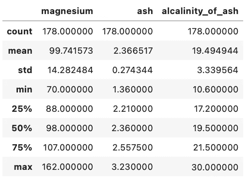
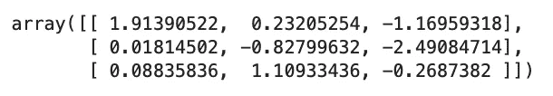

# 机器学习的数据缩放——基本指南

> 原文：<https://towardsdatascience.com/data-scaling-for-machine-learning-the-essential-guide-d6cfda3e3d6b?source=collection_archive---------42----------------------->

## 什么是标准化，为什么它如此重要？

您可能会遇到带有大量内置数字噪声的数据集，如方差或不同规模的数据，因此在考虑机器学习之前，良好的预处理是必不可少的。这类问题的一个好的预处理解决方案通常被称为*标准化*。


菲德尔·费尔南多在 [Unsplash](https://unsplash.com?utm_source=medium&utm_medium=referral) 上的照片

标准化是一种预处理方法，用于转换连续数据，使其看起来呈正态分布。在`scikit-learn`中，这通常是一个必要的步骤，因为许多模型假设你正在训练的数据是正态分布的，如果不是，你的风险偏向你的模型。

您可以用不同的方式标准化您的数据，在本文中，我们将讨论流行的数据缩放方法— *数据缩放。*或*标准缩放*更精确。

同样重要的是要注意到*标准化*是一种应用于连续数值数据的预处理方法，在一些不同的场景中会用到它:

1.  当处理任何使用线性距离度量或在线性空间上操作的模型时-KNN、线性回归、K-均值
2.  当数据集中的一个或多个要素具有较高的方差时-如果中某个要素的方差比其他要素的方差大一个数量级或更多，这可能会使假设数据呈正态分布的模型产生偏差

现在让我们继续进行数据缩放。

# 数据缩放

当处理包含不同比例的连续要素的数据集时，缩放是一种最有用的标准化方法，并且您使用的是在某种线性空间中操作的模型(如线性回归或 K-最近邻)

要素缩放会变换数据集中的要素，使它们的平均值为零，方差为一。这将使线性比较要素变得更加容易。此外，这也是`scikit-learn`中许多型号的要求。

让我们来看看一个名为 *wine:* 的数据集

```
import pandas as pd 
import numpy as np 
from sklearn import datasets wine = datasets.load_wine() 
wine = pd.DataFrame(
    data=np.c_[wine['data'], wine['target']], 
    columns=wine['feature_names'] + ['target'] 
)
```

我们想使用*葡萄酒*数据集中的`ash`、`alcalinity_of_ash`和`magnesium`列来训练一个线性模型，但是有可能这些列都是以不同的方式测量的，这会使线性模型产生偏差。使用`describe()`函数返回关于数据集的描述性统计数据:

```
wine[['magnesium', 'ash', 'alcalinity_of_ash']].describe()
```



我们可以看到，`ash`的最大值是 3.23，`alcalinity_of_ash`的最大值是 30，`magnesium`的最大值是 162。这些值之间存在巨大差异，由于规模更大，机器学习模型在这里可以很容易地将`magnesium`解释为最重要的属性。

让我们将它们标准化，以便在线性模型中使用。以下是步骤:

1.  导入`StandardScaler`并创建它的一个实例
2.  创建执行缩放的子集
3.  对子集应用缩放器

代码如下:

```
from sklearn.preprocessing import StandardScaler # create the scaler 
ss = StandardScaler() # take a subset of the dataframe you want to scale 
wine_subset = wine[['magnesium', 'ash', 'alcalinity_of_ash']] # apply the scaler to the dataframe subset 
wine_subset_scaled = ss.fit_transform(wine_subset)
```

厉害！让我们看看前几行缩放后的数据是什么样子的:



这些值现在更加接近了。为了了解缩放实际上如何影响模型的预测能力，让我们快速制作一个 KNN 模型。

首先，对于未缩放的数据:

```
from sklearn.neighbors import KNeighborsClassifier 
from sklearn.model_selection import train_test_split X = wine.drop('target', axis=1) 
y = wine['target'] X_train, X_test, y_train, y_test = train_test_split(X, y) knn = KNeighborsClassifier() 
knn.fit(X_train, y_train) 
print(knn.score(X_test, y_test)) 
**>>> 0.666666666666**
```

不太准确。让我们缩放整个数据集并重复这个过程:

```
ss = StandardScaler() X_scaled = ss.fit_transform(X) X_train, X_test, y_train, y_test = train_test_split(X_scaled, y) knn = KNeighborsClassifier() 
knn.fit(X_train, y_train) 
print(knn.score(X_test, y_test)) 
**>>> 0.97777777777777777**
```

如您所见，我们模型的准确性显著提高。我将把对这个 KNN 分类器的进一步调整留给您，谁知道呢，也许您可以正确地得到所有的分类。

让我们在下一部分总结一下。

# 在你走之前

这就是数据标准化的全部内容，也是它为什么重要的原因。我们将在其他时间比较`StandardScaler`与其他定标器。本文的要点是，无论何时你需要正态分布(相对)的特性，你都应该使用`StandardScaler`。

更准确地说，每当你使用一个假设数据是正态分布的模型——比如 KNN 或线性回归，就使用`StandardScaler`。

感谢阅读。

加入我的私人邮件列表，获取更多有用的见解。

*喜欢这篇文章吗？成为* [*中等会员*](https://medium.com/@radecicdario/membership) *继续无限制学习。如果你使用下面的链接，我会收到你的一部分会员费，不需要你额外付费。*

[](https://medium.com/@radecicdario/membership) [## 通过我的推荐链接加入 Medium-Dario rade ci

### 作为一个媒体会员，你的会员费的一部分会给你阅读的作家，你可以完全接触到每一个故事…

medium.com](https://medium.com/@radecicdario/membership) 

*原载于 2020 年 8 月 31 日 https://betterdatascience.com**的* [*。*](https://betterdatascience.com/data-scaling-for-machine-learning/)