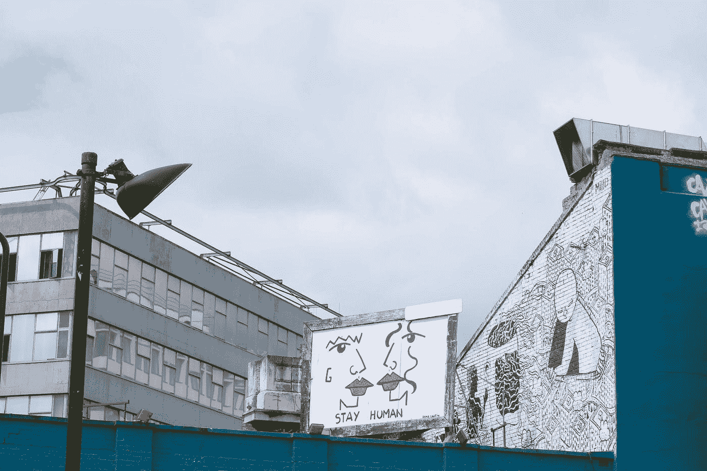

# 数据科学联盟

> 原文：<https://towardsdatascience.com/data-science-allyship-aa4c4987ce22?source=collection_archive---------67----------------------->

## 成为反种族主义数据科学家的一些方法

在 [Unsplash](https://unsplash.com?utm_source=medium&utm_medium=referral) 上由 [Toa Heftiba](https://unsplash.com/@heftiba?utm_source=medium&utm_medium=referral) 拍摄的照片

本周我打算写一写我是如何坚持并完成最近的一个项目的。然而，考虑到已经发生的一切，现在这感觉毫无意义。当然，不管发生了什么，我说的是艾哈迈德·阿贝里、布里安娜·泰勒和乔治·弗洛伊德的谋杀案，以及随后全国各地发生的抗议活动。作为一个人，除了亲自参加抗议活动，你还可以做很多事情来抗议这些谋杀。你可以向保释基金捐款([链接这里](https://docs.google.com/document/d/1X4-YS3vFn5CLL9QtJSU0xqmTh_h8XilXgOqGAjZISBI/mobilebasic))，与你社区的其他成员联系，你可以开始就黑人面临的独特斗争进行自我教育([这里有一个让你开始的书单](https://www.buzzfeednews.com/article/ariannarebolini/george-floyd-amy-cooper-antiracist-books-reading-resources?utm_source=pocket-newtab))，还有很多其他事情。不过，你可能已经在互联网上的其他地方看到过很多这样的想法，或者至少我看到过。

反种族主义的数据科学家在这段时间里能做些什么呢？这绝不是一个详尽的列表，但这是一个开始。

## 思考你的研究的含义

不久前，我看到一条推文，大意是，“干细胞告诉你如何克隆恐龙。文科告诉你为什么那是个坏主意。”有很多人工智能，特别是面部识别，已经被武器化来对付抗议者，无论是现在还是最近的历史。如果你处于开发新工具和算法的最前沿，这不足以确保它获得最好的准确性或 AUC 分数。你需要考虑你正在建造的东西的含义。仅仅决定如何使用你的模型是不够的，还要决定如何使用它，并采取相应的行动。如何做到这一点的一个很好的例子是在 OpenAI 发布的 [GPT-2 中看到的，他们从偏移中表示，由于潜在的恶意使用，他们不会发布训练好的模型。然而，如果你不在创造新技术的前沿，但你仍然在数据科学领域工作:](https://openai.com/blog/better-language-models/)

## 与他人分享你的技术知识

正如我所说，监控技术和警务算法只是用来对付抗议者的许多工具中的一部分。作为技术社区的成员，我们对技术能做什么和如何做有更好的了解。如果你已经在面部识别领域做了很多研究，你就有资格告诉别人它是如何工作的，以及需要采取哪些步骤来绕过它。如果你知道手机拍摄的照片中保存的元数据，你可以向其他人解释如何在社交媒体上发布照片，而不危及任何抗议者的安全。我们生活在一个日益由数据驱动的世界。这意味着数据科学家对世界运行的齿轮有了越来越深入的了解。我们了解像深度假货、面部识别和算法这样的事情是如何工作的，这种了解可能非常有价值。但是，只有当我们有效地与公众交流我们的知识时，这种价值才会产生。说到知识，数据科学的盟友们还有另外一件事:

## 努力教育自己

[https://tenor . com/view/lilo-and-stitch-Disney-pleakley-jumba-education-gif-3562360](https://tenor.com/view/lilo-and-stitch-disney-pleakley-jumba-education-gif-3562360)

我们一直在学习新的东西，一旦你弄清楚了最新的 SOTA 模型，新的就会出现。如果你已经在不断学习，为什么不花点时间了解种族主义是如何影响这个领域的呢？我们目前有种族主义技术，如面部识别，在检测白人面孔方面比有色人种更好。如果这个问题没有直接影响到你，或者你没有有意识地反种族主义，这就是你可能完全忽略的那种错误。因此，努力变得更加反种族主义不仅仅是让你成为更好的人和社区成员，而是让你成为更好的数据科学家。了解科技和数据科学中存在的种族歧视的最佳方式之一是倾听直接受其影响的人的声音。这里有几本书可以作为起点:

 [## 技术之后的竞赛:新吉姆法典的废奴主义工具| IndieBound.org

### 从日常应用到复杂算法，鲁哈·本杰明(Ruha Benjamin)透过科技行业的炒作来理解新兴的…

www.indiebound.org](https://www.indiebound.org/book/9781509526406)  [## 迷人的技术:种族、核心技术科学和日常生活中的自由想象

### 《种族、道德技术科学和日常生活中的解放想象》鲁哈·本杰明(编辑)杜克大学…

www.indiebound.org](https://www.indiebound.org/book/9781478003816)  [## 压迫的算法:搜索引擎如何强化种族主义| IndieBound.org

### 揭示了对有色人种女性的负面偏见是如何嵌入搜索引擎结果和算法运行中的…

www.indiebound.org](https://www.indiebound.org/book/9781479837243)  [## 暗物质:对黑暗的监视| IndieBound.org

### 在《黑暗物质》中，西蒙尼·布朗将黑暗的条件定位为一个关键的场所，通过它监视…

www.indiebound.org](https://www.indiebound.org/book/9780822359388)  [## 我们的数据体:数字防御行动手册

### 我们的数据机构(ODB)已经进行了研究，并制作了一本以数据为重点的普及教育活动手册…

store.alliedmedia.org](https://store.alliedmedia.org/products/our-data-bodies-digital-defense-playbook?variant=18553259622496) 

如果你想在 Twitter 上听到并关注黑人的声音，还有# [BlackTechTwitter](https://twitter.com/search?q=%23BlackTechTwitter&src=hashtag_click) ,坦白地说，我可能错过了很多东西。

最终，努力倾听(而不是谈论)黑人的声音，并从他们所说的话中学习。话虽如此，也要大声说出你的支持，放大那些同样的黑人的声音。作为一名女性，我曾经历过我说了些什么而被当作没什么而不予理睬的时候，但是当我的一个男性朋友说了同样的话时，它就被当真了。如果我们不能确保不同的声音不被听到，多样性就没有什么价值。因此，如果我们想建立更好的技术和技术背后的更好的社区，我们所有人都有责任积极致力于反种族主义。

#BlackLivesMatter