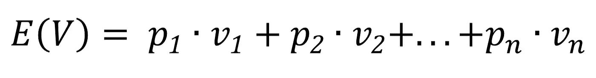
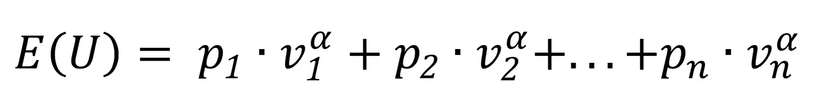

# 数据科学和行为经济学

> 原文：<https://towardsdatascience.com/data-science-and-behavioural-economics-96641ab83d08?source=collection_archive---------22----------------------->

乔希·里默尔在 [Unsplash](https://unsplash.com?utm_source=medium&utm_medium=referral) 上的照片

## 通过数据了解我们的偏见

# 什么是数据科学？

根据维基百科的说法，数据科学“*是一个跨学科领域，它使用科学的方法、流程、算法和系统从结构化和非结构化数据中提取知识和见解*。

和统计学有什么区别？说实话，没那么多。统计学是数学的一个分支，主要研究随机性、不确定性和信息。它是用于从数据中提取知识的科学的一部分，现在几乎在任何科学领域都有应用。

这种知识提取可以通过算法来完成，这有时需要大量的计算能力。由于缺乏足够强大的计算机，这些算法中的一些在许多年前不可能存在或被测试。然而，随着计算机科学和技术的巨大进步，我们现在能够开发更复杂的方法来从数据中提取信息。不仅如此，我们现在可以获得比以前多得多的数据。就好像我们给统计学打了类固醇，然后它就变成了数据科学。如果你想了解更多，可以从这里开始[。](https://medium.com/dataseries/data-science-101-99e34bea86c)

# 什么是行为经济学？

另一方面，行为经济学是心理学在经济学领域的应用(因此，它也被称为经济心理学)。许多年前，主流经济理论基于一些假设，其中之一是人类理性行事(臭名昭著的经济人)。

乍一看，这种假设似乎没有多大意义，因为我们都知道我们自己并不总是理性行事。然而，我们必须考虑到，如果我们从大的方面来看，这个假设似乎更合理:我可能不会完全理性地行动，你也可能不会。然而，总的来说，人类可能会。就像我们的非理性互相抵消了。这是一个更合理的假设，它使得创建模型、尝试和预测市场走向变得容易得多。

然而，即使是这个更合理的假设，也被行为经济学领域质疑，并在某些情况下被证明是错误的。此外，它最大的贡献不是表明经济学家忽视我们的非理性而过度简化了现实，而是表明非理性有时是可以预测的。我们的行为方式可能与理性假设不一致，但这本身是一致的，这意味着我们总是倾向于以同样的非理性方式行事。这种行为被称为认知偏差。

# 他们是怎么走到一起的？

现在我们有数据和计算能力来提出更好的现实模型，我们知道人类的非理性可以被测量和预测，我们如何利用这一点呢？好吧，我将提出一些著名的认知偏见，以及如何使用数据科学来衡量它们或将它们融入到您的产品/服务中。

## 确认偏差

最著名的认知偏差之一是确认偏差。它代表了我们倾向于寻找那些证实我们已经知道的东西，而忽略那些与我们自己的观点不一致的观点。如果我反对枪支管制，我看到一篇文章说枪支会增加暴力，我会倾向于忽略它。然而，如果我看到另一篇文章显示了相反的证据，我更有可能去读它。例如，脸书通过选择向我们展示与我们的世界观一致的帖子、文章和观点，从这种偏见中获利。

但是你怎么能深入到只看数据就能知道某人对世界的看法呢？嗯，你不需要。你可以使用算法来考虑我倾向于喜欢的内容类型，将我与其他喜欢过相同内容的用户进行比较，并向我推荐他们喜欢过而我以前没有见过的内容。网飞的推荐系统也是同样的原理。为你做到这一点的算法类型被称为“协同过滤”，也可以用来推荐产品或服务。

## 风险规避

[澳门图片社](https://unsplash.com/@macauphotoagency?utm_source=medium&utm_medium=referral)在 [Unsplash](https://unsplash.com?utm_source=medium&utm_medium=referral) 上拍摄的照片

根据环境的不同，人们或多或少倾向于冒险，这往往会导致他们做出不合理的决定。假设我邀请你赌一枚硬币:正面我给你 50 美元，反面你给我 100 美元。似乎不公平，对吧？我们实际上可以计算出这类游戏的预期收益，方法是将每个可能的结果乘以其发生的概率，然后将结果相加:50% *(-100 美元)+50% *($ 50)=-25 美元。这意味着玩这个游戏你平均会损失 25 美元。然而，如果你仍然因为过于乐观，仍然希望赢得 50 美元而决定玩这个游戏，那么你就是有风险倾向的行为。然而，如果反过来，你就会表现出规避风险的态度。

在这种情况下，期望值通用等式可以写成如下形式:

其中 p 是概率，v 是每个可能结果的相关值。风险中性的个人会根据这个等式做出决定。然而，通常情况下，人们往往是非理性的，因此行为更像下面的模型:

这里我们加入了α，它代表了个体对风险的态度:当α>1 时，个体容易产生风险；当α<1, the individual is averse to risk (and when α=1, the equation becomes just like the one above).

Studies have already shown some characteristics that can influence your attitude towards risk, such as sex, age and wealth. Since this bias can be seen not only in coin-tossing games but also when people buy insurance, warranties and lottery games, you could use regression algorithms to calculate and predict your customers’ behaviour towards risk. By doing so, you could make sure you price your services accordingly, depending on the person’s profile.

## Moral hazard

Photo by [Conor Samuel](https://unsplash.com/@csbphotography?utm_source=medium&utm_medium=referral)on[Unsplash](https://unsplash.com?utm_source=medium&utm_medium=referral)

这种偏见在保险行业很常见，举个例子可以更好地解释:一旦你给你的车上了保险，你就开始不那么担心承担风险:例如，你不会像以前那样避免在危险的街区停车。为了在给你的保险定价时考虑到这一点，公司不仅开始考虑年龄和性别的整体统计数据(例如:年轻男性更有可能遭遇车祸，所以他们的保险单通常会更贵)，而且他们必须考虑到这些概率在你给汽车投保后如何变化*。这意味着通过一个虚拟变量来控制他们的分析，这个虚拟变量告诉人们是否有保险。*

# 结论

综上所述，我们知道数据科学可以为决策过程中存在低效率的领域带来价值。行为经济学可以向我们展示那些低效率在哪里，并且已经可以为我们提供一些模型，我们可以将我们已知的数据科学方法应用于这些模型。另一方面，数据科学可能会帮助我们识别我们还没有意识到的新偏见。这是一个双赢的游戏。