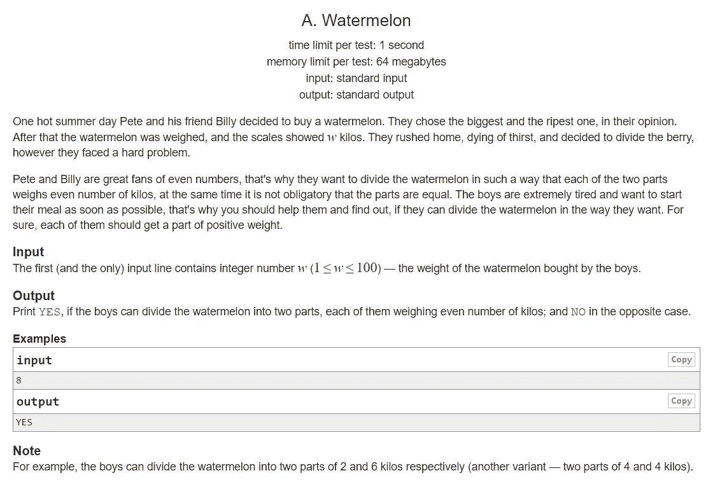
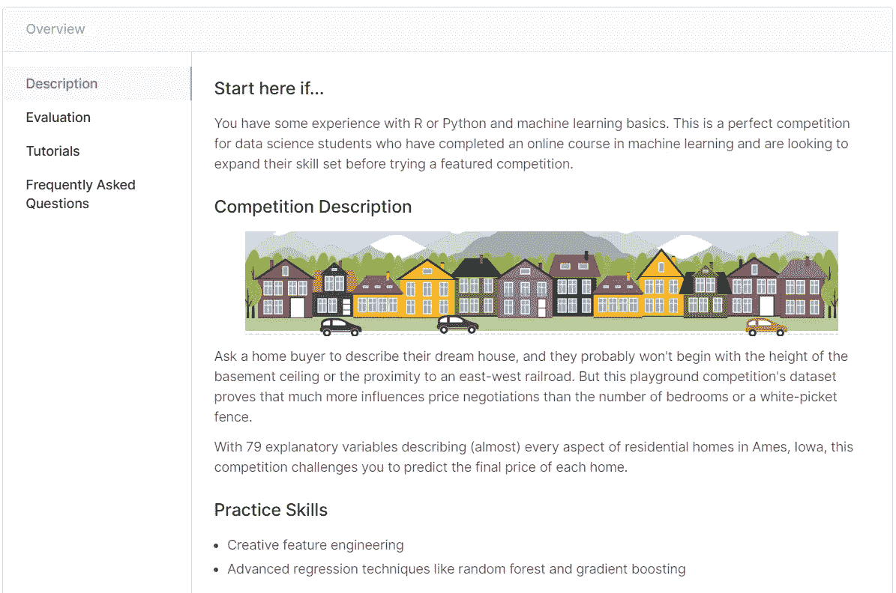

# 数据科学和竞争性编程

> 原文：<https://towardsdatascience.com/data-science-and-competitive-programming-2887300207c0?source=collection_archive---------33----------------------->

## 他们在解决问题，但方法不同。

在 [Unsplash](https://unsplash.com/s/photos/programming?utm_source=unsplash&utm_medium=referral&utm_content=creditCopyText) 上由 [Max Duzij](https://unsplash.com/@max_duz?utm_source=unsplash&utm_medium=referral&utm_content=creditCopyText) 拍照

C 竞争是学习新事物的好方法，尤其是对那些有兴趣竞争并赢得某些东西的学生来说。到目前为止，竞争性编程已经成为计算机科学界的热门竞赛。

对我来说，竞争性编程具有挑战性，因为你必须解决问题，并且使用现有的算法或实现自己的算法来解决问题。

当我大一的时候，我仍然花时间在这上面竞争，而且，我被介绍到数据科学。由于数据量和存在的机器学习算法，近年来它一直很受欢迎。

我对这一领域的发展速度以及使用数据科学方法的应用感到惊讶。正因为如此，我对数据科学产生了兴趣。

然后，突然之间，我陷入了两难的境地，要选择是继续追求竞争性编程，还是继续提升我的数据技能。根据我的经验，那些东西是在解决问题。

> 但是你有没有想过两者都追求还是选择其中一个？

您之所以阅读这篇文章，是因为当我刚进入数据科学领域时，您可能和我有着同样的困境。所以，我想给你一些关于竞技编程对你的职业是否有用的观点。

我写这篇文章，特别是为那些计算机科学的新生或者可能目前刚开始学习数据科学的人。如果你刚接触竞争性编程，我希望这对你有用。

我写这篇文章是基于我在探索计算机科学的许多领域时的经验。

这篇文章将分成几个部分。首先，我将介绍什么是竞争性编程。然后，我将向你展示与 Kaggle 比赛的不同之处。最后，我会给你一些来自软件工程和数据科学的观点，并强调它是否值得追求。

没有别的了，让我们开始吧。

# 竞争性编程

竞争性编程是一种人们必须在一定时间内解决问题的竞赛。通常，它会给你输入和输出的例子，然后你用任何编程语言来实现这个问题。

**这是 Codeforces 的问题示例，**

由我从 [Codeforces](http://codeforces.com/problemset/problem/4/A) 中捕获

首先我们可以看到，问题陈述用一个故事来说明问题。然后，它向您展示了示例案例。最后，给出了一些注意事项。

有了这个问题陈述，你必须分解我们必须做的步骤，然后，我们设计并实现算法来解决它。它只是显示了几种情况，但实际上，还有更多。因此，你必须确保你的算法可以解决任何情况。

> 总的来说，竞争性编程将在解决问题和编程技能上挑战你的团队。还有，因为你要用算法解决问题，所以你要一步一步地写解决方案。

# 与数据科学竞赛的区别

与数据科学社区之一的 Kaggle 相比，竞争确实不同。

在 Kaggle 上，你会得到问题陈述和数据集。你必须使用机器学习算法来解决问题，以最小的误差预测结果。除了解决问题之外，您还必须分析数据以获得洞察力、模式、异常值等等。

这里显示了 Kaggle 的房价预测，

被我从 [Kaggle](https://www.kaggle.com/c/house-prices-advanced-regression-techniques) 中捕捉到。

在这个例子中，你想解决回归问题，你必须用给定的数据来预测房子的价格。因此，您必须调整模型，使其能够以更小的误差预测值。此外，你必须分析数据集，以获得更多的见解。

在竞争性编程中，你也分析算法，但这与数据科学不同。您将分析您的算法性能。

如果你发现你的算法不符合某些要求像你的算法超过了时间限制，那么你就要改进算法。因此，你可以解决问题。

在数据科学中，你也将分析你的模型，然后你改进模型以具有更高的性能。

但不同之处在于，你也在研究数据的模式。有了这个模式，我们希望在继续创建模型之前获得一些见解，可能还有一些假设。

> 总体而言，数据科学竞赛主要在于分析您的数据和建模以实现更高的准确性。你不需要像从零开始的竞争性编程那样显式地编写算法，但是你只需要为这样的算法使用现成的包。
> 
> 尽管如此，你必须分析数据集并找到它的模式，还要找到可能成为你的问题的假设的见解。这部分是数据科学本身最具挑战性的部分。

# 最后的想法

照片由[布伦丹·丘奇](https://unsplash.com/@bdchu614?utm_source=unsplash&utm_medium=referral&utm_content=creditCopyText)在 [Unsplash](https://unsplash.com/s/photos/choose?utm_source=unsplash&utm_medium=referral&utm_content=creditCopyText) 上拍摄

因此，根据这些信息，**你应该同时追求两者还是只专注其中一个？**

我不知道。你有权选择哪一个。如果你还很困惑，我来给你一些我的看法。

竞争性编程和数据科学是不同的。竞技编程通过自己实现一些算法来解决问题。另一方面，数据科学也在解决问题，但它不涉及算法实现。因此，这是一个不同的领域。

如果你想解决一个新的数据科学问题，但没有任何给定的 ML 算法的实现，那么追求竞争性编程仍然是值得的。

此外，如果你想成为一名软件工程师，这是值得追求的，因为它有很多算法实现。

但是，如果您只对数据集的分析和建模感兴趣，并且主要关注于分析，那么您不应该在竞争性编程上花费太多时间。

您可以提高您的数据科学技能，因为有许多技能您必须学习，例如编程、深度学习、数据可视化、统计等等。

这是我的建议，这就是本文的结尾。

## 感谢您阅读我的文章，您也可以在下面查看我以前的文章:

 [## R 中 ARIMA 模型的时间序列预测

### 从勘探到预测 1970 年至 2015 年的二氧化碳排放数据。

towardsdatascience.com](/time-series-forecasting-with-arima-model-in-r-77f4e2ae7abb)  [## Python 中的客户细分

### 基于 K-均值聚类算法的图像分割。

towardsdatascience.com](/customer-segmentation-in-python-9c15acf6f945)  [## 更高的准确性并不意味着更好的机器学习模型性能

### 我们可以定量地衡量机器学习模型的性能，但不仅仅是准确性，还有很多…

towardsdatascience.com](/greater-accuracy-does-not-mean-greater-machine-learning-model-performance-771222345e61)