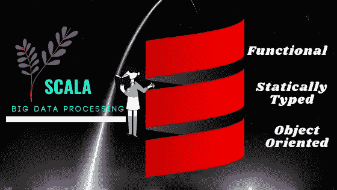

# 用 Scala 和 Spark 实现数据科学和机器学习(第 1/03 集)

> 原文：<https://towardsdatascience.com/data-science-and-machine-learning-with-scala-and-spark-episode-01-03-23864e07fdb3?source=collection_archive---------31----------------------->

## Scala Spark 机器学习

## 基于 Spark 分布式计算的大规模机器学习



学习 Scala:从护目镜图片下载的 Scala logo

cala 是用来编写最流行的分布式大数据处理框架 [apache Spark](https://spark.apache.org/) 的核心语言。从小型企业到大型企业，大数据处理正变得不可避免。每秒产生的数据量都在增加。

从数据中提取有价值的见解需要最先进的处理工具和框架。研究人员正在努力开发特定于应用的工具、编程语言和框架。Scala 是利用大数据处理的发明之一。

> Scala 编程语言旨在实现可扩展的解决方案来处理大数据，从而产生可操作的见解。

在这个系列中，我将在 Google colab 中开发一系列教程来学习 Scala，并申请数据科学和机器学习应用。Python 被认为是数据科学和机器学习最常用的编程语言。然而，当处理大数据时，数据科学家应该知道 Scala 等替代方案。

谁应该遵循这些教程？

如果您是一名使用 Pythonic 方法的数据科学家，并且想要添加另一个大数据处理工具，本系列适合您。

我把这个系列分成了三个部分。在这个故事中，我将讲述 Scala 编程语言的基础知识。我们将在下一篇文章中介绍 spark 和 Scala，并以 Spark 和 Scala 的机器学习结束本系列。对于每个故事，将有与谷歌 colab 相关的信息和实践代码。

在第一个故事中，你将学习如何在 Google colab 中安装或设置 Scala，最重要的数据类型，Scala 表达式，Scala 函数和 Scala 对象。

## Scala 数据类型

使用 python 时，不需要指定变量的类型，但是 Scala 要求你指定变量的数据类型。因此，理解和实践 Scala 中实现的数据类型更有意义。下面是 Scala 中实现的最基本的数据类型。你可以用 google Colab 做练习。

1.  **Scala 数据类型:** Int，Char，Float，Double，Long，Short，Boolean
2.  **Scala 集合:**数组，向量
3.  **Scala 映射:**键值对

## Scala 表达式

和其他编程语言一样，Scala 表达式也遵循类似的数字、布尔和逻辑表达式。一些常见和基本的表达包括在谷歌 colab 笔记本中。

```
// Syntax
val <identifier>[: <type>] = <expression>
var <identifier>[: <type>] = <expression>// Comment out one line
println("Hello Scala")// sample expression
var x = 2 * Math.sqrt(10) / 5
```

## Scala 函数

Scala 是一种面向对象的编程语言，你可以按照同样的风格编写函数。下面是在 Scala 中定义函数的语法。你可以通过本博客附带的 google colab 笔记本练习真实的例子。

```
def <identifier>(<identifier>: <type>[, ... ]): <type> = <expression>
```

下面给出了一个将两个整数相乘并输出整数的函数示例。

```
def multiplier(x: Int, y: Int): Int = { x * y }
```

## Scala 类和对象

在面向对象编程中，类被认为是非常有用的，对于 Scala 也是如此。对于使用 Scala 的程序员来说，类可以处理大数据和复杂的代码结构，使事情变得更简单。像其他语言一样，你可以用 Scala 写类。下面是一些例子。下面是一个最小的类示例

```
class User

val user1 = new User
```

[Scala 类之旅](https://docs.scala-lang.org/tour/classes.html)是用 Scala 编写类的快速指南。谷歌 colab 笔记本中给出了更多的例子。

## 导入包

像其他语言一样，您可以在 Scala 中导入原生包和第三方包。java 和 python 的语法基本相同。

```
import Array.
```

## Scala 中的并行处理

Scala 的主要目标是处理大型数据集。为了实现这一点，Scala 提供了一个非常简洁的并行处理解决方案，只需要最少的代码修改。如果您来自 Python，多处理很难设置，并且经常会导致意想不到的结果和失败。Scala 对多处理有更好的支持。在其他操作中，`filter`和`map`是并行处理时最常用的。下面是一些例子。

## 谷歌 Colab 笔记本

我准备了一个功能性的 Google colab 笔记本。请随意使用笔记本进行练习。

## 现实项目结论

在这一集里，我们学习了 Scala 的基础知识，并通过练习涵盖了以下关键概念。

*   在 Google colab 中运行 Scala
*   基本 Scala 数据类型
*   Scala 函数和类
*   Scala 中的并行处理

在下一集，我们将使用 Google colab 了解 Scala 的 spark。

## 参考资料/阅读/链接

[在谷歌联合实验室用 Scala 进行机器学习](https://medium.com/@shadaj/machine-learning-with-scala-in-google-colaboratory-e6f1661f1c88)

Scala Docs-[https://docs.scala-lang.org/tour/tour-of-scala.html](https://docs.scala-lang.org/tour/tour-of-scala.html)

[https://www . Lynda . com/Scala-tutorials/Scala-Essential-Training-Data-Science/559182-2 . html](https://www.lynda.com/Scala-tutorials/Scala-Essential-Training-Data-Science/559182-2.html)