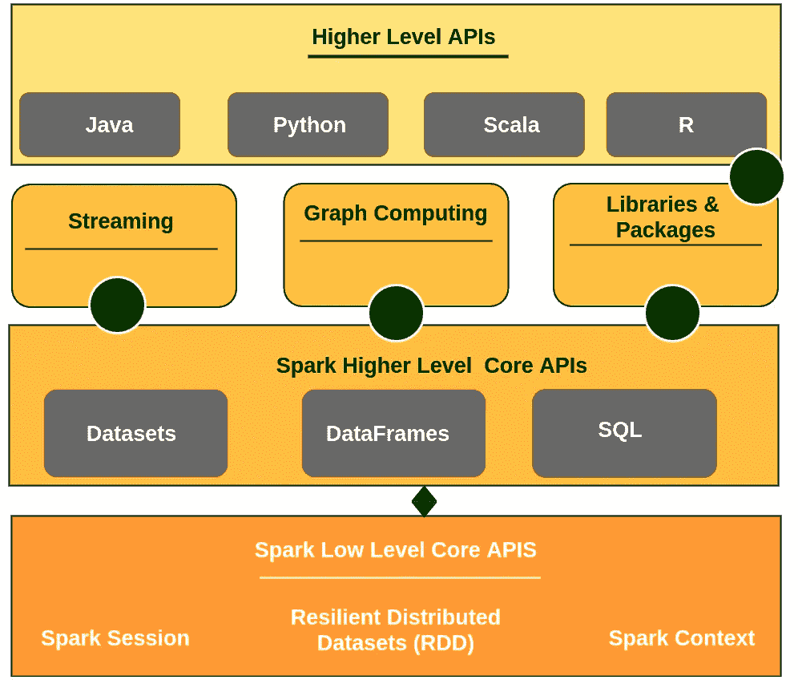

# 用 Scala 和 Spark 实现数据科学和机器学习(第 2/03 集)

> 原文：<https://towardsdatascience.com/data-science-and-machine-learning-with-scala-and-spark-episode-02-03-be74f0590f20?source=collection_archive---------22----------------------->

## SCALA SPARK 机器学习

## Scala API 的 Spark


Spark 的发明者选择 Scala 来编写底层模块。在[使用 Scala 和 Spark 的数据科学和机器学习(第 01/03 集)](/data-science-and-machine-learning-with-scala-and-spark-episode-01-03-23864e07fdb3)中，我们在使用 Google Colab 环境时讲述了 Scala 编程语言的基础知识。在本文中，我们将了解 Spark 生态系统及其面向 Scala 用户的高级 API。和以前一样，我们仍然使用 Spark 3.0.0 和 Google Colab 来练习一些代码片段。

## 什么是阿帕奇火花？

据[阿帕奇星火和三角洲引擎盖下的湖泊](https://databricks.com/p/ebook/apache-spark-under-the-hood)

> Apache Spark 是一个统一的计算引擎和一组用于在计算机集群上进行并行数据处理的库。截至本文撰写之时，Spark 是针对这一任务开发的最活跃的开源引擎；使其成为任何对大数据感兴趣的开发人员或数据科学家的实际工具。Spark 支持多种广泛使用的编程语言(Python、Java、Scala 和 R)，包括从 SQL 到流和机器学习等各种任务的库，可以在从笔记本电脑到数千个服务器集群的任何地方运行。这使它成为一个易于启动和扩展到大数据处理或超大规模的系统。



我强烈推荐阅读 [Apache Spark 和 Delta Lake Under the Hood](https://databricks.com/p/ebook/apache-spark-under-the-hood) 快速参考手册。这是一个 45 页的文档，包含 Scala 和 pyspark APIs 中的示例，阅读时间不会超过 30 分钟。

## 为什么要用 Spark 进行机器学习？

作为一名数据科学家，我们可以提出这样一个问题“Spark 对于机器学习任务的重要性是什么？”随着电子设备、社交媒体平台和高级 IT 系统使用的增加，数据正以前所未有的水平产生。此外，由于廉价的数据存储，客户很乐意收集大数据来提取价值。机器学习模型已经得到证明，并为企业更好地理解和制定未来扩张战略而工作。就获取大数据而言，Spark 是机器学习的事实上的选择，可以通过收集大量数据来建立模型。

> DataFrame API 是机器学习最重要的高层 API。Spark 的 MLlib 放弃了对 RDD 的支持，转而支持 DataFrame API。

## Spark 中的 Scala API

Scala 被选为编写 Spark 引擎的核心语言。但是，Apache Spark 提供了 Java、Scala、Python 和 r 的高级 API，在本文中，我们将使用 spark 3.0.0。

下面是在 Google colab 中获取 Scala 和 Spark 模块的命令

```
// Run below commandsimport $ivy.`org.apache.spark::spark-sql:3.0.0`
import org.apache.spark.sql._import $ivy.`sh.almond::ammonite-spark:0.3.0`
```

Spark 有两个重要的抽象，Spark 上下文和 Spark 会话。使用下面的代码，我们创建一个 spark 会话和上下文。

```
import org.apache.spark.SparkContextimport org.apache.spark.SparkConf
```

> 通常，当运行 spark 时会有很多警告，使用下面的命令，你可以关闭它们。

```
// TIP: Turn off the millions lines of logsimport org.apache.log4j.{Level, Logger}Logger.getLogger(“org”).setLevel(Level.OFF)// define spark session
val spark = {SparkSession.builder().master("local[*]").getOrCreate()}// Define Spark Context
def sc = spark.sparkContext
```

## 用 Scala 点燃 RDD

弹性分布式数据集(RDD)是与 Scala 密切相关的 Spark 数据结构的最常见抽象。它非常类似于 Scala 的原生并行特性。让我们用 Scala 写一些关于 RRD 的片段。

```
// Spark RDDimport scala.util.Random// Define variable in Scala
val bigRng = scala.util.Random.shuffle(1 to 100000)// convert Scala variable to spark RDD
val bigPRng = sc.parallelize(bigRng)
```

你可以在`bigPRng`上应用很多操作，它会在 Spark 上运行。

```
// calculate the mean of the population
bigPRng.mean// Find the min of the population
bigPRng.min// Find the stanndard deviation of the population
bigPRng.popStdev
```

在 RDD 的每个元素上应用函数非常类似于 Scala 并行`map`函数。

```
// Map function on RDD, similar to Paralell in Scalaval bigPRng2 = bigPRng.map(_ * 2)// Scala function function to apply on RDDdef div3(x:Int) : Boolean = {val y:Int=(x%3); return(y==0)}
val bigBool = bigPRng2.map(div3(_))
```

# Scala 中的 Spark DataFrame API

在前面的章节中，我们已经包括了关于 RDD 以及如何使用 RDD 进行并行计算的例子。spark 中另一个流行的 API 是 Dataframe。从数据科学家的背景来看，DataFrame API 可能更有意义。然而，有一个主要的区别是如何火花数据帧和熊猫数据帧在引擎盖下操作。

> Spark 数据帧可以存在于多个物理机器上，因此它们的计算是以分布式方式执行的，这与 pandas 数据帧相反。

Spark MLlib 将在 DataFrame API 中实现。

让我们学习一些 Spark DataFrame API 的基本技巧，它们对机器学习任务非常有用。

通读 Google colab 的第 0 部分，了解以下片段的数据准备。

```
// Read the .txt file
val df_emps = spark.read.option("header", "true").csv(data_dir + "employee.txt")// print the schema
df_emps.printSchema()// show top 10 records similar to df.head(10) in pandas
df_emps.show(10, false)
```

阅读第二张表格

```
// Read the .txt file
val df_cr = spark.read.option("header", "true").csv(data_dir + "country_region.txt")// print the schema
df_cr.printSchema()// show top 10 records similar to df.head(10) in pandas
df_cr.show(10, false)
```

阅读第三张表格

```
// Read the .txt file
val df_dd = spark.read.option("header", "true").csv(data_dir + "dept_div.txt")// print the schema
df_dd.printSchema()// show top 10 records similar to df.head(10) in pandas
df_dd.show(10, false)
```

合并是 Spark 相比熊猫最常见最高效的操作之一。

```
// Merge all three tables
val df_joined = df_emps.join(df_cr, "region_id").join(df_dd, "department")
```

# 谷歌 Colab 笔记本

我准备了一个功能性的 Google colab 笔记本。请随意使用笔记本进行练习。

> 有关更多示例，请参考 Spark 官方文档

# 现实项目结论

在这一集中，我们学习了 Scala 的 Spark 基础知识，并通过练习涵盖了以下关键概念。

*   在 Google Colab 中运行 Scala
*   火花的基础
*   Spark 的 RDD 与 Scala
*   Sparks 的 Scala 数据框架 API

下一集，我们将学习使用 Google Colab 运行时的 Spark 和 Scala 的机器学习模型。

# 参考资料/阅读/链接

[在谷歌联合实验室用 Scala 进行机器学习](https://medium.com/@shadaj/machine-learning-with-scala-in-google-colaboratory-e6f1661f1c88)

Scala Docs-【https://docs.scala-lang.org/tour/tour-of-scala.html 

[https://www . Lynda . com/Scala-tutorials/Scala-Essential-Training-Data-Science/559182-2 . html](https://www.lynda.com/Scala-tutorials/Scala-Essential-Training-Data-Science/559182-2.html)

[](http://spark.apache.org/docs/latest/sql-getting-started.html) [## 入门指南

### Spark 2.0 中的 SparkSession 提供了对 Hive 特性的内置支持，包括使用…

spark.apache.org](http://spark.apache.org/docs/latest/sql-getting-started.html) 

[https://databricks.com/p/ebook/apache-spark-under-the-hood](https://databricks.com/p/ebook/apache-spark-under-the-hood)