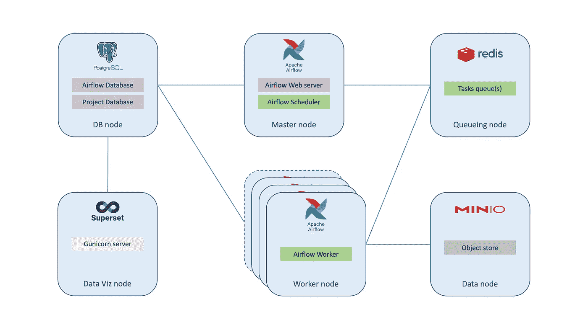
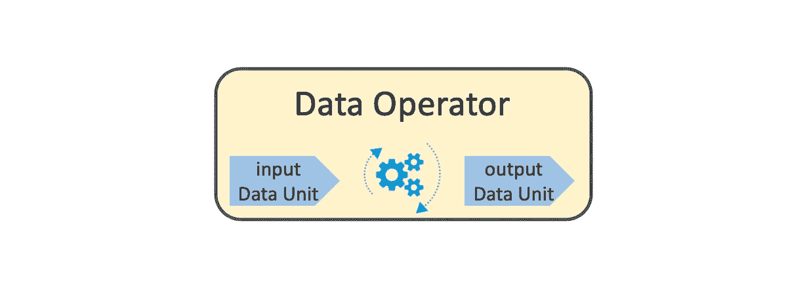
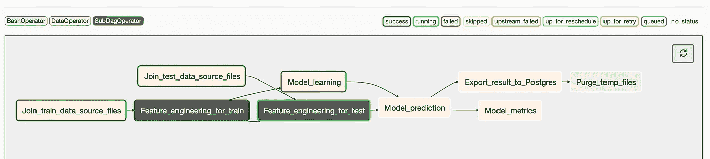
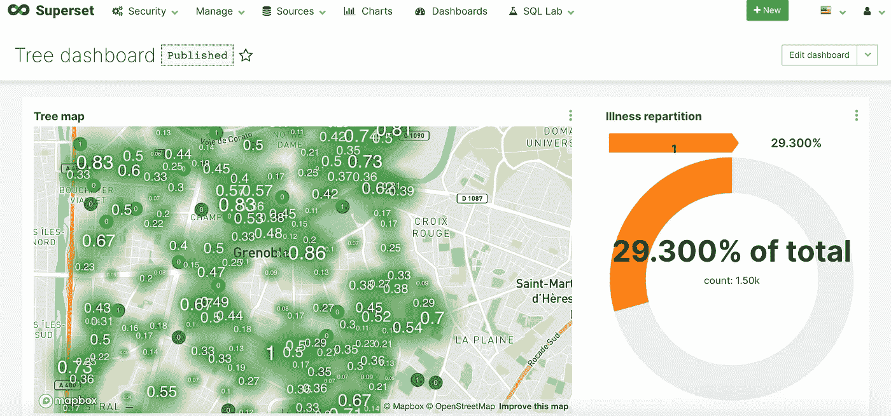

# 作为代码的数据科学

> 原文：<https://towardsdatascience.com/data-science-as-code-build-an-ai-project-like-an-it-project-7377fb55df13?source=collection_archive---------55----------------------->

Scrum 板，照片由[i̇rfan·西姆萨尔](https://unsplash.com/@irfansimsar)在 [Unsplash](https://unsplash.com) 上拍摄

## 像构建 IT 项目一样构建人工智能项目

很多文章都是关于人工智能或数据科学的主题，以及 IT 产业化的问题。也有很多工具来处理这个问题，从几乎没有代码的方法([datataiku](https://www.dataiku.com)、 [Rapid Miner](https://rapidminer.com) 、 [Knime](https://www.knime.com) 、[sales force Einstein Analytics](https://www.salesforce.com/fr/products/einstein-analytics/overview/)、 [SAP Analytics](https://www.sap.com/france/products/cloud-analytics.html) 等等。)或多或少的成功，以及一些接近代码的工具([凯德罗](https://kedro.readthedocs.io)、 [DVC](https://dvc.org) 、[达格斯特](https://docs.dagster.io)、 [MLflow](https://mlflow.org) 等。).

如果所有这些工具都有它们的优势，我真的不太喜欢它们，因为我认为一个人工智能项目首先是一个 IT 项目，意味着*代码*。

> 作为代码的数据科学

*免责声明:在这篇文章中，我不包括云中可用的人工智能托管服务，如 GCP 人工智能平台的工具，如果你对所选的提供商有足够的技能，这些工具可以很容易地投入生产(但有一定的限制)。*

如果一个企业把一个 AI 项目当成一个 IT 项目，就会跨越一个心理障碍，应该去神秘化这类项目。事实上，组织可能会将人工智能项目视为一个 IT 项目:当构建一个 web 应用程序时，就建立了一个团队，例如后端开发人员、前端开发人员、产品负责人等。，其中需要提到的技术配置文件来处理这种应用程序的技术部分。对于一个人工智能项目，例如，用数据工程师取代后端开发人员，用数据科学家取代前端开发人员，保留你的产品所有者，你就在这里:除了团队的技能和商业目标，项目的过程遵循**相同的模式**。例如，如果你使用 Scrum 作为你的敏捷框架进行日常开发和交付，你应该能够在你的 AI 项目中使用它。当然，在人工智能项目中有一些特殊性，可能比*【经典】* IT 项目更不常见。但是即使是*【经典】* IT 项目也有其特殊性:一个基于 PHP 和 JS 技术的在线零售网络应用并不像用 C++编写的物联网嵌入式应用那样涉及相同的团队概况。人工智能项目也是如此。

# 简单的数据科学架构

在这篇文章中，我将展示一个小型架构和一些代码，给出一个最终的人工智能解决方案投入生产，比方说对于*“中间数据”*(不是大数据，意思是少于几 TB)和对于*批处理*。

图一。简单的数据科学架构

具有内部架构(图 1。)，我们拥有人工智能解决方案所需的一切:

*   气流分布式架构:专用服务器(使用 Celery executor 的主服务和工作服务)+队列任务服务服务器(Redis)
*   PostgreSQL 数据库存储气流元数据、超集元数据和一些数据项目
*   用于处理数据集文件(csv、拼花等)的 MinIO 本地对象存储。)和模型持久性
*   提供一些数据可视化的超集服务器

要运行下面的工作流代码示例，所有这些服务都在同一服务器上的沙盒环境就足够了，这里提供的代码不需要 MinIO 和 Celery，它们分别由本地文件系统和本地执行器代替(如果应用了一些数据治理，例如备份系统或 IT DRP，这对于小型 AI 项目和中级 SLA 来说完全没问题)。

# 数据科学用例

[Florian Olivo](https://unsplash.com/@florianolv?utm_source=medium&utm_medium=referral) 在 [Unsplash](https://unsplash.com?utm_source=medium&utm_medium=referral) 上拍摄的照片

用来说明我的文章的用例是基于法国 [EGC 2017 年学术挑战](http://egc2017.imag.fr/defi/):它由一个预测任务组成，根据法国格勒诺布尔市(左图)的绿地相关数据来确定一棵树是否有缺陷。

数据包含种植年份、树种、地理位置、树木直径或发育阶段等特征。

这里不讨论数据科学部分，因为获得好的性能很简单(仅供参考，挑战使用的分数是准确性和 F 分数)。将使用两个数据集:一个用于训练，一个用于评估性能。

# 代码部分

为了方便人工智能项目中的代码开发，我将我的东西打包成一个 Python 库， **DSBox** ，你可以免费使用。

 [## vlevorato/dsbox

### V. Levorato 制作的包装。该软件包提供:Apache Airflow 的特定操作员，以便管理数据…

github.com](https://github.com/vlevorato/dsbox) 

我在这里只集中讨论一揽子计划中的运营部分。这一部分分为两个主要部分:

*   气流**数据运算符**
*   **数据单元**

基本上，气流操作员是没有国籍的。一旦任务完成，日志分开，没有状态被保留，你不能直接在任务之间传递信息，即使在某些情况下可以使用一些本地机制( *XCom 变量*或*入口/出口*)。**数据操作符**简单地覆盖气流基本操作符，包含一个或两个**数据单元**管理输入和/或输出数据流(图 2。).

图二。数据运算符结构

在谈论 IT 生产之前，作为一名数据科学家，当我第一次处理一个问题时，我主要是在 Jupyter 笔记本上操作熊猫数据帧。如果我尽全力编写一个分解的、结构化的和解耦的代码，如果我想让它投入生产，我显然不想重写我的所有工作。这就是数据操作符的用途:编写一个函数，将数据帧作为输入参数，并返回一个数据帧。它可以处理其他类型的数据帧(Dask、Vaex)，但是为了简单起见，我更喜欢在本文中关注 Pandas 数据帧。

如前所述，数据操作符使用的函数接受一个输入数据帧，进行一些处理(这里是一个非常简单的`fillna`操作)，并将结果作为数据帧返回。为了完成整个工作，我需要首先定义组成输入和输出数据流的数据单元。假设我需要读取一个带有字符“；”的 CSV 文件作为分隔符，并希望将结果写入一个拼花文件:

我现在可以编写一个标准的气流 DAG 程序，它有一个由我的数据操作符定义的任务。

# 完整的人工智能解决方案

让我们回到我们的树病预测用例。最终导出到 Postgres 数据库的完整工作流代码[可以在这里找到](https://github.com/vlevorato/dsbox/blob/master/dsbox/examples/tree_disease_usecase/tree_disease_dag_with_pg.py)。我们的 DAG 如预期的那样被气流调度程序很好地解释(图 3。).

图三。Airflow UI 中的树病用例工作流

我不会输入最终 DAG 的每个 ML 任务的细节(图 4。)，因为你可以在[我的 GitHub repo](https://github.com/vlevorato/dsbox) 上探索完整的代码，因为它遵循经典的数据科学模式*(加入、清理、特征工程、训练、预测、测量性能、展示结果)*。最重要的是，主要思想是**通过数据单元**显式声明所有数据集读写操作。是的，我以前做过很多爪哇☕️。所有操作符都不读取和写入数据，其中一些只是读取，例如适合模型的*“Model _ learning”*任务，并且不写入任何数据，只写入将由*“Model _ prediction”*任务使用的模型本身的序列化。为了避免将数据路径耦合到工作流程序，应该使用元数据管理文件或工具来避免硬编码路径。
**注:**`SubDagOperator`此处仅用于教学目的，不建议在生产中使用。

图 4。树木病害用例 DAG

# 数据展示

为了最终确定用例，需要向业务公开数据，而所提出的体系结构恰恰提出了 Apache 超集来实现这一点。我创建了一个非常简单的仪表板(图 5。)的地图，其中测试数据集的每棵树都带有预测的疾病标签(0 或 1 ),地图框布局自动生成一些聚类，这取决于放大的方式。(差的)旭日图给出了预测病树的比例。

图五。通过 Apache 超集实现数据可视化

> 如果从 IT 的角度来看，让一个人工智能解决方案促进*“走向生产”*并不那么困难。

# 最后的想法

正如你所看到的，如果从 IT 的角度来处理这个项目，那么拥有一个人工智能解决方案来促进*【走向生产】*并不困难，即使在这篇文章中，几个元素被故意搁置(测试、CI/CD、元数据管理等)。).最后，它更多地是关于了解您的组织是否已经能够平稳地交付 it 应用程序。在所有衡量交付效率的指标中，时间(或频率)是其中之一:使用*“数据科学即代码”*模式，我能够每周交付一个新版本的产品，而且我在现实生活中也是这样做的。因此，首先，考虑频繁交付(如果需要的话)，每月交付一次是一个好的开始。如果你已经这样做了，或者更快，那么恭喜你:你已经知道如何将一个人工智能项目投入生产。

> 更高级的 AI 架构概念将在以后的文章中讨论，因为这个解决方案不容易扩展，并且有一些限制。