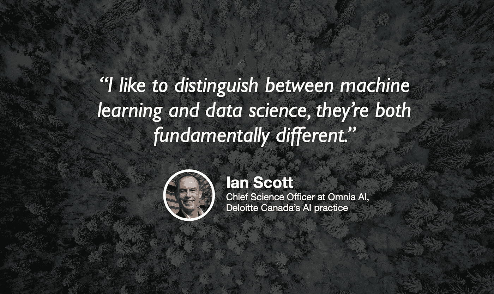

# 德勤的数据科学

> 原文：<https://towardsdatascience.com/data-science-at-deloitte-133457084a5?source=collection_archive---------26----------------------->

## [苹果](https://podcasts.apple.com/ca/podcast/towards-data-science/id1470952338?mt=2) | [谷歌](https://www.google.com/podcasts?feed=aHR0cHM6Ly9hbmNob3IuZm0vcy8zNmI0ODQ0L3BvZGNhc3QvcnNz) | [SPOTIFY](https://open.spotify.com/show/63diy2DtpHzQfeNVxAPZgU) | [其他](https://anchor.fm/towardsdatascience)

## 伊恩·斯科特在 [TDS 播客](https://towardsdatascience.com/podcast/home)

背景照片由[内森·奎洛兹](https://unsplash.com/@nathan030997)拍摄

*编者按:迈向数据科学播客的“攀登数据科学阶梯”系列由 Jeremie Harris 主持。Jeremie 帮助运营一家名为*[*sharpes minds*](http://sharpestminds.com)*的数据科学导师初创公司。可以听下面的播客:*

不同公司的数据科学看起来可能大相径庭，通常很难就数据科学家到底是什么这个问题达成一致意见。

这就是为什么与在不同组织(从初创公司到企业)应用其技能的数据科学家交流如此重要。了解数据科学家需要执行的各种角色和职责是提炼数据科学本质的唯一方法。

这就是为什么我想和伊恩·斯科特聊天，他是德勤人工智能部门[德勤综合咨询](http://www.deloitte.ca/OmniaAI)的首席科学官。Ian 早在 20 世纪 80 年代末就在研究数据科学，当时他在哈佛大学攻读博士学位时，将统计建模应用于实验高能物理的数据。从那以后，他在许多公司担任战略职务，最近包括德勤，在那里他领导了重要的机器学习和数据科学项目。

我们的谈话集中在明确数据科学到底是什么，以及数据科学家团队如何高效地合作。以下是我最喜欢的一些外卖食品:

*   虽然大多数数据科学家倾向于使用类似的工具(Python、SQL、pandas、sklearn、jupyter notebooks、可视化工具等)，但从高级职责的角度来定义数据科学比工具更有帮助。Ian 将数据科学家视为从数据中提供见解的人，以及可以将这些见解传达给非技术受众的人，而不是“可以建立神经网络的人”或“可以训练堆叠 XGBoost 模型的人”。越来越多的情况下，如果你想被录用，软技能是决定性的优势。
*   具有高度技术背景的新数据科学家通常认为数据科学问题是技术问题。不幸的是，这远远不是真的:算法不能单独解决数据科学问题——如果它们解决了，那么数据科学就已经是一个完全自动化的职业了。需要商业和产品知识来弄清楚如何设计和选择你的功能，所以如果你是一个在分析或机器学习领域开始职业生涯的技术人员，你能做的最大杠杆作用可能是投入大量时间来了解你的公司如何赚钱，以及它如何为客户提供价值。
*   咨询工作涉及到从一个客户到另一个客户的速度比一个内部数据科学家通常要快。这意味着加速是至关重要的，因为你需要足够快地开发不同问题的背景以达到有效。许多咨询公司已经发展出缓解这个问题的策略，通过确保具有深厚领域知识的合作伙伴通常能够帮助需要这种专业知识的用例。

你可以在 LinkedIn 上找到[伊恩](https://www.linkedin.com/in/ian-j-scott-49b967/)，在 Twitter 上找到[德勤](https://twitter.com/DeloitteCanada)，或者在 Twitter 上找到我[这里](https://twitter.com/jeremiecharris)。