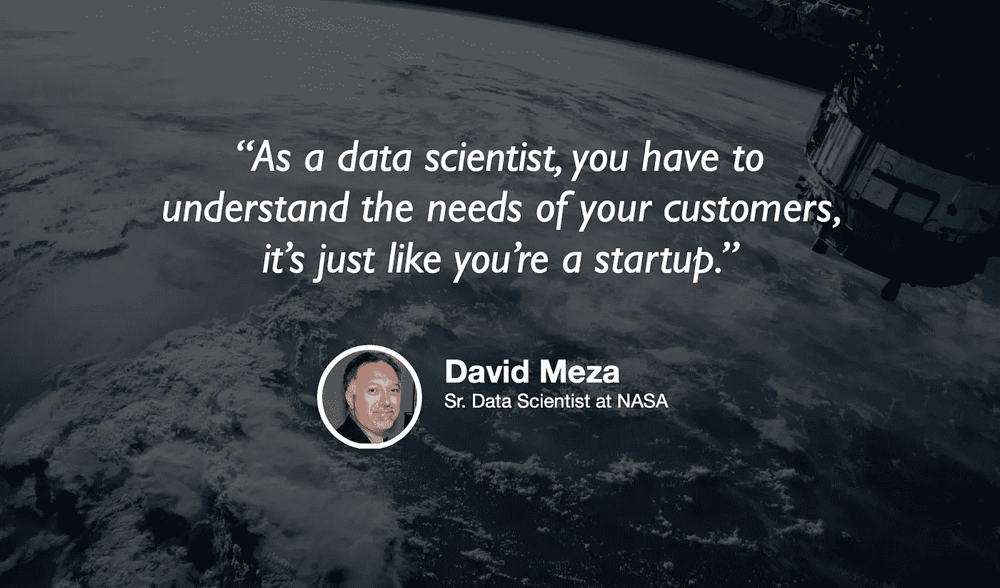

# 美国宇航局的数据科学

> 原文：<https://towardsdatascience.com/data-science-at-nasa-dc59bb93292a?source=collection_archive---------42----------------------->

## [苹果](https://podcasts.apple.com/ca/podcast/towards-data-science/id1470952338?mt=2) | [谷歌](https://www.google.com/podcasts?feed=aHR0cHM6Ly9hbmNob3IuZm0vcy8zNmI0ODQ0L3BvZGNhc3QvcnNz) | [SPOTIFY](https://open.spotify.com/show/63diy2DtpHzQfeNVxAPZgU) | [其他](https://anchor.fm/towardsdatascience)

## 大卫·梅萨在 [TDS 播客](https://towardsdatascience.com/podcast/home)

*编者按:迈向数据科学播客的“攀登数据科学阶梯”系列由 Jeremie Harris 主持。Jeremie 帮助运营一家名为*[*sharpes minds*](http://sharpestminds.com)*的数据科学导师初创公司。可以听下面的播客:*

机器学习不是火箭科学，除非你在 NASA 做。如果你碰巧在美国国家航空航天局做数据科学，你和我今天播客的嘉宾大卫·梅萨有共同之处。

大卫在 NASA 的职业生涯中，一直专注于优化 NASA 众多数据库中的信息流，并确保这些数据得到机器学习和分析的利用。他目前的重点是人员分析，包括跟踪美国宇航局员工的技能和能力，以发现那些有能力以新的或意想不到的方式满足该组织已经或可能发展的需求的人。

David 在数据库和建模方面都有丰富的经验。以下是我们谈话中我最喜欢的一些带回家的东西:

*   如果你想发展一套与众不同的技能，图形数据库是一个很好的关注点。它们出现在生产领域只有大约十年的时间，最近它们得到了更多的关注，因为它们在建模社交媒体和其他网络数据类型方面表现出色。
*   除非你从事的是以产品为中心的工作(例如为用户建立推荐系统)，否则数据科学家的产出通常不是模型或图表，而是教育。具体来说，你将培训那些希望做出数据驱动决策的领导者和管理者——这意味着你必须特别小心，以确保你的图表和模型不会被曲解。在某种程度上，你是一名翻译——这意味着你需要会说两种语言:分析和机器学习的技术语言，以及商业价值的语言。
*   像 NASA 这样已经存在很长时间的组织，在数据科学方面面临着独特的挑战:他们往往有许多与现代工具和基础设施不兼容的遗留系统和旧数据库。在这种情况下，数据科学家必须考虑的一个关键问题是他们的数据库策略的稳健性:你最不想做的事情就是将你的数据存储在一个十年内都不相关的花哨数据库中。
*   美国宇航局有数千名员工和数万名承包商。在这种规模下，他们面临的最大挑战之一是确保他们的员工能够解决与其技能和能力相匹配的问题。这就是机器学习和人员分析变得如此重要的地方。

你可以[在推特上关注大卫](https://twitter.com/davidmeza1)，你也可以[在推特上关注我](https://twitter.com/jeremiecharris)。