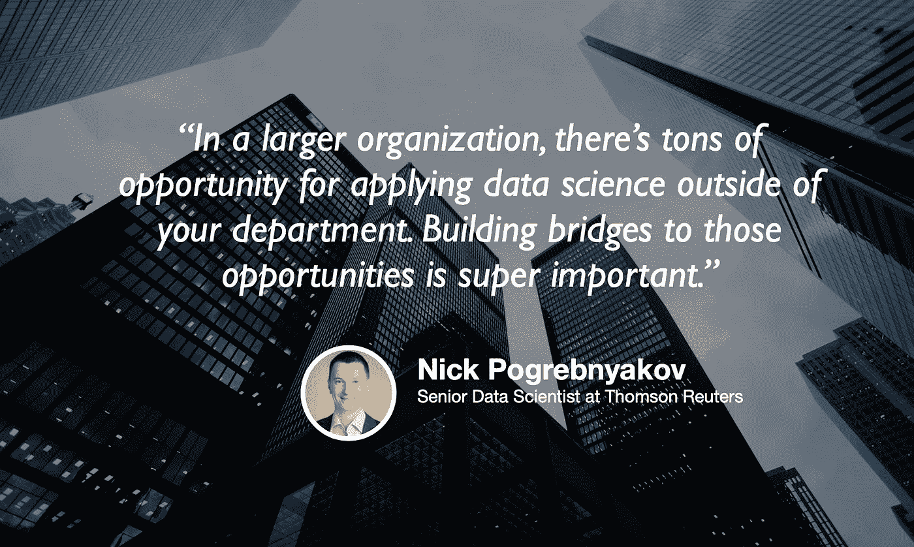

# 路透社的数据科学，以及冠状病毒之后的远程工作

> 原文：<https://towardsdatascience.com/data-science-at-reuters-and-the-remote-work-after-the-coronavirus-a827fb8a62a1?source=collection_archive---------79----------------------->

## [苹果](https://podcasts.apple.com/ca/podcast/towards-data-science/id1470952338?mt=2) | [谷歌](https://www.google.com/podcasts?feed=aHR0cHM6Ly9hbmNob3IuZm0vcy8zNmI0ODQ0L3BvZGNhc3QvcnNz) | [SPOTIFY](https://open.spotify.com/show/63diy2DtpHzQfeNVxAPZgU) | [其他](https://anchor.fm/towardsdatascience)

## Nick Pogrebnyakov 在 [TDS 播客](https://towardsdatascience.com/podcast/home)

背景图片由肖恩·波洛克[拍摄](https://unsplash.com/@seanpollock)

*编者按:迈向数据科学播客的“攀登数据科学阶梯”系列由 Jeremie Harris 主持。Jeremie 帮助运营一家名为*[*sharpes minds*](http://sharpestminds.com)*的数据科学导师初创公司。可以听下面的播客*

尼克·波格雷布尼亚科夫(Nick Pogrebnyakov)是汤森路透(Thomson Reuters)的高级数据科学家，哥本哈根商学院(Copenhagen Business School)的副教授，也是有经验的机器学习开发人员可以找到公司合同工作的市场 [Leverness](https://leverness.com/) 的创始人。他是一个大忙人，但他同意在今天的 TDS 播客中与我坐下来，谈论他在路透社的日常工作，以及机器学习和数据科学的工作前景。

以下是我从聊天中获得的一些最大收获:

*   用于评估模型的指标必须具有商业意义，因此在设计它们时，您需要咨询主题专家(或者自己成为一名专家)。顺便说一句，这就是为什么我总是建议人们建立涉及他们很好理解的数据的个人项目(例如，如果你喜欢骑自行车，找一个关于自行车道的数据集)。展示你知道如何将商业问题转化为技术问题是绝对必要的。
*   根据 Nick 的说法，行业研究角色和传统数据科学角色之间的最大区别是失败风险容忍度和获得结果的可接受时间范围，这两者对研究角色来说都更高。研究角色仍然是快节奏的，但有一种理解是，当你试图挑战极限并实现最先进的结果时，更多的实验和更花哨的策略是可以接受的。
*   对于大型组织来说，拥有大量尚未开发但极具潜力的数据可供分析是相当常见的。他们面临的最大挑战是，由于他们的规模，进行数据分析的团队通常与管理和增长这些有价值的数据集的团队隔离开来，因此在这种情况下值得发展的一项技能是跨团队沟通的能力，这使您能够注意到关键数据资源何时未被利用。
*   新型冠状病毒已经改变了企业的招聘方式，现在比以往任何时候都更倾向于远程工作。尚不清楚这一举措是否会是永久性的，但早期迹象表明，长期来看，这一势头可能会朝着这个方向转变。
*   远程工作肯定有缺点，通常最好是在团队至少见过几次面之后。这就是为什么(当然是在疫情之前)我倾向于建议入门级数据科学家和分析师亲自参加工作，即使至少在他们工作的头几个月有远程工作选项。科技越来越多地使远程连接成为可能，但仍然没有任何东西可以替代面对面的连接。

你可以在 [LinkedIn 这里](https://www.linkedin.com/in/pogrebnyakov/)找到尼克，或者在 Twitter [这里](https://twitter.com/jeremiecharris)找到我。