# 在亚马逊 EMR 集群上使用 PySpark 实现大规模数据科学

> 原文：<https://towardsdatascience.com/data-science-at-scale-with-pyspark-on-amazon-emr-cluster-622a0f4534ed?source=collection_archive---------39----------------------->

## [理解大数据](https://towardsdatascience.com/tagged/making-sense-of-big-data)

[王华伦](https://unsplash.com/@wflwong?utm_source=medium&utm_medium=referral)在 [Unsplash](https://unsplash.com?utm_source=medium&utm_medium=referral) 上的照片

你有没有遇到过这样的情况，你的计算机无法处理你试图处理的数据？我知道我有。嗯，所以你可能正在处理一个大数据，它很可能太大太复杂，无法由 CPU 上的一台机器来处理。那么，我们所说的大数据是指什么？多少数据才算大数据？嗯，我们可以无休止地争论这个问题——所以我们不要在这里争论了。相反，我们只能说，你有足够大的数据，而你的计算机正在努力处理它。希望你的机器不会冒出任何火焰或烟雾。玩笑归玩笑，这是一个非常常见的问题，解决它的最常见方法是在分布式计算平台上处理如此大的数据集。Apache Spark 是一个开源的并行计算框架，旨在支持在计算机集群上处理这样的大型数据集。

有一些不同的分布式计算平台提供商可供选择，一些流行的选择包括 Cloudera、Hortonworks、Databricks、Amazon AWS 和 Microsoft Azure。在本文中，我将向您展示如何在 AWS cloud 上为您的需求建立一个分布式计算平台，特别是 Amazon EMR。我们将使用 PySpark，它是 Apache Spark 的 Python API。

在 Amazon EMR 上设置 PySpark 之前，请确保您具备以下条件:

1.  在 AWS 上创建帐户
2.  创建 EC2 密钥对
3.  创建 EC2 安全组

## 步骤 1:在 AWS 服务中找到 Amazon EMR

现在您有了一个帐户，浏览 AWS 服务并找到 EMR。下面是一个例子。

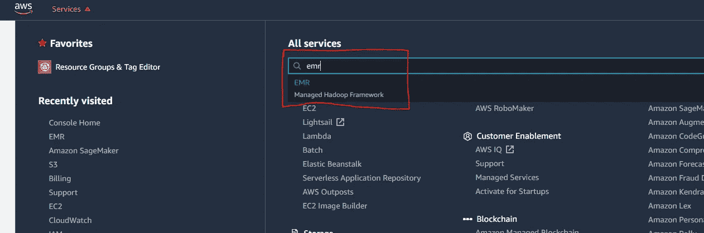

## 步骤 2:创建集群

一旦进入 EMR，找到显示“创建集群”的按钮并点击它。

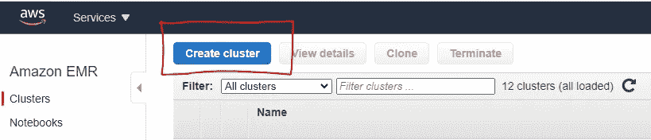

## 步骤 3:转到高级选项

点击“创建集群”后，您将看到一个类似的页面，然后点击“转到高级选项”

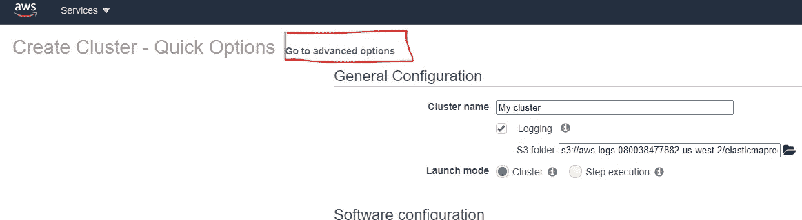

## 步骤 4:软件和步骤

对于 EMR 版本，我选择 emr-5.31.0，因为这是在本文发布时的最新版本(不是测试版)。然后，我选择 Hadoop 和 Spark，因为这是我需要预安装在集群上来完成标记工作的另外两个软件。一旦选择了这些选项，就没有必要再去搞乱其他选项了，所以请继续操作，然后单击下一步。

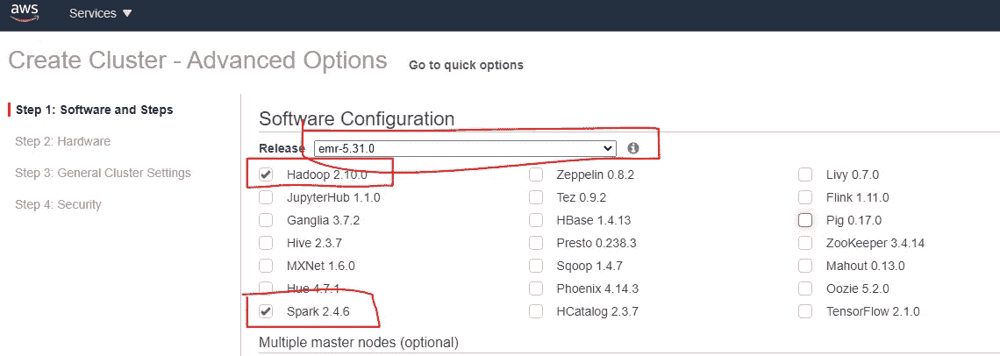

## 第五步:硬件选择

在本节中，您将为集群的主节点和工作节点选择硬件类型。首先，在页面的上部，为实例组配置选择“统一实例组”。

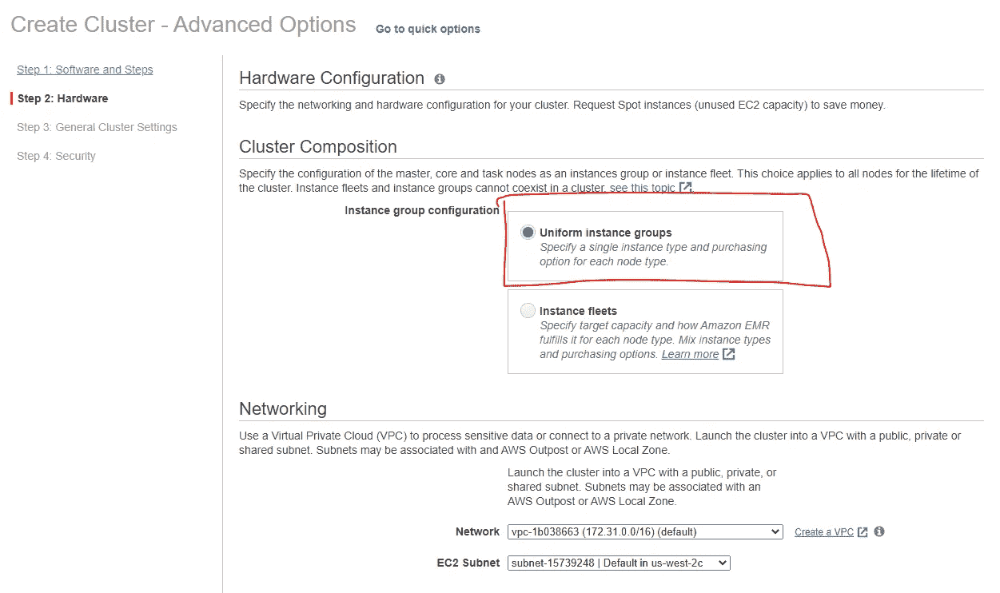

然后向下滚动，找到如下所示的页面部分，并选择硬件类型。理想情况下，您的工作节点需要合理数量的 CPU 和内存。我选择 m5.xlarge 作为主节点和核心/工作节点，因为它们足以满足我对数据集大小的预处理需求。根据数据集和您想要实现的目标，您可以选择所需的正确的 CPU 和内存量。请注意，我请求了两个核心/工作节点实例。您可以根据手头任务的需要使用这个数量的实例。您还会看到任务节点显示在核心/工作节点下，您在本练习中不需要它们，因此可以忽略。

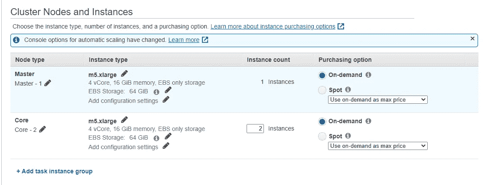

完成上述选择后，将其余选项保留为默认值，然后按下一步。

## 步骤 6:常规集群设置

在此部分中，选择集群的名称。你想取什么名字都可以。这取决于你是否选择日志记录，我通常会关闭它，因为它会存储 S3 的每一个 EMR 日志，这些日志往往会占用 S3 的空间。但是最佳实践建议让它开着。

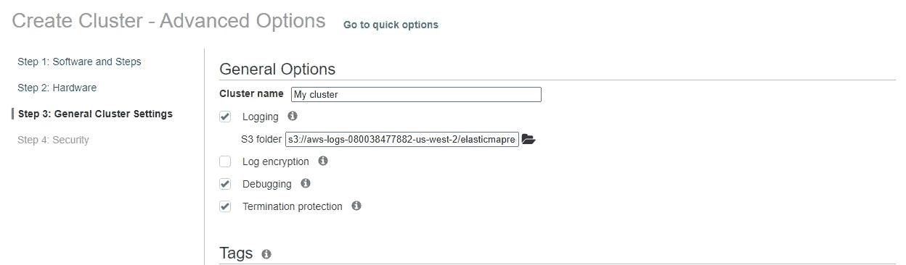

将此页面上的其余选项保留为默认设置，然后单击 Next。

## 步骤 7:配置安全性

这一节很重要！在此部分中，您将配置两件事情:

1.  EC2 密钥对
2.  安全组

选择 EC2 密钥对和您之前创建的安全组，最后单击“Create cluster”

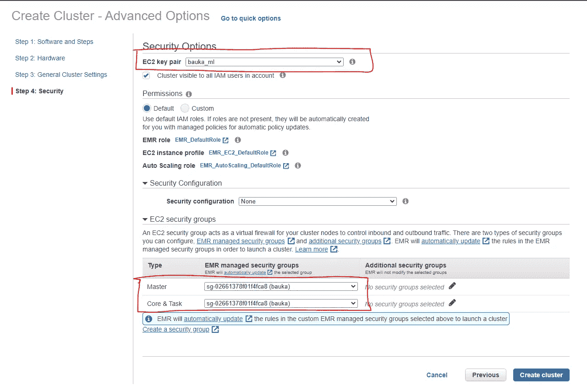

现在，在创建新的 EMR 集群时，您将看到如下页面

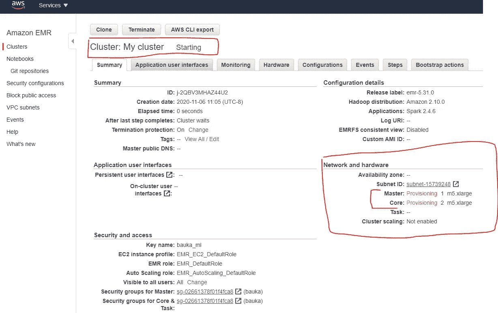

创建后，您的群集的状态将从“正在启动”变为“正在等待”，这意味着您的群集现在可以使用了。

## 步骤 8:在 EMR 上创建一个笔记本实例

现在您需要一个 Jupyter 笔记本来使用 PySpark 与您新创建的集群的主节点一起工作。为此，请单击左侧横幅上的“笔记本”，然后单击“创建笔记本”。

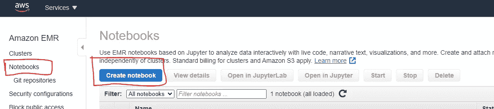

在下一页中，为您的笔记本命名，然后单击集群下的“选择”,然后在那里找到并选择您新创建的集群。最后，在 S3 上选择一个与笔记本相关联的位置来读写数据。请记住将“AWS 服务角色”保留为默认值。然后点击“创建笔记本”，瞧。

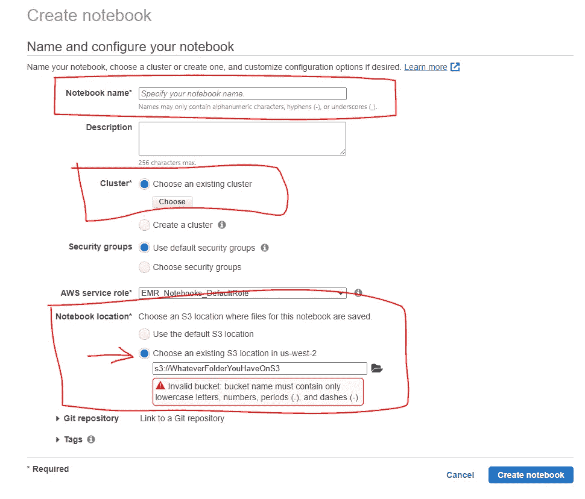

现在，您有了一个 Jupyter 笔记本，它连接到新创建的 EMR 集群的主节点，该集群预装了 Hadoop 和 Spark。您已经准备好在 Amazon EMR 集群上使用 PySpark 处理您的大数据。

**警告:**当你完成后，记得停止你的笔记本并终止你的集群！！！否则，您将在您的下一个 AWS 法案中产生巨大的成本！！！

享受使用 Amazon EMR 集群上强大的 Apache Spark 处理大数据的乐趣吧！

如果你觉得这篇文章有用，我很乐意在下面以鼓掌或评论的形式得到你的反馈。让我们在 LinkedIn 上联系

谢谢大家！