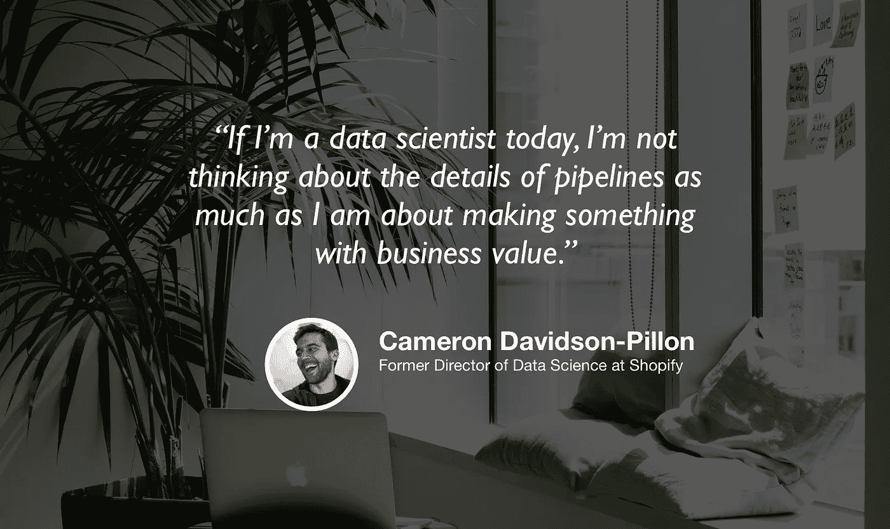

# Shopify 的数据科学

> 原文：<https://towardsdatascience.com/data-science-at-shopify-7c9d5db479dd?source=collection_archive---------38----------------------->

## [苹果](https://podcasts.apple.com/ca/podcast/towards-data-science/id1470952338?mt=2) | [谷歌](https://www.google.com/podcasts?feed=aHR0cHM6Ly9hbmNob3IuZm0vcy8zNmI0ODQ0L3BvZGNhc3QvcnNz) | [SPOTIFY](https://open.spotify.com/show/63diy2DtpHzQfeNVxAPZgU) | [其他](https://anchor.fm/towardsdatascience) | [剪辑](https://youtu.be/74WkIL3LmDg)

## 卡梅伦·戴维森-皮隆在 [TDS 播客](https://towardsdatascience.com/podcast/home)

*编者按:迈向数据科学播客的“攀登数据科学阶梯”系列由 Jeremie Harris 主持。Jeremie 帮助运营一家名为*[*sharpes minds*](http://sharpestminds.com)*的数据科学导师初创公司。可以听下面的播客:*

如果你想知道数据科学的发展方向，了解它的发展方向会有所帮助。很少有人有这样的历史眼光，更少有人将它与对尖端工具的理解结合起来，这暗示了该领域未来可能采取的方向。

幸运的是，其中一位是 Shopify 的前数据科学总监卡梅伦·戴维森-皮隆。自 2012 年以来，卡梅伦一直沉迷于数据科学和估计理论，当时该领域仍处于独立发展阶段。他不仅在技术问题上，而且在招聘和团队建设方面都有很好的高水平观点，他非常友好地加入了我们今天的“走向数据科学”播客。

以下是我们谈话中我最大的收获:

*   微积分没有许多数据科学家认为的那么重要。计算机现在可以为我们计算导数和梯度，所以这个挑战已经被抽象掉了。当有疑问时，把你的时间投入到理解统计学和概率论上，而不是微积分。
*   对于数据科学家来说，通过宁滨或粗粒化数据来丢弃数据中的大量信息是相当常见的做法。这方面的一个经典例子是净推介值(NPS ),它的计算方法是让用户从 1 到 10 给你的产品打分，把所有 8 到 10 的分数都算为正，把所有< 5 的分数都算为负，然后把这些分数平均出来。虽然有时有理由这样做，但这可能会浪费有价值的信息(例如，在 NPS 的情况下，用户提供的 7 分和 8 分之间的差异真的有那么大吗？).
*   对于分析团队来说，在公司内部建立信任非常重要。他们的工作是帮助其他员工访问他们需要的数据或见解，这要求那些其他员工能够舒服地诚实和明确地描述他们的问题和需求。建立信任是第一步。
*   随着工具的发展，数据科学家可以花更少的时间在团队工作上，人们越来越希望这些数据科学家能够沿着“商业价值”轴做出贡献。这是产品和商业直觉在数据科学中越来越受关注的一个重要原因。
*   面试伴随着大量的噪音，对候选人和面试官都是如此。例如，卡梅伦从自己的经历中指出，在午餐前面试的候选人可能会因面试官的低血糖而遭受折磨，并得到更严厉的评价。同样，候选人可能不得不在现场漫长的一天结束时面试一位首席技术官，此时正是疲劳最严重的时候。因为这个过程很嘈杂，所以重要的是不要因为一次糟糕的面试而自责:这完全有可能是你受到了一次纯粹随机的打击！

你可以[在推特上关注卡梅隆](https://twitter.com/Cmrn_DP)，你也可以[在推特上关注我](https://twitter.com/jeremiecharris)。

## 夹子