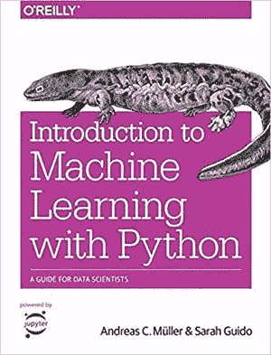
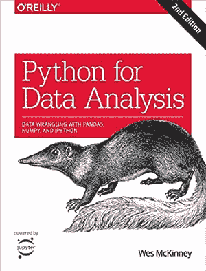
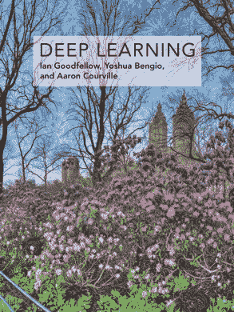
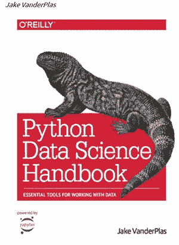
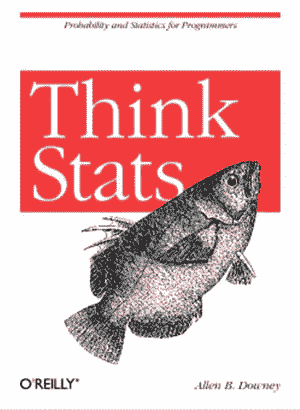
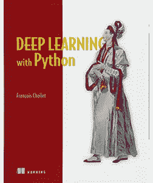

# 2020 年必读的数据科学书籍

> 原文：<https://towardsdatascience.com/data-science-books-you-must-read-in-2020-1f30daace1cb?source=collection_archive---------4----------------------->

## 看看吧，你为什么要读它们？

Rafael Cosquiere 摄于 [Pexels](https://www.pexels.com/photo/chair-beside-book-shelves-2041540/?utm_content=attributionCopyText&utm_medium=referral&utm_source=pexels)

> “我们正在进入一个数据可能比软件更重要的新世界。”——
> [***——蒂姆·奥雷利***](https://www.oreilly.com/tim/)

**数据科学产业**的应用正在快速增长，并提供了一个非常有前途的未来。为了能够进入这一领域，一个人必须具备**各种概念**、**技术**，并对工作可用的各种工具有足够的经验。

有数以百计的资源，包括网上课程、网站、视频和书籍，可以帮助你掌握这门学科，因为乍一看这可能会让人望而生畏。在整篇文章中，我们将提到一些学习数据科学和相关技术的最佳书籍，它们将使学习变得轻而易举。

> 数据科学是让数据变得有用的学科

# 数据科学书籍

在本节中，我们将重点介绍各种数据科学书籍，涵盖所有技能水平，以巩固您的领域知识。这些书将被证明对帮助你学习这项新技能至关重要，它们会让你深入了解**各种算法**、**概念、方法**，以及**支持的编程语言**和**及其相关包**以充分利用它们。

***免责声明:*** *本帖无附属链接。这篇文章仅供参考。*

## 1.**Python 机器学习简介:数据科学家指南**

**作者:**安德烈亚斯·c·穆勒和萨拉·圭多

**出版商** —奥赖利

**难度等级:**初学者

**在这里获取图书**——[亚马逊](https://www.amazon.in/dp/1449369413?tag=hackr0df-21)

《用 Python 进行机器学习入门》一书的封面

> 机器学习是一种新的编程范式，一种向计算机传达你的愿望的新方式。它令人兴奋，因为它允许你自动化不可言喻的事物。

这本书以适合初学者的风格涵盖了各种各样的机器学习主题，向他们展示了如何轻松地开始构建自己的 [**机器学习解决方案**](https://blog.digitalogy.co/best-and-free-online-machine-learning-courses/) 。它还详细介绍了学习和应用机器学习来解决常见问题的最佳实践，而无需学习高级数学课程。

这本介绍性的书涵盖了**基础概念**，以及**算法**和一些用于模型评估的**高级方法**和 scikit-learn，这是一个经过验证和测试的 Python 工具，它补充了这本书，提供了更多关于机器学习实现的实践经验。

## 2. **R 代表数据科学**

**作者:**哈德利·威克姆，加勒特·格罗勒蒙德

**出版商** —奥赖利

**难度等级:**初学者

**在这里获取图书**——[亚马逊](https://www.amazon.in/data-science-Transform-Visualize-Model/dp/1491910399?tag=hackr0df-21)

**在线看书**——[https://r4ds.had.co.nz/](https://r4ds.had.co.nz/)

“数据科学的 R”一书的封面

R 是理解大量孤立数据的重要工具，本书旨在指导读者如何在数据科学中充分利用 R。本书涵盖的主题遵循数据科学的核心步骤，包括使用 R 编程语言对数据进行导入、整理、转换、可视化和建模。

这本书要求 R 的先验知识水平，它的包如 [**tidyverse**](https://www.tidyverse.org/) 伴随着一定程度的足够的数字素养。虽然它没有涵盖数据科学领域的全部，但作者提供了大量额外的资源，可以广泛涵盖所包含的主题。

 [## 数据科学应该选择 R 的 6 个理由？

### 最近更新由克莱尔 d。人工智能创新的加速增长已经导致几个…

blog.digitalogy.co](https://blog.digitalogy.co/r-for-data-science/) 

## 3.**裸统计**

**作者:**查尔斯·惠兰

**出版商** — W. W .诺顿&公司；再版

**难度等级:**初学者

**在这里获取图书**——[亚马逊](https://www.amazon.in/Naked-Statistics-Stripping-Dread-Data/dp/039334777X?tag=hackr0df-21)

《赤裸裸的统计》一书的封面

这本书以数据科学为主题，通过**将它们与真实世界的场景**联系起来，解释了这个主题的核心概念。这本书旨在以喜剧风格传递来自**统计世界的令人难以置信的内容，同时激励读者更深入地探究这个主题。**

作者涉及的一些概念包括推理、回归分析、中心极限定理、反向因果关系、正发表偏倚。虽然它需要一定程度的统计经验，但它成功地以一种非常独特的方式传递了预期的知识。

> “有统计数据很容易撒谎，没有统计数据就很难说真话。”
> ― **查尔斯·惠兰**

**也看看这个—**

 [## 2020 年必读的机器学习书籍

### 看看吧，你为什么要读它们？

towardsdatascience.com](/machine-learning-books-you-must-read-in-2020-d6e0620b34d7) 

## 4.**数据科学家实用统计**

**作者:**安德鲁·布鲁斯、彼得·布鲁斯和彼得·格德克

**出版商** —奥赖利

**难度等级:**中级

**在这里获取图书**——[亚马逊](https://www.amazon.in/dp/1491952962?tag=hackr0df-21)

《数据科学家实用统计学》的封面

这本书最好是针对以前有编程语言和统计学经验的数据科学专业人士，以一种方便的方式介绍了这个主题的基本概念，以方便学习。它还强调了来自数据科学和统计世界的各种概念及其目的的有用性。

面向数据科学家的实用统计学通过**将核心概念与过去和最近几年与数据科学行业相关的实例**联系起来，解释了该主题的核心概念。尽管它涵盖了大部分的概念，如果不是全部的话，这本书还是推荐额外的阅读。

 [## 2020 年的数据科学趋势

### 新十年的关键数据科学趋势

towardsdatascience.com](/data-science-trends-for-2020-9b2ee27af499) 

## 5.**用于数据分析的 Python**

**作者:**韦斯·麦金尼

**出版商** —奥赖利

**难度等级:**中级

**在这里获得图书**——[亚马逊](https://www.amazon.in/dp/1491957662?tag=hackr0df-21)

《用于数据分析的 Python》一书的封面

正如这本书的标题所暗示的，它**主要关注 Python 数据分析**的实际实现，主要分析以各种形式存储的结构化数据。它详细介绍了 Python 的作用、用于数据分析相关任务的大量库，以及它为数据科学带来的好处。

[本书涵盖的基本 Python 库](/best-python-libraries-for-machine-learning-and-deep-learning-b0bd40c7e8c)包括 **NumPy、pandas、matplotlib、IPython 和 SciPy** 。作者从 IPython 开始，并包括了其余的库。

它还涵盖了 Python 编程的基础知识，作为对几乎没有 Python 编程经验的读者的快速复习。

> “无为而为；不费力地工作。把小的看成大的，把少的看成多的。在困难还容易的时候去面对它；通过一系列小行动完成大任务。—老子"
> ― **韦斯·麦金尼**

## 6.深度学习

作者:伊恩·古德菲勒、约舒阿·本吉奥和亚伦·库维尔

**出版商** —麻省理工学院出版社

**难度等级:**初学者

**在这里获取图书**——[亚马逊](https://www.amazon.com/Deep-Learning-Adaptive-Computation-Machine/dp/0262035618/ref=sr_1_3?keywords=deep+learning+MIT+press&qid=1575011089&sr=8-3)

《深度学习》一书的封面

主要面向学习机器学习、深度学习和人工智能的大学生以及那些希望快速学习机器学习的程序员。这本书涵盖了机器学习的所有介绍性章节，包括**数学章节**和**深度网络**，涵盖了深度学习和深度生成模型。作者提到了许多见解，以理解什么是机器学习，以及如何实现它来解决现代问题。

> “由该领域的三位专家撰写，深度学习是关于该主题的唯一一本综合书籍”
> 
> ⁠——特斯拉和 SpaceX 的联合创始人兼首席执行官埃隆·马斯克

 [## 面向所有人的顶级谷歌人工智能工具

### 使用谷歌人工智能中心将想法变为现实

towardsdatascience.com](/top-google-ai-tools-for-everyone-60346ab7e08) 

## 7.**使用 Scikit-Learn 和 TensorFlow 进行机器实践学习**

**作者:**作者:奥雷连·盖伦

**发行方** —奥莱利传媒

**难度等级:**初学者

**在这里获取图书**——[亚马逊](https://www.amazon.com/Hands-Machine-Learning-Scikit-Learn-TensorFlow/dp/1491962291/ref=pd_sbs_14_5/146-9314038-8798005?_encoding=UTF8&pd_rd_i=1491962291&pd_rd_r=cb8e06f1-8036-4f68-be13-6d58ca292f60&pd_rd_w=MxZbW&pd_rd_wg=lFZm0&pf_rd_p=703f3758-d945-4136-8df6-a43d19d750d1&pf_rd_r=PXPQVPS0CRG13GSBNV84&psc=1&refRID=PXPQVPS0CRG13GSBNV84)

《使用 Scikit-Learn 和 TensorFlow 进行机器学习》一书的封面

如果你对机器学习一无所知，这本书将是你的正确选择，因为它承担了为你提供正确的工具、概念、知识和理解机器学习的心态的任务。作者介绍了该主题中包含的各种技术，并借助许多生产就绪工具和环境进行了解释，如 **Python 的 TensorFlow、Scikit-Learn 和 Keras** 。

这本书的目的是**通过广泛的例子提供更多的实践经验**，同时减少对理论内容的关注，并鼓励读者更深入地研究**实际实施**。

> “在机器学习中，这被称为过度拟合:这意味着模型在训练数据上表现良好，但不能很好地概括。”
> ――奥雷连·盖伦

# 看看这本书的第二版—

## 8.统计学习导论

**作者:**加雷斯·詹姆斯，丹妮拉·威滕，特雷弗·哈斯蒂，罗伯特·蒂布拉尼

**出版商** —施普林格

**难度等级:**初学者

**在这里获取图书**——[亚马逊](https://www.amazon.in/Introduction-Statistical-Learning-Applications-Statistics/dp/1461471370)

《统计学习导论》的封面

这本书作为**统计学习**的指南，本质上转化为一套建模和理解数据的工具。这本书涵盖了这门学科中的各种技术，更强调几个概念的实际应用，而不是它的数学实现。

它通过包含 R 编程语言，以一种更加简单和实用的方式成功地交付了几个复杂的主题，从而促进了学习过程。要充分利用这本书，确实需要理解统计术语和概念。

## 9. **Python 数据科学手册**

作者:杰克·范德普拉斯

**发行方** —奥莱利传媒

**难度等级:**中级

**在这里获取图书**——[亚马逊](https://www.amazon.com/Python-Data-Science-Handbook-Essential/dp/1491912057/ref=sr_1_10?keywords=fluent+python&qid=1575011237&sr=8-10)

https://github.com/jakevdp/PythonDataScienceHandbook**Git Hub—**

《Python 数据科学手册》的封面

这本方便的书背后的目标是呈现数据科学中的各种概念，而不是作为一个全新的领域，而仅仅是作为一项新的技能。根据作者的说法，数据科学可以被最好地解释为某个领域的**黑客技能**、**实质性专业知识**与该领域的数学和统计知识之间的交集。

本书假设读者具有创建和管理 Python 程序流的基本 Python 经验，因此，主要侧重于讲授 Python 的实现及其在数据科学中值得注意的库栈。

## 10.**从零开始的数据科学**

**作者:**乔尔·格鲁什

**出版商** —奥莱利传媒

**难度等级:**初学者

**在这里获取图书**——[亚马逊](https://www.amazon.com/Data-Science-Scratch-Principles-Python/dp/149190142X/ref=sr_1_4?keywords=data+science+from+scratch&qid=1575010685&sr=8-4)

《从头开始的数据科学》一书的封面

如果你很想知道**各种算法**、**库、框架**和其他工具包在数据科学中是如何工作的，那么这是一本适合你的书。这本书不是先教你数据科学的核心方面，而是走相反的路线，从使数据科学成为可能的工具的基础开始，逐渐触及数据科学的各种概念。这本书的先决条件包括事先了解数学和编程技能。

> "只需运行:pip 安装 ipython，然后在互联网上搜索解决方案，无论是什么原因引起的神秘错误信息。"
> ― **乔尔·格鲁什**

 [## 数据科学家的最佳数据科学工具

### 数据科学工具，使任务可以实现

towardsdatascience.com](/best-data-science-tools-for-data-scientists-75be64144a88) 

## 11.想想统计数据

**作者:**艾伦·b·唐尼

**发行方** —奥莱利传媒

**难度等级:**初学者

**在这里获取图书**——[亚马逊](https://www.amazon.com/Think-Stats-Exploratory-Data-Analysis/dp/1491907339/ref=sr_1_1?keywords=think+stats&qid=1575009671&sr=8-1)

“思考统计”这本书的封面

Think Stats 为探索性数据分析提供了实用工具的**介绍，并遵循作者的数据处理风格。这本书遵循计算方法，而不是传统的数学方法，主要原因是鼓励读者使用 Python 代码以获得更好的可读性和清晰度。**

这本书背后的想法是提出一种基于项目的方法，读者可以选择一个统计问题，一个数据集，并将他们学到的每一种技术应用于该数据集。

作者还提到了许多免费的外部参考资料，例如维基百科。

## 12.使用 Python 进行深度学习

**作者:**弗朗索瓦·乔莱

**出版商** —曼宁出版公司

**难度:**专家

**在这里获取图书**——[亚马逊](https://www.amazon.com/Deep-Learning-Python-Francois-Chollet/dp/1617294438/ref=sr_1_3?keywords=deep+learning+with+python&qid=1575011149&sr=8-3)

《用 Python 进行深度学习》一书的封面

Python 深度学习讲述了通过使用 Python 和它的库 **Keras** 让机器学习和深度学习对广大受众可用。这本书涵盖了人工智能、机器学习和深度学习的基本背景，然后聚焦于 **Keras 对深度学习**的实现。

然后作者继续讨论深度学习的**实际应用**及其相关概念，并给出了大量代码示例。对于大多数有技术能力的读者来说，比如数据科学家、深度学习专家和研究生，这将是一个合适的选择，因为它需要精通 Python。

> “不是所有的问题都能解决；仅仅因为你收集了输入 X 和目标 Y 的例子，并不意味着 X 包含了足够的信息来预测 Y。例如，如果你试图根据最近的价格历史来预测股票市场上的股票走势，你不太可能成功，因为价格历史不包含太多的预测信息。”
> 
> ―弗朗索瓦·乔莱，

# 更多可供阅读的数据科学书籍—

*   模式识别和机器学习
*   实用数据科学与 R
*   Python 机器学习示例
*   想想 Python
*   统计学习的要素
*   想想贝叶斯——贝叶斯统计变得简单了
*   设计数据密集型应用程序

# 结论

数据科学是一个庞大的行业，包含大量强大而高效的工具，用于执行各种数据任务。一个有抱负的数据科学家应该知道如何使用这些工具来处理数据，以实现性能驱动的结果。通过吸引您对一些最好的数据科学书籍的关注，我们希望鼓励任何正在寻找数据科学和机器学习切入点的人。毫无疑问，这些书是最好的书籍之一，它们不仅能增强你的数学知识，还能增强你对贯穿全文的几种编程语言和库的了解。

> ***注:*** *为了消除各种各样的问题，我想提醒你一个事实，这篇文章仅代表我想分享的个人观点，你有权不同意它。*

# 更多有趣的阅读—

我希望这篇文章对你有用！以下是一些有趣的读物，希望你也喜欢

 [## 2020 年你必须使用的最好的 Python IDEs 和代码编辑器

### 具有显著特性的顶级 Python IDEs 和代码编辑器

towardsdatascience.com](/best-python-ides-and-code-editors-you-must-use-in-2020-2303a53db24)  [## Python vs. Node。JS:哪个最适合你的项目？

### 使用一组预定义的因素对 Python 和 Node.js 进行详细比较

towardsdatascience.com](/python-vs-node-js-which-one-is-best-for-your-project-e98f2c63f020)  [## 10 家使用 Python 的世界级公司

### Python 正被 IT 界的一些巨头积极使用

towardsdatascience.com](/10-world-class-companies-using-python-26cde24919a8)  [## 2020 年最佳数据科学博客

### 最值得信赖和享有盛誉的来源，让您了解数据科学领域的最新动态。

towardsdatascience.com](/best-data-science-blogs-to-follow-in-2020-d03044169eb4)  [## 用于自然语言处理的 Python 库

### 用于自然语言处理的流行 python 库概述

towardsdatascience.com](/python-libraries-for-natural-language-processing-be0e5a35dd64) 

> ***关于作者***
> 
> ***克莱尔 D*** *。在*[***digital ogy***](https://www.digitalogy.co/)***—****是一个内容制作者和营销人员。这是一个技术采购和定制匹配市场，根据全球各地的特定需求，将人们与预先筛选的&顶尖开发人员和设计师联系起来。连接****Digitalogy****on*[***Linkedin***](https://www.linkedin.com/company/digitalogy)*[***Twitter***](https://twitter.com/DigitalogyCorp)*[***insta gram***](https://www.instagram.com/digitalogycorp)*。***