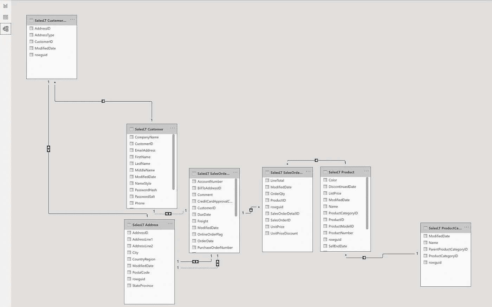

# 数据科学—使用 Microsoft Power BI 为 SQL 关系数据构建网络图

> 原文：<https://towardsdatascience.com/data-science-building-a-network-graph-in-power-bi-using-sql-server-a1b4c9b7610a?source=collection_archive---------23----------------------->

## 讨论如何为存储在 SQL Server 中的销售数据构建网络图，以可视化销售模式。

作者图片

网络理论是一种最先进的理论，用于表示实体之间的复杂关系。一些有趣的应用是疫情扩散分析(如 COVID19)、社会网络分析(如脸书网络)、世界贸易分析等..网络图建立在网络理论的基础上，可以为讲故事提供动态的、有时令人兴奋的图表。

本文将讨论如何为存储在 SQL Server 中的 SQL 关系数据构建网络图。想要从事一些数据科学项目的人(例如软件工程师、数据工程师、数据库管理员)可能会对它感兴趣。

以上是自行车相关产品销售数据的最终网络图。注意，为了简单起见，我没有使用所有的数据，为了演示的目的，我没有使用更清晰的视图。

## 从这个图表中，很容易回答公司高管的常见问题:

*   卖什么产品？
    *图中所有的绿色节点，包括旅行车、公路车、山地车、自行车架。*
*   产品销售到哪里？
    *图中的所有灰色节点，包括加利福尼亚州、新英格兰州、新墨西哥州、科罗拉多州、内华达州和犹他州。*
*   卖多少产品或者产品卖多少钱？
    *大部分到加州和新英格兰，部分到新墨西哥州和科罗拉多州，少量到犹他州和内华达州。*
*   产品和客户的地理位置之间有什么关联吗？
    *是的！例如，销售到新英格兰的公路自行车比自行车架多得多，公路自行车的链接更粗就说明了这一点。*
*   对于一个全新的产品，它应该在哪里营销和销售？
    *例如，一辆旅行自行车可以行销到加利福尼亚、新英格兰、新墨西哥和科罗拉多！*

## 现在，我们如何在微软 Power BI 中构建这样的东西呢？

**先决条件**

*   Microsoft 帐户。可以免费注册。
*   超级商务智能台式机。你可以从这个[微软链接](https://powerbi.microsoft.com/en-us/downloads/)免费下载。
*   SQL Server。你可以从这个[微软链接](https://www.microsoft.com/en-ca/sql-server/sql-server-downloads)免费下载。
*   Microsoft 示例数据库“AdventureWorksLT2016”

**示例 Adventure Works 数据库中有什么？**

*   销售系统的虚假 CMS 数据
*   产品和产品类别
*   客户及其地址
*   销售订单

**步骤 1 —打开 Power BI Desktop 并创建一个新工作簿。**在可视化面板中，点击三个点并选择“获取更多视觉效果”。

作者图片

**步骤 2 —搜索“网络”,安装网络导航图，这是微软提供的自定义可视化工具。**安装后，网络导航器应显示在可视化列表中。

作者图片

作者图片

**步骤 3 —现在让我们通过将工作簿连接到 SQL Server 上的 AdventureWorks 数据库来获取示例数据。**注意，当要求我们选择表格时，我们只需要数据库中的几个表格。如果将来需要，您可以添加更多表格。

作者图片

作者图片

作者图片

作者图片

单击左侧边栏上的模型图图标，确认数据模型。请注意，Power BI 将识别外键和表之间的关系。

作者图片

**第 4 步—(可选)为用户界面添加一个新列。**在左侧栏中，导航到数据图标，然后选择客户表，并单击新列。

作者图片

在编辑栏中，输入以下文本，为所有记录设置列名和常数值。

PowerBiNodeColor = "#01B1AA "

作者图片

**步骤 5——点击网络导航图标，创建网络图。在我们填写所需属性之前，它将为空。**

作者图片

**第 6 步—添加我们想要探索的数据字段。**在本次演示中，我们将使用:

*   列产品类别。作为源节点的名称
*   列地址。StateProvince 作为目标节点
*   SalesOrderDetail 列 OrderQty 作为边权重，它确定边/链接的厚度。
*   SalesOrderDetail 列 OrderQty 作为目标节点权重，它决定了状态节点的大小。
*   列 PowerBiNodeColor 作为源节点颜色，这是我们在上一步中创建的绿色。

第六步——在“画笔”部分给网络图一些爱和格式。

作者图片

以下是我为此演示更新的设置列表:

*   在“布局”面板中将“最大节点大小”设置为 30，以便节点/气泡不会变得太大
*   打开布局面板中的标签。
*   将标题值设置为“Adventure Works”。

**恭喜恭喜！**现在，您有了一个全新的网络图来展示如何以一种非常吸引人的格式可视化 SQL 关系数据！

本文中使用的 Power BI 工作簿发布在这个 [GitHub 链接](https://github.com/ShawnShiSS/data-science-network-graph)上。请随意使用它作为您下一个数据科学项目的开始！

**感谢您的阅读！**