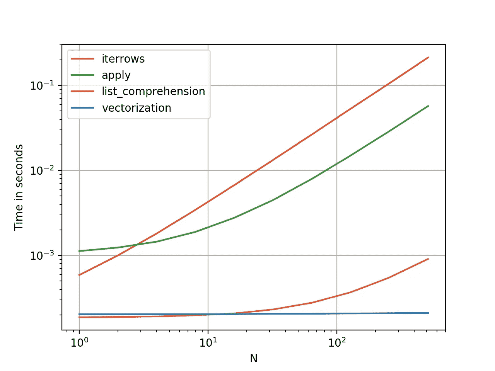
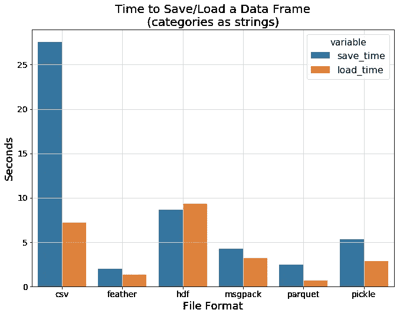
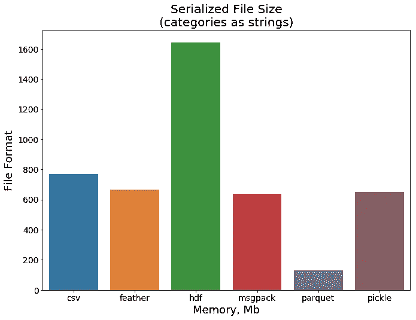

# 数据科学的 Python 最佳实践

> 原文：<https://towardsdatascience.com/data-science-coding-mistakes-and-best-practices-part-1-f7511cf573f7?source=collection_archive---------15----------------------->

## [入门](https://towardsdatascience.com/tagged/getting-started)

## 通过以下几个技巧，避免常见错误并提高您的数据科学编码技能


由 [nesabymakers](https://unsplash.com/@nesabymakers) 在 [Unsplash](https://unsplash.com/photos/kwzWjTnDPLk) 上拍摄的照片

我们中的许多人在没有强大的软件工程背景的情况下开始了他们的数据科学职业生涯。虽然一开始这可能不是问题，但是随着代码变得越来越复杂，您会发现您的笔记本会变得越来越慢，并且您会努力维护它。这篇文章的目标是帮助你写出干净、易读、高性能的代码。这篇文章并不是关于如何成为一名更好的程序员的详尽指南，但是我希望你能从中找到一些有用的东西来提高你的编码技能。

# 1.在 DataFrame 行上循环(简单回答:不要！)

我认为这是第一次做分析编程的人最常犯的错误之一。StackOverflow 的回答很好地解释了这一点。

> pandas 中的迭代是一种反模式，只有当你用尽了所有其他选择时，才应该这么做。你不应该使用名字中带有“iter”的函数超过几千行，否则你将不得不习惯等待。

为了加快你的数据处理，你需要使用内置的 pandas 或 numpy 函数，因为它更快更容易。例如，看看这个 For 循环，

```
for index, row in df.iterrows():
   if row['room_size'] <= 36
       row['category'] = 'small'
   else:
       row['category'] = 'large'
```

这可以使用 numpy 轻松完成，

```
df['category'] = np.where(df['room_size'] <= 36, 'small', 'large')
```

使用 numpy/pandas 函数的最大好处可能是它们比 for 循环快很多。看看下面的图表，比较熊猫函数和迭代的运行时间。



各种数据处理方法的速度比较。

如果您使用 pandas 或 numpy 函数，您的代码将被矢量化，这意味着这些库不是一次处理一个值，而是一次对所有行执行一次操作，这使得您的数据处理速度非常快。以下是您可以使用 pandas 进行数据帧操作的一些其他示例:

## 基于其他列的操作创建新列:

```
df['c4'] = (df['c1'] — df['c2']) * df['c3']/100
```

## 向上或向下移动列:

```
df['c1'] = df['c1'].shift(periods=1) # Shifting up one column
df['c1'] = df['c1'].shift(periods=-1) # Shifting down one column
```

## **切片一个**列 **:**

```
df = df[start_index:end_index].copy()
```

## 填充不适用值:

```
df.fillna('bfill',inplace=True)
```

最棒的是，您可以使用 [pandas](https://pandas.pydata.org/docs/user_guide/index.html) 或 [numpy](https://numpy.org/doc/stable/reference/index.html#reference) 内置函数进行大多数数据操作。我只能想到一些用例，这些用例只能通过迭代来完成，比如训练你的 ML 模型或者使用正则表达式。因此，如果您想知道如何使用这些库之一进行数据操作，请查阅 numpy 或 pandas 文档(或 StackOverflow)。

# 2.SettingWithCopyWarning()，了解视图与副本

如果你曾经使用过熊猫，你可能以前遇到过这个警告。

```
SettingWithCopyWarning: 
A value is trying to be set on a copy of a slice from a DataFrame.
Try using .loc[row_indexer,col_indexer] = value instead
```

这个警告可能是由很多原因造成的，但是我认为最常见的原因是对视图和副本的不清楚的理解。顾名思义，**视图**是原始数据的视图，因此修改视图可能会修改原始对象。举个例子，

```
# df2 will return a **view**
df2 = df[['A']]
df2['A'] /= 2
```

上面的操作返回一个视图，并将产生`SettingWithCopyWarning`。如果您更改列`df2`的值，它也会更改列`df`上`A`的值，这就是警告试图告诉我们的。要修复它，你必须使用`.copy()`为`df2`创建一个全新的对象

```
# df2 will return a **copy**
df2 = df[['A']].copy()
df2['A'] /= 2
```

上面的代码将返回一个**副本**，这是一个全新的对象。在上面的代码中，改变`df2`不会改变`df`。事实上，**你应该在每次创建一个新的非空数据框架**时使用 `**.copy()**` **来避免声名狼藉的`SettingWithCopyWarning`。**

# 3.编写干净的代码。

众所周知，数据科学家写的代码很糟糕。这并不奇怪，因为数据科学家编写的许多代码都是用于 EDA、快速原型制作和一次性分析的。你的代码可能有一天会被其他人修改或阅读，这个事实你可能不会想到。引用一个比我更好的程序员的话，“代码被阅读的次数比它被编写的次数多得多，所以要相应地计划”。以下是我给你的一些关于如何写出更好代码的建议。

## **避免非描述性的变量名**

不要在你的代码中写简短的非描述性的变量名，比如`i`、`j`、`X`、`Y`。而是写一个描述性的变量名，比如`row_index`、`column_index`、`train_data`、`test_data`。是的，这会让你多花两秒钟输入变量，但是相信我，当将来有人试图修改/调试你的代码时，这会节省很多工时。

```
# Avoid (❌) - Non-descriptive variable names
n, x, y = data.shape# Prefer (✅) - Clear, descriptive variable names
no_of_images, image_width, image_height = data.shape
```

## 命名和格式约定

拥有一致的命名准则将有利于您和您的团队。它将使任何阅读你的代码的人更快地理解它，并使你的代码更好看。由于大多数数据科学代码都是用 python 编写的，所以我将分享一些 PEP8 命名约定:

*   **变量/函数**名称为小写，用下划线分隔
*   **常量名称**都是大写字母
*   **类**名称通常应使用茶色

至于格式，因为 python 不允许混合使用制表符和空格来缩进，所以最好坚持一种格式。有许多不同的 [python](https://www.python.org/dev/peps/pep-0008/#code-lay-out) [风格](https://google.github.io/styleguide/pyguide.html) [指南](https://docs.python-guide.org/writing/style/)可供您遵循，但我发现其中有几个是必不可少的:

*   使用 4 个空格代替制表符(如果你使用 VS 代码，你可以[自动将制表符转换成空格](https://stackoverflow.com/questions/36814642/visual-studio-code-convert-spaces-to-tabs))
*   用两行空行将顶级函数和类定义括起来。
*   通过在圆括号、方括号和大括号内使用 Python 的隐含行继续符来换行

```
# Long function
foo = long_function_name(var_one, var_two,
                         var_three, var_four)
```

## 保持你的代码干燥(不要重复)

考虑将您在整个代码中使用的相同值重构到代码的单独部分中的单个变量中，或者更好的是，重构到单独的 JSON 文件中。这将在将来为您节省大量时间，因为如果您想在整个代码中更改相同的值，您可以通过更改一个变量来实现。这种做法还将避免一种常见的编码反模式，称为[幻数](https://en.wikipedia.org/wiki/Magic_number_(programming))，其中具有未解释含义的唯一值被直接硬编码在源代码中。

```
# Avoid (❌) - Unexplained 'magic' number
model = models.Sequential()
model.add(layers.LSTM(60, activation='relu', input_shape=(10, 3)))# Prefer (✅) - Clear value names and meaning
neurons = 60
no_of_timesteps = 10
no_of_feature = len(df.columns)
activation = 'relu'

model = models.Sequential()
model.add(layers.LSTM(neurons, 
activation= activation, input_shape=(no_of_timesteps, dimensions)))
```

这也适用于您的过程，与其在笔记本中编写冗长的数据处理过程，不如将相似的过程分组并重构为单个函数。然后，您可以使用 pandas `.pipe()`函数在单个链式执行中调用所有重构的函数。

```
# Avoid (❌) - Long, sequential procedures
df = pd.read_csv(‘data/train.csv’)
df[‘price_per_sqft’] = df[‘price’] / df[‘sqft’]
df[‘c1’].fillna(0, inplace=True)
df[‘c2’].fillna(method=‘bfill’, inplace=True)
df[‘c3’].fillna(df.groupby([‘c1,c2’])[‘c3’].transform(‘mean’))# Prefer (✅) - Separation of functions and chained executions
PATH = ‘data/train.csv’def load_data(path):
 return pd.read_csv(path)def calculate_price_per_sqft(df):
 df[‘price_per_sqft’] = df[‘price’] / df[‘sqft’]def imputate_missing_values(df):
 df[‘c1’].fillna(0, inplace=True)
 df[‘c2’].fillna(method=‘bfill’, inplace=True)
 df[‘c3’].fillna(df.groupby([‘c1,c2’])[‘c3’].transform(‘mean’))
 return dfdf = load_data(PATH)
result = (
  df.pipe(calculate_price_per_sqft)
    .pipe(imputate_missing_values)
)
```

# 4.在. parquet 文件中保存和加载数据

常见的做法是使用`.to_csv()`功能将数据保存到 CSV，就像你在许多 kaggle 笔记本中看到的那样。但是 CSV 实际上 [**不是存储大数据的好格式**](/the-best-format-to-save-pandas-data-414dca023e0d) ，因为它是*无模式的*，所以你必须在加载数据时解析日期和数字，并且*是未压缩的*，这意味着大数据集将占用大量内存，并且保存和加载将非常慢。Pandas 库实际上支持许多更适合保存大型数据集的格式。看看下面的图表，比较数据帧保存/加载时间。



图片来自[伊利亚扎依采夫](/the-best-format-to-save-pandas-data-414dca023e0d)，2019。经允许重新发布

我们可以看到羽毛和拼花比 CSV 快几个数量级，两者都由`pandas`支持。这是由于这些文件类型的列压缩，它们将数据存储在磁盘中，类似于 DataFrame 对象在内存中的存储方式。接下来，我们来看看这些文件类型的文件大小对比。



图片来自[伊利亚扎依采夫](/the-best-format-to-save-pandas-data-414dca023e0d)，2019。经允许重新发布

这一次拼花地板脱颖而出。基于这种比较，我推荐以 parquet 格式保存数据，因为这样速度更快，占用的内存更少，并且受`pandas`支持。您可以使用`.to_parquet()`将数据保存在`parquet`文件中。

```
# Avoid (❌) - Saving and loading data to CSV
df = pd.read_csv('raw_dataset.csv')
df.to_csv('results.csv')# Prefer (✅) - Saving and loading data to parquet
df = pd.read_parquet('raw_dataset.parquet')
df.to_parquet('results.parquet')
```

# 5.构建您的项目

一开始，在一个 jupyter 笔记本上进行分析、可视化、特征工程和构建 ML 模型似乎是个不错的主意。当然，打开笔记本开始处理数据集是非常容易的，但是如果你在开始时没有仔细地组织代码，事情会很快变得非常混乱。结构化您的项目将降低代码的复杂性，并使其更易于维护。对于 starter，你可以将自己创建的有用的函数放在一个名为`data_processor.py`的独立模块中，然后导入到你的 jupyter 笔记本中。

```
// data_processor.pyimport pandas as pddef imputate_missing_values(df):
 df['c1'].fillna(0, inplace=True)
 df['c2'].fillna(method='bfill', inplace=True)
 df['c3'].fillna(df.groupby(['c1','c2'])['c3'].transform('mean'))
 return dfdef calculate_moving_averages(df):
 df['moving_average'].fillna(0, inplace=True)
 return df
```

在你的 jupyter 笔记本中，你可以导入你已经创建的模块，并使用`.pipe()`函数来使用它(我是`.pipe`函数的粉丝)。

```
// your_notebook.ipynbimport data_processor.py as dpresult = (
  df.pipe(calculate_price_per_sqft)
    .pipe(imputate_missing_values)
)
```

接下来，您可以将它们进一步分成名为`visualization.py`、`data_processing.py`、`build_model.py`等模块。

事实上，只要项目中的每个模块都符合**单一责任原则**，你就可以随心所欲地构建你的项目。引用维基百科，

> *单一责任原则(SRP)是一种计算机编程原则，它规定每个模块或类都应该对软件提供的功能的单一部分负责，并且这种责任应该完全由类来封装。它的所有服务都应严格符合这一职责。*

或者，如果你想要一个现成的模板，请查看为你做上述所有事情的[cookiecutter](https://drivendata.github.io/cookiecutter-data-science/#nothing-here-is-binding)data science。

# 结论

这篇文章包含了我在作为一名数据科学家的旅程中所犯的错误和学到的有用技术。我并不声称这些方法是完美的，但我希望这篇文章对开始职业生涯的数据科学家初学者有所帮助。

*我是一名初学数据的科学家，热衷于从数据中创造价值。可以在 Twitter*[*@ faisalrasbihan*](https://twitter.com/faisalrasbihan)*联系我。我欢迎建设性的反馈和批评。*

参考文献:
【1】[https://medium.com/r?URL = https % 3A % 2F % 2 ftowardsdatascience . com % 2 ftop-10-coding-errors-made-by-data-scientists-bb 5 BC 82 faaee](https://medium.com/r?url=https%3A%2F%2Ftowardsdatascience.com%2Ftop-10-coding-mistakes-made-by-data-scientists-bb5bc82faaee)
【2】[https://towards data science . com/data-scientists-your-variable-names-are-words-heres-how-to-fix-them-89053d 2855 be](/data-scientists-your-variable-names-are-awful-heres-how-to-fix-them-89053d2855be)
【3】[https://towards](/the-best-format-to-save-pandas-data-414dca023e0d)

[4][https://www . practical data science . org/html/views _ and _ copies _ in _ pandas . html](https://www.practicaldatascience.org/html/views_and_copies_in_pandas.html)