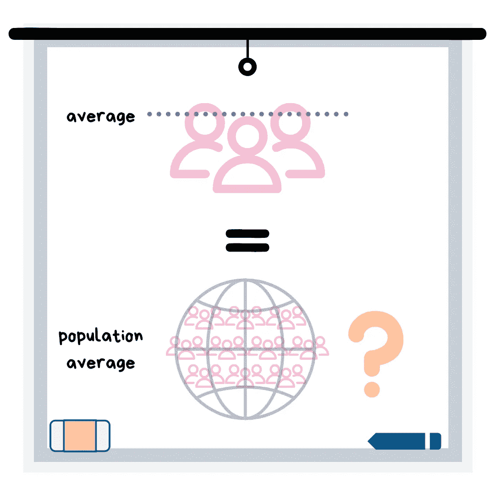
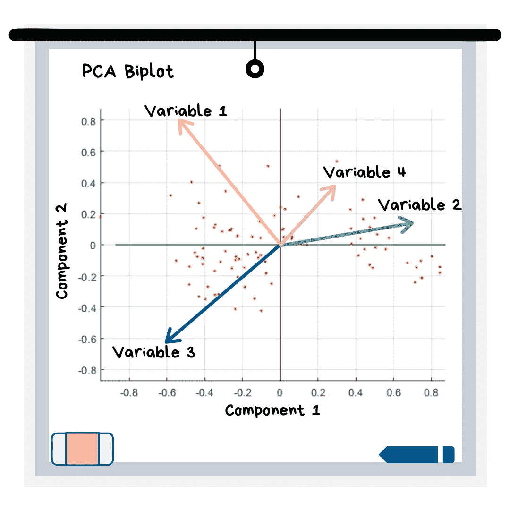
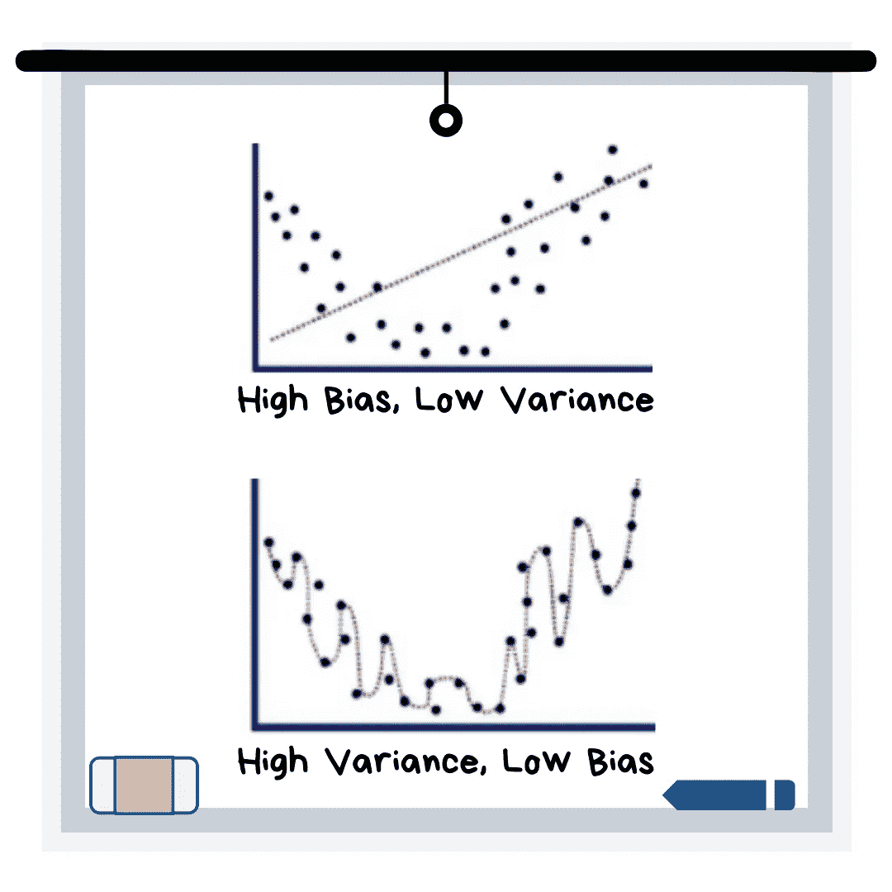
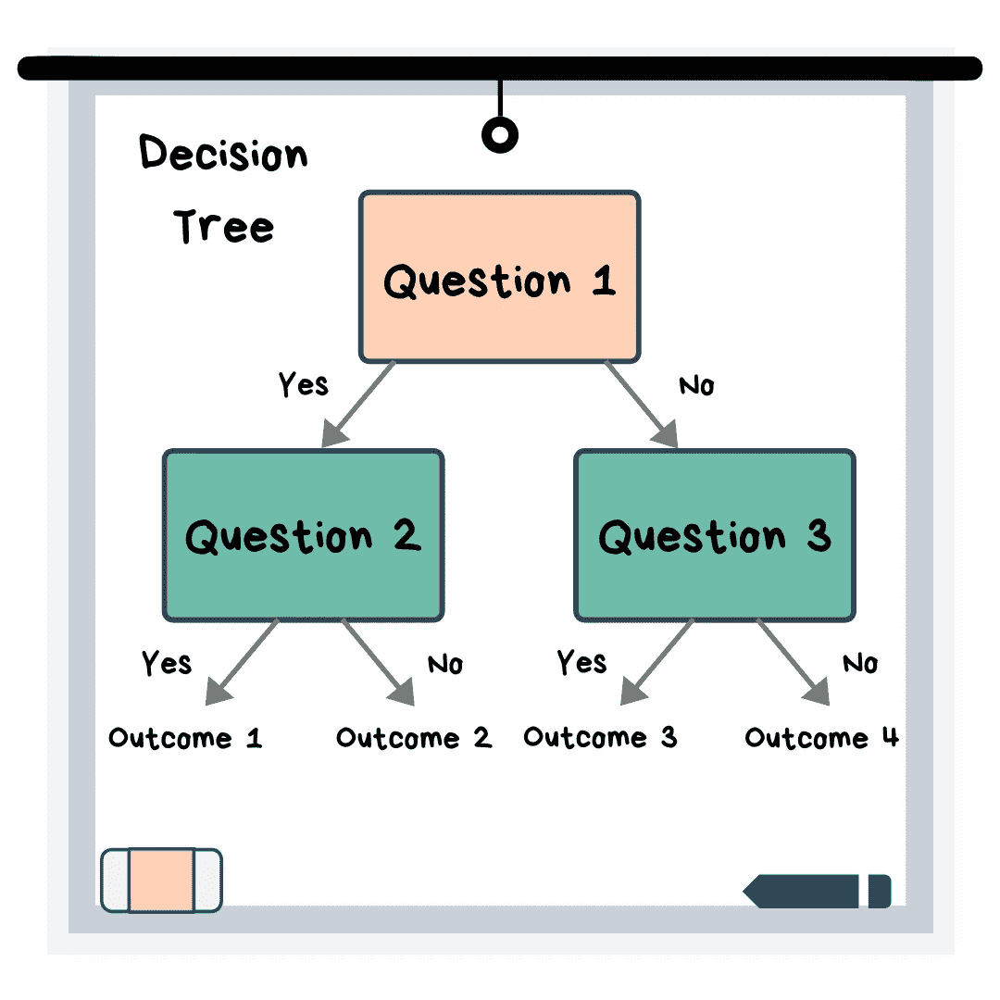
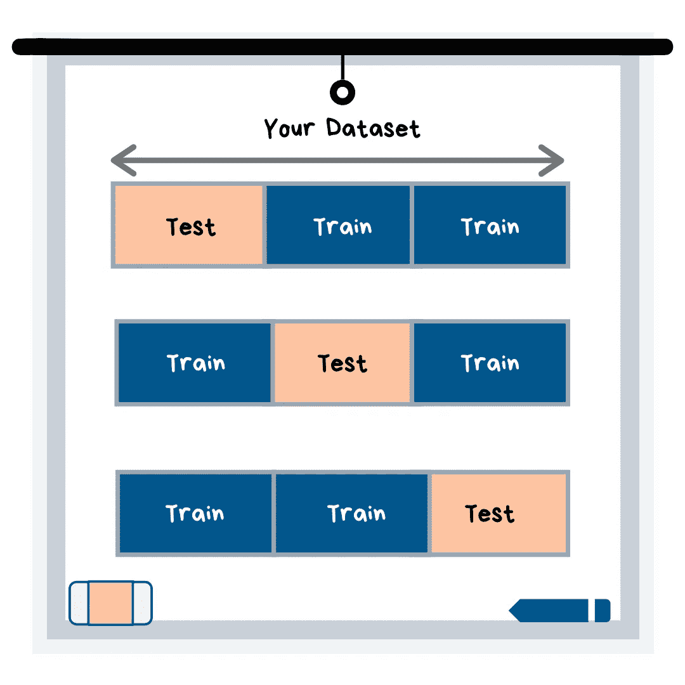

# 向五岁儿童解释数据科学概念

> 原文：<https://towardsdatascience.com/data-science-concepts-explained-to-a-five-year-old-ad440c7b3cbd?source=collection_archive---------4----------------------->

## 在采访中简单描述技术概念

我见过许多数据科学面试问题，要求您“向我描述[插入数据科学概念]，就好像我是一个五岁的孩子。我妹妹正在学习成为一名小学教师，在和她讨论过这个问题后，我们觉得这个问题有点夸张，也许是为了强调或者是为了引人注意。所以我决定保留这个吸引人的标题，但是这篇文章将稍微侧重于向一个没有技术背景的成年人解释这些概念。然而，为了与主题保持一致，我还创建了图形来描述每个答案，如果我有机会使用白板，我会在我的解释中附上图形。

这些主题遵循以下顺序:

1.  统计和数据准备
2.  机器学习模型概念
3.  评估模型

## 假设检验和 T 检验

总体均值的假设检验

对于假设检验，你首先从一个关于大群体的问题开始。比如美国人的平均身高是多少？你猜它是 5 英尺。8 英寸。(只是根据个人经验)。你知道你不可能真实地测量每个美国人的身高，所以你随机选择了一个更小的群体来测量(随机样本)。

看看所有美国人的平均身高是否真的是 5 英尺。8 英寸。，你会进行假设检验！在本例中，您将需要使用单样本 t 检验，它有一个特定的等式，我不会深入研究。这里需要注意的重要一点是，你需要知道你测量的人数，他们的平均身高，以及他们身高的标准差(也就是他们的身高离平均值有多远)。

当你从 t 检验中得到一个值(t 值)时，你需要使用一个图表或程序来评估你是否可以得出你非常确定——95%确定——这是美国人的平均身高。如果你的 t 值大于 1.96 或小于-1.96，你会说你拒绝你的假设，即所有美国人的平均身高是 5 英尺。8 英寸。如果它在这个范围之间，你就“未能拒绝”(这是统计学术语)你的假设，并得出结论说这是美国人的实际平均身高。

## 主成分分析

有时你有一个数据集，其中有太多的列(变量),很难处理。将所有这些变量放入一个模型中会导致它运行缓慢，并且很难一次将你的因变量(你试图预测的变量)和所有其他变量之间的关系可视化。这就是 PCA 的用武之地！

PCA 将变量转换为分量，每个分量都是原始变量的混合，但共享方差较小。

PCA 双标图示例

注意，我肯定会把 5 年前的水平解释留给这一个。通过一些复杂的数学(线性代数)，PCA 将你的变量转化为“组件”左边的图称为双标图，它显示了组件 1 和组件 2 由我们最初的四个变量组成。然而，每个变量在一个组件中比在另一个组件中表现得更多。例如，绿色(变量 2)向量具有较高的分量 1 值，但其分量 2 值保持在 0.2 以下。因此，与成分 2 相比，变量 2 是成分 1 的更重要部分。

这里的目标是拥有比变量数量更少的组件(这样你的模型可以运行得更快)。此外，您希望您的组件尽可能多地保留关于原始变量的信息。为了对此进行分析并选择将多少组件放入模型中，您可以查看一个名为*解释方差比率*的指标。该指标告诉您每个组件“解释”的数据集中总方差的百分比希望本节中的第一幅插图能让这个想法更清晰一些。在一个理想的场景中，你可以通过将每个组件的*解释方差比*相加来选择要包含在你的模型中的组件数量，直到你达到大约 80%或 0.8 的累积总数。

最后，还有一点需要澄清:当您使用 PCA 组件时，您会失去一些解释模型结果的能力。一旦确定了模型中哪些组件是有意义的，你能做的最好的事情就是查看双标图，如上图所示，以显示每个变量如何为每个组件提供信息。

## SQL(结构化查询语言)连接

假设您有一个数据库，它实际上就像一个 Excel 表或表格的集合。SQL 连接最容易通过示例来理解，因此示例表如下所示:

2 个 SQL 连接示例表

对于这个例子，我们假设有一些学生的信息在学生表中，但是他们不在注册表中，因为他们当前没有注册上课。此外，我们在学生表中没有注册课程的学生的信息。以下是每种类型的联接会告诉您的内容:

可视化 3 种类型的 SQL 连接

*   **内部连接**:学生表**和注册表**中每个学生的注册+学生信息
*   **右加入**:报名人数+学生信息**只针对**报名参加某个班级的学生
*   **左连接**:学生信息+招生信息**只针对学生表中的学生**

因此，您希望在查询中使用的 SQL 连接类型(也就是您发送到数据库以获取数据的代码)取决于您希望了解的信息。如果您想知道注册上课的学生的电话号码，请使用内部联接。如果您想要每个学生的姓名和年份，以及他们所在的班级(如果他们碰巧注册了任何课程)，那么您可以使用左连接。

> 我们现在正冒险进入模特界。

## 偏差/方差权衡

这很难向非技术观众解释，所以请耐心听我说。

偏差/方差权衡是一个经典的数据科学概念，它表明当您创建模型时，偏差和方差之间存在固有的权衡。我将从这两个术语的描述开始，然后简要解释为什么在这两个术语之间有一个权衡。

高偏倚和高方差的极端情况图解(图表来自[https://www . kdnugges . com/2018/04/data-science-interview-guide . html/2](https://www.kdnuggets.com/2018/04/data-science-interview-guide.html/2))

**偏差:**具有高偏差的模型不能很好地“拟合”数据。也就是说，它的**准确性在你用来制作模型的数据(训练数据)**和你用来测试模型的数据**上是低的【关于测试的更多信息，参见交叉验证部分】。高偏差表明您的数据中有遗漏，或者您使用了错误的模型！示例:您的数据看起来像二阶多项式(x ),但您尝试使用线性模型(x)进行预测，如图中的上图所示。**

**方差:**方差高的模型对数据集自变量的微小变化非常敏感。这个问题与过度拟合有关，即您的模型与您用**训练的数据拟合得太好**，因为它将数据集中的噪声(或随机性)识别为重要，而实际上并不重要。因此，当你引入它以前没有见过的新数据时，它在预测中的表现**很差**。示例:将具有二阶多项式(x)关系的数据与 20 阶多项式 x ⁰进行拟合(见上图)。

这两个问题之间存在权衡，因为当您调整模型以更好地适应您的数据时，您会减少偏差，但您必然会增加方差。这种紧张关系存在于根据你收集的数据对模型进行过拟合和欠拟合之间。

## 决策树和随机森林

一个简单的决策树示例

左边的图片是你能做出的最简单的决策树之一。您从顶部开始，询问关于您的观察(数据集中的一行)的问题，并沿着树向下，直到您得到一个结果，这将是您的预测 y 值。

决策树很容易让你的数据超负荷。最糟糕的情况是，你的树的每个结果恰好代表数据集中的一个观察值。

为了解决这个问题，使用了随机森林模型。从本质上讲，一个程序会生成一堆决策树，每一棵看起来都有一点不同，这是由于模型进行决策分割的随机性。然后，对所有这些树的结果进行平均，以获得最终预测。这种方法可以让你制作更小的树，减少模型的方差，同时保持模型的准确性，这也是它非常受欢迎的原因。

> 最后，关于验证你的模型。

## 交叉验证

在评估任何类型的机器学习模型时，交叉验证都是最佳实践。下图显示了如果要执行三次交叉验证(三重交叉验证)，将如何分割数据集。

拆分数据集以进行交叉验证

对于上面的每个数据分割，您将在列车段上构建您的模型，并在测试集上测试您的模型(生成预测)。然后，您可以对每个分割的准确性分数进行平均，以获得模型实际上有多好的图片。数据科学家这样做是因为他们可以使用更少的数据总量，并可以在模型以前没有见过的更大范围的数据上测试他们的模型。

当雇主问这些问题时，他们似乎想评估两件事:

1.  你对这个概念了解到足以分解它吗？
2.  *你能以直观、简单、简洁的方式解释棘手的技术概念吗？*

我希望这篇文章有助于你了解概念的分解，无论你是试图自己理解它们还是更好地向他人解释它们。如果你碰巧有一个 5 岁左右的孩子，如果你能向他们解释其中的一个并让我知道它是如何进行的，那将是令人惊讶的。(我猜他们可能只是有点困惑。)此外，如果您对这些主题还有任何不清楚的地方，请告诉我！

感谢阅读！点击这里查看我在这个迷你系列中的第二篇文章:

 [## 向一个五岁的孩子解释机器学习模型

### 尽可能简单地解释 ML 模型是如何工作的

medium.com](https://medium.com/@megandibble/machine-learning-models-explained-to-a-five-year-old-f2f540d9dcea) 

【www.canva.com】上制作的 [*所有图形*](http://www.canva.com)