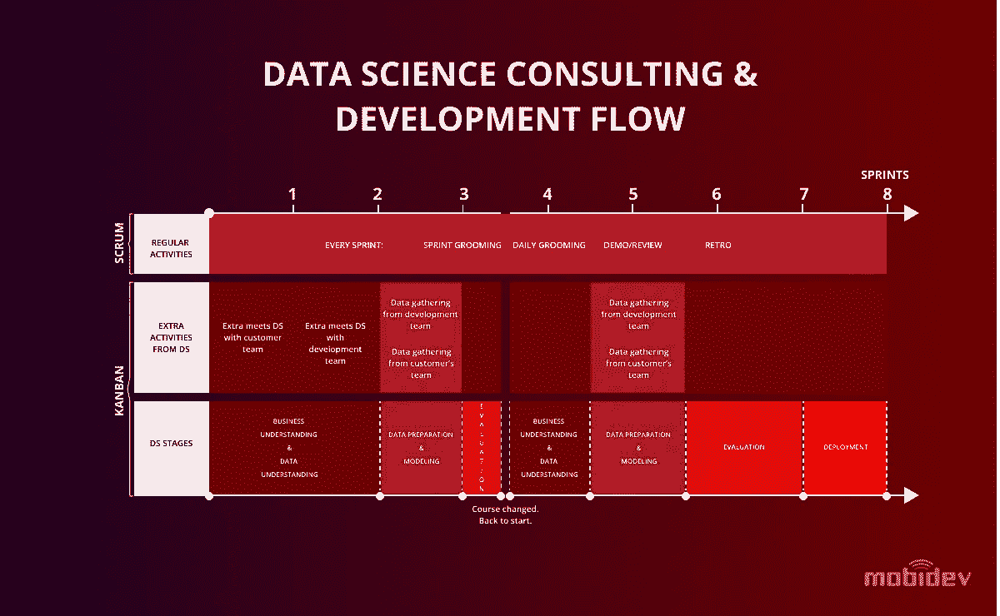
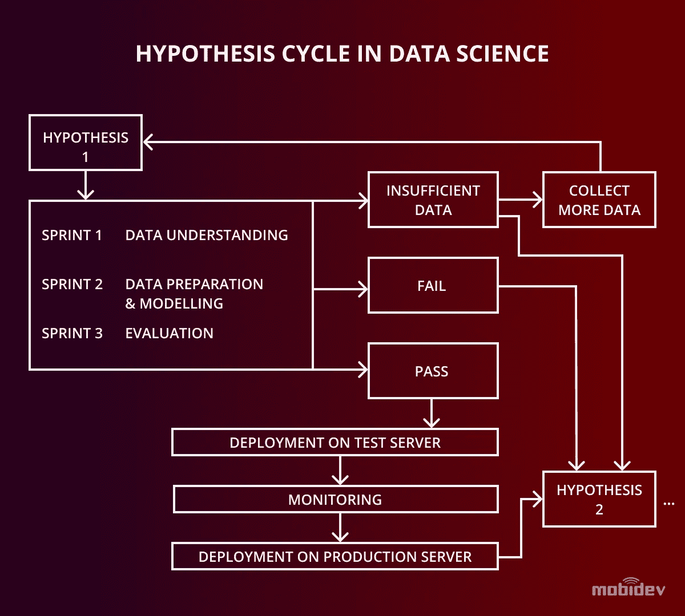

# 数据科学咨询:从想法到部署

> 原文：<https://towardsdatascience.com/data-science-consulting-from-idea-to-deployment-ea8efed8c388?source=collection_archive---------32----------------------->

## 为企业主解释数据科学软件开发项目流程。

如果你知道如何挖掘，你的数据可能是金子。大多数企业主都知道应用数据科学来获得竞争优势的价值和用途。数据挖掘产生未被发现的洞察力，这些洞察力导致成功商业战略的行动计划。为了充分利用应用数据科学，拥有有用的数据以及业务人员了解典型的数据科学开发流程非常重要。

# 数据科学推动创新

让我们探讨两个案例研究，一家零售/餐饮连锁店和一家医疗保险公司如何使用应用数据科学和机器学习来进行数据挖掘，并发现对业务战略创新有用的见解。

# 零售/餐饮连锁店案例研究

一家连锁零售店和餐馆收集了多年的库存和销售数据。该数据库用作数据科学顾问用来训练机器学习模型的信息资源。该顾问帮助企业主确定并实现战略目标。

现有的数据库是用于生成需求预测模型的资源，以便对未来的销售进行预测。一个自适应选择性模型通过分析过去两年半的零售销售数据来预测未来一周的需求。数据挖掘使用结合外部数据源的自回归模型。这使得在任何时候对任何特定产品的需求进行预测成为可能。通过使用这一解决方案，该公司能够优化库存和仓储，根据需要随时提供可用的供应品，并且更加经济高效。

# 医疗保险公司的案例研究

在这种情况下，目标是确保对高度个人化医疗保健数据的授权访问，以遵守健康保险便携性和责任法案(HIPAA)的规定。该公司被建议使用[多模式生物认证](/why-you-should-use-multimodal-biometric-verification-for-security-systems-f345134ffd05)，要求用户通过面部和语音识别才能获得授权访问。

数据科学顾问建议为系统添加增强的安全功能，包括用于驾照验证的[光学字符识别](/how-to-use-optical-character-recognition-for-security-system-development-9dc57258afa3) (OCR)，防止面部识别欺骗的[深度学习系统](/anti-spoofing-techniques-for-face-recognition-solutions-4257c5b1dfc9)，以及基于 NLP 的安全挑战。这些改进促成了企业验证即服务(EVaaS)系统的创建。

# 数据科学咨询项目流程

企业主想知道如何使用技术来实现业务目标。他们对技术工作的细节不太感兴趣。他们更感兴趣的是在其业务流程中实施应用数据科学的成本和结果。

以下是数据科学软件开发项目的步骤。

# 步骤 1:收集数据

数据科学顾问了解客户和客户的顾客的需求。咨询师会发现客户的问题。推荐的解决方案能产生最大的价值，并满足客户的顾客的需求。顾问必须了解数据科学如何应用于业务模型，以及哪些数据将支持实施策略。

如果有多年来收集的现有数据可供使用，这对训练机器学习模型很有帮助。顾问评估数据以从战略角度理解其结构和有用性。

如果没有可用的数据库，那么数据科学顾问将探索客户的目标和主要用例。这些是数据收集技术设计的基础。获取数据的选项包括直接收集数据和调查是否存在任何第三方数据库，这可能是有用的。或许，存在合适的预训练模型。如果他们这样做，这将大大减少模型训练所需的费用和精力。有可能生成合成数据来代替真实数据。

使用预训练模型，精确度会根据特定于新项目的数据输入进行调整。随着模型的“学习”，结果会提高。在开始时，不可能预测机器学习模型的准确性和质量。这需要一个反复的过程，在开发过程中使用实验和校准结果。

给数据科学顾问大约一周的时间来评估业务输入和目标。作为项目合同前建议阶段的一部分，这种评估通常是没有成本的。

# 第二步:设定目标

业务目标是衡量改进的标准。技术目标是衡量系统性能的基准。成功指标是两者的结合。

当[使用需求预测](https://mobidev.biz/blog/machine-learning-methods-demand-forecasting-retail?utm_source=towardsds&utm_medium=towardsds-ds-cons&utm_campaign=towardsds-ds-cons)时，依赖于客户行为的商业目标，如“增加 20%的销售额”没有保证。可以保证的是技术目标，比如“销量增加 20%需要多少库存。”

例如，客户可能需要一个预测模型，该模型基于对过去五个月的数据的分析，以 70%的准确度预测未来一周的产品需求。这一预测将是创建额外的测量、任务和假设的基础。

正如我们在零售/餐饮连锁店项目中看到的，目标是优化库存、仓储和采购。数据挖掘从过去的销售统计数据允许顾问预测未来的商品购买。对单个数据集的分析解决了库存、仓储、采购以及预测销售收入的问题。

每个任务都是从一个假设发展而来的，例如“通过使用销售预测来改善库存管理”来为每个项目设置适当的库存水平。这个假设提供了一个可以遵循的指南。通过评估在探索回答假设的数据集合时完成的结果，决策变得必要。

如果假设是正确的，那么机器学习模型经历微调以提高结果的准确性。Substantia 致力于此。

如果假设是不正确的，并且表明将假设应用于特定数据集没有价值，那么方法、假设或数据集必须改变。

# 需要什么样的精度水平？

所需的精确度是不可预测的，因为它取决于数据集。由于花费的预算对业务目标来说是成本有效的，因此准确性是有限的。过度花费以达到高于必要的精度水平是一个糟糕的策略。没有必要要求不能为企业创造增值结果的系统准确性。

# 阶段 3:构建循环

通过将经典的敏捷原则与跨行业数据挖掘流程(CRISP-DM)模型相结合，可以管理数据科学项目。

标准周期专注于一个假设，以生成任务和结果的精确度。这个周期是一组四次冲刺，每次持续一周。在理解业务和数据的前两个冲刺阶段，第一个假设形成了基线，以此为基础，用未来的假设来改进结果。

通过适当的假设，使原始数据具有可操作性是可能的。为此，必须采取以下步骤:

*   **数据回顾**:了解、访问、探索数据集的格式和数量。
*   **报告**:通过识别初步的洞见，创建一份数据评审报告。
*   **数据认证**:验证数据集的完整性和质量。
*   **行动项目**:为建模建立一个可操作的数据集。

在上面给出的需求预测示例中，数据经过了检查、清理和组织。这些数据决定了最常出售商品的基准。并非所有数据都具有相同的值。为了获得有用的结果，用于模型的数据必须与提出的确切假设相关。[数据科学顾问](https://mobidev.biz/services/data-science?utm_source=towardsds&utm_medium=towardsds-ds-cons&utm_campaign=towardsds-ds-cons)组织了一个有代表性的数据样本进行分析。对所有数据的分析并不是一蹴而就的。

在[多模态生物识别安全系统示例](https://mobidev.biz/blog/multimodal-biometrics-verification-system-ai-machine-learning?utm_source=towardsds&utm_medium=towardsds-ds-cons&utm_campaign=towardsds-ds-cons)中，一个目标是通过实时比较驾照照片和自拍照片来更好地识别用户。面部识别的预训练模型有助于建立基线。

使用驾照数据集带来了一个挑战。许可证的图像质量远低于高分辨率自拍文件和用于模型预训练的面部图像。因为目标是比较这两种类型的图像，所以数据集必须符合假设的要求。

# 多少数据才够？

拥有太多的数据永远不会发生，因为从大型数据库中选择一个子集样本是可能的。但是，如果没有足够的正确类型的数据，训练过程将失败，模型将无法学习。如果需要更多的数据，我们会收集数据或转向不同的假设。

如果一个假设由于缺乏足够的数据来检验而失败，那么，我们用一个新的假设重新开始这个循环。这种类型的失败是固有的和不可避免的风险。

在零售/餐饮连锁店项目中，了解不同类型产品的销售情况至关重要。需要的数据是每个时期的购买量，以及在销售前这些物品在仓库中的库存时间。模型分析的项目越多，获得的准确性就越低。然而，为不同的项目重新训练模型是可能的。这改善了结果。

在选择用于训练模型的数据之前，决定如何测试模型的准确性是一个明智的策略。可以将大多数初始数据集随机分成两组。一个是培训用的，一个是测试用的。

例如，要以 97%或更高的准确率预测一个月的销售额，假设模型需要五个月的历史销售数据。一旦这个假设有了足够的证据，模型就成功了，预测系统就可以部署了。

# 阶段 4:部署模型

模型部署分为两个阶段。第一阶段是使用真实数据在测试环境中部署模型。该模型进行短期预测，并检查准确性。例如，如果历史数据是前五个月的交易，那么合适的预测周期可以是一周或一个月。使用一年的预测期是不合适的，因为这将引入不准确性，并且需要太长的时间来验证。

模型通过分析测试后，部署提升到实时生产环境。

在零售/餐饮连锁店的案例中，需求预测模型在测试环境中的测试服务器上运行了足够长的时间，证明其平均准确率为 97%。然后，它与公司范围的系统集成，供每个地点使用该地点的相关数据。

# 结论

数据科学软件开发项目的四个阶段需要随时重复业务流程和新的统计方法，使特定的机器学习模型过时。幸运的是，[数据科学随着许多基于云的服务和预训练模型的出现而继续发展](https://mobidev.biz/blog/future-ai-machine-learning-trends-to-impact-business?utm_source=towardsds&utm_medium=towardsds-ds-cons&utm_campaign=towardsds-ds-cons),这很有用。这使得软件开发人员更容易创建新模型并测试它们。与现有企业软件的集成变得越来越容易，软件项目交付速度更快，从而缩短了新部署的上市时间。