# 数据科学速成班

> 原文：<https://towardsdatascience.com/data-science-crash-course-6d8e03390f6b?source=collection_archive---------19----------------------->

## 让我们在 2020 年学习数据科学

2020 年到了，是时候学习数据科学了！这一数据科学速成课程是开始数据科学之旅的快捷方式。我们的目标是在你现在拥有的任何一台计算机上立即开始编程。仅仅通过阅读这篇文章，你将学会开始编码和分析数据的所有必要术语。我们走吧！

数据科学速成班。2020 年学数据科学吧！

# 开始前请注意:

## 如果您想查看本课程的完整课堂讲稿以及视频讲座，请访问数据科学 Rush 网站。

# 1.介绍

## 我们将 Python 用于数据科学

Python 是初学者和专家的完美语言，因为它的流行和清晰的结构。它很容易掌握，而且由于社区的存在，您将能够在您的第一次实验以及最近的机器学习研究中使用它。

## 数据科学速成课程概述

首先我来说说设置你的环境。在我们的例子中，这意味着在你的计算机上安装 Anaconda，这将允许你快速运行 Jupyter 笔记本，在那里你将直接从你的浏览器运行简短的 Python 程序。所以从现在到你的第一个节目，你可能需要 15 分钟。

那么要做数据科学，你需要一点数学知识。我将复习线性代数和统计学中的基本术语，这是你在学习过程中需要用到的。这些包括:

*   向量及其运算
*   矩阵及其运算
*   均值、方差、相关性
*   随机变量，相关性，条件概率，
*   朴素贝叶斯定理

然后我们可以直接处理数据:

*   正在导入文件。txt，。json，。xml，。超文本标记语言
*   在 NumPy 数组、pandas 数据帧和其他结构(列表、字典)中存储数据

## 获取和处理数据

我还将讨论如何以及在哪里可以获得有趣的数据。因为数据科学是关于数据的，所以你应该找到一个令你兴奋的数据集。一些例子包括:

*   书籍和文件，例如来自[古腾堡项目](http://gutenberg.org/)
*   抓取网站(下载体育或财经新闻)
*   [Kaggle](http://kaggle.com/) 数据库
*   Twitter API

## 数据科学中的标准技术

拥有数据是数据科学的第一步，一旦我们有了数据，我们就可以开始工作了。标准技术包括:

**分类**:我们有两个或更多的类别(标签)，我们想根据这些标签对对象进行分类。我们在这里讨论监督学习和标准技术，包括 KNN，朴素贝叶斯，决策树，XGBoost，神经网络。

**聚类**:我们没有任何标签，但我们仍然想对我们的数据进行分类。我们通过不同的相似性度量对数据进行聚类，从而创建标签。我们在这里讨论无监督学习和标准技术，包括 k-means 和 DBSCAN。

**神经网络**本身就是一个独立的话题。它们背后的基本思想是将一个问题简化成可以被“神经元”单独处理的更小的部分。我将介绍像 Keras 和 Tensorflow 这样的基本框架，然后还将讨论 MNIST 和其他一些很好的问题。

**如果你想可视化数据或者更好地理解数据，降维**是必须的。有时，您只想在 2D 绘制 4D 数据，然后必须对其进行转换，以捕捉信息的本质。标准技术包括主成分分析和 SVM。

对于数据科学的商业应用来说，可视化数据非常重要。最后，你想把你的发现传达给其他人，最好的方式是用一个漂亮的图表展示给他们，每件事都很清楚。我们将讨论 plotly 和 Dash。

在这个速成课程之后，您将准备好解决基本的数据科学问题，并自学更多内容。

# 2.蟒蛇和朱庇特笔记本

Anaconda 是一个针对数据科学和机器学习应用的免费开源发行版，包括 Python 和 R 编程语言。它旨在简化包的管理和部署。

好吧，这听起来可能很复杂，但事实是，这一切都是为了给你一个可以编码的框架。你需要一个编译器来运行 Python 代码，想想“运行”你的程序的文本编辑器，Anaconda 给了你更多。它为您提供了您可能想要使用的所有软件包和 Jupyter 笔记本。

不过还是从安装开始吧。让我们去 www.anaconda.com[下载最新版本:](http://www.anaconda.com/)

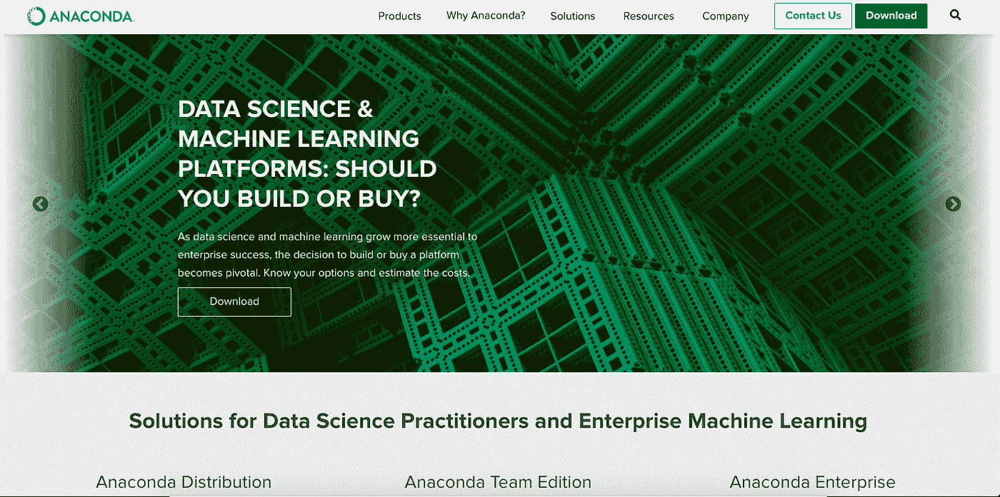

Anaconda 网站

既然你有了它，是时候深入解释它是如何工作的了。

如果你现在打开 Anaconda，你会看到这个屏幕:

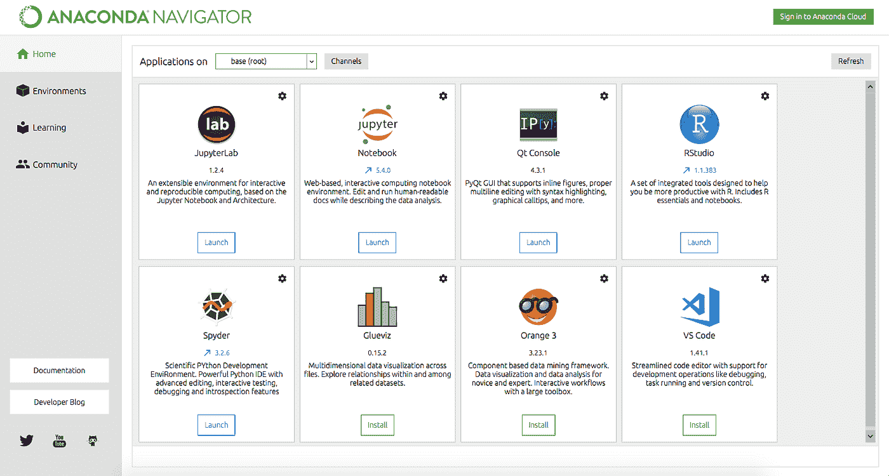

巨蟒领航员

## Jupyter 笔记本

现在让我们来看看 Jupyter 笔记本。其余的我们可以暂时忘掉。让我们打开 Jupyter 笔记本，你会看到下面的屏幕:

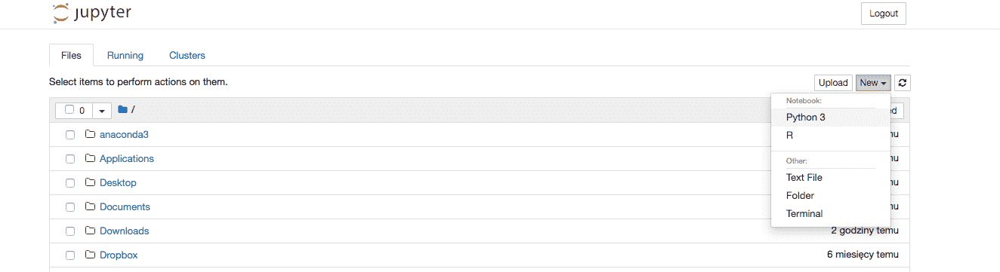

Jupyter 笔记本

点击右上角的 New 并选择 Python3。你会明白的

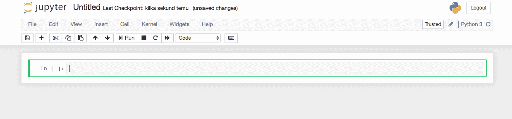

Jupyter 笔记本

还有…你可以走了！这是一个命令行，在这里您可以开始用 Python 编写代码，然后通过单击 Run 来执行。

Jupyter 笔记本是一种非常方便的编写代码和记录不同实验的方式。它不太适合较大的项目，但对于用数据运行快速实验或训练神经网络来说，它是完美的。

您通常通过“导入…”来导入包/库。包是现成的代码片段，让您不必自己编写所有内容，从而节省时间。所有东西都有包装:

*   导入数据(json)
*   处理数据(熊猫、NumPy)
*   文本分析
*   神经网络(Keras、PyTorch、Tensorflow)
*   可视化(破折号)

因此，通常情况下，在您自己做任何事情之前，您应该检查是否已经有相关的软件包可用。当然，有时候你会想自己动手，只是为了学习。

最后，JupyterLab 也是一个很棒的工具，它基本上只是一种同时管理多个 Jupyter 笔记本的方法，因此如果你想组织你的代码，它非常有用。

现在，您已经拥有了用 Python 编写第一个数据科学实验所需的一切。

# 3.线性代数与统计

现在我们要复习数据科学所需的数学。

## 数据科学线性代数

线性代数是关于向量和矩阵的操作。这既是符号，也是操纵对象的有用方式。Vector 的核心就是写在一列(或一行)中的一组数字:

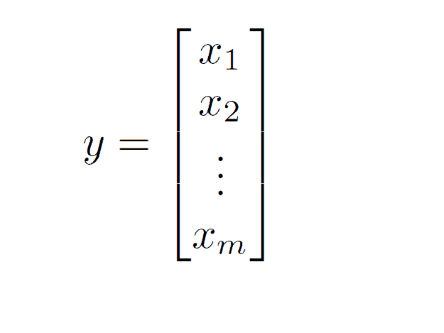

矢量

您可以对向量执行类似加法的运算，方法是将各个项相加，它们需要具有相同的长度。你可以用一个标量乘以一个向量，这个标量是一个实数，通过把每个条目乘以这个实数。

现在，向量通常被认为是在某个更大的空间中，例如像平面上的[1，2]，在那里它们表示坐标。突然间一切变得非常直观。此外，很明显，你可以测量向量之间的距离(平面上两点之间的距离)或尝试计算两个向量之间的角度。

当你把数据写成向量，然后对它们进行运算以测量它们时，这在数据科学中非常有用。线性代数方法是必要的。

向量概括为矩阵，n 乘 m 的阵列，其具有以行和列书写的 n 乘 m 个条目:

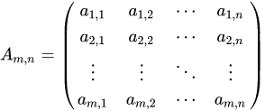

[数]矩阵

同样，您可以添加相同形状的矩阵，将它们乘以一个标量，并执行其他操作。例如，您可以将某些兼容形状的矩阵相乘。这对于数据科学中的许多应用来说是至关重要的，所以在进一步学习之前，你一定要练习乘法矩阵。

这就是你从线性代数开始所需要的。从某种意义上来说，张量是矩阵向更高维度的推广，值得一读。

## 统计数字

统计学是关于数据的收集、组织、显示、分析、解释和呈现。这需要将概率与理论结合起来，因为你需要通过从某些分布中取样来对未知数据建模。

重要的概念是方差和偏差。关注维基百科:

*   偏差误差是来自学习算法中错误假设的误差。高偏差会导致算法错过特征和目标输出之间的相关关系(欠拟合)。
*   方差是对训练集中的小波动的敏感性的误差。高方差会导致算法模拟训练数据中的随机噪声，而不是预期的输出(过拟合)。

换句话说，偏差与样本数据相对于整个数据集太小有关，而方差则与过于关注数据中的每个微小变化有关。这两个概念之间有一个权衡，通常情况下，我们用多大的偏差换取多大的方差。

为了开始操作机器学习模型，您需要学习概率论的基础知识，例如

*   随机变量
*   条件概率
*   朴素贝叶斯定理

这些概念对于理解数据科学和机器学习背后的基础数学至关重要。学习它们的最好方法是做几个练习，计算特定情况下的实际概率和矩阵。网上有大量的书籍和资料，所以我不会在这里复制。

# 4.处理数据

最后用 Python 做点有数据的事情吧。我将回顾处理数据的基本技术。你如何储存信息？我们已经知道我们想要用向量和矩阵来表示我们的数据。

## 导入数据

我们可以从导入文件开始。你的电脑上可能已经有了

*   短信
*   Excel 电子表格
*   jsons
*   XML
*   战斗支援车

你可以把它输入到 Jupyter 笔记本电脑中。

大部分是通过“open (…)”完成的，例如:

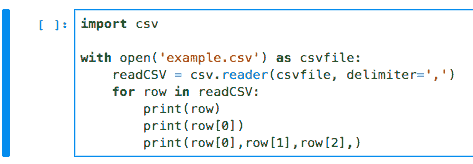

在 Python 中打开 CSV

看看 [Python 编程](https://pythonprogramming.net/reading-csv-files-python-3/)或者[真正的 Python](https://realpython.com/python-csv/) 来了解更多。

其他形式的文件也是如此。

我们已经知道，我们希望以数组(矩阵、向量)的形式表示数据，所以让我们看看如何用 Python 来实现。

## 存储数据

现在的问题是如何储存它们。有几种标准的方法可以做到这一点。

Numpy 数组是一种表示数组的简单方法，NumPy 是进行数据科学的最佳库之一。请看这里的[官方文件](https://docs.scipy.org/doc/numpy/user/index.html)。如果你想定义一个向量[1，2，3]，这里有一段 Jupyter 笔记本的摘录:

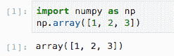

NumPy 数组是一个伟大的数据科学工具

又快又简单，对吧？

Pandas 是一个开源的、BSD 许可的库，提供高性能、易于使用的数据结构和数据分析工具。

DataFrame 是一种电子表格格式，是 Pandas 的一部分，也允许处理数据。这个例子展示了如何使用它来创建一个简单的电子表格:

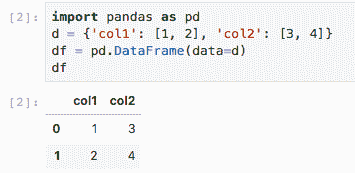

数据科学的熊猫数据框架

它真的很高效，用起来也很棒，特别是如果你以前广泛使用过 Excel，这一切都会非常熟悉。

除了这两个非常高效的包之外，Python 本身也提供了过多的数据结构。[看看这里有多少个](https://docs.python.org/3/tutorial/datastructures.html)。举几个在处理数据时很方便的例子:

*   列表
*   字典
*   元组

最好的学习方法就是摆弄它，所以现在就打开你的 Jupyter 笔记本吧！

# 5.获取数据

数据对于做数据科学至关重要。为了开始使用它，我们通常必须先清洗它。我们来讨论一下怎么做。

如果你的电脑上没有任何有趣的数据，那么最好的方法就是从网上搜集信息。用 Python 处理像'[请求](https://pypi.org/project/requests/2.7.0/)'和'[漂亮的声音](https://pypi.org/project/beautifulsoup4/)'这样的包(清理数据)非常容易。

大多数网站很容易使用请求，这只是一个清理问题。

## 用于数据科学的抓取 web

你可以从网上下载有用的数据。我们生活在数字世界，几乎任何东西都可以在网上找到。大多数数据可以通过抓取从不同的网站获取。这种获取数据的方式非常令人满意，但需要时间，因为您必须一路清理 HTML 代码。

尤其是财务数据非常容易获得。你可以用像 Pandas DataFrames 和 NumPy 数组这样的工具来分析它，我们在上一篇文章中已经讨论过了。

假设你想从纳斯达克获取信息。使用 GET，您可以立即获得 HTML 代码:

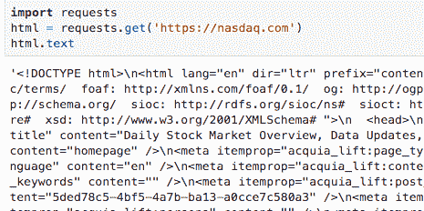

请求 Python 用于数据科学

然而，正如你所看到的，这是远远不可读的。下一步将是使用 BeautifulSoup 使其变得漂亮:

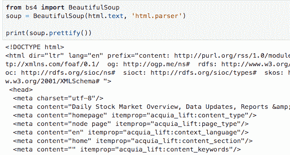

数据科学的美丽小组

这是更具可读性，但你仍然需要投入工作，从中提取一些信息。这是一个很好的开始方式。

查看 [BeautifulSoup 文档](https://www.crummy.com/software/BeautifulSoup/bs4/doc/)了解更多详情。

搜集很棒，因为你可以通过研究更多关于你的爱好的信息来学习数据科学。比如说，如果你喜欢视频游戏，并且想要分析不同的统计数据，那么抓取是最好的选择。您将了解更多您感兴趣的特定网站。

## 互联网上可用的数据集

获取数据的另一种方法是访问已经准备好的数据集。这方面的例子数不胜数，我在这里只讨论一些主要的数据集。

古腾堡计划是下载书籍的一个很好的来源。您可以访问版权过期的旧书。想想莎士比亚。

[Twitter API](https://developer.twitter.com/) 是另一个奇妙的来源。注册一个开发者账户，然后你就可以开始玩自动化了。例如，你可以提取关于一个标签的数据，以及人们对最近事件的反应。这对于社会科学或市场营销的研究尤其重要。

[Kaggle](https://www.kaggle.com/) 是数据科学竞赛的绝佳资源，也是现成的数据集的绝佳资源，你可以从他们的网站上直接免费下载。大公司经常在那里宣布他们的竞争，所以你会看到在更广泛的数据科学社区中有什么有趣的东西。

## 为数据科学建立数据集

除此之外，还有一堆数据集用于对机器学习模型进行基准测试。我不会在此详述，但我想向您介绍几个值得了解的例子:

*   MNIST——手写数字的数据集
*   [CIFAR-10](http://www.cs.toronto.edu/~kriz/cifar.html)–10 类 60，000 张图像
*   [ImageNet](http://www.image-net.org/) —根据 WordNet 层次结构组织的图像数据库
*   [IMDB 评论](http://ai.stanford.edu/~amaas/data/sentiment/) —来自 IMDB 的电影评论数据集
*   维基百科——巨大的文本资源

这就是这节课的全部内容。现在是时候打开你的 Jupyter 笔记本，玩你最喜欢的数据集了。

实践永远是学习数据科学的最佳途径。

# 6.分类和监督学习

我们已经学习了存储数据和从哪里获取数据。现在让我们来看看数据分类的标准技术，这是数据科学的基本应用。

## 什么是监督学习

假设您有贴有标签的数据。想想有描述的动物图像，不管是猫还是狗(分类问题)。另一个例子是关于电子商务中客户的数据，包括年龄组、职业、过去购物(回归问题)。监督学习处理这种类型的问题，其中你将标签附加到数据上，以便你可以使用这些标签作为指导来“监督”你的算法的学习过程。

[分类](https://en.wikipedia.org/wiki/Statistical_classification)是根据包含标签已知的对象的训练数据集，识别新对象属于哪个标签(类别)的问题。例子是将给定的电子邮件分配到“垃圾邮件”或“非垃圾邮件”类别，以及基于观察到的患者特征给给定的患者分配诊断。

[回归](https://en.wikipedia.org/wiki/Regression_analysis)是基于其他特征或变量估计一个值(“连续标签”)的统计过程。

## 分类和回归算法

[K 近邻(KNN)](https://en.wikipedia.org/wiki/K-nearest_neighbors_algorithm) 是分类和回归的最标准例子。我们正在寻找与我们开始的给定例子最接近的物体，并基于此贴上标签。k 代表我们正在寻找的一些邻居。[看看 KNN 的这个实现，当 K=2 时，使用 sklearn](https://scikit-learn.org/stable/modules/neighbors.html) ，这里我们要理解平面上的 6 个点:

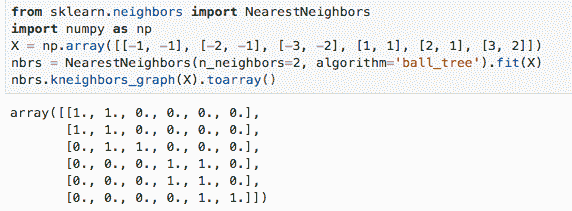

KNN 与 sklearn

朴素贝叶斯是一种标准的方法。您简化了一种情况，并假设数据中的动作/对象是独立的(在概率意义上)，因此您可以使用贝叶斯定理计算概率。形式上,“朴素贝叶斯”方法是一组基于应用贝叶斯定理的监督学习算法，其“朴素”假设是给定类变量值的每对特征之间的条件独立性。[您可以再次使用 sk learn](https://scikit-learn.org/stable/modules/naive_bayes.html)来实现它，例如，在本例中，使用标准虹膜数据集，并使用正态分布(GaussianNB)来模拟条件概率:

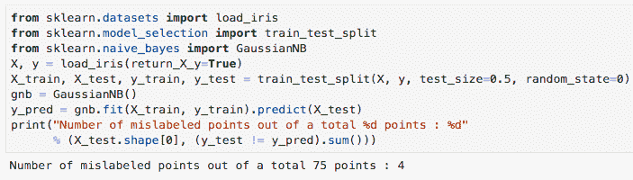

带 sklearn 的朴素贝叶斯

当您试图预测标签的精确值时，会使用回归。所以这是一个分类问题的连续变体。这对于试图根据生活在一个人附近的人来确定他的收入来说是完美的。

线性回归是最简单的，即假设您的数据可以用线性函数来建模。有太多的回归模型是基于不同的函数，最流行的是 sigmoid 和 ReLu(修正的线性函数)。

同样，使用 sklearn 很容易实现线性回归。看看这篇教程，了解如何在 Python 中使用[线性回归。](/a-beginners-guide-to-linear-regression-in-python-with-scikit-learn-83a8f7ae2b4f)

另一种分类技术是决策树，在这种分类技术中，您可以尝试使用问答格式的数据，如:

*   这个人住在公寓还是房子里？
*   这个人三十多了吗？
*   这个人有孩子吗？

树可以自动生成。例如，您可以使用 sklearn 构建一个简单的决策树，将[平面分成两个区域:](https://scikit-learn.org/stable/modules/tree.html)

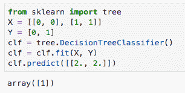

使用 sklearn 的决策树

构建树很棒，因为这样你就可以通过投票将几棵树连接成一个更大的模型。考虑每个决策树的决策，并且对所有决策进行加权(在最简单的情况下是算术平均)。这种方法被称为集成学习。

## 更高级的算法

[XGBoost](https://xgboost.readthedocs.io/en/latest/) 是另一种标准技术，值得一读。[官方文档写着](https://xgboost.readthedocs.io/en/latest/):“XGBoost 是一个优化的分布式梯度增强库，旨在高效、灵活和可移植。它在梯度推进框架下实现机器学习算法。XGBoost 提供了一种并行的树提升(也称为 GBDT，GBM ),可以快速准确地解决许多数据科学问题。相同的代码运行在主要的分布式环境(Hadoop、SGE、MPI)上，可以解决超过数十亿个例子的问题。”您可以将 XGBoost 视为更高级的决策树。

当涉及到监督学习时，神经网络通常是最终的工具。你建立了一个能够根据过去的例子学习标签的架构。我很快会谈到它们，但首先我会解释当你没有先验标签时该做什么，这就是如何进行无监督学习或聚类。

# 7.聚类和无监督学习

我们学习了监督学习，以及当您有一个带有标注的数据集时该做什么。现在让我们看看没有提供标签的数据集，谈谈无监督学习。

## 什么是无监督学习

假设我们有原始数据，如与营销相关的社会统计数据。例如，您试图了解谁在您的电子商务网站上购买了 MacBook，并且您希望找到相似的人。或者你正在通过一个在线平台卖票，你试着把你的客户分成不同的类别，这样你就可以向每一组传达一致的信息。

为了聚类数据或把你的数据分成不同的类别(这不是事先给定的！)，你必须使用一种聚类算法。sklearn 将再次提供帮助。让我们用一个来自 sklearn 的代码示例来回顾两个基本方法。

## 数据科学中的聚类方法

k-means 是聚类中的基本技术。这里的“K”代表您想要的集群数量。这是任意的，你选择这个参数，但是有一些方法([见肘方法的例子](https://en.wikipedia.org/wiki/Elbow_method_(clustering)))，在这里你可以自动推断出最佳的聚类数。你可以使用 sklearn 将著名的虹膜数据集分组。[例如，这将是 3 个集群](https://scikit-learn.org/stable/auto_examples/cluster/plot_cluster_iris.html)的结果:

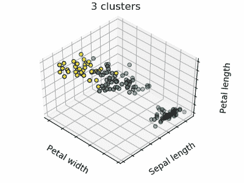

k 均值聚类

如果你想让[成为一个简单的 k-means 用例](https://scikit-learn.org/stable/modules/generated/sklearn.cluster.KMeans.html)，那么你可以简单地将平面上的点分成 2 组。

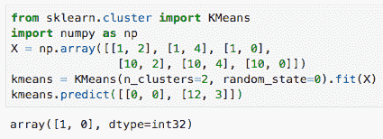

sklearn k-means

k-means 和其他技术的关键是有一个度量，即一个明确定义的距离，通过它我们可以测量数据集中对象的相似程度。在大多数来自电子表格的实际数据中，度量很容易定义，我们只需要空间中向量之间的通常距离，因为数据是纯数字的。当然，你可以让它变得更复杂，特别是如果你的数据有噪音或者你试图提取真正隐含的数据，但是你不需要考虑例如如何将一个单词嵌入向量空间。

另一种数据聚类算法是基于密度的带噪声应用空间聚类，简称 DBSCAN。[跟随 sk learn](https://scikit-learn.org/stable/modules/clustering.html#dbscan):“DBS can 算法将集群视为由低密度区域分隔的高密度区域。由于这种相当一般的观点，由 DBSCAN 发现的聚类可以是任何形状，这与假设聚类是凸形的 k-means 相反。DBSCAN 的核心部分是岩心样本的概念，岩心样本是位于高密度区域的样本。因此，聚类是一组彼此靠近的核心样本(通过某种距离度量来测量)和一组靠近核心样本的非核心样本(但它们本身不是核心样本)。”这也是标准技术之一，乍听起来可能很复杂，但原理很简单:

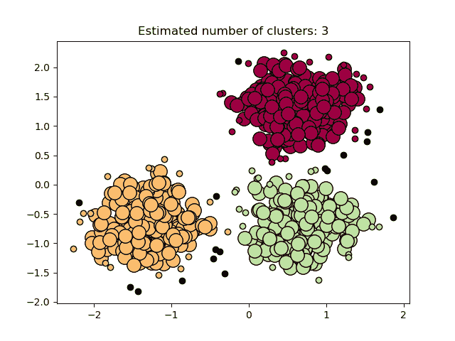

DBSCAN 正在运行

如果你想知道如何在一个例子上实现 DBSCAN，[看看这里的信用卡数据集](https://www.geeksforgeeks.org/implementing-dbscan-algorithm-using-sklearn/)和一个简短的教程。

## 数据科学是实用的

最好的学习方法是实践，所以我强烈建议你现在打开你的 Jupyter 笔记本，继续 [Kaggle](http://kaggle.com/) 搜索一个你可以在实验中使用的数据库。上面的例子中有很好的数据集:

*   信用卡数据
*   虹膜数据集
*   平面上的点

你还可以在网上找到大量其他现成的数据集，包括干净的和原始的。

聚类经常出现在自然界中，如果你要为一个更大的组织工作，比如银行或保险公司，你肯定会用到它。你试图将未标记的数据归入可以解释的类别，这是很自然的。然后，如果你设法通过聚类来建立类别，当你试图把新的对象放入已经存在的来自聚类的组中时，你将回到新数据的分类问题。

归根结底，数据科学就是分类、聚类并从中提取信息。只是需要时间去掌握。

# 8.神经网络

我们将讨论神经网络以及如何使用它们对数据进行分类。这将是对神经网络的一个温和的介绍，因为我假设你从未使用过它们。

## 什么是神经网络

神经网络从感知器开始，以人脑中的单个神经元为模型。你可以把它想象成一个接一个的函数。有了输入数据，然后应用一个激活函数，可以是线性函数、ReLu 或 sigmoid 函数或任何其他函数，然后将数据传递到下一个节点，并在给定节点再次应用激活函数。这一切都是分层进行的(这是更一般的前馈网络描述):

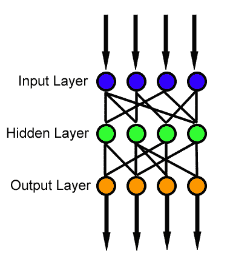

前馈神经网络

所以让我们从一个感知器的例子开始。我们看看它们是如何用 sklearn 实现的，然后我们切换到 [Keras](https://keras.io/) 框架。 [Keras](https://keras.io/) 是一个高级神经网络 API，用 Python 编写，能够运行在 TensorFlow 之上。 [TensorFlow](https://github.com/tensorflow/tensorflow) 是机器学习的端到端开源平台。它有一个全面、灵活的工具、库和社区资源生态系统，让研究人员推动 ML 的最新发展，开发人员轻松构建和部署 ML 驱动的应用程序。

这里有一个关于 sklearn 的简单例子，我们尝试使用感知器来拟合数字:

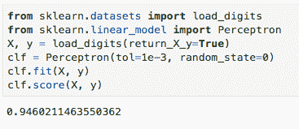

Sklearn 感知器神经网络

如你所见，代码简短而简单，但细节在数学中。在这一点上，你应该回到一些线性代数，以了解发生了什么。

以下段落更具技术性，但我尝试将所有术语放在一起(通过链接，您可以了解每个概念的更多信息):

形式上，[多层](https://en.wikipedia.org/wiki/Multilayer_perceptron)感知器是一类前馈神经网络。[前馈](https://en.wikipedia.org/wiki/Feedforward_neural_network)神经网络是其中节点之间的连接不形成循环的神经网络。[反向传播](https://en.wikipedia.org/wiki/Backpropagation)是一种用于训练监督学习的前馈神经网络的算法。反向传播针对单个输入/输出示例计算损失函数相对于网络权重的梯度。在这种情况下，理解[梯度下降](https://en.wikipedia.org/wiki/Gradient_descent)也很重要，这是一种用于寻找函数局部最小值的算法。

让我在这里指出，深度学习是机器学习，但我们使用至少 3 层神经网络的神经网络。

## Keras 中的神经网络

现在让我们回到例子。正如我提到的，Keras 和 Tensorflow 是目前最流行的机器学习框架，Keras 特别容易上手。当你建造连续的模型时，这有点像乐高。让我们来看看这个例子，再次看到[多层感知器这次是用 Keras](https://keras.io/getting-started/sequential-model-guide/) 建造的:

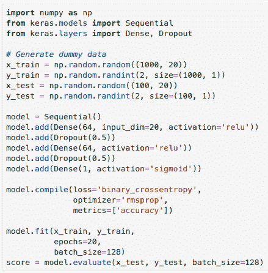

Keras 神经网络

我不会在此详述，但这里发生了什么:

1.  我们进口 Keras。
2.  我们生成一些随机数来训练一些数据，然后进行测试(X，y train/test)。
3.  我们建立了一个序列模型，但增加了 3 层。其中两个具有 ReLu 作为激活函数，最后一个具有 sigmoid。我们也使用 dropout，但我不会在这里讨论它，尽管它值得阅读更多。
4.  然后，我们对模型进行编译，使其适合我们的训练数据。
5.  我们根据测试数据对模型进行评估。

总而言之，这就是神经网络和机器学习的工作原理:

1.  通过导入包、框架和数据(用于训练和测试)来设置阶段。
2.  建立一个模型。
3.  使模型符合训练数据。
4.  根据测试数据评估模型。
5.  调整模型的参数，调整数据，重复。

由于数据科学是实用的，并且都是关于测试和尝试的，现在轮到你了。打开你的 Jupyter 笔记本，玩数据。我还推荐阅读如何将 Keras 用于 MNIST 数据集— [这里有一个很好的教程。](https://nextjournal.com/gkoehler/digit-recognition-with-keras)

# 9.降维

让我们来讨论一下如何减少数据中的一些维度，以便可以可视化和更好地理解。

## 主成分分析

假设您想要绘制数据，但您的数据有太多的维度，无法立即完成。降维来了。这些方法允许您只查看与您最相关的某些维度的信息。

标准技术是 PCA，即主成分分析，它着眼于特征向量(奇异值)并投影到那些捕获大部分数据的向量。例如，你可以把 4D 变换成 2D，通过投影到 2D 空间，由两个最大的奇异值构成。

[让我们看一个简单 PCA 的 sklearn 代码](https://scikit-learn.org/stable/modules/generated/sklearn.decomposition.PCA.html)与 NumPy 数组一起使用:

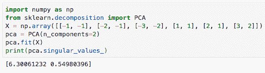

带 sklearn 的 PCA

这里我们只使用 2 个分量的 PCA，我们得到我们空间的奇异值。要真正理解发生了什么，您应该阅读一些资料:

*   [请看这里，了解 PCA 背后的奇异值和理论的详细讨论](https://intoli.com/blog/pca-and-svd/)。
*   另一个很好的资源是[这篇关于如何将 PCA 应用到虹膜数据集](https://www.math.umd.edu/~petersd/666/html/iris_pca.html)的文章。
*   你可以用主成分分析法把你的投影维数降低到最大奇异值。[看看如何用葡萄酒数据做这件事](/principal-component-analysis-for-dimensionality-reduction-115a3d157bad)。

## 数据科学中的降维

降维很重要，因为你想要去除不必要的数据，电子表格中不相关的列，以便以最有效的方式应用数据科学算法。较少的参数更容易控制和操作。

还有许多其他方法用于降维。更高级的包括例如流形学习。[流形学习](https://scikit-learn.org/stable/modules/manifold.html)是一种非线性降维方法。这项任务的算法是基于这样的想法，即许多数据集的维数只是人为的高。t-SNE 是流形学习中最著名的技术之一[你可以在 sklearn 文档中读到更多关于它的内容](https://scikit-learn.org/stable/modules/manifold.html#t-distributed-stochastic-neighbor-embedding-t-sne)。

总而言之，如何降低维度完全取决于您正在处理的数据。有时候，从一开始就很明显，为了获得更好的结果，应该忽略几列或几行。有时很难看出什么是真正重要的，然后你不得不尝试一些降维算法来解开数据和对象之间的依赖关系。

但这就是为什么数据科学是实用的——不摆弄数据就没有理解。

# 10.(英)可视化(= visualization)

最后，我将讨论如何展示一个数据科学项目，使其对他人具有吸引力和启发性。换句话说，让我们来谈谈观想。

## 如何在 Python 中可视化

我首先写道，一个记录良好的 Jupyter 笔记本非常适合可视化，特别是如果你想向有技术背景的人展示你的工作。当你为工作面试做测试题时，这通常是雇主期望你发出的。

否则，如果你与非技术人员交谈，你将需要更多的视觉方式来展示你所取得的成就，比如:

*   使用 plotly 或 matplotlib 绘制数据
*   [创建热图](https://plot.ly/python/heatmaps/)
*   在表格中显示统计数据

下面是一个使用 matplotlib 的简单绘图示例:

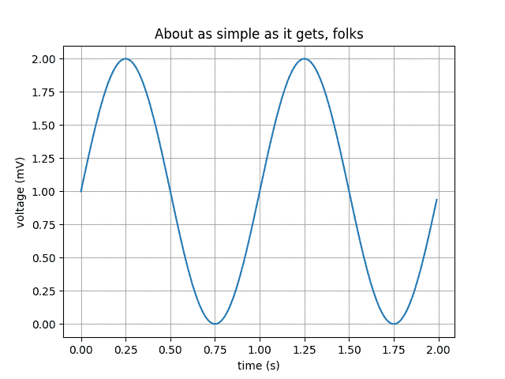

Matplotlib 图

它的代码是:

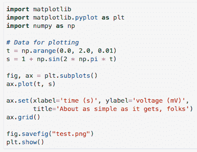

Python 中的 matplotlib

总的来说，你可以用 plotly 创造出令人惊奇的[。下面你可以找到一个来自 plotly 的可视化示例，全部用 Python 完成:](https://plot.ly/python/)

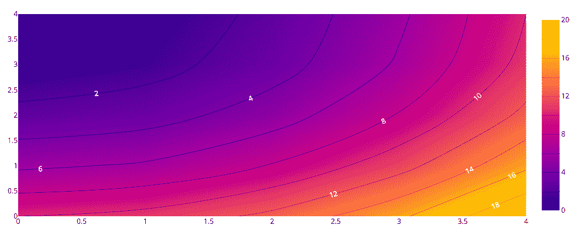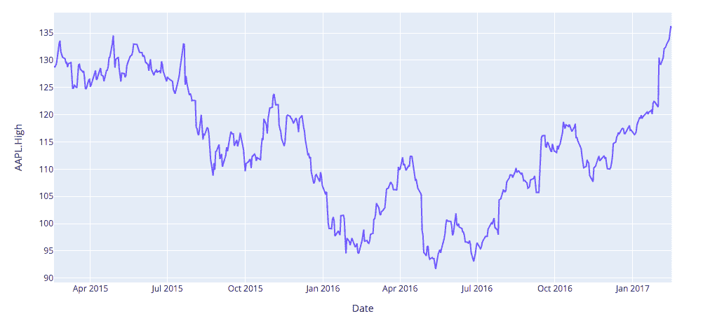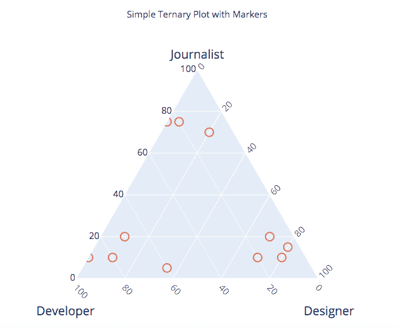

对 plotly 的良好掌握会让你做真正伟大的事情。

plotly 更进一步的是 plotly 的 [Dash](https://plot.ly/dash/) ，它允许你用 Python 构建网络应用。因此，向任何人展示真的很棒，无论是技术人员还是非技术人员。你可以在这里看看【Dash 有什么可能。例如，这个交互式仪表板是在 Dash 中完成的:

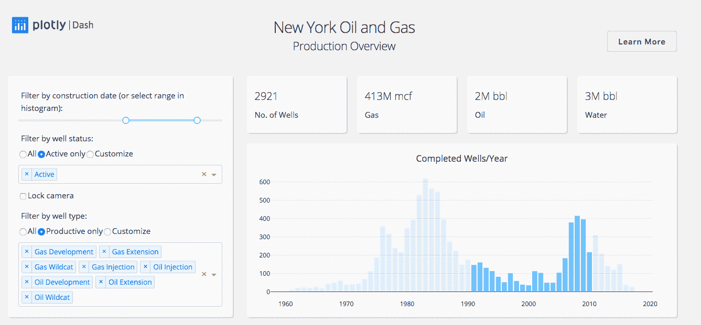

Python 中的仪表板

你可以在这里访问它。

如你所见，Python 为你可视化和展示你的作品提供了惊人的选择。现在轮到你在 Jupyter 笔记本上玩了。

## 分享你的开源项目

分享你的项目的最好方式肯定是 Github。上传您的代码和一份精心编写的文档，并与您的同事分享以获得反馈。当然，如果你在为一家公司工作，你不能真的这样做，但是如果你正在为你自己的开源项目工作，那么 Github 是一个分享你的工作的完美方式。数据科学有一个很棒的社区，所以你肯定会听到反馈并从其他人那里学到更多。

**这就是数据科学速成班的全部内容。**

我希望您喜欢它，并学到了有用的东西，现在您已经准备好解决一些数据科学问题了。

请在评论中告诉我你的反馈，以及你将来还想学习什么。

**祝您的数据科学之旅好运！**

*P.S .如果你想看* [*本课程的视频版本，可以看看我的 YouTube 频道*](https://www.youtube.com/channel/UCEq0oQsS-voRnSWbcviIDGA?sub_confirmation=1) *:*

YouTube 上的数据科学速成班

*附言:如果你想了解更多关于数据科学的知识，这里有一些我写的可能有用的文章:*

*   [2020 年你应该读的数据科学书籍](https://medium.com/me/stats/post/358f70e1d9b2?source=main_stats_page)
*   [2020 年 Coursera 上的最佳数据科学课程](/best-data-science-courses-on-coursera-in-2020-f7de4ab414ff)
*   [成为数据科学家的实用指南](https://medium.com/me/stats/post/2483a5f83770?source=main_stats_page)
*   [成为数据科学家的完整指南](https://medium.com/me/stats/post/1e08bc54688d?source=main_stats_page)

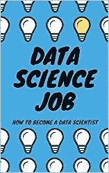

数据科学工作

最后，如果你想了解成为一名数据科学家意味着什么，那么看看我的书[数据科学工作:如何成为一名数据科学家](https://amzn.to/3aQVTjs)，它将指导你完成这个过程。

**谢谢大家的支持！**