# 深度线性回归

> 原文：<https://towardsdatascience.com/data-science-crash-course-in-depth-linear-regression-fd06511f586c?source=collection_archive---------25----------------------->

## 数据科学速成班

## 从线性回归开始理解算法。

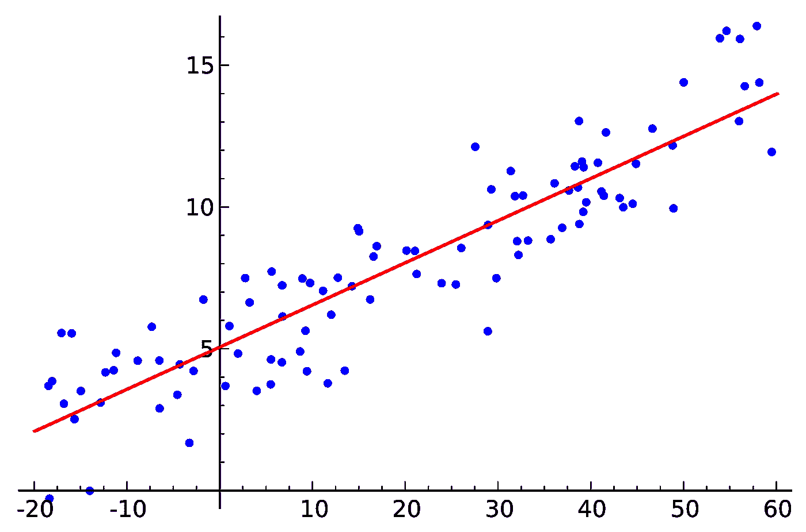

“随机数据点及其线性回归”——摘自维基百科

本月早些时候， [Edward Qian](https://medium.com/u/9ab35c11801?source=post_page-----49cfc5ed9136----------------------) 和我开始为有抱负的数据科学家编写一套综合课程，这些课程可以在我们的网站【www.dscrashcourse.com】上找到

我将把稍加修改的课程交叉发布到 Medium 上，让更多的观众可以看到。如果你觉得这些文章很有帮助，请到网站上查看更多的课程和练习题！

算法是计算机解决特定问题时可以遵循的一组规则。在建模的背景下，每种算法将使用不同的方法来获得最能代表目标变量的函数。回想一下，回归算法探索了自变量和一个*连续*因变量之间的关系。

# 线性回归

线性回归对因变量和至少一个自变量/解释变量之间的线性关系进行建模。有一个解释变量的线性回归模型称为**简单线性回归**，而有多个变量的线性回归模型称为**多元线性回归**。

当对训练集进行拟合时，线性回归模型估计未知参数，以量化自变量的线性变化对平均因变量的影响。

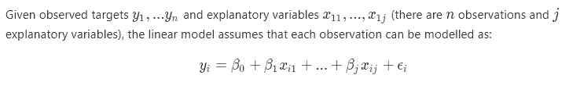

系数

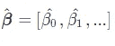

是估计的参数。有了这些系数，只要我们知道解释变量，我们就可以估计未来观测值。

*ϵ* (读作ε)是**误差**项，也称为**残差**。误差是真实目标变量和预测目标变量之间的差异。

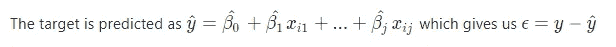

# 系数是如何计算的？

简而言之，我们选择“最佳”系数来最小化误差项。

做这件事有几种不同的方法。标准方法之一是使用**普通最小二乘估计** (OLS)方法。OLS 方法做了几个假设:

*   可以使用线性关系对数据进行建模，类似于上面所示的形式
*   误差项 *ϵ* 是独立同分布的，总体均值为零
*   误差项的方差必须是常数；它不能是目标的函数
*   独立变量与误差项不相关，也彼此不相关
*   理想情况下，误差项应该是正态分布的——这使我们能够可靠地计算置信区间

在这些假设下，我们可以构建一个封闭形式的公式来计算使误差项最小的系数。

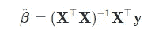

推导从一个目标开始:最小化残差平方和。

回想一下，我们可以将误差度量为**y**—**X*β***

误差平方和可以定义为系数的函数。在矩阵符号中:

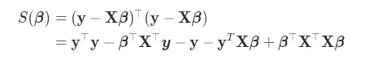

函数 *S* 使用我们的 beta 参数计算误差平方和。

这是 *β* 的二次函数，所以如果我们对 *β* 求导就能找到全局最小值。然后我们可以通过将β设为 0 来求解^。

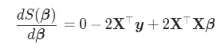

将左侧设置为零。我们的 OLS 假设允许我们假设 **X** 具有满列秩，这使得 **X** ⊤ **X** 可逆。

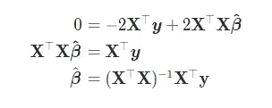

# 模型解释

线性回归的简单性是一把双刃剑。线性模型非常容易解释和理解，但也是对现实世界复杂性的简化。大多数数据集也会违反 OLS 方法的假设。

**模型解读**的重要性不可小觑。能够解释系数使我们能够使用模型来推动业务战略，量化我们努力的效果，并给予利益相关者对我们算法的信任。

我们用一个例子来演示一下。房地产经纪人吉姆训练了一个线性回归模型来预测房价，作为平方英尺和年龄的函数。让 *y* 代表房子的价格， *x* 1 代表平方英尺， *x* 2 代表以年为单位的年龄。

他使用上述公式计算系数，并得出他用来预测 house 的公式:

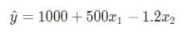

吉姆的模型告诉了我们很多关于房价的信息:

*   平方英尺每增加一个单位，平均房价就会增加 500 美元
*   房龄每增加一个单位，平均房价就会下降 1.2 美元

这些信息可以用来提高房屋的估价。现实并非如此简单，但如果增加一平方英尺的额外空间只需要 200 美元，难道你不想增加房子的面积来卖个更高的价钱吗？

# 关注交互效应和分类变量

吉姆意识到体型和年龄之间的交互作用非常重要。他补充说，作为一个预测，并重新训练他的模型。他的新公式变成了:

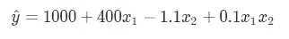

Jim 决定将房屋类型作为预测因素纳入他的模型。每栋房子要么是联排别墅，半独立式或独立式住宅。他决定将这些视为分类变量。

新模型将利用这些额外的预测因素:

*   *x* 3 : 1 如果房子是联排别墅，否则为 0
*   如果房子是半独立式的，x 4 : 1，否则为 0
*   *x* 5 : 1 如果房子是独立式的，否则为 0

这再次扩大了他的公式:

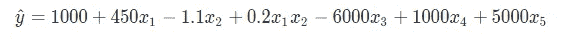

这告诉我们，在其他条件相同的情况下，独立式住宅比半独立式住宅平均贵 4000 美元，比联排别墅贵 11000 美元。

# 线性回归的常见陷阱

*   **多重共线性**:独立变量可能高度相关，这违反了 OLS 假设(也许他们当年建造了更大的房子，让我们可以根据房屋年龄预测面积)
*   异方差性:非恒定方差也违反了 OLS 假设(也许，房子越老，价格的方差越大)

其他一些值得思考的趣闻:

*   我们的线性模型需要截距吗？(零岁没有平方的房子应该值 1000 美元吗？那还是房子吗？)
*   我们的目标变量的合理值范围是多少？房价当然不能是负的…

# 感谢您的阅读！

如果你喜欢这篇文章，可以看看我关于数据科学、数学和编程的其他文章。[通过 Medium](https://medium.com/@mandygu) 关注我的最新更新。😃

作为一个业余爱好项目，我还在[www.dscrashcourse.com](http://www.dscrashcourse.com/)建立了一套全面的**免费**数据科学课程和练习题。

如果你想支持我的写作，下次你报名参加 Coursera 课程时，可以考虑使用我的会员链接。完全公开—我从每一次注册中获得佣金，但不会对您产生额外费用。

再次感谢您的阅读！📕