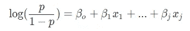
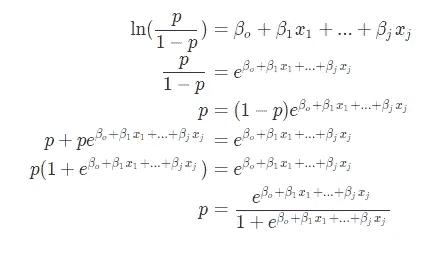
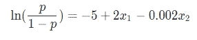
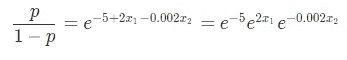
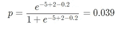

# 解释逻辑回归

> 原文：<https://towardsdatascience.com/data-science-crash-course-interpreting-logistic-regression-97fc0f40d06b?source=collection_archive---------57----------------------->

## 数据科学速成班

## 从逻辑回归开始理解**概率**模型

照片由[乔纳森·彼得森](https://unsplash.com/@grizzlybear?utm_source=unsplash&utm_medium=referral&utm_content=creditCopyText)在 [Unsplash](https://unsplash.com/s/photos/odds?utm_source=unsplash&utm_medium=referral&utm_content=creditCopyText) 上拍摄

本月早些时候， [Edward Qian](https://medium.com/u/9ab35c11801?source=post_page-----49cfc5ed9136----------------------) 和我开始为有抱负的数据科学家编写一套综合课程，这些课程可以在我们的网站[www.dscrashcourse.com](http://www.dscrashcourse.com/)上找到

我将把稍加修改的课程交叉发布到 Medium 上，让更多的观众可以看到。如果你觉得这些文章很有帮助，请到网站上查看更多的课程和练习题！

逻辑回归用于通过估计事件的对数概率来模拟事件发生的概率。如果我们假设对数赔率和独立变量 *j* 之间存在线性关系，那么我们可以将事件发生的概率 *p* 建模为:

您可能会注意到没有指定对数底数。对数的底数实际上并不重要——回想一下，如果我们将两边乘以 log*k*b，我们可以将底数 *b* 改为任何新的底数 *k*

这给了我们假设左手边的基础的灵活性。当然，基数会影响结果的解释以及系数值。

# 隔离概率

如果我们有对系数的估计，就很容易分离出*p。*注意 *p/(1-p)* 代表事件发生的*几率*。

我们将用另一个例子来说明解释。房地产经纪人 Jim 训练了一个逻辑回归模型来预测某人出价购买房子的可能性。他通过使用两个解释变量来保持模型的简单性:

*   1:潜在客户看房的次数
*   *x* 2:房子要价千元

在使用程序确定最佳系数后，Jim 为他的模型推导出这些系数:

吉姆的模型告诉我们:

*   预期买家每多参观一次房子，平均几率的自然对数就会增加 2
*   房价每增加 1000 美元，平均来说，赔率的自然对数减少 0.002

那…听起来很拗口，而且很难理解。我们可以用一个简单的技巧来提高口译水平。

我们可以计算出 *e* 的 2 次幂和-0.002 的值，以简化解释。

*   潜在买家每多参观一次房子，平均而言，出价的几率就会受到约 7.39 倍的乘数影响
*   房价每增加 1000 美元，平均而言，出价的几率会受到乘数 0.998 的影响

如果 Jim 的客户 Sue 有一次参观了一栋定价为 1，000，000 美元的房子，那么我们可以使用上面推导的公式来估计她购买该房子的概率。

这表明苏有大约 4%的机会出价买下这栋房子。

# 作为分类器

尽管是一个回归模型，逻辑回归经常用于分类。孤立概率总是在 0 和 1 之间。我们可以设置一个任意的阈值来预测观察值所属的类别。

我们还可以将逻辑回归扩展为两个以上类别的分类器，使其成为一个*多类别*分类器。我们可以通过采取*一对所有*的方法来做到这一点，在该方法中，我们训练与类别一样多的逻辑回归模型(每个模型预测一个类别发生的对数概率)，并采用产生最高概率的类别进行推断。

# 感谢您的阅读！

如果你喜欢这篇文章，你可能想看看我关于数据科学、数学和编程的其他文章。[通过 Medium](https://medium.com/@mandygu) 关注我的最新更新！