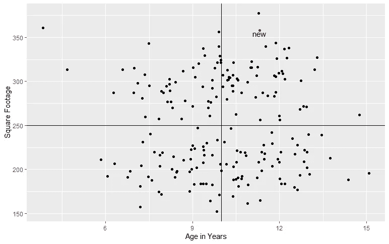
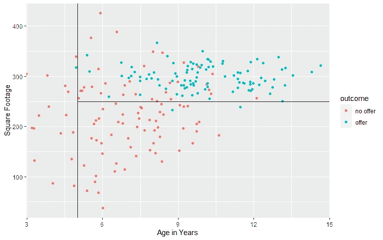

# 了解树木

> 原文：<https://towardsdatascience.com/data-science-crash-course-understanding-trees-60337f605448?source=collection_archive---------70----------------------->

## 数据科学速成班

## 了解用于分类和回归的基于树的模型

本月早些时候， [Edward Qian](https://medium.com/u/9ab35c11801?source=post_page-----49cfc5ed9136----------------------) 和我开始为有抱负的数据科学家编写一套综合课程，这些课程可以在我们的网站【www.dscrashcourse.com】上找到

我将把稍加修改的课程交叉发布到 Medium 上，让更多的观众可以看到。如果你觉得这些文章很有帮助，请到网站上查看更多的课程和练习题！

基于树的方法可用于回归和分类。这些算法背后的思想是将预测器空间分成多个不重叠的区域，并将新的观测值分配给它们各自的区域。这些方法也被称为**决策树方法**。

# 回归决策树

在将预测空间分成 *n* 个区域后，我们计算该区域中响应变量的统计量(例如，平均值)。新的预测将被放入它们各自的区域中，并且该区域的统计数据将被用作预测。

我们用房价的例子来说明一个例子。为了简单起见，我们假设最佳区域已经确定。房地产经纪人吉姆想尝试一种基于树的方法来预测房价。他用房子的面积和年龄作为预测指标。

Jim 的决策树将其预测器空间划分如下:

*   区域#1:面积小于 250 平方英尺，年龄小于 10 岁
*   区域#2:面积小于 250 平方英尺，年龄超过 10 年
*   区域#3:面积超过 250 平方英尺，年龄在 10 岁以下
*   区域#4:面积超过 250 平方英尺，年龄超过 10 年

吉姆想推断一栋新房子的价格(在图中用红色标出)。这所房子属于第四区。从训练集中观察到的区域 4 中房屋的平均价格是$125，000。因此，吉姆的模型会预测这个新房子会卖那么多。

# 分类决策树

用于分类的决策树的行为类似于回归。假设 Jim 决定使用相同的预测器(在不同的数据集上)来预测某人是否会出价购买房子。蓝色的观察值对应于那些提供报价的观察值，而红色的观察值对应于没有报价。该算法将预测器空间分成 *n* 个区域，并且每个区域被映射到一个类别。

Jim 的决策树将其预测器空间划分如下:

*   区域# 1:5 岁以下
*   区域#2:年龄超过 5 年，面积超过 250 平方英尺
*   区域#3:年龄超过 5 年，面积小于 250 平方英尺

假设算法也告诉我们，区域 2 和 3 映射到“offer”，而区域 1 映射到“no offer”。有了这些信息，我们可以预测随后的观测值将属于哪一类。

# 更复杂的基于树的方法

我们可以**集成**(组合)多个决策树来形成更复杂的模型。基于树的集成算法分为:

*   **Bagging** (也称为 **bootstrap aggregation** ):更小的数据子集是通过替换随机抽样产生的。在每个子集上训练决策树。来自每个决策树的结果被*平均*以产生最终输出。
*   **Boosting** :与 Bagging 不同，在 Bagging 中每个决策树都是独立训练的，Boosting 算法中的每个学习器都是从以前的学习器中顺序学习的。
*   **堆叠**:几个模型并行训练。另一个模型被训练以基于每个集合模型的预测来确定输出。这种集成技术在基于树的模型中并不常见。

## 装袋示例:随机森林

**随机森林**是一种流行的机器学习算法，使用 bagging 集成决策树。除了随机采样每棵树的训练数据之外，随机森林还随机采样用于每棵树的特征。

## Boosting 示例:使用决策树的 AdaBoost

**AdaBoost** 是 adaptive boosting 的缩写，在迭代过程中集成决策树:我们从数据集上训练的一个决策树开始，但在每个迭代步骤中，我们重新加权数据集，以更加强调错误分类，并在这个重新加权的数据集上重新训练决策树。

# 感谢您的阅读！

如果你喜欢这篇文章，你可能想看看我关于数据科学、数学和编程的其他文章。[关注我 Medium](https://medium.com/@mandygu) 上的最新更新！