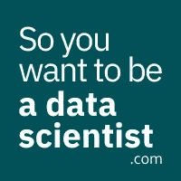

# 数据科学精英以及如何避免他们

> 原文：<https://towardsdatascience.com/data-science-elitists-and-how-to-avoid-them-b8888178e8c0?source=collection_archive---------35----------------------->

## 你需要掌握的知识能够区分互联网上有益的批评和不必要的负面信息。

克里斯汀娜·戈塔迪在 [Unsplash](https://unsplash.com/s/photos/regal?utm_source=unsplash&utm_medium=referral&utm_content=creditCopyText) 上的照片

互联网是一个可怕的地方。尤其是对于那些尝试新事物或转行的人。这里面有正确的信息也有错误的信息，有鼓励也有沮丧。对于数据科学来说尤其如此。成为一名数据科学家需要什么是一个有点争议的话题，许多人对此有非常强烈的看法。

具体来说，有一群人似乎只发出关于成为数据科学家的负面信息。我称他们为数据科学精英。他们倾向于认为，要成为一名数据科学家，你需要一个博士学位，你需要成为一名数学专家，你需要知道所有与数据相关的技术工具，以及你完美的计算机科学知识。不用说，我不同意他们的观点。在这篇文章中，我想告诉你为什么不认真对待数据科学精英，以及如何在成为数据科学家的过程中抵御消极因素。

首先，**当人们给你一长串技术技能时，你不应该当真。**数据科学家不是开发人员。是的，你需要学习一些技术工具，但其中许多并不是必需的，只是有了它们就好了。

此外，每个公司都有自己的技术栈，也就是他们使用的工具集。你申请的每家公司都有可能使用不同的技术，你不可能学会所有的技术。尤其是当你刚刚开始的时候，知道如何使用专业工具并不是首要任务。在播客第四集的[中，我和 Samantha Zeitlin(一名招聘高级数据科学家)讨论了这个问题。她提到，根据她的经验，你在工作中学习工具。](https://anchor.fm/misra-turp/episodes/4---A-senior-data-scientists-life-with-Samantha-Zeitlin-ecpha1)

当别人告诉你，你做不到，或者为时已晚时，你不应该当真。出于某种原因，有些人倾向于给人一种感觉，要么你现在就拥有这些技能，要么你就完蛋了。当我看到这样的评论时，这是我的脸:

每个人在某个时候都必须是初学者。没有必要让一个人因为没有这种或那种技能而感到难过。如果你想成为一名数据科学家，你可以，就这样。我就是这么想的。根据你的背景，这可能会花你或多或少的时间。这需要的时间可能也取决于你的财务要求，以及你是否能全职工作，但仅此而已。这并不是说每个人都适合成为数据科学家。当然，在深入学习之前，你应该理解这份工作的要求和含义。但是我一会儿会谈到这一点。

你应该半信半疑地接受人们的建议。除非有人是“让他人成为数据科学家”的教授，否则我怀疑他们对自己的工作是否客观。如果有人获得了数学博士学位，然后成为了一名数据科学家，那么听到他们说你需要一个博士学位或者你需要高级数学技能就不足为奇了。人们试图提供帮助，但对他们来说很难做到客观。因此，不要把一个人的建议放在心上，试着去阅读其他人对同一话题的看法。也许你想成为数据科学家的[播客](https://anchor.fm/misra-turp)可以帮到你。*眨眨眼*

当然，我不能告诉你应该留意数据科学精英的每一种方式。你必须自己发现错误的信息(或无用的信息)。我能做的就是告诉你如何学会只拿对你有用的东西。

这些是我在免费迷你课程《数据科学入门》中复习的内容。你可以用我的[网站](https://www.soyouwanttobeadatascientist.com/)上的表格注册。回到我们的话题。

**首先，也是最重要的一点，你需要对自己想要从事的数据职业类型有信心。如果你所拥有的只是对你认为你想做的事情的模糊解释，你将很容易被你所读到或听到的东西所操纵。当有人说，你需要成为一名优秀的开发人员才能成为数据科学家，你可能很难理解这到底是什么意思。了解数据管道，它需要哪种类型的开发，以及哪种类型的数据专家处理它的哪些部分将对你有所帮助。**

你需要对这门学科有很好的理解。人工智能、机器学习、自然语言处理、深度学习、认知解决方案、计算机视觉、机器人技术，还有更多你可能在互联网上看到的东西，这些都与数据科学密切相关。但是它们之间有什么关系呢？要称自己为数据科学家，您需要了解多少？乍一看，这似乎很难理解，但如果你对数据科学运作的学科有一个很好的总体了解，你就不太容易受到干扰，对自己的道路更有把握。

**最后，你需要了解数据科学的核心要求和基本技能。**你可以在基本技能的基础上再接再厉，专攻某个领域，但不是没有坚实的基础。尽管如此，即使在你专注于基本技能之后，知道以什么样的顺序去解决和学习它们也是有帮助的。我称之为技能矩阵。了解所需的技能，学习它们的顺序，并清楚它们如何有助于你的学习，这将使你在竞争中领先。

在数据科学入门迷你课程中，我帮助你选择数据职业并对其充满信心，解释人工智能的学科以及数据科学和其他流行词汇如何适应这种情况，解释数据科学管道，并谈论成为数据科学家所需的必备技能。这是一门免费课程，你可以使用[我的网站](https://www.soyouwanttobeadatascientist.com/)中的表格报名参加。

毕竟，在学习数据科学的同时，保持 it 的高效和智能是您的责任。用正确的观点武装自己，没有什么能阻挡你。

您是否打算转行从事数据科学职业，但不确定从哪里开始？通过我的网站免费参加我的数据科学入门课程。

本课程旨在帮助您:

*   阐明您的数据职业目标，
*   明白努力的方向，
*   了解必要的技能，
*   在您的学习旅程中做出明智的决定

此外，我每周发表文章、采访数据专业人员和免费资源，以帮助专业人员有效地将他们的职业生涯转向数据科学。如果你对你需要学习的东西感到迷茫，对所有声称自己是最好的课程感到困惑，觉得没有一门课程对你的目的来说足够完整，我的网站就是为你准备的。