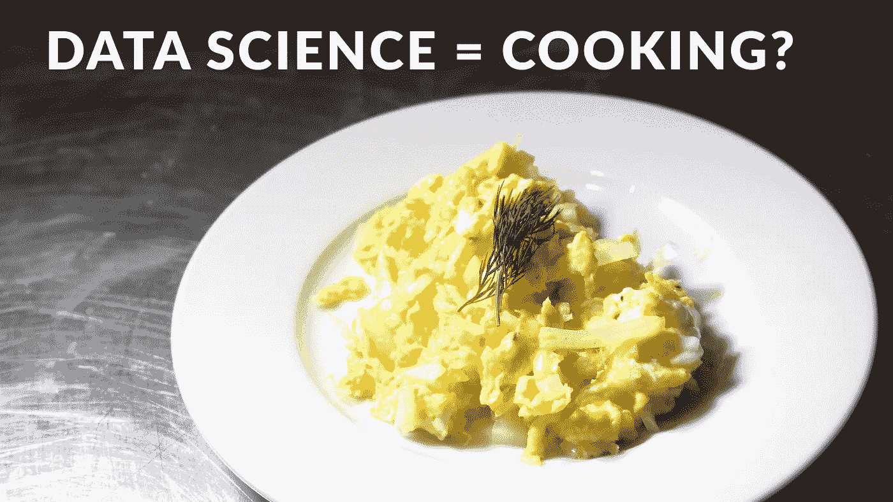

# 数据科学用…做饭来解释？

> 原文：<https://towardsdatascience.com/data-science-explained-with-cooking-1a801731d749?source=collection_archive---------22----------------------->

## 你从未意识到的惊人的相似之处

数据科学和烹饪是我的两大爱好。在做了这两方面的大量工作后，我发现这两个领域有大量的共同点。制作新菜肴的过程几乎直接反映了数据科学项目的生命周期。随着时间的推移，我开始用烹饪/数据科学的类比向那些不在这个领域工作的人解释我的工作。

## 假设品尝

当厨师开始做一道新菜时，他必须了解当前菜单缺少什么。他需要弄清楚什么样的盘子可以完成选择或者替换掉被移走的盘子。

作为数据科学家，我们也需要从一个问题开始。通常是通过商业理解。我们需要找出哪些机会可以为我们的组织创造最大的价值。

## 成分=数据

在厨师决定了他想做什么类型的菜后，他去冰箱收集配料。如果他没有必要的原料，他会去商店收集。

作为数据科学家，我们的数据点就是我们的配料。我们手头可能有一些，但我们可能还需要通过网络抓取、SQL 查询等收集更多。

就像原材料一样，数据本身通常不是很有用。一旦我们结合了我们的数据并对其进行分析，我们最终会发现它的真正价值。盐本身一般不会被消耗掉，但是几乎每一餐都少不了它。

## 清洗你的食物和数据

食物可能会被灰尘、杀虫剂或其他有害物质覆盖。重要的是在食用前清洗配料，以避免不良味道和疾病。

这对我们清理数据也很重要。质量差的“脏”数据会给我们的模型带来灾难性的结果。诚然，我们清理数据的方式与厨师清理蔬菜的方式略有不同。我们需要专注于清理数据类型、输入空值和移除异常值。

## 风味工程

有时，厨师需要在将食材放入菜肴之前调整它们的成分。在烹饪之前，他们敲碎鸡蛋，切洋葱，切肉。

这一过程与数据科学中的特征工程非常相似。有时，我们需要更改数据，以便为我们的模型产生最佳结果。我们可以对数据进行分组、缩放、编码或转换。这些变化有助于提高我们输出的可解释性和准确性。

## 品尝和探索

当从头开始烹饪时，大多数厨师边做边品尝食物。他们需要了解每种配料的味道，以及这些配料混合在一起的味道。在理解了这些关系之后，他们将能够决定在最后一餐中包含哪些配料。

对于数据科学家来说，在构建模型之前探索我们的数据也很重要。我们必须了解变量之间的关系，以避免多重共线性(在某些模型中)。

## Sous Vide =深度学习？

在厨师准备好配料后，就该选择如何烹饪了。有许多烹饪选择，他可以选择烤，烤，煮，嫩煎，烧烤，腌制…你明白了。根据他做的菜，他可能知道这些选项中哪一个会产生最好的结果。

这与我们的模型选择没有什么不同。根据我们试图解决的问题(回归、分类或聚类)，我们知道哪些模型可能是最好的，但我们仍然必须从那里缩小范围。我们最感兴趣的是尝试其中的几种，看看哪一种能产生最好的结果。

## 调整你的烤箱

厨师一旦选择了烹饪介质，就不会善罢甘休。他们还必须弄清楚要煮多久，在什么温度下煮。这些变量是这顿饭成功的关键。

这与机器学习模型的模型调整过程非常相似。我们必须对我们的算法进行一些调整，以确保我们得到最好的结果。不幸的是，我不认为有烹饪方法的 gridsearch 还没有。

## 美味交叉验证

我们的厨师已经做好了他的饭，但是他还没有做完！他需要检查结果。他想确定不只是他觉得好吃。让厨房里的其他厨师品尝这道菜对他来说很重要。如果他只迎合自己的口味，他的饭菜可能不会像他希望的那样有广泛的吸引力。

这很像数据科学中的交叉验证过程。我们希望确保我们的模型能够很好地推广，所以我们在新数据上测试它，并比较结果。

## 电镀艺术

如果食物符合可接受的标准，重要的是在上盘时使其具有吸引力。对食物进行电镀增加了厨师的客人的感官体验。

在数据科学中，我们必须向业务利益相关者解释我们的模型。我们必须产生美丽的视觉效果，增加对我们工作的理解。

电镀和数据可视化都可以被认为是他们自己的领域，因为他们有巨大的深度。

## 记录你的口味

最后，如果厨师喜欢这个结果，并且想要重现这顿饭，他需要写下一份食谱。他还应该培训厨房里的其他厨师来达到同样的效果。

对于数据科学家来说，记录我们的代码并构建系统来重复执行我们的模型是非常重要的。

在烹饪和数据科学中，再现性是长期成功的基础。

## 你的厨房应该是一个 API

经营餐馆时，对顾客来说，过程极其简单是很重要的。他们应该能够点一顿饭，而且饭菜应该始终如一地送到他们手中。他们不需要知道饭菜是怎么做的，厨师在做什么，甚至不需要知道厨房里发生了什么。

这就是模型 API 端点在数据科学中的工作方式。您应该能够向它发送请求(订单)，并获得可靠的响应(饭菜)，而不必担心香肠是如何制作的。