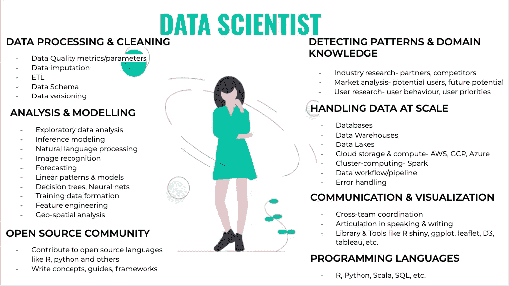

# 面向分析思维的数据科学|简介

> 原文：<https://towardsdatascience.com/data-science-for-analytical-minds-introduction-8900b8d2477f?source=collection_archive---------48----------------------->

你是这样的人吗:

*   学过统计学、计量经济学或数学的概念。
*   喜欢推理，创造疯狂的假设，发现你的概念或理论中的缺陷？
*   计划在数据科学领域开始职业生涯*或寻找加速数据科学职业生涯的方法？

如果是的话，那么你已经登陆了正确的 5 部分博客系列，它将为你提供从数据中获取真实生活价值所需的所有实用信息。

# 数据科学对我有意义吗？

我想是的。作为 Atlan 的经济学研究生和首席数据科学家，我将数据科学视为经济学和计算机科学的美丽产物，它吸取了双方的精华，形成了自己的形状和个性。

作为经济学家，我们被训练去理解和发现所有层次的模式——微观的和宏观的——以及跨越不同的领域，如发展经济学、农业经济学、环境经济学等等。我们接受过将这些模式转换成数学方程的培训，以便进行经验测试，并与相关的利益相关者交流结果。

数据科学家拥有训练有素的经济学家的专业知识、处理大数据的知识、高效利用计算机能力的诀窍以及扼杀所有可重复任务的工程态度。

如果你也觉得自己理解了数据科学的一些组成部分，并且对数字、模式和思维的分析很有一套，那么你可以很容易地在数据科学中为自己创造一个位置，就像我一样。:)

# 数据科学的职业前景如何？

来源:[艾登梅森](https://www.tvovermind.com/author/aidenmason/)，via: g [iphy](https://giphy.com/)

数据科学正在以新的创新迅速改变各种行业的面貌。在整个组织中，数据现在是一项核心职能，就像销售、营销或产品和设计一样。

任何采用数据科学的公司都比行业中的其他公司具有竞争优势，因为业务突然变得有能力获得大量知识、更快的学习和过程修正。根据金雅拓的 [2018 数据安全信心指数，89%的受访者知道，如果他们能够学会正确分析自己的信息，他们将拥有竞争优势。](https://safenet.gemalto.com/resources/data-protection/data-security-confidence-index-report-2018/)

在学术界，研究部门正在学习数据科学，并聘请专家来扩展他们的研究。[2018 年诺贝尔经济学奖获得者 Paul Romer](https://qz.com/1417145/economics-nobel-laureate-paul-romer-is-a-python-programming-convert/)从 STATA 和 Mathematica 转到 Python，以便能够受益于其处理海量和各种类型数据集的能力，并获得在开源社区分享其工作的机会。

选举正在利用数据科学的力量在世界各地进行竞争，无论是英国退出欧盟竞选还是剑桥分析公司(Cambridge Analytica)完成的美国竞选。

在世界范围内，这导致了对数据科学专业人员需求的激增。2019 年， [LinkedIn 将数据科学](https://blog.linkedin.com/2019/january/10/linkedins-most-promising-jobs-of-2019)选为最有前途的职业。

现有的供应无法满足所有这些需求。indeed 2019 年 1 月的报告显示，对数据科学家的需求同比增长 29%，自 2013 年以来增长 344%——这是一个戏剧性的增长。但是，尽管需求以职位发布的形式出现爆炸式增长，精通数据科学的求职者的[搜索增长速度较慢(14%)，这表明供需之间存在巨大且不断增长的差距。](https://searchcio.techtarget.com/news/450431431/Job-searches-reveal-top-skills-for-tech-positions)

# 数据科学家的一天是怎样的？

让我们举一个数据科学问题的例子来更好地理解这一点。

想象一下，你或你的公司得到了一笔资金，用于预测未来两年印度每个村庄和城镇的每月疟疾病例。

鉴于一系列因素可能导致或加速疟疾的发病率，您需要来自各种数据源的大量不同数据指标:气象信息卫星、村庄位置空间目录、道路网络等，医院目录、收入估计、卫生记录等 PDF 或 excel 格式的统计数据库。所有这些数据集都包含不同的数据类型、地理粒度和更新频率。

作为在职的数据科学家，您应该能够:

*   对问题陈述进行背景研究，并制定一个执行计划，考虑您和您的团队的有限时间表、资源和技能组合。
*   根据问题陈述，找到并整理映射到所需指标的正确数据集
*   处理和清理所有不同的数据类型，并将它们绑定在一起
*   进行解释性分析，为您的预测/预测模型找到正确的指标/特征。
*   建立适用于空间数据、时间序列数据以及横截面数据的模型。
*   编写一个脚本，该脚本可以在最少的人工干预下每月运行一次，完成所有步骤，包括数据源、数据清理、主数据库创建、运行预测模型
*   创建一个定期更新的可视化仪表板，以便相关利益相关者可以使用和分享这些见解。

看着问题陈述，你们中的大多数人，对疟疾发生和预测进行研究后，将能够设计解决方案和工作流程，但将这变成现实是数据科学家的工作。

# 那么，一名优秀的数据科学家需要具备哪些技能呢？

背景图片来源: [unDraw](http://undraw.co)

工作，工作，工作…

在博客系列的后续部分中，我们将深入探讨每一个组件。现在简单说一下:

*   [**数据处理**](https://medium.com/@shilpaarora992/dirty-data-quality-assessment-cleaning-measures-39efb90ad734) **&清理-**

从全球来看，数据科学家通常将 80%的时间花在数据清理和准备上。这是为什么呢？这是因为数据科学家必须处理不同数据类型、文件格式、清理过程、更新频率、聚合级别、数据大小和其他维度的数据集。在进入分析或建模部分之前，通常需要进行大量耗时的数据处理过程来理解任何数据。因此，正确自动化数据处理的能力是任何数据科学家最需要的技能之一。

*   [**数学，统计& M**](https://github.com/shilpa9a/Introduction_to_statistical_learning_summary_python) **阿奇内学-**

这将涉及对统计学和数学的深入理解，以建立和使用各种分析或预测的 ML 模型。任何学习和喜欢数学和统计学的人，都知道基本原理。来吧，现在就在你的脑海里背诵所有的 OLS 假设，你就会明白我的意思..但是，我们没有学到先进的 ML 技术，如 XGboost、支持向量机、神经网络等等。当我开始在工作中学习这些技术时，我意识到这些只是同样的统计和数学模型的更强大的扩展，如逻辑回归、线性优化和贝叶斯概率，这些都是我们在课程中学习的一部分。我们计划在以后的博客系列中深入研究这些技术。

*   [**编程语言**](https://github.com/shilpa9a/Introduction_to_statistical_learning_summary_python) **-**

数据科学需要大量的数据争论、多模型测试和优化以及可视化，以得出正确的见解、做出推论、进行预测或做出决策。更重要的是，组织内每天都需要处理不同的数据规模和容量。因此，对于任何数据科学家来说，了解能够最好地自动化和优化工作(从数据清理到可视化)的脚本编程语言是必不可少的。r 和 python 是数据科学家最常用的编程语言，但是还有更多我们将在下一节详细讨论的。在一些大学，经济学家或统计学家主要学习 STATA 和 R 或 python 等语言的基础知识，这是一个很好的敲门砖，但在学习如何编写针对敏捷性和速度进行优化的 R 或 python 脚本方面，还有很长的路要走。

*   **处理大规模数据-**

与我们通常进行数据清理、ML 模型测试等的测试环境相比，大数据和生产算法需要高度优化的环境。
这个优化的环境包括选择正确的数据库或数据仓库来存储你的数据，选择正确的机器配置来运行脚本，选择正确的库和包来执行脚本中的特定任务，等等。并非所有这些任务都必须由数据科学家来完成，他们更关心的是数据工程师，但作为一家小公司或独立研究人员，你可能没有这种奢侈，所以拥有工作知识将是有用的。

*   **检测模式&领域知识-**

这些大概是你进入数据科学领域最应该自豪的技能。数据科学的所有其他组成部分都是技术密集型的，但这些更依赖于人的直觉和对该领域的研究，离自动化还很远。这里的固有技能是形成开箱即用的假设，寻找模式并通过数据支持它们，批判性地检查工艺流程中的每一步，并将数据和数学模型与行业需求联系起来。这些都是优秀的经济学家、数学家或统计学家所固有的技能，只要你对某个领域充满热情，这些技能就可以应用于任何行业或领域。

*   **沟通&可视化-**

对于任何数据科学家来说，沟通都是一项重要的技能。鉴于工作的性质，数据科学家需要将他们构建的模型或预测转化为可供非技术决策者采取行动的见解，这些决策者将根据数据设计行动方案。良好的沟通是各种属性的函数，我们将在下一篇文章中讨论，但真正有助于沟通的一个工具是观想。

当数据科学家必须获取大量数据、复杂模型和输出，并让时间和注意力有限的观众能够理解它们时，可视化就来了。正如他们所说，“一幅画胜过千言万语”，在我看来，一个好的观想值一百万。这也来自于人类天生对模式和符号的理解比其他任何语言都要好。

*   **开源社区-**

数据科学社区是建立在一些令人敬畏的开源工具、语言、框架、书面文章、维基、博客和书籍之上的。因此，我们都通过我们能做的方式做出贡献真的很重要——写博客，为 R、python 或任何开源语言做出贡献，在研讨会上发言，建立公共数据仪表板(如 [COVID19](https://www.covid19india.org/) 的仪表板)，为开放数据仓库如 OSM 或任何其他你喜欢的方式贡献数据。

# 那么，下一步是什么？

接下来是阅读和动手操作。正如托马斯·爱迪生的名言——“没有执行的愿景是幻觉”。

我和我的合著者[安基塔·马图尔](https://medium.com/u/a50321649ae?source=post_page-----8900b8d2477f--------------------------------)在这个博客系列中，我希望能帮助你开始走上成为一名数据科学家的道路。在这篇介绍性博客之后，本系列还会有 4 篇博客:

1.  [**脏数据**](https://medium.com/@shilpaarora992/dirty-data-quality-assessment-cleaning-measures-39efb90ad734) **-质量评估&清理措施**
2.  [**统计机器学习中的皮索**](https://github.com/shilpa9a/Introduction_to_statistical_learning_summary_python) **n**
3.  **扩大规模——编程语言、数据存储&协作**
4.  **传播知识——交流&社区**

期待这些博客向您介绍数据科学的不同方面，同时为您提供可靠的资源来开始您的数据科学培训。黑客快乐！

# 帮助你起步的资源-

*   **了解数据科学概念基础的书-**[Gareth James、Daniela Witten、Trevor Hastie、Robert Tibshirani](http://faculty.marshall.usc.edu/gareth-james/ISL/ISLR%20Seventh%20Printing.pdf) 撰写的《统计学习及其在 R 中的应用》
*   **帮助建立数据科学职业生涯的书** *-* [艾米莉·罗宾逊和杰奎琳·诺利斯的《建立数据科学职业生涯》](https://livebook.manning.com/book/build-your-career-in-data-science/welcome/v-3/)
*   **ML 技术核心数学理解系列视频讲座&概念-** [斯坦福大学计算机科学系吴恩达教授的机器学习系列讲座](https://www.youtube.com/watch?v=UzxYlbK2c7E&list=PLF9D0C9213BEBF4B5)
*   **值得关注的伟大数据科学家名单-**[https://humansofdata . atlan . com/2019/10/data-science-leaders-and-influencers-you-must-follow/](https://humansofdata.atlan.com/2019/10/data-science-leaders-and-influencers-you-must-follow/)
*   **免费 MOOCs 精选列表-**[https://towards data science . com/top-20-free-data-science-ml-and-ai-MOOCs-on-the-internet-4036 BD 0 AAC 12](/top-20-free-data-science-ml-and-ai-moocs-on-the-internet-4036bd0aac12)
*   学习数据科学教程— [初学者全教程](https://www.youtube.com/watch?v=ua-CiDNNj30)

*在数据科学下，我们正在考虑所有相关的职业，如数据科学家、数据分析师、业务分析师、ML 从业者、统计学家等。成为它的一部分。

特别感谢我们这个系列的杰出编辑- [艾西瓦娅·比德卡尔](https://medium.com/u/97afa6e5fbf3?source=post_page-----8900b8d2477f--------------------------------)🎉