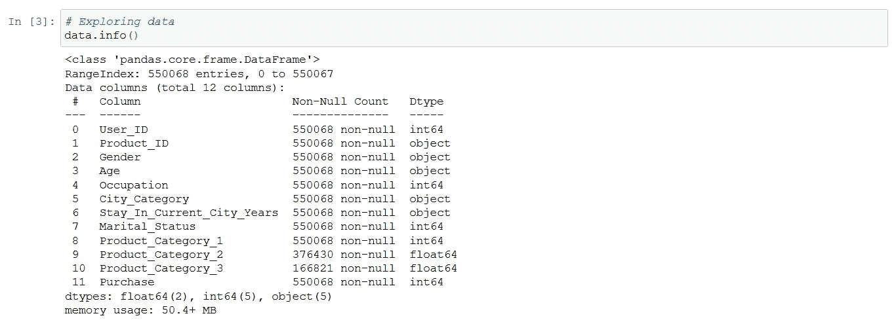
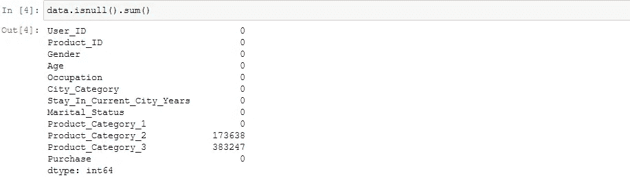
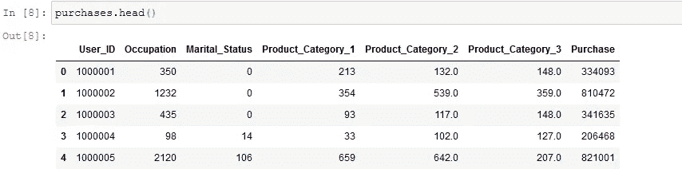
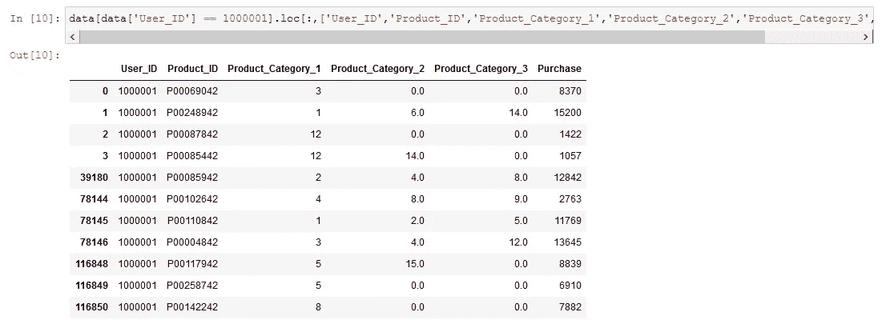
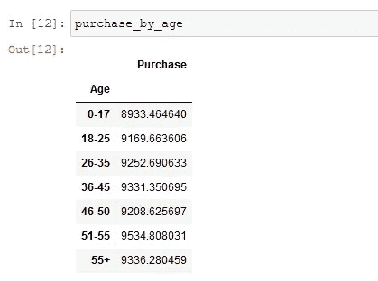
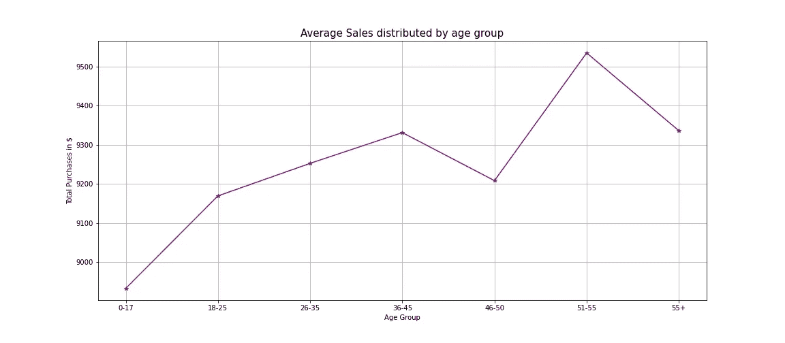
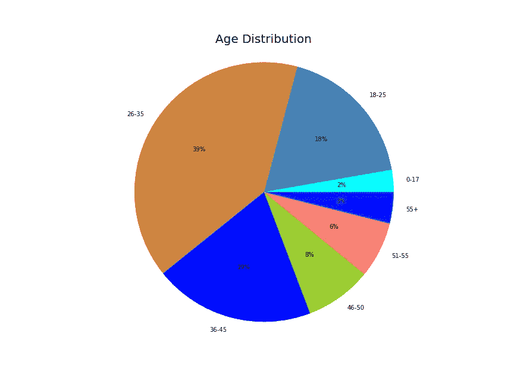
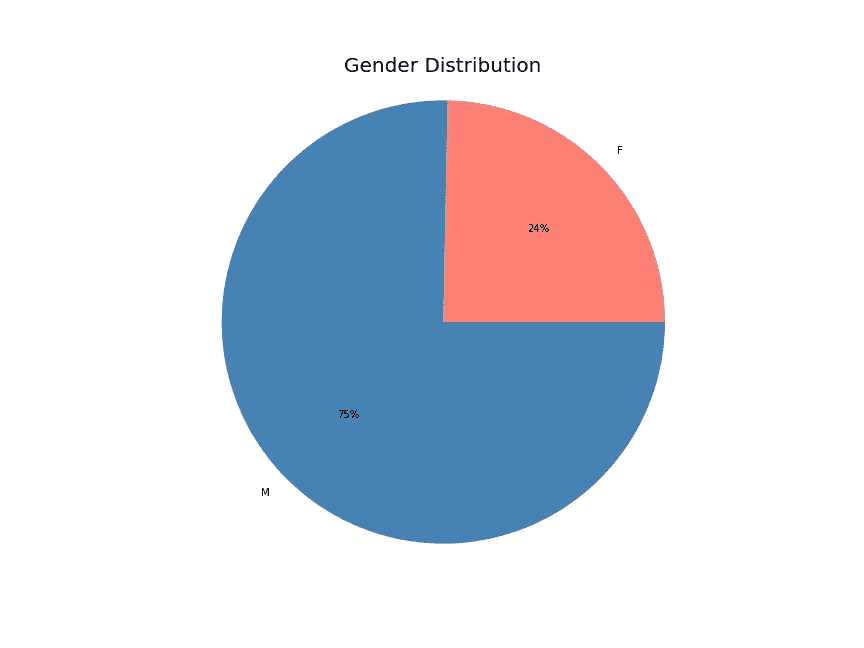
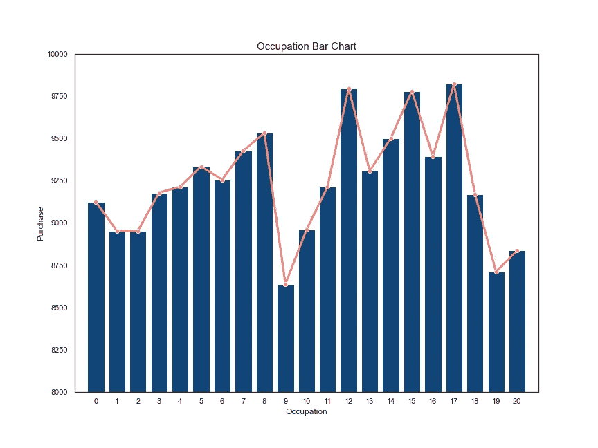
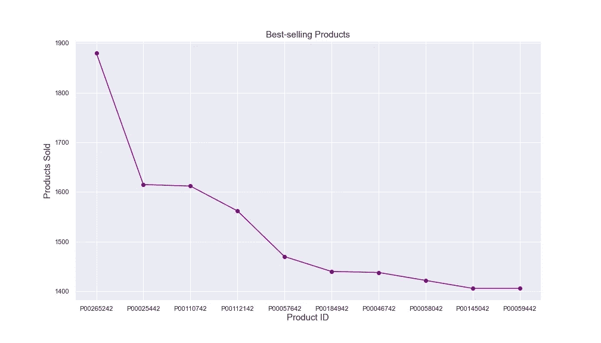

# 使用 Python 的电子商务数据科学

> 原文：<https://towardsdatascience.com/data-science-for-e-commerce-with-python-a0a97dd7721d?source=collection_archive---------7----------------------->

## 我为电子商务行业准备了一份广泛的数据科学应用指南。


马克·柯尼希在 [Unsplash](https://unsplash.com/s/photos/e-commerce?utm_source=unsplash&utm_medium=referral&utm_content=creditCopyText) 上的照片

商业是目前世界上发展最快、最具活力的行业之一。随着数字交易的便利和快速的送货上门，它的受欢迎程度一直在迅速增长。大型科技公司收入的一个主要来源来自其底层专有算法的交互，这些算法在很大程度上由数据科学提供支持，因此了解用于维持和增加客户数量的方法是非常重要的。

在本文中，我将向您介绍这个令人惊叹的行业是如何应用数据科学和 Python 脚本来实际展示这个案例的。数据集和脚本都可以通过这个[链接](https://github.com/Jotaherrer/DataAnalysis/tree/master/e_commerce)在我的 GitHub 上找到。

# 目录:

> 1.数据和数据科学介绍(1 分钟阅读)
> 
> 2.数据科学的电子商务应用(1 分钟阅读)
> 
> 3.推荐系统(1 分钟阅读)
> 
> 4.客户分析(2 分钟阅读)
> 
> 5.使用 Python 进行数据探索性分析(4 分钟读取)

# 1.数据和数据科学简介

数据的定义仅仅是原始事实的集合，如数字、文字或观察结果，而数据科学是处理数据研究的科学学科。


照片由[弗兰基·查马基](https://unsplash.com/@franki?utm_source=unsplash&utm_medium=referral&utm_content=creditCopyText)在 [Unsplash](https://unsplash.com/s/photos/data?utm_source=unsplash&utm_medium=referral&utm_content=creditCopyText) 上拍摄

如今，大多数电子商务平台在不妨碍客户体验的情况下收集大量用户数据。收集的数据存储在结构化的或列表化的表格中，以便于分析和解释。不仅存储结构化数据，还存储[非结构化数据](https://medium.com/swlh/which-technology-should-you-learn-according-to-your-profile-e081cf35d72f)，如图像、视频或文档，这些数据在研究用户偏好时也有很大价值，但通常更难处理和分析。

> 数据分析为这些公司提供了不断变化的**洞察力**和**指标**，使他们能够打造更好的产品。

对数据科学的兴趣大爆发的原因是由于数据量和计算能力的增长而被广泛采用。数据的**增长**与广泛的数字化和互联网渗透以及移动设备的大规模采用直接相关，移动设备在没有人工干预的情况下持续生成数据。另一方面，**计算能力**使数据科学家能够以高效的方式存储、处理和研究大量数据。

如今，不仅是大型科技公司，如谷歌、脸书、苹果、亚马逊或微软，正在充分利用其核心业务，而且小型和本地企业以及初创公司也逐渐采用数据科学来增加其业务价值。

# 2.数据科学的电子商务应用

电商代表*电子商务*，代表**网络版实体零售店**。它允许世界各地的人们通过在线平台购买、浏览和销售产品。

虽然从客户的角度来看，这似乎是一个相当简单的过程，但为了提供无缝的在线购物体验，需要克服几个障碍，例如与过程相关的障碍，包括产品订购、交付和公平定价。

然而，随着越来越多的人希望在网上购物，电子商务行业正在迅速扩张。这也意味着越来越多的传统企业正在将其商业模式转换或补充到电子商务中。

在电子商务行业发展的背景下，数据科学有助于从这些平台的大量可用数据中获得最大价值，并有助于将重点转向客户参与和体验。它侧重于:

*   **用户产品推荐。**
*   **客户趋势和行为分析**
*   **预测销售和库存物流。**
*   **优化产品定价和支付方式。**

这些应用中的每一个都涉及大量数据的存储和解释，其中数据分析技术派上了用场。


照片由 [**Pixabay**](https://www.pexels.com/@pixabay?utm_content=attributionCopyText&utm_medium=referral&utm_source=pexels) 发自 [**Pexels**](https://www.pexels.com/photo/laptop-technology-ipad-tablet-35550/?utm_content=attributionCopyText&utm_medium=referral&utm_source=pexels)

# 3.推荐系统

在案例研究中应用数据分析技术的一个例子是该公司的**推荐系统**，这是一种根据用户以前在平台上的购买或搜索来预测用户对某个商品的偏好的方法。

> 推荐系统被战略性地用于提高转化率、提升客户体验和扩大用户参与度。

一个被证明有效的大规模推荐系统是**亚马逊**的数据驱动和个性化营销方法，通过智能推荐给用户来提高平台的销量。据《麦肯锡洞察》杂志报道， [**亚马逊 35%的收入是由其推荐引擎**](https://www.mckinsey.com/industries/retail/our-insights/how-retailers-can-keep-up-with-consumers#) **产生的。**这一成就之所以成为可能，是因为推荐系统应用于电子邮件宣传活动及其网站的大部分页面，包括站内和站外推荐。

有两种类型的推荐系统:

1.  **基于内容的推荐**:根据产品的属性或特征进行推荐的方法。例如，如果一个产品与另一个产品共享属性，在用户购买第一个产品的情况下，系统应该推荐第二个产品，因为用户的偏好与第二个产品匹配的可能性更高。
2.  **协同推荐**:这种方法基于多个用户显示的交互进行推荐。例如，如果几个客户同时购买了一种产品和另一种产品，系统应该相互推荐每一种产品，因为以前的客户在以前的场合一起购买了这两种产品。

# 4.客户分析

客户是任何电子商务公司的关键因素，强调为客户提供良好的客户体验和满意度应该是首要关注的问题。为了达到这样的服务水平，有必要了解客户及其偏好。

电子商务平台有可能跟踪客户从进入网站到离开的活动，无论这是在购买或销售某些产品之后，还是在浏览产品之后。基于这种了解客户的必要性，它采取的每一个行动都必须被记录和存储为潜在的有用数据，以确定客户的概况。

> 从收集到的数据中生成关于客户的可行见解的过程称为客户分析。

**客户分析**有助于了解客户行为的趋势和变化，以便修改业务战略，并相应地做出关键业务决策。它还提供了一种方法来分析哪些获取和保留客户的渠道实际上是有效的，哪些是无效的。

为了建立客户分析平台，电子商务公司必须关注客户的关键特征，包括:

*   **客户描述和细分**:可以根据客户的偏好、购买和浏览模式对客户进行分组，以建立个人档案并在此基础上提供推荐。此外，这种分析有助于建立目标受众、个性化产品，甚至适用于每个群体的营销策略。
    这也有助于将重心转移到最赚钱的客户，以建立更好的客户关系。客户可分为**地理**特征、**行为**平台、**人口**特征和**心理**特征。
*   **情感分析**:这是确定一组单词或句子背后的情感的过程，目的是通过产品评论或支持票来识别客户对其购买或销售的产品所表达的情感。
    情感分类器可以是正面的、负面的或中性的，有助于回应投诉和改善客户服务等。
*   **流失分析**:这是根据客户在平台中的活动，分析客户购买产品的可能性的过程，旨在优化现有的获取和保留策略。流失率的提高可以极大地影响业务的增长甚至可持续性。
*   **终身价值预测**:这是客户在与平台建立关系期间将为企业提供的估计总收入。该估计是使用早期交易模式、交易频率和交易量等因素进行的。
    预测终生价值预测，有助于规划向什么样的客户投入业务资源，以从他们身上获取最大价值。

# 5.使用 Python 的数据探索过程

分析数据集之前的第一步是预览它包含的信息。为了轻松处理这些信息，我们将使用 [Pandas](https://pandas.pydata.org/) ，这是一个用于数据操作和分析的 Python 库，它提供了用于操作数值表和时间序列的数据结构和操作。

对于不熟悉 [Python](https://www.python.org/) 的人来说，它是一种强调编码效率、可读性和脚本重用性的高级通用编程语言。

数据集和脚本都可以通过这个[链接](https://github.com/Jotaherrer/DataAnalysis/tree/master/e_commerce)在我的 GitHub 上找到。**下面，我将包含在您的计算机上运行分析所需的代码**:

```
# Imports 
import pandas as pd
import matplotlib.pyplot as plt
import matplotlib.gridspec as gridspec
import seaborn as sns
import numpy as np
```

在导入必要的库之后，继续创建包含数据集信息的 pandas 数据框架，并研究它:

```
# Read dataset and preview
data = pd.read_csv('e_commerce.csv')# Exploring data
data.info()
```



通过在“数据”变量中应用 info()方法的结果，我们可以访问数据集内的信息，该数据集由电子商务平台中的一系列交易组成，我们已经为这些交易确定了用户 ID、购买产品 ID 和许多在该过程中有用的描述性数据。

在继续分析之后，我们继续清理数据帧中的空特征。正如我们在下面的代码中看到的，产品 2 有 173.638 个空字段，这意味着用户在这种情况下不会购买一个以上的产品。此外，产品 3 有 383.247 个空字段:

```
# Count null features in the dataset
data.isnull().sum()
```



现在，让我们继续用零值替换空要素，因为我们需要一个干净的数据集来对其执行操作:

```
# Replace the null features with 0:
data.fillna(0, inplace=True) # Re-check N/A was replaced with 0.
```

在数据框架中，我们有客户进行的所有交易，其中包括每个人进行的每笔交易。为了确定在我们的平台上花费最多的用户，让我们按用户 ID 分组并合计花费金额:

```
# Group by User ID:
purchases = data.groupby(['User_ID']).sum().reset_index()
```



此外，我们还可以访问每个用户 ID 购买的产品，让我们用用户 ID 1.000.001 试试:

```
data[data['User_ID'] == 1000001]
```



在确定了消费最多的用户之后，让我们提取这些用户的年龄范围以及每个年龄组的平均销售额:

```
purchase_by_age = data.groupby('Age')['Purchase'].mean().reset_index()
```



年龄在 51-55 岁之间的用户群是在平台上花费最多的人群，所以也许我们应该将营销活动瞄准他们。让我们来看看用户年龄的图形分布:

```
plt.figure(figsize=(16,4))
plt.plot(purchase_by_age.index, purchase_by_age.values, color='purple', marker='*')
plt.grid()
plt.xlabel('Age Group', fontsize=10)
plt.ylabel('Total Purchases in $', fontsize=10)
plt.title('Average Sales distributed by age group', fontsize=15)
plt.show()
```



作者图片

另一方面，它将有兴趣找出哪个年龄组和性别进行更多的交易。这两个事实很容易用几行代码计算出来:

```
# Grouping by gender and age
age_and_gender = data.groupby('Age')['Gender'].count().reset_index()
gender = data.groupby('Gender')['Age'].count().reset_index()# Plot distribution
plt.figure(figsize=(12,9))
plt.pie(age_and_gender['Gender'], labels=age_and_gender['Age'],autopct='%d%%', colors=['cyan', 'steelblue','peru','blue','yellowgreen','salmon','#0040FF'])
plt.axis('equal')
plt.title("Age Distribution", fontsize='20')
plt.show()
```



作者图片

```
# Plot gender distributionplt.figure(figsize=(12,9))
plt.pie(gender['Age'], labels=gender['Gender'],autopct='%d%%', colors=['salmon','steelblue'])
plt.axis('equal')
plt.title("Gender Distribution", fontsize='20')
plt.show()
```



作者图片

另外，我们可以计算出平台的客户所展示的那些职业中，哪些是购买产品较多的职业。看一看下面的代码:

```
# Group by occupation:
occupation = data.groupby('Occupation')['Purchase'].mean().reset_index()# Plot bar chart with line plot:
sns.set(style="white", rc={"lines.linewidth": 3})
fig, ax1 = plt.subplots(figsize=(12,9))
sns.barplot(x=occupation['Occupation'],y=occupation['Purchase'],color='#004488',ax=ax1)
sns.lineplot(x=occupation['Occupation'],y=occupation['Purchase'],color='salmon',marker="o",ax=ax1)
plt.axis([-1,21,8000,10000])
plt.title('Occupation Bar Chart', fontsize='15')
plt.show()
sns.set()
```



作者图片

最后，我们可以确定平台中最畅销的产品:

```
# Group by product ID
product = data.groupby('Product_ID')['Purchase'].count().reset_index()
product.rename(columns={'Purchase':'Count'},inplace=True)
product_sorted = product.sort_values('Count',ascending=False)# Plot line plot
plt.figure(figsize=(14,8))
plt.plot(product_sorted['Product_ID'][:10], product_sorted['Count'][:10], linestyle='-', color='purple', marker='o')
plt.title("Best-selling Products", fontsize='15')
plt.xlabel('Product ID', fontsize='15')
plt.ylabel('Products Sold', fontsize='15')
plt.show()
```



作者图片

# 结论

我写这篇文章的目的是提供一种直觉，让人们了解全球公司如何应用数据科学来获取、保留和发展他们的客户群。除此之外，我还想对电子商务中涉及的理论提供一个实用的解释，包括推荐系统和客户分析。

如果你喜欢这篇文章中的信息，不要犹豫，联系我分享你的想法。它激励我继续分享！

# 深入了解数据科学的相关文章:

**神经网络在烟囱溢流剖面中的应用:**

[](https://medium.com/swlh/which-technology-should-you-learn-according-to-your-profile-e081cf35d72f) [## 根据你的个人资料，你应该学习哪种技术？

### 根据堆栈溢出用户的标签，利用网络分析和 Python 来找出您应该…

medium.com](https://medium.com/swlh/which-technology-should-you-learn-according-to-your-profile-e081cf35d72f) 

**纽约 Airbnb 租房数据分析:**

[](/airbnb-rental-analysis-of-new-york-using-python-a6e1b2ecd7dc) [## Airbnb 租房——使用 Python 分析纽约

### 发现最方便的租赁方式，以便继续实施具有良好可视化效果的数据分析。

towardsdatascience.com](/airbnb-rental-analysis-of-new-york-using-python-a6e1b2ecd7dc) 

**使用漂亮的可视化工具增强指标、KPI 和数据解释:**

[](/business-intelligence-visualizations-with-python-1d2d30ce8bd9) [## 用 Python 实现商业智能可视化

### 我准备了一份详尽的指南来展示漂亮的可视化效果，以增强度量、KPI、预测和其他…

towardsdatascience.com](/business-intelligence-visualizations-with-python-1d2d30ce8bd9) 

感谢您花时间阅读我的文章！如果您有任何问题或想法要分享，请随时通过我的[电子邮件](http://herrera.ajulian@gmail.com)联系我，或者您可以在以下社交网络中找到我以了解更多相关内容:

*   [**LinkedIn**](https://www.linkedin.com/in/juli%C3%A1n-alfredo-herrera-08531559/)**。**
*   [**GitHub**](https://github.com/Jotaherrer) **。**

# 参考

*   [1] [Python 官网](https://www.python.org/)
*   [2]麦肯锡洞察[杂志](https://www.mckinsey.com/industries/retail/our-insights/how-retailers-can-keep-up-with-consumers#)。