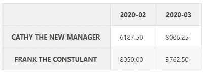
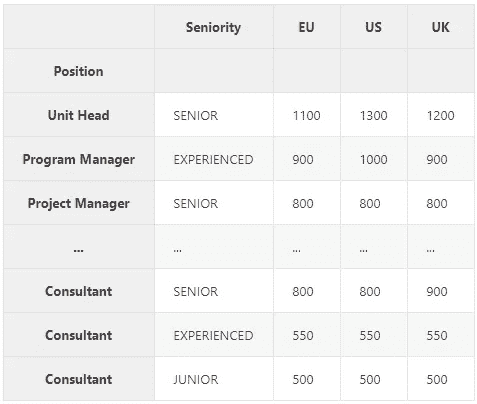
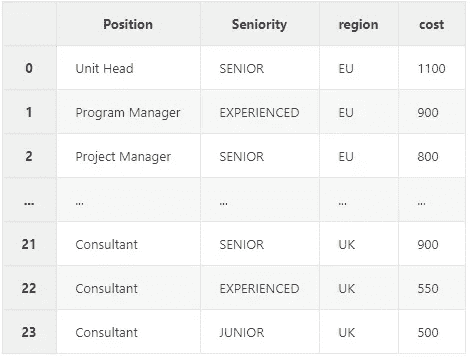
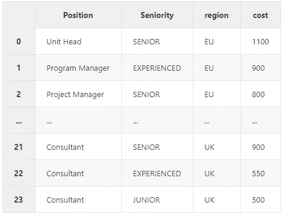
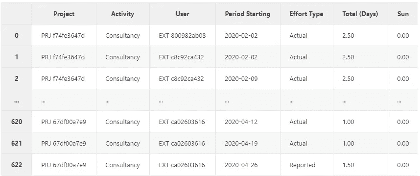
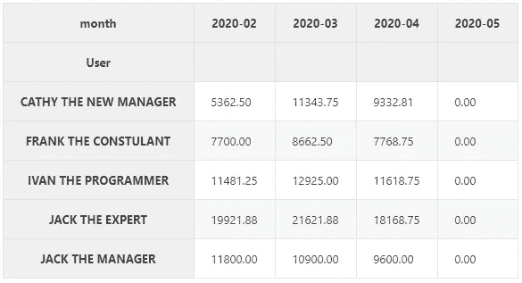
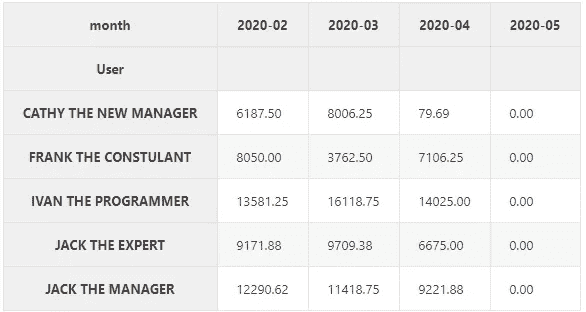
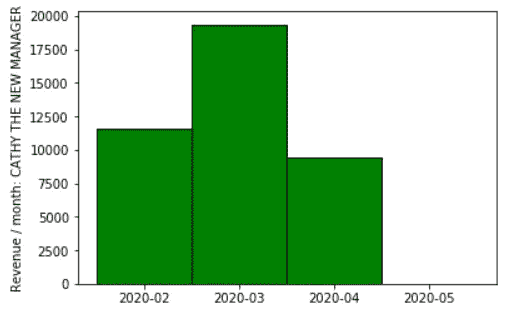

# 使用数据科学轻松处理企业资源规划数据

> 原文：<https://towardsdatascience.com/data-science-for-erp-data-2b414028f9b6?source=collection_archive---------45----------------------->

## 用数据管理

## 面临分析公司数据的挑战，厌倦了巨大的 Excel 文件？用一个简单的 Jupyter 笔记本给他们写信

与 [Dmytro Karabash](https://medium.com/u/79cc5dc1f7e1?source=post_page-----2b414028f9b6--------------------------------) 一起创建


信用:斯科特·格雷厄姆@ unsplash

# 介绍

你现在是老板了。你有一个团队或一个业务部门在做咨询。可能是一群帮助客户的顾问，一些项目经理以敏捷或其他方式领导你的项目。每个人都填写他们的时间表(如果他们不填写，你会削减他们的奖金)——时间是向客户收费的，你也有固定费用的项目。也许更小的团队也是你组织的一部分——你可以领导 10 人、100 人或 1000 人(嘿，伙计——你管理一个有 1000 名员工的单位？不要读这篇文章——找一个读过的人。你甚至可能有一个 ERP(企业资源规划)或什么的，在一个可爱的角落办公室里有一个 CFO。你有没有一个很好的方法来估计每个团队成员和项目带来多少利润，以及如何合理精确地预测它？如果你有一个像样的 ERP 仪表板，它能给你所有这些，那么你是幸运的，你也不需要这篇文章。你有可能在年底得到一个简单的计算结果——比如“让我们假设你的项目在一年内的所有收入融资和 800 美元的人工日成本得到你的单位盈利能力”。800 美元可能看起来高得离谱，也可能低得不可接受，这取决于你从事的行业。所以这就是你计算你的团队给公司带来的钱的精确度？需要我们提醒你这是你工作存在的原因之一吗？

你还能得到什么？所有的时间表项目都有预算，你甚至可以得到大概的成本(我们以后再讨论)——一年的大量数据，即使是 10 人的团队。我们向您展示的是，您不需要 ERP 来完成剩下的工作 Jupyter 中的笔记本就可以了。请记住这一点——管理始于衡量。如果你手头没有他们的数据，你怎么能监督你的团队和项目呢？

为什么这里需要数据科学？好吧，你可以在你的手指上有所有的数据。最终，你会希望像这样计算你的利润

```
profit **=** revenue **-** cost
```

不仅是减去两个数字，而且是在表的层次上——所以上述语句的输出可以是一个表，其中包含每个顾问每月的利润，如下所示:



或者通过下面的陈述获得 3 月份计费时间最多的 3 个人的列表

```
t**.**where**(**t**[**'Billable'**]** **&** **(**t**[**'month'**]** **==** '2020-03'**)**
        **).**groupby**([**'User'**])[**'effort'**].**sum**().**nlargest**(**3**)**
```

但是我们为你创建了一个 [Jupyter Notebook](https://yourdatablog.com/teamdata/) ，你可以在那里玩代码，让它在几个段落中工作(感谢[fast pages](https://fastpages.fast.ai/)——我们的帖子和笔记本是一回事)。是的，需要学习一些 python。与您自己做的任何事情(ERP 报告、Excel、其他工具)的巨大区别在于，任何分析都保留在笔记本中，并且可以在您的数据更改后重新应用。

# 数据科学

所以，让我们把这件事做完。首先，是的，你需要了解一点 python 来获取文件。基础水平就可以了。如果你是 2020 年的经理，却不能写一个简单的脚本——嗯，你可能错过了一些东西。我们的目标不是构建 ERP，甚至不是拥有一个易于使用的工具包——我们希望向您展示如何为自己制作一个工具包(但是可以随意重用我们的代码)。你将看到的是一组简单的例子——花一两个小时将你的文件载入笔记本，然后开始玩它——只需做出你想要的分析。你最终可以检查一些数字或者构建你的图表和仪表板。没关系，即使你为一家公司工作(那是你最需要它的地方)——只要安装 Anaconda 并下载笔记本就可以了。所以，我们首先获取并转换我们的输入文件(如果你想了解文本和所有代码——在 [colab](https://colab.research.google.com/github/h17/fastreport/blob/master/_notebooks/2020-06-01-Working-with-team-data.ipynb) 上阅读)。

# 我们加载的数据

让我们在这里总结一下——如果你是团队领导或业务部门经理，最有可能的情况是——你很少有字典

*   每个地区的成本或“外部”贡献者的默认成本
*   不属于你的项目每小时的平均收入

```
*# show roles*
roles **=** data**[**"roles"**]**
roles
```



我们需要设置默认值，并将其转换成易于使用的格式，这在 python 中非常容易:

```
default_revenue **=** 1200
default_cost **=** 850*# wide to long format*
roles_long **=** pd**.**melt**(**roles**.**reset_index**(),**
                     id_vars**=[**'Position'**,** 'Seniority'**],**
                     var_name**=**'region'**,**
                     value_name**=**'cost'**)**
roles_long
```



现在，人数数据

*   你的员工名单，以及他们的等级(或费用)
*   参与模式(员工或承包商)

```
*# show head count*
headcount **=** data**[**"Employees"**]**
headcount **=** headcount**.**merge**(**
    roles_long**[[**'Position'**,** 'Seniority'**,** 'region'**,** 'cost'**]],**
    how**=**'left'**,**
    left_on**=[**'Seniority'**,** 'Position'**,** 'Country'**],**
    right_on**=[**'Seniority'**,** 'Position'**,** 'region'**])**
headcount**[**'cost'**]** **=** headcount**[**'cost'**].**fillna**(**default_cost**)**
headcount
```



*   有预算、工作量估算、日期、收入确认类型(时间和材料、固定费用或其他)等的项目

```
*# show projects*projects **=** data**[**"Projects"**]**
projects
```


您的团队/项目的时间表。其他团队可能会参与您的项目，而您的团队可能会在外部项目中工作

```
*# show timesheets*timesheet **=** data**[**"timesheet"**]**
timesheet
```



这里的 EXT 用户不在我们的人数之内(假设我们没有获得真实姓名，但在这种情况下，我们从 ERP 获得了一些 id)

为什么不直接用 ERP 来做呢？你的 ERP 可能没有很好地呈现你想要在你的层面上控制的参数(否则，你无论如何也不会读这篇文章)。到 2025 年，可能会有一个项目在进行改进——也许四大律所之一正在面试你的要求。如果您驾驶这艘船的时间足够长，您可能会得到快速而肮脏的计算、对 SAP 的 SQL 查询(字段名仍然是德语)或 Excel 文件。为什么？你的老板不在乎——他们已经雇佣了你，而且更好的 ERP 将在 2025 年到来。所以他们想知道你的团队赚了多少钱(最好是每个人、每个月、每个项目，有图表、预测和比较)，并想知道为什么它不那么有利可图(因为它从来都不是)。

为了简化您的工作，我们将从时间表中创建一个时间序列，这有点复杂，所以您现在可以跳过它，稍后再回来，但关键是，最终，您将获得一个可爱的每月熊猫数据框架。在数据科学中，拥有一个可以轻松分组和过滤的大数据框架(类似于 excel 表或 SQL 表)是很常见的。它是有帮助的，因为它使事情变得非常容易。

# 收益性

时间表和项目预算通过这种方式得到了简化，您可以在几条简单的语句中以您想要的方式操作它们。如果你学过 excel 公式，你也可以这样做。现在，让我们以最简单的方式来看看盈利能力。作为经理，我们建议你这样做来为你的团队设定基准。因此，利润就是收入——成本，我们希望保持简单。你可以实现你喜欢的计算。

**收入:**比方说，对于一个&材料项目，你产生的收入与你开出的账单(按照约定的费率)一样多，一直到它的预算。我们不做任何固定费用确认公式。不同的公司有不同的做法，你要么需要历史数据，要么需要实际认可的价值，这取决于你的经营方式。

我们还假设我们只对人数中的用户感兴趣(所以我们过滤掉所有分机用户)。

```
*# revenue calculation for a person for a month* 
*# (SUM REV of all timesheet records * corresp project rates)*
revenue_df **=** timeseries**[[**'User'**,** 'Project'**,**
                         'Billable'**,** 'effort'**,** 'date'**,** 'month'**]]**
revenue_df **=** revenue_df**.**merge**(**projects**[[**'Project'**,** 'Daily Rate'**]],**
                              how**=**'left'**,**
                              on**=**'Project'**)**
revenue_df**[**'Daily Rate'**].**fillna**(**default_revenue**,** inplace**=True)**
revenue_df **=** revenue_df**[(**revenue_df**[**'User'**].**str**[:**3**]** **!=** 'EXT'**)** **&**
                        **(**revenue_df**[**'Billable'**])]**revenue_df**[**'daily_revenue'**]** **=** revenue_df**[**'Daily Rate'**]** ***** \
    revenue_df**[**'effort'**]**
revenue **=** revenue_df**.**groupby**([**'User'**,** 'month'**])[**
    'daily_revenue'**].**sum**().**unstack**().**fillna**(**0**)**
revenue **=** revenue**[**revenue**.**sum**(**1**)** **>** 0**]**
revenue**.**head**()**
```


我们每个月都有人均收入。不会太复杂吧？

成本:让我们从这样一个事实开始:仅仅使用“默认成本率”是不够的——每当利润受到压力时，你应该做得更好。你可能有在不同国家工作的人，他们的水平完全不同。和你的财务团队谈谈，从他们那里得到一些估计(或者一起做)。如果你被任命管理一个团队或业务部门，我们会说他们欠你很多。我们假设你在每个国家都得了几分。每个人的成本也很好。这个工具的美妙之处(与自己做 Excel 相比)在于你可以直接添加它——它只是几行代码。让我们来计算每月的直接成本:这里我们检查张贴在时间表上的工作成本，假设它们是满的——也可以检查一个月中的工作日数并进行比较。我们对外部资源不感兴趣，所以我们将再次过滤掉它们。

```
*# cost calculation for a project* 
*# (SUM COST of all timesheet records * corresp cost rates - see roles)*
cost_df **=** timeseries**[[**'User'**,** 'Project'**,** 'effort'**,** 'date'**,** 'month'**]]**
cost_df **=** cost_df**.**merge**(**headcount**[[**'Name'**,** 'cost'**]],**
                        how**=**'left'**,** left_on**=**'User'**,** right_on**=**'Name'**)**
cost_df **=** cost_df**[**cost_df**[**'User'**].**str**[:**3**]** **!=** 'EXT'**]**
cost_df**[**'daily_cost'**]** **=** cost_df**[**'cost'**]** ***** cost_df**[**'effort'**]**
cost **=** cost_df**.**groupby**([**'User'**,** 'month'**])[**'daily_cost'**].**sum**()**
cost **=** cost**.**unstack**().**fillna**(**0**)**
cost **=** cost**[**cost**.**sum**(**1**)** **>** 0**]**
cost**.**head**()**
```



现在，我们可以通过对数据帧的操作来获得每个用户每月的利润。在这里它结出了一些果实。*利润=收入—成本*。事实上，它需要先清理一些数据——但不是太多

```
profit **=** revenue **-** cost
profit**.**head**()**
```



这是我们承诺过的，对吗？好的，第二个——在三月份输入最多计费时间的人

```
t **=** timeseries  
t**.**where**(**t**[**'Billable'**]** **&** **(**t**[**'month'**]** **==** '2020-03'**)**
        **).**groupby**([**'User'**])[**'effort'**].**sum**().**nlargest**(**3**)**
```


# 还有什么？

现在，让我们看看如何将一些 python 和数据科学技术(我们将在下一篇文章中获得更多细节)应用于您在上面看到的数据，以及如何很好地将其可视化。

首先，让我们采取一个项目经理，并设想他/她的项目每月的收入。

```
**%matplotlib** inlinepm_selected **=** "CATHY THE NEW MANAGER"
drawdt **=** revenue**.**loc**[**pm_selected**].**Tplt**.**bar**(***range***(***len***(**drawdt**.**index**)),** drawdt**.**values**,** color**=**"green"**,**
        width**=**1**,** align**=**'center'**,** edgecolor**=**'black'**);**
plt**.**xticks**(***range***(***len***(**drawdt**.**index**)),** drawdt**.**index**);**
plt**.**ylabel**(**"Revenue / month: "**+**pm_selected**);**
```



这很简单。然后，对于那些稍微了解高级 python 的人来说，这是一件有趣的事情——您可以用几行代码制作一个交互式图表。好吧，作为团队领导，你可能不会这么做。抱歉。让我们做一些计算。首先，让我们确定输入的“可疑”时间(例如，一个人在一个给定的项目上连续三天以上做同样的工作，而不是 8 小时)——这是您自己做的一个快速检查，不需要问 PMO 任何事情，也不需要将它正式化。我可以说这是可疑的，因为我们工作的性质(你的可能会不同，所以你寻找另一种模式)使得你不太可能连续几天在一个项目上花费相同的时间(除非你被指派全职)。你正在做的事情很可能只是以某种方式将你的工作时间分配给你的项目。

```
*# remove the weekend*
working **=** timeseries**[(**timeseries**[**'workweek'**]** **==** **True)**
                     **&** **(**timeseries**.**Billable**)].**copy**()**
working **=** working**.**groupby**([**"User"**,** "Project"**,** "date"**]).**sum**().**sort_index**()**
working**[**'value_grp'**]** **=** **(**working**.**effort**.**diff**(**1**)** **==** 0**).**astype**(**'int'**)****def** **streak(**df**):**  *# function that finds streak of 1s: 0,1,1,0,1 -> 0,1,2,0,1*
    df0 **=** df **!=** 0
    **return** df0**.**cumsum**()-**df0**.**cumsum**().**where**(~**df0**).**ffill**().**fillna**(**0**).**astype**(***int***)** working**[**'streak'**]** **=** streak**(**
    working**[**'value_grp'**])**  *# streak of identical effort*
result **=** working**[(**0 **<** working**.**effort**)** **&**
                 **(**working**.**effort **<** 1**)** **&**
                 **(**working**[**'streak'**]** **>** 3**)].**reset_index**()**result **=** result**[**result**.**User**.**str**[:**3**]** **!=** 'EXT'**].**groupby**([**'User'**,** 'Project'**]).**last**()**
result**[[**"effort"**,**"date"**,**"streak"**]]**
```


需要明确的是，基于以上所述，我们不建议发送主题为“时间可疑者名单”的电子邮件。人们可能会改变他们的行为，你可能不容易找到下一个模式。作为一名经理，你挖掘数据，发现见解，并以你认为合适的方式采取行动。你不会告诉你十几岁的孩子现在你知道他把香烟藏在哪里了吧？

# 用例

这里有一些上面提到的有用的例子——我们将在下一篇文章中讨论其中的一些。

*   决策——例如，确定最大的亏损项目
*   确定需要管理层关注的项目——在这里也应用机器学习，并确定你将自己挑选的项目
*   更好地分析非计费工时
*   识别可疑行为—异常检测
*   基于现有模式的收入和工作预测，当计划偏离时不突出显示
*   整合的按需分析(例如盈利能力预测、收入预测、未分配容量),以防您的 ERP 无法做到这一点

关键是加载你的数据(excel、CSV、TSV——无论什么)很简单，操作也很简单——比在许多 excel 文件中操作更直接，比等待 PMOs 更快。

请继续关注我们的下一篇文章。

最初发表于 Y [我们的数据博客](https://yourdatablog.com/teamdata/)