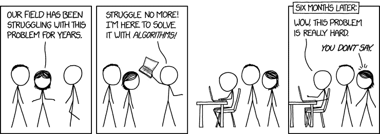
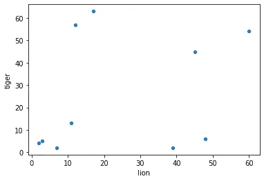

# 历史数据科学:远程阅读

> 原文：<https://towardsdatascience.com/data-science-for-history-distant-reading-b072e4f6d055?source=collection_archive---------51----------------------->

历史数据科学最有前途的应用之一是数字人文学科中被称为“远程阅读”的技术。远距离阅读是对更熟悉的术语“近距离阅读”的有意颠倒，意思是对文本细节的仔细、精细的检查。相比之下，远程阅读包括使用自动化对大量文本进行归纳。我在上一篇文章中用入侵文学的例子暗示了这一点，但现在我想借此机会详细说明什么是远距离阅读以及它是如何工作的。

远距离阅读的现代体现归功于意大利文学学者弗朗哥·莫雷蒂(Franco Moretti)，他在 21 世纪初震惊了文学界，建议文学学者完全放弃近距离阅读。他创造了这个术语，并写了一本关于远程阅读的书([字面意思为](https://www.google.com/books/edition/Distant_Reading/YKMCy9I3PG4C?hl=en&gbpv=0))，但量化文本的方法早在他之前就有了，正如泰德·安德伍德在[他 2017 年的文章《远程阅读的谱系》中指出的那样](http://www.digitalhumanities.org/dhq/vol/11/2/000317/000317.html)。像数据科学本身一样，远程阅读独立于数字人文学科而存在，并声称其血统远远超出了现代计算的出现，但数字化已将其提升到一个新的水平，并以前所未有的方式将其纳入主流。虽然当前的化身起源于文学学者，遥远的阅读适用于历史方法，好像不是更容易。

远程阅读的核心概念是通过从大量的文学作品中收集见解，而不是依赖于从有限的“伟大”作品中进行细读。莫雷蒂认为这种方法的主要好处是能够更好地识别超越国界和流派的大规模模式，开拓研究范围，包括传统经典以外的作品，以及远距离阅读是客观的，而近距离阅读最终是主观的事实。前两点显然是对的，对于历史资料来说更是如此，因为传统资料的“正典”只占可用资料的很小一部分。然而，关于第三点，我必须建议谨慎行事。远距离阅读比近距离阅读更客观，提供了确凿的证据，但它是完全客观的，而不是完全客观的。处理数据是一门艺术，也是一门科学，只要涉及到人类(剧透:总是)，就会有一定程度的主观性。文集的作品是怎么选出来的？你是如何决定使用哪种模型的？你找到的东西在多大程度上取决于你正在寻找的东西？远程阅读既不是完全客观的，也不是神奇的灵丹妙药，无论弗朗哥·莫雷蒂如何试图说服你。最好不要单独使用，而是与细读和其他更传统的技巧结合使用。

不要成为这种人([感谢 XKCD 的兰德尔·门罗](https://xkcd.com/1831/)

现在来看看远距离阅读到底有多有效。文本分析属于数据科学的一个分支，称为自然语言处理(NLP)。NLP 是数据科学家知道数字人文主义者所说的“远程阅读”的名称。NLP 涉及通过对文档进行矢量化来分析文档，也就是说，将文档转换成可用于训练预测模型等的数值集。最基本的矢量化是通过计数。对于文档中的每个单词，取该单词出现的次数，并将其视为该单词的值。将接下来发生的事情可视化的最简单的方法是一个简单的二维散点图。假设我们从图书馆拿了 10 本书，并计算“狮子”和“老虎”这两个词在每本书里出现了多少次。然后，我们将“狮子”数量作为一个维度，将“老虎”数量作为另一个维度来绘制它们。结果看起来像这样:

只统计了两个单词(而且数据是由你真实地在现场编造的)这显然是一个非常粗略的分析，但是仅仅根据这个情节，我们就可以对这些书的内容做出一些猜测。在左上角，我们有书上老虎出现的频率比狮子高得多。也许这些书是关于老虎的，或者重点介绍了老虎。在右下角我们看到了相反的情况，那里的书更多的是描写狮子而不是老虎。在右上角有狮子和老虎的高计数(也许是关于大型猫科动物的书？)在左下角，两者都很少——很可能这些是关于其他东西的书。现在想象一下，我们为单词“bear”的计数增加了第三个维度同样的逻辑仍然适用——书籍根据其内容移动到情节的不同区域，点与点之间的距离可能被解释为意义。现在想象我们增加了第四维度……但你无法想象，因为我们生活在一个三维世界(至少在空间方面)。令人欣慰的是，数学仍然有效——就计算机而言，你可以继续增加维度，得到的点之间的距离概念仍然有一些意义。有了足够多的词汇，你可能不仅能分辨出一本书是关于狮子还是老虎，还能分辨出它是悲观还是乐观，是写于 19 世纪还是 20 世纪，或者它属于哪种类型。开始问这类问题，弄清楚它们是如何相互作用的，很快，你就可以进行远距离阅读了。

计数矢量化只是一个开始。还有其他形式的矢量化，如 tfi df(**T**total**F**frequency**I**nverse**D**document**F**frequency)矢量化，它使用相对于整个语料库中的频率的频率，而不是原始计数。其他方法考虑一个术语旁边出现的单词来衡量上下文和含义。不同的预处理方法，如删除过于常见的“停用词”或通过词干化或词汇化将词缩短为更通用的词根形式，可以用来影响矢量化的结果。还有多种不同的方法可供选择。例如，情感分析技术旨在识别文档的语气，而主题分析旨在确定文档在谈论什么。所用的方法一如既往地取决于所提的问题。

这就是你的介绍——欢迎来到遥远阅读的奇妙世界！请记住，它不是魔术，它不会创造纯粹的客观真理，但如果使用正确，它会是一个非常强大的工具。不要放弃近距离阅读(对不起，佛朗哥·莫雷蒂)，而是尝试远距离阅读——你不会后悔把它加入你的工具包。