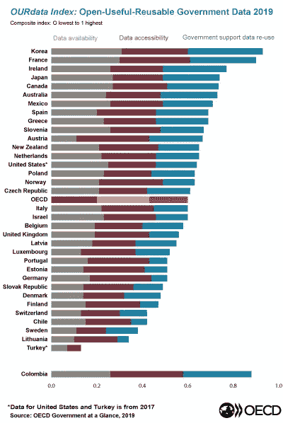

# 造福社会的数据科学

> 原文：<https://towardsdatascience.com/data-science-for-social-good-a88838bc8ed0?source=collection_archive---------20----------------------->

## [变更数据](https://towardsdatascience.com/tagged/data-for-change)

## 超越我们想看什么类型的电影，到我们想生活在什么类型的世界。为社会公益做数据科学的资源、例子和机会。

照片由[哥鲁达](https://unsplash.com/@sakethgaruda?utm_source=medium&utm_medium=referral)在 [Unsplash](https://unsplash.com?utm_source=medium&utm_medium=referral) 上拍摄

五年前，美国前总统巴拉克·奥巴马(Barack Obama)将 DJ Patil 博士介绍为联邦政府的首位首席数据科学家，并号召数据科学家加入到改善国家和世界的努力中来([主题视频](https://www.youtube.com/watch?v=oWYDyWlcICY))。

**但是，如何通过数据科学让世界变得更好呢？**

最常见的是，我发现了一些关于它的方法和技术如何在商业环境中有所帮助的例子。然而，由于我的背景是评估公共政策和项目，我想更多地了解如何使用数据科学来确定项目或政策的影响，或者设计基于证据的公共政策。

因此，我开始了一项搜索任务，以找出那里有什么资源，真实的用例是什么样的，以及数据科学如何用于社会公益。以下是我在**资源、用例示例和机会**方面的发现，适用于那些希望提高自己在该领域的技能并努力获得更大社会影响力的人。

**卡内基梅隆大学数据科学和公共政策中心***:*在他们的网站上，你可以找到数据科学在社会科学和公共政策中产生重大影响的项目实例。他们能够做出贡献的领域有:刑事司法、教育、经济和劳动力发展、能源、环境、公共卫生、交通和基础设施、公共安全。一些真实的使用案例包括:用于预防不利的警察事件的早期干预系统、预防圣何塞的住房违规事件、通过行为和数据分析减少供水中断、减少艾滋病毒感染和提高艾滋病毒医疗护理的参与度等。每个项目都在他们的网站上有详细的描述，因此它们可以作为那些希望获得灵感的人的伟大用例。

 [## 主页

www.datasciencepublicpolicy.org](http://www.datasciencepublicpolicy.org/) 

更棒的是，他们每年都会组织**社会公益数据科学夏季奖学金，**通过该奖学金，他们将来自世界各地的有抱负的数据科学家聚集在卡内基梅隆大学，与非营利组织和政府机构合作开展为期 3 个月的数据科学项目，并向经验丰富的导师和项目经理学习。在项目期间，所有的研究员都有工资，并提供住房。要注册，请访问他们的网站，因为他们的注册过程在每年年初进行。

 [## 卡内基梅隆大学数据科学公益暑期奖学金

### 数据科学为社会公益奖学金是一个全职的夏季计划，培训有抱负的数据科学家工作…

www.dssgfellowship.org](https://www.dssgfellowship.org/) 

英国国家数据科学和人工智能研究所 [**艾伦图灵研究所**](https://www.turing.ac.uk/) 也复制了这个成功的程序。今年，由于新冠肺炎的原因，DSSGx 似乎将在遥远的地方举行。

艾伦图灵研究所的网站和博客也提供了与数据科学应用对社会影响相关的有趣和有用的材料。而且，从今年开始，他们已经开始实施一个新的实习项目——图灵实习网络，通过这个项目，他们将工业界和博士生联系起来。不幸的是，这些实习只针对那些拥有在英国工作权利的人。

 [## 主页|艾伦图灵研究所

### 我们相信数据科学和人工智能将改变世界。我们是先锋；训练下一个…

www.turing.ac.uk](https://www.turing.ac.uk/) 

**DataKind，**哪些主要陈述是“利用数据科学的力量为人类服务”和**“…使用数据不仅可以更好地决定我们想看什么样的电影，还可以更好地决定我们想看什么样的世界”:微笑。如果你是这个领域的新手，并且希望获得经验，你可以申请他们的志愿者项目。对于更有经验的数据科学家来说，志愿服务可以作为回报社会和做有意义工作的一种方式。他们的一个优势是，除了总部在纽约之外，他们在班加罗尔、三藩市、新加坡、英国和 DC 华盛顿都有分部。DJ Patil 和许多其他杰出的数据科学家也是他们的顾问。**

 [## 数据种类

### 了解 DataKind 网络中发生的情况

www.datakind.org](https://www.datakind.org/) 

****。org** ，一家来自英国的非营利组织，自称是一个跨学科和跨部门讨论政府部门数字革命的影响和潜力的全球论坛。他们组织年度会议，提交的**论文在 [Zenodo](https://zenodo.org/communities/dfp17/?page=1&size=20) 平台上的a 社区中公开发表**。涵盖的主题包括:数据驱动的城市系统，促进可持续的智能城市发展；使用机器学习减少公共采购中的腐败:欺诈检测模型；如何用机器提取档案数据等。**

** [## 政策 CIC 的数据

### 我们正在招募一组志愿者来协助国际政策的第五次数据运行…

dataforpolicy.org](https://dataforpolicy.org/) 

**微软研究院数据科学暑期学校—** 我最后添加这个机会，因为尽管它很特别，但它只面向来自纽约市地区的大学生。暑期学校包括一个为期四周的数据科学实践介绍强化课程，入选学生还将因参与该课程而获得津贴。

 [## 微软研究院数据科学暑期学校-微软研究院

### 2020 年重要更新:由于新冠肺炎，我们将举办今年的虚拟暑期学校，它将…

www.microsoft.com](https://www.microsoft.com/en-us/research/academic-program/data-science-summer-school/) 

**评估和数据科学**

> **农业、卫生和教育是大数据影响最大的领域。**

 [## 衡量大数据时代的结果和影响:评估、分析和…

### 我们生活在一个越来越依赖于大数据和数据科学的世界，在我们个人生活的方方面面…

www.rockefellerfoundation.org](https://www.rockefellerfoundation.org/report/measuring-results-and-impact-in-the-age-of-big-data-the-nexus-of-evaluation-analytics-and-digital-technology/) 

对于那些对公共政策和项目评估感兴趣的人来说，值得一读的是 BCT 合伙人公司的首席数据科学家皮特·约克和发展评估顾问迈克尔·班贝格今年出版的一本书，这本书可以在网上免费找到，因为它的出版得到了洛克菲勒基金会的支持。令人高兴的是，这份报告更深入地研究了大数据和数据科学如何服务于影响评估，方法方面，整合数据科学和评估的必要条件，趋同领域，以及分歧点。它还包括一个案例研究，说明如何通过使用机器学习、预测分析和其他大数据技术来提高儿童福利计划的绩效。

此外，我在研究数据科学如何在公共部门中发挥作用时看到的一篇非常有用的文章是由 **Alex Engler** 写的关于***所有政策分析师需要了解的关于数据科学的知识***。亚历克斯是布鲁金斯研究所的研究员，研究人工智能和新兴数据技术对社会和治理的影响。我发现他的工作值得效仿。

 [## 所有政策分析师需要了解的数据科学知识

### 由于公共政策不能在实验室里进行，所以实验在政策研究中很少见。实验需要…

www.brookings.edu](https://www.brookings.edu/research/what-all-policy-analysts-need-to-know-about-data-science/) 

**政府数据来源**

现在让我们来谈谈数据的来源，以防你想检查它们，甚至试着使用它们。

好消息是，越来越多的政府正在开放他们的数据，并提供给任何人免费下载和使用。

下面，我们可以看到经合组织发布的一张图表，向我们展示了各国在数据可用性、数据可访问性和政府支持数据再利用方面的表现。毫不奇怪，韩国正处于领先地位，因为它甚至在最近向世界展示了它如何使用大数据和人工智能来对抗新冠肺炎(在 TDS 上发表的文章[中给出了很好的描述)。](/coronavirus-a-big-data-lesson-from-south-korea-5bb703b8b0ae)

资料来源:经合组织，[公开政府数据](https://www.oecd.org/gov/digital-government/open-government-data.htm)

*   **美国政府公开数据**(超过 211 609 个数据集):[https://www.data.gov/](https://www.data.gov/)
*   **欧盟开放数据门户** (15 399 个数据集):[https://data.europa.eu/euodp/en/data/](https://data.europa.eu/euodp/en/data/)
*   **欧洲数据门户**(收集了来自 36 个国家的 1 076 894 个数据集的元数据)[https://www.europeandataportal.eu/en](https://www.europeandataportal.eu/en)
*   **公开政府数据朝鲜**:[https://open.go.kr/](https://open.go.kr/)

这些只是一些例子。如果你想知道哪些国家加入了开放政府伙伴关系，你可以查看他们的成员名单。

如果你知道任何其他有用的资源和例子，请写评论给我，我会把它们添加到列表中。**