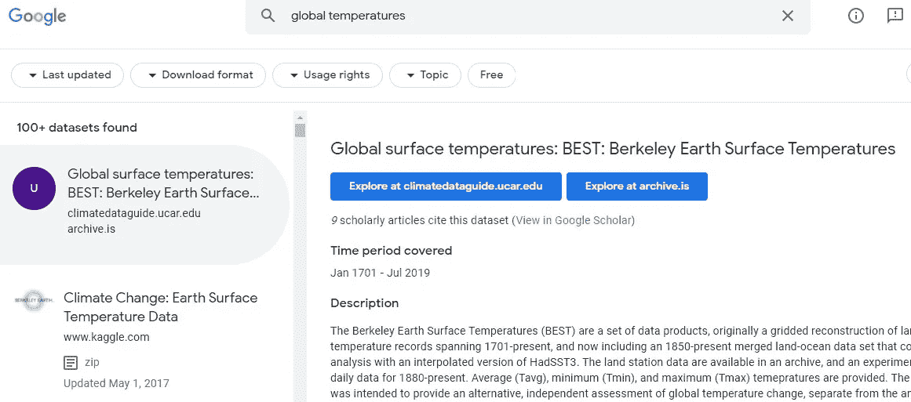
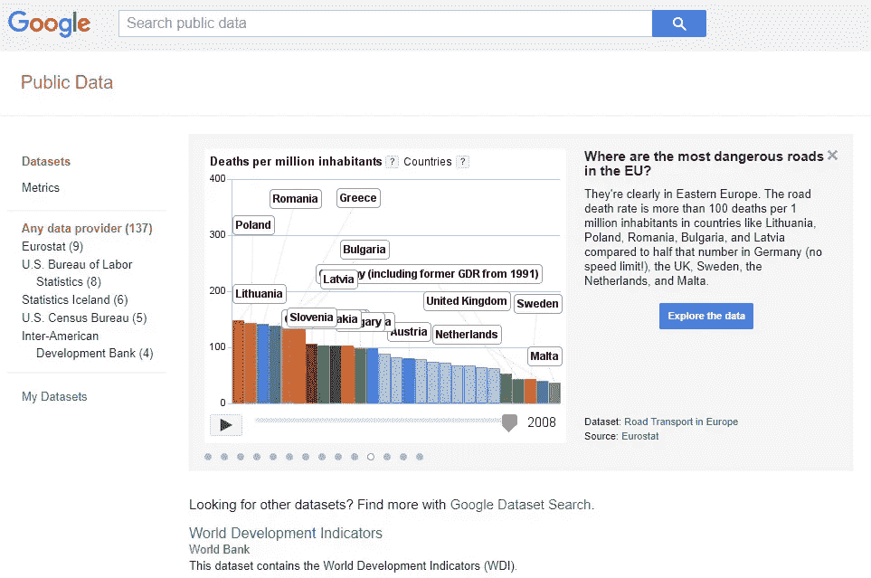

# 用于社会公益的数据科学:免费开放数据的最佳来源

> 原文：<https://towardsdatascience.com/data-science-for-social-good-best-sources-for-free-open-data-5120070caf02?source=collection_archive---------12----------------------->

## 类型、优点以及在哪里可以找到它们

Viktor Forgacs 在 [Unsplash](https://unsplash.com?utm_source=medium&utm_medium=referral) 上拍摄的照片

# 内容

1.  **简介**
2.  **什么是开放数据？**
3.  **开放与免费与在线数据**
4.  **去哪里找公开数据？**

*   国际组织
*   美国
*   欧洲
*   拉丁美洲
*   亚洲
*   其他开放数据源(谷歌公共数据浏览器、Kaggle、FiveThirtyEight、UCI 机器学习库等。 *)*

**5。结论**

# 介绍

数据科学有能力为建设我们想要生活的世界做出巨大贡献。已经有许多用例展示了如何利用它来解决现实世界中的问题。

在我以前关于这个主题的文章中也可以找到一些这样的例子:

 [## 造福社会的数据科学

### 超越我们想看什么类型的电影，到我们想生活在什么类型的世界。资源、示例和…

towardsdatascience.com](/data-science-for-social-good-a88838bc8ed0) 

然而，为了做到这一点，我们需要可以自由重用的数据，并以有用的格式进行组织。在本文中，我将介绍一些在这方面可以使用的最著名和最重要的门户网站。

# 什么是开放数据？

> **“开放数据”是指不受版权、专利或其他控制机制限制的免费数据。** *(* [*联合国儿童基金会数据*](https://data.unicef.org/open-data/) *)*

在这种情况下，仅仅在硬拷贝报告中公开共享数据是不够的。要使数据被认为是完全开放的，它必须遵循一定的原则，使其效用最大化:

*   使用国际公认的分类(国家适用 ISO-3166)进行组织；
*   使用非专有文件格式(如 JSON 或 CSV)；
*   通过符合标准的通信接口(如 SDMX-JSON)提供；
*   并用适当的元数据来描述它。

开放数据是一个更大的运动的一部分，它还包括开源软件、开放教育资源、开放访问、开放科学、开放政府等。

越来越多的特定类型的数据开始被视为*的“公共产品”，当这些数据可供使用、重用和免费分发时，可以带来**更好的政策制定、更明智的决策、价值创造和以公民为中心的服务**。而就是这样，[开放政府数据](https://www.oecd.org/gov/digital-government/open-government-data.htm)理念和一套政策也出现了。*

*开放式政府是一种理念，根据这种理念，公民应该能够获得政府文件和数据，以进行有效的公共监督。通过公开政府数据，公共机构在它们所服务的公民面前展现了透明度和问责制。*

*我遇到的一个令人惊讶的例子来自韩国首尔，在那里，开放数据已经成为常态，被用来解决城市和市民面临的真正挑战。在首尔，不仅公共机构在使用他们收集的数据，而且任何企业、非营利组织或普通公民都可以访问这些数据，如果他们希望利用这些数据或只是出于问责原因检查这些数据的话。*

*市政厅的目标之一是向市民提供开放数据，以便他们可以使用这些数据并在此基础上进行建设。通过这样做，它有助于创造一个新的行业，其中许多初创公司使用提供的数据来开发创新的解决方案，以应对城市面临的一些挑战。*

*想了解更多关于韩国和其他国家的例子，请看《经济学人》的视频:*

# *开放数据、免费数据和在线数据*

*开放数据是没有限制的数据。免费数据是可以免费获得的数据。通常，开放数据也是免费的。但当涉及到在线数据时，并不是所有的数据都可以免费或无限制地使用。在许多情况下，它是受版权保护的，是其创造者的专有权利，它需要许可或支付费用。*

*即使数据没有版权，事情也不是完全清楚的。我们可以想到从 LinkedIn 上删除数据。2019 年，[美国上诉法院驳回了 LinkedIn 阻止分析公司 HiQ 抓取其数据的请求](/web-scraping-is-now-legal-6bf0e5730a78)。即便如此，LinkedIn 不喜欢任何人试图从它的平台上抓取数据，并且[在一些文章中警告不要这样做](https://www.linkedin.com/help/linkedin/answer/56347/prohibited-software-and-extensions?lang=en)。*

# *去哪里找开放数据？*

*现在，让我们进入这篇文章的核心:在哪里可以找到公开的数据；无论是政府的还是其他类型的。下面，我介绍了国际组织提供的数据源、特定区域(美国、欧洲、拉丁美洲、亚洲)的数据源以及其他类型的全球相关数据源。*

# *国际组织*

## *世界银行公开数据*

* [## 世界银行公开数据

### 世界银行公开数据来自世界银行:数据

data.worldbank.org](https://data.worldbank.org/) 

通过这一门户，世界银行提供了免费和开放的途径，获取有关全球各国发展的大量数据。这是因为他们相信，通过提供更广泛的数据访问，他们可以提高透明度和问责制，并有助于帮助决策者做出更明智的决策。

用户可以按照国家和地区或指标浏览 4593 个数据集，这些数据集是围绕不同部门(农业、教育、性别、基础设施、环境、城市发展等)组织的。).

他们的搜索门户更有价值的是，它提供了对各种类型数据的访问，如**时间序列、微观数据**(从抽样调查、人口普查和行政系统中获得)，以及**地理空间数据**。

此外，如果你想更好地了解可以从他们的数据集中提取的信息类型，可以看看他们的 191 种可视化效果，涵盖的主题包括没有用上电的人数、全球二氧化碳排放量的增加、资源枯竭、获得改善的水源等。

## 经合组织数据

 [## 经合组织数据

### 查找、比较和分享最新的经合组织数据:图表、地图、表格和相关出版物...最新的经合组织中期…

data.oecd.org](https://data.oecd.org/) 

经合组织的数据门户网站提供了 875 个数据库，可以根据感兴趣的国家或主题(农业、发展、经济、教育、能源、环境、金融、政府、卫生、创新和技术、就业、社会)进行搜索。

该门户网站的好处之一是，它还提供长期记录的数据，有时早在 1959 年。一个不利之处是，它主要涵盖了与经合组织成员国相关的数据。例如，罗马尼亚不是其中的一部分。

如果你还不想下载数据集，只是想探索他们的存储，你可以在他们的数据仓库[中的大型数据库上进行自己的查询。统计](https://stats.oecd.org/)。

## 联合国数据

 [## UNdata

### 人口人口，表面积和密度国际移民和难民人口增长，生育率，寿命…

data.un.org](http://data.un.org/) 

联合国数据门户的创建源于这样一种信念，即统计应被视为一种公益，可以为循证政策和更好的知情决策服务。

该门户网站旨在提供对联合国编制的 32 个大型数据库中的 6000 多万个数据点的免费访问，与其他国际机构在单一入口点的访问一样。来源组织的例子有:粮食及农业组织、世界卫生组织、世界银行、经合组织、国际货币基金组织等。

搜索引擎允许用户根据更大的数据集、数据源或主题来查找信息。每个这样的元素都有一个下拉菜单，在我看来，可以方便用户导航。

此外，联合国数据通过单独的门户网站提供对三个专门的 UNSD 数据库的访问，如联合国国际贸易统计数据库、在线统计月报和众所周知的可持续发展目标指标。 [**联合国商品贸易统计数据库**](https://comtrade.un.org/) 是官方国际贸易统计数据、相关分析表格和出版物的资料库。 [**MBS Online**](https://unstats.un.org/unsd/mbs/app/DataSearchTable.aspx) 提供全球 200 多个国家和地区的经济社会统计数据。它包含 55 个表格，100 多个指标，涵盖各种主题，记录了 80 年。

[**联合国全球可持续发展目标数据库**](https://unstats.un.org/sdgs/indicators/database) 提供了对 460 个数据系列的访问，这些数据显示了在实现可持续发展目标方面取得的进展。门户网站上的搜索可以按目标及其具体目标和指标进行过滤，也可以按地理区域(因为它还包括国家概况)和年份(2000 年至 2019 年)进行过滤。

联合国数据门户网站提供的其他一些功能包括访问作为《联合国统计年鉴》一部分制作的流行统计表以及国家(地区)和区域的统计概况。

## 儿童基金会数据

 [## 公开数据-儿童基金会数据

### “开放数据”是指不受版权、专利或其他机制限制的免费数据…

data.unicef.org](https://data.unicef.org/open-data/) 

儿童基金会的数据门户网站是为那些希望专门处理儿童和妇女数据的人而设的。他们的 [**数据仓库**](https://data.unicef.org/dv_index/) 包括与儿童死亡率、儿童贫困、儿童保护和发展、教育、性别、孕产妇、儿童和新生儿健康、移民、营养、向工作过渡等主题相关的数据集。同样，数据也可以按国家过滤。

## **GHO 数据仓库——世界卫生组织**

 [## GHO

### GHO 数据库是世卫组织 194 个成员国获取卫生相关统计数据的门户。它提供对…的访问

www.who.int](https://www.who.int/data/gho) 

就数据而言，世卫组织的覆盖率很高，因为它与来自六个区域的 194 个会员国合作。通过全球卫生观察站，世卫组织提供了其监测的 1000 多项指标，这些指标可以根据可持续发展目标卫生和卫生相关目标下的主题、类别或国家进行导航。它提供的数据类型包括:道路交通伤害、非传染性疾病和精神健康、环境污染死亡率、烟草控制、清洁城市、健康公平监测等。

作者在谷歌数据集搜索上拍摄的标题

# 美国

## 数据。政府

 [## Data.gov

### 今天标志着老年人健康数据收集的启动-一个新的资源编目超过 200 个联邦数据集…

www.data.gov](https://www.data.gov/) 

美国政府的开放数据门户帮助用户浏览来自不同政府机构的超过 225 079 个数据集，这些数据集可以与工具和其他资源一起用于进行研究、开发 web 和移动应用程序、设计数据可视化等。

使用它的一个优点是，它允许根据位置(在地图上)、主题、格式、数据类型(地理空间或非地理空间)、组织、组织类型、局和出版商来过滤数据。

该门户的一个缺点是，尽管大多数数据集都有有效的元数据，但仍有一些数据集没有允许下载的有效 URL。

## 美国人口调查局

 [## Census.gov

### 人口普查局的使命是作为美国人口和经济的高质量数据的主要提供者。

www.census.gov](https://www.census.gov/) 

美国人口普查局负责产生关于美国人民和经济的数据，因为它的主要任务是每十年进行一次美国人口普查。它收集的数据然后被各级决策者使用——联邦、州或地方。

它提供的工具包括:美国事实查找工具、人口普查数据浏览器和 Quick Facts，这些工具允许用户根据自己的兴趣搜索和可视化数据。

# 欧洲

## 欧盟开放数据门户

 [## data . Europ . eu

### 欧洲数据门户收集公共数据门户上可用的公共部门信息的元数据…

data . Europ . eu](https://data.europa.eu/) 

欧盟开放数据门户网站提供免费获取广泛主题的数据，如:教育、环境、经济和金融、农业、林业、食品、卫生、政府和公共部门、司法、能源、科学和技术、交通等。 **15 561 个数据集**(截止日期)来自所有欧盟机构、团体和机关(如欧盟统计局、欧盟统计局、联合研究中心、欧洲投资银行、欧盟委员会总司、环境署等。).

门户网站上提供的大多数数据都可以免费重复使用，无论是用于非商业目的还是商业目的，前提是注明来源。而且只有少数数据集有特殊的再利用条件，这是出于保护第三方知识产权的需要。

作为奖励，该门户还提供对**可视化目录**的访问，该目录包括一系列**可视化工具**、**培训材料**[数据可视化研讨会和网络研讨会，涉及使用 D3.js、Qlik Sense、Webtools Maps、PowerBI 等工具以及**可重用可视化工具**。

## 欧洲数据门户

 [## 主页|欧洲数据门户

### 欧洲数据门户对欧洲开放数据的现状进行年度基准评估…

www.europeandataportal.eu](https://www.europeandataportal.eu/en) 

该门户由欧洲联盟出版办公室管理，收集欧洲各国公共数据门户上的公共部门信息元数据。迄今为止，它涵盖了 36 个国家、81 个目录和 1，089，978 个数据集，人们可以根据类似于欧盟开放数据门户使用的类别进行搜索。

此外，它还包括关于提供数据和重新使用数据的好处的信息。

## 开放所有欧盟成员国的政府数据网站

*   [data.gov.be](http://data.gov.be/)
*   [data.egov.bg/](https://data.egov.bg//)
*   [data.gov.cz/english](https://data.gov.cz/english)
*   [portal.opendata.dk](http://www.portal.opendata.dk/)
*   [govdata.de](http://govdata.de/)
*   [opendata.riik.ee](https://opendata.riik.ee/en)
*   [data.gov.ie](http://data.gov.ie/)
*   [data.gov.gr](http://data.gov.gr/)
*   [datos.gob.es](http://datos.gob.es/)
*   [data.gouv.fr](http://data.gouv.fr/)
*   [data.gov.hr](https://data.gov.hr/)
*   [dati.gov.it](http://dati.gov.it/)
*   [data.gov.cy](http://www.data.gov.cy/)
*   [opendata.gov.lt](http://opendata.gov.lt/)
*   [data.gov.lv](http://data.gov.lv/)
*   【data . public . Lu】
*   【data.gov.mt 
*   [data.overheid.nl](http://data.overheid.nl/)
*   [data.gv.at](http://data.gv.at/)
*   [danepubliczne.gov.pl](https://danepubliczne.gov.pl/)
*   [dados.gov.pt](http://dados.gov.pt/)
*   [data.gov.ro](http://date.gov.ro/)
*   [podatki.gov.si](https://podatki.gov.si/)
*   [data.gov.sk](http://data.gov.sk/)
*   avoindata.fi
*   [机会来了](http://oppnadata.se/)

加上不再是欧盟一部分的英国:

 [## 开放式政府

### 英国第四个开放政府国家行动计划 2019-21 (NAP)，在第六届开放政府期间发布…

www.gov.uk](https://www.gov.uk/government/collections/open-government) 

# 亚洲

## 亚洲开发银行数据库

 [## 亚行数据库|亚洲开发银行

### 亚行鼓励网站和博客链接到其网页。文章可以不加修改地重新发布…

data.adb.org](https://data.adb.org/) 

亚洲开发银行成立于 1966 年，有 68 个成员，其中 49 个来自亚洲和太平洋地区。它的数据库有一个非常直观的搜索系统，通过这个系统，人们可以按主题或国家进行浏览。该存储库包含(迄今为止 [)](https://www.adb.org/) 234 个数据集、45 个仪表盘和 10 个数据故事。涵盖的主题包括:金融部门、贫困、人民、公共部门治理、经济学和其他。

我在亚行最近的评估会议上了解到的另一个有趣的亚行产品是 [**EVA**](https://www.learnfromeva.com/) **，这是一个人工智能引擎**，它扫描评估和其他类型的文件，以确定亚行在其成员国开展的业务中的经验教训。

## 韩国开放政府数据门户

 [## 대한민국 정보공개 포털

### 编辑描述

open.go.kr](http://open.go.kr/) 

在开放数据方面，韩国是最佳实践的一个很好的例子。然而，他们的网站是专为母语人士设计的。

# **拉丁美洲**

## 数字促进发展

 [## 美洲开发银行

### 探索一个国家的主要发展指标与其宏观经济概况、全球…

data.iadb.org](https://data.iadb.org/) 

数字促进发展是美洲开发银行的开放数据门户，展示了拉丁美洲和加勒比地区的社会经济指标。它建立在七个数据源之上:Agrimonitor(跟踪农业政策)、INTrade(区域贸易)、Latin Macro Watch(宏观经济、社会问题、贸易、资本流动、市场和治理)、公共管理、社会脉搏(生活状况)、SIMS(劳动力市场)、Sociometro(社会经济状况)。搜索过程可以按国家或指标过滤。

下面，我添加了一篇有趣的文章，内容是关于大数据和开放数据以前在拉丁美洲国家是如何用于社会公益的:

 [## 大数据和开放数据如何改变拉丁美洲

### 我们使用 cookies 来改善您在我们网站上的体验。通过使用我们的网站，您同意所有 cookies 符合…

www.weforum.org](https://www.weforum.org/agenda/2018/03/latin-america-smart-cities-big-data/) 

拉丁美洲国家的开放数据门户

*   [智利开放数据](http://datos.gob.cl/dataset)
*   [秘鲁公开赛数据](https://www.datosperu.org/)

# 其他开放数据源

## 谷歌公共数据浏览器

 [## 谷歌公共数据浏览器

### 谷歌公共数据浏览器使大型数据集易于探索、可视化和交流。因为图表和地图…

www.google.com](https://www.google.com/publicdata/directory) 

谷歌公共数据浏览器在某种程度上是一个搜索引擎，方便访问由国际组织(如本文前面所述)、国家统计局、非政府组织和研究机构提供的数据集。此外，其背后的团队希望为用户提供更多，这就是为什么他们的目标是使公众感兴趣的大型数据集更容易探索、可视化和交流，即使是非技术受众也是如此。

作者在谷歌公共数据浏览器上拍摄的标题

除了谷歌公共数据浏览器之外，还有 [**谷歌数据集搜索**](https://datasetsearch.research.google.com/) 引擎，它使用户能够通过简单的关键字搜索找到存储在网络上的数据集。当使用它时，可以应用与下载格式、使用权、主题相关的过滤器，或者根据最近的更新。数据源在搜索返回结果中对其数据集进行排名的一个标准是引用了某个数据集的学术文章的数量。

作者在谷歌数据集搜索上拍摄的标题

## 五三八

 [## 我们的数据

### 我们正在分享一些文章和图片背后的数据和代码。

data.fivethirtyeight.com](https://data.fivethirtyeight.com/) 

FiveThirtyEight 是来自新闻领域的高质量数据的非常全面的来源。涵盖的主题包括:政治、体育、科学与健康、经济和文化。

## 卡格尔

 [## 查找开放数据集和机器学习项目| Kaggle

### 下载数千个项目的开放数据集+在一个平台上共享项目。探索热门话题，如政府…

www.kaggle.com](https://www.kaggle.com/datasets) 

在开放数据源中，Kaggle 可能是数据科学家最熟知的，因为它围绕它建立了社区。

Kaggle 支持数据集的各种发布格式，但他们也鼓励数据集发布者尽可能以可访问和非专有的格式共享数据。支持的文件类型包括:CSV、JSON 和 SQLite。

对于数据科学新手来说，Kaggle 的一大优势是，它通过围绕每个数据集创建社区来支持学习，在社区中，每个感兴趣的用户都可以通过解决与该数据集相关的任务来做出贡献，提交他们的结果并参与讨论，接收和提供反馈。

## DBpedia

 [## DBpedia

### 与我们联系。成为 DBpedia 协会的成员，加入我们的各种委员会或帮助开发一个…

wiki.dbpedia.org](https://wiki.dbpedia.org/) 

DBpedia 是基于维基百科中最常用的信息框构建的，其本体目前包含 4 233 000 个实例，例如，其中 1 450 000 个是个人，241 000 个是组织。它的数据此前已使苹果、谷歌和 IBM 等公司受益，用于它们一些最重要的人工智能项目。

## UCI 机器学习知识库

[加州大学欧文分校机器学习知识库](https://archive.ics.uci.edu/ml/index.php)包含 557 个数据集，可用于机器学习算法的**实证分析。它创建于 1987 年，一直被学生、教育工作者和研究人员用作机器学习数据集的主要来源。他们最新上传的数据集涵盖的主题包括:脸书大型网页网络、两栖动物、早期糖尿病风险预测、比特币等。自 2007 年以来，最受欢迎的五大数据集是指:鸢尾植物的种类，根据人口普查数据预测收入是否超过 5 万美元/年，使用化学分析确定葡萄酒的原产地，诊断乳腺癌，患者是否患有心脏病。**

# 结论

在浏览上述门户网站时，我惊讶于它们所提供的大量信息，以及其中一些提供给公众使用的附加工具。数据真的可以很美。

随着世界上可用的数据量越来越大，我相信我们有越来越多的机会将它们用于更高的目的，帮助塑造一个更美好的世界。

感谢您的阅读。我希望内容是有用的。如果你认为还有其他开放数据的来源值得添加，请在评论中提及。*