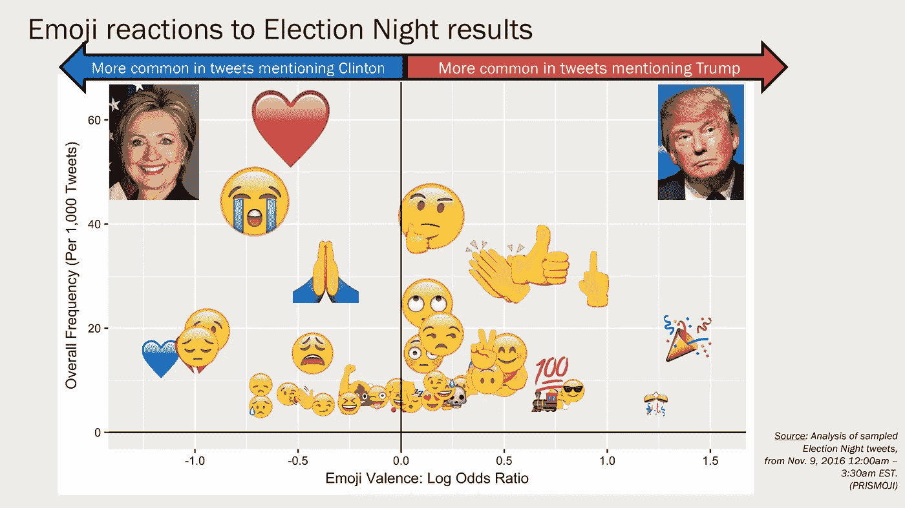

# 为理解而丢失的数据科学艺术

> 原文：<https://towardsdatascience.com/data-science-for-understanding-vs-data-science-for-prediction-ffe846ee11e1?source=collection_archive---------31----------------------->

## 通过将我们的领域局限于预测数据科学，我们使得这个领域更少人性化——结果是更难接近

用于理解的数据科学和用于预测的数据科学之间存在巨大差异。

前者是理解人们为什么使用🙃表情符号和他们试图传达的情绪状态——以及这在不同文化和年龄组之间有何不同。

后者预测，如果有人以一定的顺序键入某些单词，那么他们将键入的下一个表情符号是🙃。

前者需要丰富的跨学科技能——主要是人类的技能——正如我 2016 年在宾夕法尼亚州立大学[演讲中首次提出的。](https://www.youtube.com/watch?v=TxmPmBKKu84)

后者是一个纯粹的技术问题，甚至可能是一个微不足道的技术问题，只是端到端数据科学过程的一部分。

## 没有好奇心，就不会有理解🤔

不幸的是，“预测者”主导了当今数据科学领域的流行概念——尤其是围绕机器学习和人工智能的炒作。

每个人都想掌握最新的技术和建模技术，却不了解我们正在建模的潜在现象。

不仅没有理解，连一点好奇心都没有。

多年来，我最喜欢问数据科学学生的一个问题是，如果他们可以访问世界上所有的数据，他们会做什么。在过去，他们会说“我会寻求理解恒星的诞生，或社会的进步，或抑郁症的原因。”

现在，他们说“我会寻求学习计算机视觉，或深度学习，或神经网络。”

我们把所有的注意力都放在工具上，而忽略了我们试图解决的问题。杰出的德国心理学家埃里希·弗洛姆(Erich Fromm)在 1947 年就预见到了这一点，他写道:“我们已经陷入手段之网，看不到目的。”

不仅如此，当涉及到数据科学时，我们已经使这个领域变得更不人性化，因此更不容易接近。

## 数据科学是帮助我们了解世界的工具🌍

这几乎肯定是一个有争议的——很可能是少数——立场，但我甚至不确定用于预测的数据科学是否应该被视为数据科学——或者是否应该被视为工程学的一个分支。

公平地说，我主要认为自己是一名将数据科学作为理解世界的**工具**的研究人员，而不是我研究的对象本身，这一观点是由这一背景驱动的。

在我的职业生涯中，我一直感兴趣的问题基本上都是人类的问题。广告如何影响购买行为？我们如何让人们投票给我们的候选人？为什么人们会使用特定的表情符号，它们是什么意思？

这些都是涉及完整的端到端数据科学流程的问题。为了解决这些问题，我们需要有活力、有远见、跨职能的科学家，他们有天生的好奇心，热衷于了解世界和推动影响。

由于对预测的狂热关注，以及数据科学教育的卡格勒化，这些天我办公桌上的大多数数据科学简历都是学生们急切地寻求在最尖端的技术上超越彼此。

然而，他们简历上的几乎所有东西都是定义明确的项目，别人为他们做了最艰苦的工作。其他人定义问题，其他人收集、处理和组合数据。在他们建立了一个模型之后，其他人决定了这个模型的含义和下一步该做什么。

需要说明的是，当然有一些数据科学的工作只专注于构建模型，而且大多数工作报酬都很高。

但对我来说，这些工作并没有体现出数据科学的真正潜力和前景——增进我们对周围世界的了解。

## 只专注于机器学习会让我们的领域变得不那么多样化🖥

如果今天的数据科学家被视为整天坐在电脑后面，调整超参数的人，那么我们已经大大削弱了我们的领域，并因此使其更加多样化。

当我第一次进入数据科学(通过生物统计学的方式)——当哈尔·瓦里安第一次[在 2009 年说](https://flowingdata.com/2009/02/25/googles-chief-economist-hal-varian-on-statistics-and-data/)“未来十年最性感的工作将是统计学家”——我们设想的人是一个有远见的布道者，让人们对这个迷人的新领域的潜力感到兴奋。

就连瓦里安也形容这个人有“获取数据的能力——能够理解数据、处理数据、从中提取价值、可视化数据、进行交流。”

我们是如何从 2009 年的那个起点走到今天的，当时我的一个同事半开玩笑地对我说，“我永远不会信任一个数据科学家去做一个 Powerpoint。”

我最近遇到了一位年轻的数据科学家——她向我坦白说，她有很多处理数据的经验，但对机器学习来说是新手，她甚至不确定自己是否应该成为数据科学家。

我不知道现在的学校在教什么，也不知道硅谷的招聘实践在传达什么，但这是一个非常新的现象！

我在 2012 年开始面试数据科学的工作，机器学习会作为一种事后想法出现，而且很少。

对于我面试的几乎每一个职位——初创公司和大型科技公司都是如此——我只是偶尔会被问及机器学习。我会笑着说我只知道聚类和分类的区别。招聘经理会说，这已经足够了😂

## 我们如何吸引充满活力、全面发展、充满好奇心的思考者进入我们的领域？🤓

在几乎所有情况下，数据科学中涉及模型拟合的部分通常是该过程中最不有趣、难度最小的部分。这一部分在两边都被动态和令人兴奋的问题空间所包围:将现实世界的问题转化为数据科学问题，获取、准备和清理数据，在左边和右边，找到见解并将其编织成一个产生影响的故事。

过去几年，我职业生涯中最大的收获之一是我有多爱“数据侦探工作”——这也是我对新闻业的热情派上用场的地方。追踪不同的数据来源，理解它们的含义，分析数据，并了解其来源。我觉得这一切太迷人了！

如果 80%的数据科学都是在清理数据，那么我们也需要热爱这一部分的人，而不仅仅是把它视为麻烦的人。

如果我们只将这个领域缩小到机器学习和预测，我们能够吸引那些充满活力、充满好奇心、有条不紊和坚持不懈的思想家吗？

还是说，这只会导致那些可能成为最佳大图数据科学家的人被吓得退出这个领域？这是否会导致工程导向型的人进入这个领域，期望一直做所有的 ML，而对实际的数据科学大部分时间是什么样子感到不满，并离开这个领域？

我不假装知道所有的答案，甚至不知道其中的任何一个，但我确实认为我们需要重新利用数据科学的价值来理解世界，而不仅仅是预测未来。

*迈向数据科学的一小步为了理解:*[*2016 选举日的顶级表情符号*](https://prismoji.com/2016/11/26/the-top-emojis-of-election-day-2016/)