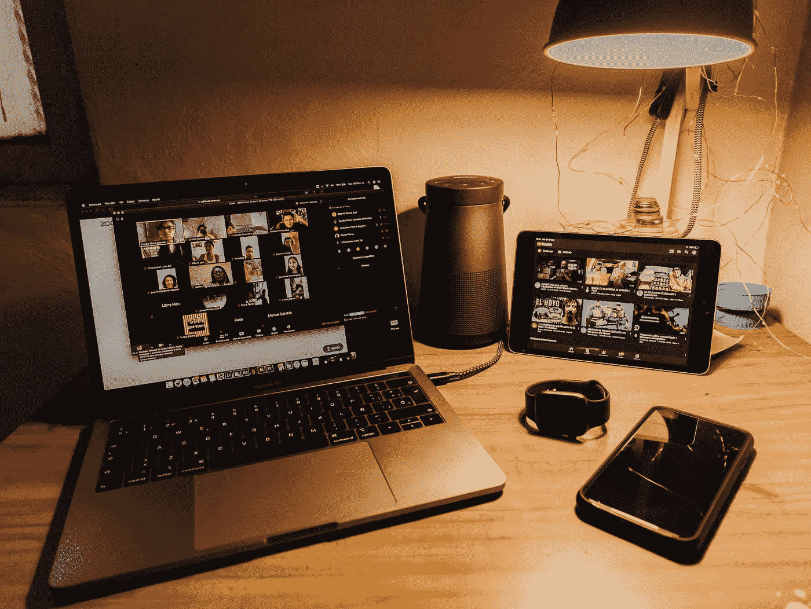
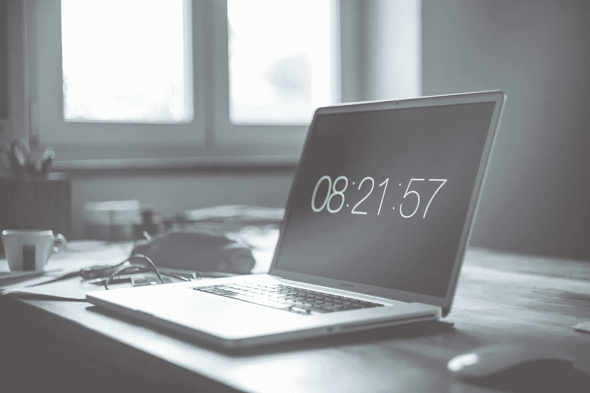

# 2020 年的数据科学

> 原文：<https://towardsdatascience.com/data-science-in-2020-afdcb2f6979f?source=collection_archive---------69----------------------->

## 什么保持不变，什么有所不同？


裘德·贝克在[Unsplash](https://unsplash.com/s/photos/2020?utm_source=unsplash&utm_medium=referral&utm_content=creditCopyText)【1】上的照片。

# 目录

1.  介绍
2.  什么保持不变？
3.  有什么不同？
4.  摘要
5.  参考

# 介绍

2020 年当然有太多的不幸事件影响到几乎每个人。但是科技行业受到了怎样的影响，更具体地说，2020 年的数据科学受到了怎样的影响？根据您居住的地方、从事的行业以及您是哪种类型的数据科学家，这些异同可能适用于您，也可能不适用于您。下面，我将讨论这些影响，以及它如何在今年余下的时间里影响你。

# 什么保持不变？



由 [Gabriel Benois](https://unsplash.com/@gabrielbenois?utm_source=unsplash&utm_medium=referral&utm_content=creditCopyText) 在[Unsplash](https://unsplash.com/s/photos/video-conference?utm_source=unsplash&utm_medium=referral&utm_content=creditCopyText)【2】上拍摄的照片。

因为数据科学大部分时间都是技术领域的一部分(*或者说，与其他工作*相比，这个角色本身几乎不需要那么多的亲自参与的工作)，所以日常工作中有一些部分幸运地保持不变，没有负面干扰。*以下是数据科学过程中保持不变的相似之处或部分:*

*   *视频会议的使用*

当然，视频会议现在非常普遍，但根据我的个人经验，以及数据科学社区中其他密友的已知经验，视频会议在过去已经在大多数日常工作中占据突出地位。在我之前的一些公司，我和我们的团队需要在整个工作周通过视频进行几次通话，甚至每天都要打几次电话。进行这种沟通的原因是，虽然我们的团队亲自密切合作，但我们的利益相关者却没有。我们不再花 30 分钟到一个小时开车到其他有不同部门的办公室——更多的是围绕业务和非技术焦点，而是开一个视频会议。这样，当我们今年真的需要做同样的工作方法时，它实际上与我们以前的日常工作没有太大的变化。

*   *跨职能协作*

与我上面所说的类似，无论是过去还是现在，都需要不仅仅是一个数据科学团队的协作，还需要其他几个团队的协作。一些例子是与市场营销、商业分析、客户服务等领域的利益相关者合作。同样的合作今年也很突出。

*   *JIRA 和其他产品管理工具的使用*

作为与利益相关者合作的一种方式，我们将使用 JIRA 或其他类型的产品管理工具进行交流。我们会创建票证，并在头脑中记着 sprint 目标来完成它们。今年也是如此。

# 有什么不同？



由[马库斯·斯皮斯克](https://unsplash.com/@markusspiske?utm_source=unsplash&utm_medium=referral&utm_content=creditCopyText)在[Unsplash](https://unsplash.com/s/photos/time?utm_source=unsplash&utm_medium=referral&utm_content=creditCopyText)【3】上拍摄的照片。

由于数据科学家的一些日常工作保持不变，今年的日常工作也发生了重大变化。

*   *更多视频会议*

尽管我们已经在数据科学领域的许多合作中进行了视频会议，但今年我们还是进行了视频会议。起初，这有点让人不知所措，因为你必须学习视频交流的礼仪(*尽量不打断，但必要时也要参与*)。但是现在，已经司空见惯，意料之中，所以一直是慢慢变得正常的差异。

*   *不再有面对面的工作(对于许多公司，而不是所有公司)*

伴随着以上一点，没有亲自动手。今年我甚至开始了我的工作，完全是在遥远的地方。这绝对是一次独特的经历，但随着每一天的到来，它变得越来越正常。

> 这种变化也促使企业首先询问自己是否需要办公室。

> 然而远程工作有时也有消极的一面——懒惰、工作量减少等等。现在，它得到了更多的尊重，一些公司甚至看到了更多的进步。

*   *你工作的时间*

今年远程工作的一个更独特的副作用是，你不再需要正常的上午 9 点到下午 5 点的工作时间。有些日子你可以晚一点开始，但随后你会发现自己在家里的办公室工作到晚上 7 点，只是因为你没有被提醒要设法避开交通，并在正常的社会驱动的下午 5 点下班时间离开。当然，这可能是积极的，也可能是消极的，取决于个人和公司。

*   *新的工作时间*

上面提到的一个可能的积极因素是，当你整天在家工作时，你会发现自己产生了更多的结果，做了更多的研究。你获得的新的工作时间可以是一个积极的变化，因为你不再花 30 分钟到 2 小时去上班——在我住的地方和其他大城市，交通会感觉好像永远都在工作，到你去工作的时候，你实际上已经筋疲力尽了，只是在你离开的时候又要做一次。因此，积极的一面是能够在仅仅清醒几分钟后就投入工作，完成更多的工作，也许是在下午 3 点而不是下午 5 点完成远程工作。

# 摘要

如您所见，对于数据科学家来说，2020 年有哪些保持不变，哪些发生了变化，有几个关键要点。这些要点也可以应用到其他护理人员和行业。*总结一下，这些要点如下:*

```
**Stayed the same:***Use of video conferencing**Cross-functional collaboration**Use of JIRA and other product management tools***Is now different:***Much more video conferencing**No more in-person work (for a lot of companies, not all)**The hours you work**The new amount of time you get for working*
```

*感谢您的阅读！我希望你喜欢我的文章，并学到一些新东西。欢迎在下面评论你在 2020 年作为数据科学家的经历。什么对你来说保持不变，什么变了？哪些变化你不喜欢，哪些你喜欢？*

# 参考

[1]照片由[裘德·贝克](https://unsplash.com/@judebeck?utm_source=unsplash&utm_medium=referral&utm_content=creditCopyText)在[Unsplash](https://unsplash.com/s/photos/2020?utm_source=unsplash&utm_medium=referral&utm_content=creditCopyText)(2019)上拍摄

[2]Gabriel Benois 在 [Unsplash](https://unsplash.com/s/photos/video-conference?utm_source=unsplash&utm_medium=referral&utm_content=creditCopyText) 上拍摄的照片，(2020)

[3]2017 年 [Markus Spiske](https://unsplash.com/@markusspiske?utm_source=unsplash&utm_medium=referral&utm_content=creditCopyText) 在 [Unsplash](https://unsplash.com/s/photos/time?utm_source=unsplash&utm_medium=referral&utm_content=creditCopyText) 拍摄的照片