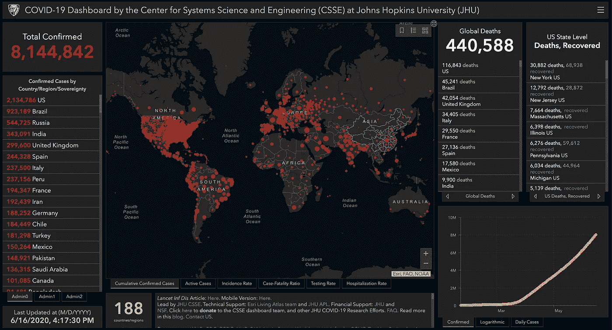

# 后危机时代的数据科学

> 原文：<https://towardsdatascience.com/data-science-in-a-post-crisis-world-8d1a477d38f7?source=collection_archive---------26----------------------->

## 过去不一定能预测未来

*来源:* [*约翰·霍金斯【COVID 仪表板*](https://www.arcgis.com/apps/opsdashboard/index.html#/bda7594740fd40299423467b48e9ecf6)

十年前，我刚刚开始涉足生物信息学，不知疲倦地学习统计学和计算。我开始学习 R 和数据库，用二手的 Pentium IIIs 搭建了一个集群进行并行计算，看了入门的机器学习文献。一切感觉就像昨天一样，却又是永远的过去。我很幸运，根本无法想象几年后我会在数据、科学和计算领域做些什么。过去几年可能是参与这一技术和方法演变的最佳时期；工具从未如此之好，数据从未如此之丰富，职业前景从未如此之乐观。从**久负盛名的* **旗/方**到新兴的五人初创企业，数据科学这个术语随处可见。突然间，感觉我们拥有了解决癌症、贫困和各种社会政治问题的所有知识和工具，坐在自动驾驶汽车里，飞向月球。*

*事实证明，只有最后一个愿望可能很快就会实现。2020 年初是一系列的警钟。疫情在短短几周内摧毁了世界，随之而来的是大规模的隔离、关闭、社会运动和动乱。随着经济引擎的燃料供应被切断，公司采取一切手段以求生存。不幸的是，数据科学部门发现自己很早就面临裁员，这可能与技术角色相对更能抵御经济危机的传统观念相矛盾。这要归咎于疫情，但可能不是所有的裁员；重组和整合是下意识的反应。这一过程的一部分可能是加速一场迟到的学习——当公司正在考虑如何迎接风暴并为复苏做准备时，一个不成比例的大数据科学团队可能被认为不太重要。*

*那么，为什么数据科学仅仅用了几个月的时间，就从 21 世纪最性感的工作变成了商业中不那么重要的工作呢？我们来深入探讨一下。还要注意，我将使用数据科学这个术语来涵盖**更多的** **技术领域**，比如**机器学习、统计学习、因果推理、AI，为了方便起见**。此**不**涵盖基本分析、报告、数据工程或商业智能，因为这些功能通常是全面需要的。不区分可能会使我的两美分过于宽泛，不能涵盖所有的细微差别，所以请原谅我。*

## *数据科学的价值，解释*

*数据科学不是魔法，也不能凭空创造价值，尽管有些人可能不这么认为。为了让数据科学释放其全部潜力，至少有三个先决条件:*

*   ***业务**正处于稳步增长的上升轨道，有一个巨大的基线，即使 1%的增量也足以证明大量数据科学投资的合理性；*
*   ***领导层**真正了解数据，并愿意将数据的声音纳入战略构建，而不是利用数据来强化预先确定的决策；*
*   ***工程平台和运营团队**成熟且可扩展，因此数据产品可以快速迭代和部署以实现收益。*

*我将详细解释这三个先决条件，但假设我的观点与事实相差不远，为了让数据科学大放异彩，需要具备很多能力。指望聘请一位知名研究人员担任首席数据科学家并立即产生回报，可能是不现实的。此外，这样一个高素质的团队甚至可能不是企业所必需的。*

*所以事不宜迟，让我们详细讨论一下这三个先决条件。*

## *一个稳定增长的大企业*

*这在开始时可能不是不言自明的，因为世界经济的大部分在过去五年中都处于某种形式的增长或超增长状态，所以我们无法观察到反事实:当业务萎缩时，数据科学将如何发挥作用。过去的几个月表明，很少有人对减缓出血感兴趣；利用数据将周环比增长率从-20%降至-10%可能并不值得称赞。当衰退开始时，需要实施激烈的策略，例如暂停某些产品供应，分配过大的折扣，采取强有力的保留和重新激活措施，转向新的收入流等。由于这种策略以前很少执行(即使执行了，也可能被认为是异常值)，过去的学习很难预测未来的结果，更不用说与市场中其他参与者同时移动所产生的二阶效应了。最终结果是数据科学的价值可能会迅速减少。*

*公司还可能意识到，这种战略和市场的不稳定性可能会在复苏阶段延续足够长的时间，因此，在未来几个月或几年内，可能不太需要全面的数据科学/机器学习团队。另一方面，如果业务以每月 20%的速度增长，投资于扩展产品功能、加强工程基础设施，甚至扩大物流和客户服务以进一步推动增长，可能会比大量投资于最先进的数据科学以改善现状更好。简单的目测分析和建模可能就足够了。例如，从战略上来说，投资 100 万英镑在未来 6 个月内将服务扩展到一个新的城市可能是一个更好的选择，而不是扩大当前的数据科学团队，这可能会也可能不会带来与优化现有城市业务相同的回报。另一点需要注意的是，随着最近数据科学的繁荣和人才的供过于求，公司可能有信心缩小数据科学部门的风险很低。尽管顶级人才仍然有很高的溢价，但从零开始相对快速地重建一个有能力的团队可能不会太具挑战性。*

*现在我们已经看到，在危机期间和危机过后，企业可能不需要大规模的数据科学存在。那么，数据科学发挥作用的最佳场景是什么？我认为企业可能需要:*

*   ***不缩水:**利用数据减少整体损失并不是一件值得庆祝的事情。资本和资源可以更好地引导到强有力的支点。*
*   ***不过度增长:**投资新功能可能比优化更可取，此外，过去的经验可能无法预测未来，因为业务变化可能非常快。在数据科学有效发挥作用之前，可能还有许多技术债务需要偿还。*
*   ***不平坦**:如果业务进入缓慢增长和平台期，那么可能没有足够的增长/参与度来利用。事实上，最近科技领域数据科学的裁员可能部分归因于增长缓慢，因此可供探索的增量较小。*

*业务和产品也需要有足够的复杂性，以便机会不是肉眼直观的，而是只能通过复杂的数据分析和建模来发现。如果一个商家只在网上向客户销售一种产品，那么可能没有多少数据科学魔法可以施展。在一个由卖家、商品和买家组成的三方在线市场中，一种算法可以真正超越简单的规则系统，获得可观的利润，尽管回报在减少。第一种算法可能比简单规则高出两位数，比如 10-20%，但随后的改进可能会小得多，与现状相比通常不到 5%，代价是复杂性和可扩展性/维护挑战日益增加。如果你查看任何 Kaggle 竞赛，基线通常是随机森林或 xgboost 模型，获胜的解决方案通常是数百个模型的混合，结合外部数据和多轮仔细调整。然而，这种性能差异在商业上可能没有实质性的意义。对于不断增长的业务规模和复杂性，对数据科学功能的大量投入有时是一种前期投资，因此增长部分是投资假设的一部分。*

*也许实施这种非常复杂的方法来实现不到 5%的增量收益的唯一逻辑原因是，考虑到所有相关的直接成本和机会成本，5%的增量对业务来说必须足够重要。这意味着基线收入，或任何代理指标，如每日活跃用户，需要是巨大的。即使年收入达到 1 亿英镑，500 万英镑的 5%增量可能也只能维持 20 人强大数据科学团队的收支平衡，而且无法保证这种增量在未来几年能够实现。基线可能需要数十亿，在这种情况下，舞台上只剩下几个大玩家(脸书、苹果、亚马逊、谷歌、腾讯、阿里巴巴等)。对于较小的公司来说，投资于工程、销售、营销和分析，而不是技术密集型数据科学，可能会在短期内带来更好的回报。我过去曾在非常早期的阶段(不到 10 人)与相当多的公司交谈过，业务和产品处于早期开发阶段，雄心勃勃地计划建立一个数据科学/机器学习功能。现在还为时过早，这个团队更有可能被用来吸引投资者，而不是做有意义的工作。他们可能会花大部分时间进行特别分析，以回应领导的好奇心或建立数据管道。这并不是说这些不是关键任务，但这不是使用这种招聘的最佳方式。*

*您可能已经感觉到，数据科学是一个相当微妙的有机体，需要微妙的业务养分才能生存。它需要更多的内部和外部因素才能茁壮成长；进一步阅读。*

## *精通数据科学的领导层*

*学术界和工业界的一个显著区别是，一个好的纸上研究是否能在合理的时间内在生产环境中实施，并有明确可衡量的结果。要做到这一点，领导层必须 1)全面了解数据科学产品，它能做什么，不能做什么，以及所有相关的风险、偏见和陷阱；2)支持所有级别的基于数据的思维和决策，并为数据科学提供有效的发言权；3)尊重数据的客观性；不要通过寻找有利的信号来将数据科学武器化。这些看似简单，但实际上很难做到始终如一。*

*成功的第一要素是领导者理解数据科学:数据是如何收集、汇编和提炼的；什么是抽样偏差；捕捉到了什么，更重要的是，**没有**捕捉到什么；分析和建模是如何完成的，假设和权衡是什么，等等。如果一位数据科学家分析了一项实验，并报告说一项新功能可能会增加 1%的用户参与度，那么这种说法通常会有很多假设。这种假设通常会在讨论、电子邮件链和总结中丢失，从而导致较大广播半径下的保真度降低。几度分离之后，人们可能会将一个*估计*解释为一个*事实，*将一个*地区性*实验的结果混淆为一个*全球性*实验，做出错误的推断，在错误的上下文中引用这样的数字来支持某些论点，等等。领导者需要意识到并促进数据科学研究的正确解释和使用，并在必要时进行纠正，有时甚至要介入并管理叙述。否则，误解可能会迅速发生，从而损害数据科学组织的可信度。*

*第二个要素是为数据科学提供合适的话语权。在过去，我目睹了两种情况，一种是数据科学家把从数据中发现的东西作为最终的真理来否定其他人的论点，另一种是数据科学家坐在决策桌的末端投下名义上的一票。这两种情况都不健康。理想情况下，数据科学应该为正在讨论的问题带来独立、客观(尽最大可能)和正交的观点，与其他各方(如工程师、设计师、消费者洞察、财务等)拥有平等的发言权。对数据的过度依赖可能会成为数据谬误的牺牲品，例如抽样偏差——被认为是对世界的客观描述实际上可能不具有代表性。名义上对数据的依赖会让数据科学团队无能为力。很难取得平衡，但肯定可以做到。*

*第三个要素是保持数据科学的客观性，不要只强迫有利的发现。从复杂而丰富的数据集中寻找预期的结果，在特征选择过程中冒泡某些特征或编造相关性，通常并不困难。领导者很容易从数据科学功能中找到额外的决策保证。有些人甚至认为只报道有利的发现而隐瞒测试不一定是撒谎。领导者需要意识到这一点，并尽快采取正确的行动，因为这不仅对内部和外部的数据科学职能部门，而且对所有合作者都极具破坏性。领导者应该明确并以身作则，这是一条永远不应该跨越的红线。*

## *成熟的工程/运营平台*

*即使满足了所有这些先决条件，成熟的工程平台也是有效执行数据科学的必备条件。与数据科学相关的工程能力并不少见，如数据平台、审计、模型部署、实验工具包等。不断降低优先级，以便为更关键的产品功能开发腾出空间。因此，数据科学**研究**和**部署**之间往往会有差距。数据科学团队可能会编译一些数据，离线运行研发，然后返回一个可能会产生重大业务影响的模型。不幸的是，由于缺乏基础设施开发，甚至可能需要 3-6 个月的时间才能部署。当部署准备就绪时，整个业务可能已经转移，这可能会使之前的研究变得无关紧要。因为数据科学产品依赖于如此多的移动部分，所以解决数据接收、编译、模型部署、可扩展性和产品集成的成熟平台对于允许数据科学团队自助服务至关重要。否则，数据科学团队将别无选择，只能等待许多其他团队来铺平道路，然后才能交付任何东西。要做到这一点，不仅需要一个强有力的精通数据的领导层，还需要一个规模足够大的公司，以便能够留出资源来投资开发这种能力。较小的参与者通常没有这种奢侈，因此不得不继续依赖不太理想和更特别的解决方案。*

*所以现在你可能会问——我们到了吗？仍然可能缺少一个组成部分——一个能够执行战略并交付成果的强大的基层运营团队。想象一个客户服务优化工具，就像优步的 COTA 一样，让人类参与其中:客服人员需要训练有素才能使用这个工具来实现它的价值。仓库优化模型可能会假设工人可以以一定的速度重新进货和运输货物，这在现实中可能是真的，也可能不是真的(这可能会给地面上的人增加压力和紧张)。数据科学产品的预期增量回报和实现的增量回报之间存在巨大差异并不罕见，调试整个生命周期也不是小事。每一部分都必须完美无缺地运行，从这个意义上说，数据科学确实是火箭科学的翻版。*

## *现金蜜月的结束*

*一系列危机以及近期独角兽的表现不佳和破灭，给不惜一切代价追逐增长的狂热浇了一桶冷水。投资者可能会更加保守，盈利能力而不是收入/活跃用户群现在可能会成为关键指标。数据科学人才的囤积可能会降温——几年前，这几乎是吸引投资者的必备条件，因为 FOMO、人才供应缺乏，以及数据科学在资本回报方面可以实现的宏伟愿景。雇主的热烈追捧吸引了许多专业人士转向数据科学，随着数据科学项目和训练营的过剩，人才供应不断增加。不可避免地，这将导致数据科学市场进入和修正的更高门槛。*

*我记得几年前，我参观了堪萨斯城，和一个当地人交谈。我依稀记得那里一个城镇兴衰的故事(细节我可能说错了)。由于汽车行业非常火爆，其中一家制造商建立了一个中心来培训特定技能的工人，并保证了就业。许多人为了职业前景蜂拥而至，但由于供过于求，整个项目仅在几年内就摇摇欲坠。现在，数据科学市场正在走一条类似的道路，尽管没有那么严重。我和训练营的一些人聊过，虽然他们对他们刚刚建立的可以区分猫和狗的模型非常满意，并且对他们在几个小时内取得的成就印象深刻，但许多人不知道他们在做什么，也不知道为什么猫/狗模型在任何情况下都有意义。数据科学如此简单以至于任何人都可以做的错误印象，再加上它是这十年中最好的工作之一的看法，可能会使人们匆忙做出决定*集体放弃他们目前的职业并对自己进行快速训练，最终却发现他们所学的已经过时，他们不得不与许多经历过类似快速训练过程的人竞争。**

*在后危机时代的未来几年，这对数据科学意味着什么？我认为它将继续繁荣，但以不同的方式。度过危机的公司将准备好复苏，许多破坏性的公司将出现在新的领域，尤其是医疗保健和教育领域。工具会继续变得更好，自动化程度更高，可伸缩性更强。数据科学将进一步民主化，但变得更加两极化——任何人都可以很快入门，但要成为顶尖人物需要付出更多努力。要真正脱颖而出，需要技术知识、实践经验、领域知识、工程技能、沟通、商业意识、战略眼光的良好组合，最后但同样重要的是，一些好运气。*

## *一些预测*

*作为 Scott Galloway 教授的[支点](https://podcasts.apple.com/us/podcast/pivot/id1073226719)的粉丝，我愿意做一个无耻的模仿者，自己做一些预测。这毕竟是我做的事情；这次不同的是，我可能没有很多数据来佐证我的直觉。*

*   *数据科学市场可能会降温，尤其是入门级职位。企业可能会减少长期投资(自动驾驶、计算机视觉等)。)，但更侧重于分析和报告的自动化。对于应届毕业生来说，这将是一个艰难的时期，因为投资减少，创业公司的空缺会减少。另一方面，传统行业如制造业、酒店业、批发和杂货业、大品牌零售业等。可能认为这是培养数据科学能力并为下一轮竞争做好准备的好机会。此外，随着新冠肺炎的余波，许多新的机会可能会出现在纽约、波斯顿和旧金山湾区等科技中心之外。因此，从这些非典型的技术中心开始可能是一个不错的选择。*
*   *领域知识将受到强烈的追捧。无论是运筹学、计量经济学、生命科学、医疗保健、物理学还是其他。许多看似不相关的深度研究实际上可以转化为解决前所未见的挑战，在未来五年内，我们将有大量这样的研究。新冠肺炎，移民政策和去全球化等政治因素，以及研究经费的缩减将减少 STEM 博士的数量。随着数据科学在研究中更广泛的应用和强大的领域知识，美国下一轮毕业的博士可能会受到私营部门的热烈追捧。另一方面，私营部门专门的人工智能研究角色的数量实际上可能增长更慢，因为公司更有可能在短期内投资，并寻求不一定需要最先进的技术和理论能力的问题解决者。最好的仍然会在市场上非常火爆，但可能会出现较少的机会。*
*   *数据科学家的角色将进一步分化。面向业务的分析师、因果推理数据科学家、机器学习工程师和研究科学家的角色将被明确定义，而不是作为一把瑞士刀。由于领域知识的不断丰富，从一个轨道到另一个轨道的角色转换可能更加困难，类似于今天 UI 和后端工程师的分歧。全栈仍然是可能的，但可能不会在大公司中发现它的巨大效用。顶尖人才至少会有一个非常深的“初级技能轨迹”。这就像玩角色扮演游戏:平均分配你的技能点不会让你走得很远。你需要选择你是想成为一名战士，一名法师，还是一名巫师。*

## *拥抱不确定性*

*对我来说，数据科学最吸引人的一点是，未来并不是一成不变的。这是一个新的、快速发展的领域，有很多不确定性。这很有压力，但也非常令人兴奋，因为我们每个人都可能有自己的方式来开拓自己的轨迹。然而，不确定性是我们的一种自然结构，我们的工作就是做出预测。*

*所以有些建议:*

*   *如果你对 2020 年的数据科学感兴趣，请做好准备，这可能没有捷径可走。参加训练营或速成班可能只会让你进入职场，但不要指望它能保证你之后马上找到一份理想的工作。你需要花几年时间在实践中学习，并逐渐增强你的能力。人才供应的增加和招聘的减少也意味着进入最负盛名的公司的门槛更高，并且不是所有的差距(成熟度、驾驭复杂和微妙的商业环境、沟通、技术权衡)都可以通过教科书学习来弥合。这将是一次长征，而不是冲刺。*
*   *对于已经加入的人来说，更深入更广泛，成为一个真正的问题解决者。我们不能成为只会一招的小马，而是必须继续了解我们的领域，同时也要关注我们周围发生的事情。既然时间有限，就需要做出选择；无论是关于你想发展哪种数据科学(分析 vs .机器学习)，获得哪种第二技能(商业 vs .产品开发)，还是追求职业目标(IC vs .技术领导力)，你都必须尽早做出一些决定，并坚持你的计划。根据短期的变化做出相应的调整，但要努力长期坚持下去。*
*   *充满激情和好奇心，确保你热爱你所做的事情。大量的数据科学工作并不有趣，臭名昭著的数据清理可能是最乏味和耗费精力的。如果你没有恋爱，那么你很可能不会走得很远。放弃并尝试不同的东西是可以的，我知道有些人发现数据科学不适合他们，于是转向工程或产品，后来获得了巨大的成功。你在这个过程中学到的技能不会被浪费，而且会长期受益。适应，适应最终会存活下来。*

*以前的数据科学博客:*

*   *[数据科学家最基本的技能，以及如何为未来进行教育](/most-essential-skills-for-data-scientists-and-how-do-we-educate-for-the-future-adc8a4bca0bb)*
*   *[作为一名数据科学家，我学到了什么](https://medium.com/@m.sugang/what-ive-learned-as-a-data-scientist-edb998ac11ec)*

***免责声明及注释**:*

*   *本文中的观点是我个人的观点，与我的雇主无关。*
*   *我妻子读了初稿，并提供了许多建设性的反馈。我做了许多相应的修改，并特别感谢她。*