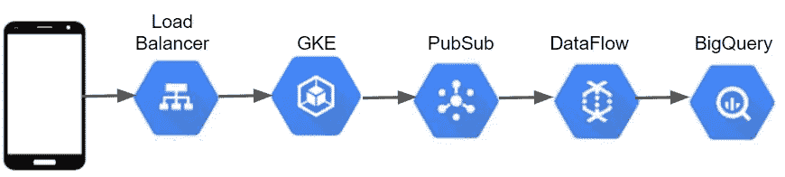
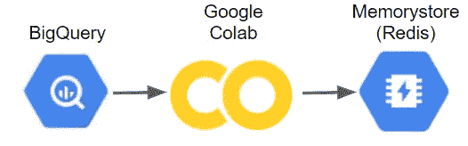
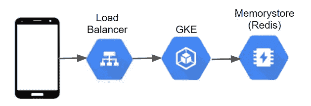
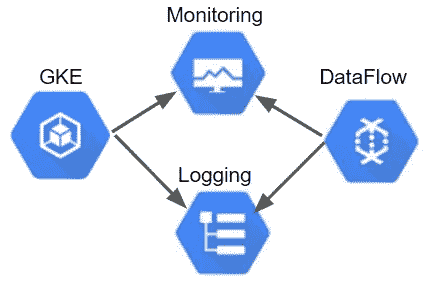

# 无服务器世界中的数据科学

> 原文：<https://towardsdatascience.com/data-science-in-a-serverless-world-d04632e07a67?source=collection_archive---------31----------------------->

[来源](https://pxhere.com/en/photo/1596860)

## 利用托管服务构建数据产品

在大公司中，通常有单独的团队来训练机器学习模型，并将这些模型投入生产。数据科学团队可能负责特征工程、模型选择和超参数调整，而机器学习工程团队负责构建和维护服务于训练模型所需的基础设施。随着云平台提供越来越多的托管服务，这种关注点的分离不再必要，数据科学家现在可以构建生产系统。处于数据科学和机器学习工程交汇点的数据科学家通常被称为应用科学家，这是一个可以为公司提供重要价值的角色。

谷歌云平台(GCP)和其他云提供商现在为数据库、消息传递、监控、容器、流处理和许多其他任务提供无服务器和完全托管的解决方案。这意味着团队可以快速构建端到端的机器学习管道，同时减少供应和监控基础设施所需的时间。In 使数据科学家能够构建生产级的数据产品，其中设置了监控，并且系统可以从故障中恢复。除了只关注模型训练，应用科学家还可以构建服务于 ML 模型的生产系统。

为什么单个团队能够利用托管服务构建端到端的机器学习管道非常有用？

*   **快速开发:**让一个团队负责模型构建和模型部署通常会导致项目更快的迭代，从而在扩展系统之前产生更多的原型和测试。使用托管服务，如 GCP Redis 上的 Memorystore，使团队能够用应用程序数据库制作数据产品的原型，而不必担心启动和监控基础架构。
*   **简化翻译:**当不同的团队执行模型构建和模型部署时，通常会使用不同的工具集，并且可能需要将使用 Python 训练的模型翻译成不同的编程语言，例如 Go。当团队同时负责这两项任务时，通常会使用相似的工具来完成这两项任务，比如使用 Python 来进行模型训练和模型服务。这种翻译的减少对于构建实时系统特别有用。
*   **发展专业知识:**构建端到端系统意味着数据科学家将获得使用标准工具之外的工具的实践经验，例如使用 NoSQL 工具和 Kubernetes。

虽然让单个团队使用托管服务构建数据产品有几个优点，但也有一些缺点:

*   **成本:**当您达到一定规模时，托管服务通常比托管解决方案更昂贵。例如，无服务器功能非常适合原型开发，但是对于大容量管道来说成本太高。
*   **缺失功能:**云提供商可能没有针对您需要使用的服务的完全托管产品，或者该产品可能无法提供应用所需的性能要求。例如，一些组织使用 Kafka 代替 PubSub 进行消息传递，因为延迟要求较低。
*   **DevOps:** 让一个数据科学团队构建和部署机器学习管道意味着该团队现在需要数据产品，这可能不是该角色的期望。对于关键应用程序，与工程或云运营团队合作非常有用。

数据科学团队使用托管服务构建端到端数据产品会是什么样子？我们将概述在 GCP 上为移动应用程序服务的实时模型。

数据收集管道

## 数据收集

为这个数据产品设置的第一个组件是从移动应用程序收集事件的管道。我们需要将数据从移动设备传输到 BigQuery，以便为训练模型提供历史数据。对于模型应用，我们将使用 Redis 来执行实时特征工程。我们需要为这个管道创建两个组件:一个 web 服务将 HTTP post 事件转换成 JSON 消息并将事件传递给 PubSub，一个数据流作业将 PubSub 设置为数据源，将 BigQuery 设置为数据接收器。web 服务可以使用 Python 中的 Flask 或 Java 中的 Undertow 编写，而数据流作业可以使用 Python 或 Java 编写。我们可以使用以下服务通过 GCP 上的托管服务来构建收集管道:

*   **负载平衡:**该服务提供第 7 层负载平衡，以提供一个端点，移动设备可以调用该端点来发送跟踪事件。要设置负载平衡器，我们首先需要在 Kubernetes 上部署跟踪服务，并使用节点端口公开该服务。
*   **Google Kubernetes 引擎(GKE):** 我们可以使用 Docker 将 web 服务容器化，并使用托管的 Kubernetes 托管服务。该服务接收 HTTP posts 形式的跟踪事件，并将 post 有效负载转换为 JSON 字符串，然后传递给 PubSub。
*   **PubSub:** 我们可以使用 PubSub 作为消息代理，在管道中的不同服务之间传递数据。对于收集管道，消息从 web 服务传递到数据流作业。
*   **云数据流:**数据流作业定义了一组要在数据管道上执行的操作。对于这个管道，作业将执行以下操作:使用来自 PubSub 的消息，将 JSON 事件转换为 BigQuery 记录，并将记录传输到 BigQuery。
*   **BigQuery:** 我们可以使用 BigQuery 作为托管数据库来存储来自移动应用程序的跟踪事件。

一旦这些组件建立起来，我们就有了一个收集跟踪事件的管道，可以用来建立机器学习模型。在下面列出的帖子中，我提供了类似管道的代码示例。

 [## 简单且可扩展的分析管道

### 收集关于应用程序使用和用户行为的数据，如玩家在游戏中的进度，对于产品来说是无价的…

towardsdatascience.com](/a-simple-and-scalable-analytics-pipeline-53720b1dbd35) 

模型培训渠道

## 模特培训

有了 GCP，我们可以使用 Google Colab 作为托管笔记本环境，通过 scikit-learn 等库来训练模型。我们可以使用 Python notebook 环境来训练和评估不同的预测模型，然后将性能最佳的模型保存到 Redis 中，供模型应用程序服务使用。如果应用服务不是用 Python 编写的，那么使用诸如 [ONNX](https://github.com/onnx/onnx) 这样的可移植模型格式是很有用的。下面的帖子介绍了 Google Colab 平台。

 [## Google Colab 入门

### 沮丧和困惑的基本教程

towardsdatascience.com](/getting-started-with-google-colab-f2fff97f594c) 

模型服务管道

## 特征工程和建模服务

一旦我们有了一个我们想要服务的训练好的模型，我们将需要构建一个应用程序，该应用程序将基于跟踪事件实时更新每个用户的特征向量，并且还实时服务于模型预测。为了将编码跟踪事件的特征向量存储到用户配置文件中，我们可以使用 Redis 作为一个低延迟的数据库，在这里我们检索和更新这些值，如下面列出的博客文章中所述。对于模型服务，我们需要构建一个 web 服务，该服务从 Redis 获取用户配置文件，应用存储在 Redis 中的模型，该模型是使用 Google Colab 训练的，并将模型预测返回给模型应用程序，在模型应用程序中，模型预测可用于个性化应用程序。与跟踪管道类似，通过将这些应用程序容器化，web 服务可以托管在托管的 Kubernetes 上。

 [## 实时特征工程和 ML 模型的 NoSQL

### 使用流式数据构建用户配置文件

towardsdatascience.com](/nosql-for-real-time-feature-engineering-and-ml-models-93d057c0a7b8) 

监控组件

## 监视

为了监控应用程序，我们可以使用通过 Stackdriver 提供的 GCP 中的日志和监控托管服务。我们可以记录来自 GKE 上托管的服务的事件，以及从数据流作业到堆栈驱动程序日志的事件。我们还可以将这些服务的自定义指标发送到 Stackdriver monitoring，在那里可以根据阈值设置警报。通过设置这些数据流，可以设置对管道的监控，其中触发警报并将其转发给 Slack、SMS 或 PagerDuty，并且可以使用 Stackdriver 查看应用程序日志。下面的帖子中提供了使用 Stackdriver 进行监控和日志记录的代码示例。

 [## 与 GCP 合作开发数据科学

### 为模型服务部署生产级容器

towardsdatascience.com](/devops-for-data-science-with-gcp-3e6b5c3dd4f6) 

## 结论

使用托管服务可以减少设置和监控基础架构所需的开发运维工作量，从而使数据科学团队能够着手将模型投入生产。虽然支持数据科学团队构建端到端管道可以加快数据产品的开发，但过度依赖托管服务可能会大规模推高成本。在本帖中，我们讨论了一些在 GCP 可用的托管服务，数据科学家可以利用这些服务来构建实时 ML 模型。

本·韦伯是 Zynga 的一名杰出的数据科学家。我们正在[招聘](https://www.zynga.com/job-listing-category/data-analytics-user-research/)！