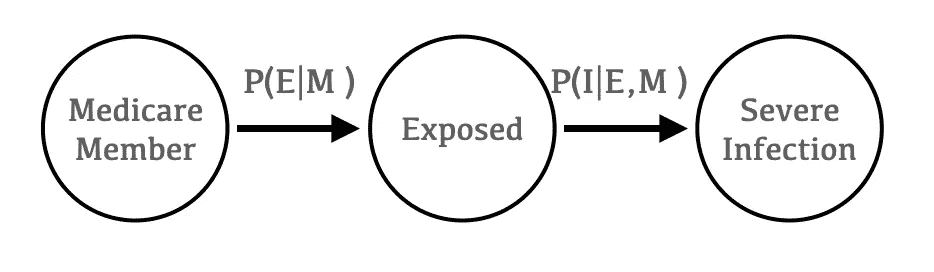

# 黑天鹅时代的数据科学

> 原文：<https://towardsdatascience.com/data-science-in-black-swan-times-part-1-understand-your-causal-chain-9d45355c8e2c?source=collection_archive---------47----------------------->

## 第 1 部分:理解你的因果链

图片鸣谢迪克·丹尼尔斯:[https://commons . wikimedia . org/wiki/File:Black _ Swan _(Cygnus _ atratus)_ rwd . jpg](https://commons.wikimedia.org/wiki/File:Black_Swan_(Cygnus_atratus)_RWD.jpg)

在他的书《黑天鹅》中，作者纳西姆·塔勒布将黑天鹅事件描述为那些不可预测的、带来严重后果的事件，而人们事后将其描述为完全可预测的。我认为这三个条件都适用于新冠肺炎造成的疫情是合理的。在这段时间里，实际上日常生活的每一部分都被改变了。这就提出了大多数预测模型有效性的问题。在这种时候，评估你的模型的潜在假设是特别重要的，有一个统计背景是有帮助的。

# 重温链式法则

在我成为数据科学家之前，我是一名粒子物理学家。粒子物理学是独一无二的，因为你研究的是肉眼看不见的现象。信号极其稀少。通过组合留在各种电子检测器中的签名来识别信号事件，得到的电子签名被很好地描述为随机事件。虽然机器学习正被用来更有效地识别这些类型的罕见事件的信号，但这些技术并没有很快被采用。除了物理学家的固执之外，这个事实的原因是在这个领域中，潜在的一连串事件被很好地模拟了。理解这些潜在过程的变化本身就很有趣，因为它可以表明一种新的物理现象的存在。

对随机的，通常是罕见的事件进行分类是机器学习最适合的任务之一，也是它最普遍的应用。然而，与上述场景不同，机器学习通常应用于中间步骤没有得到很好研究的场景。在大多数情况下，最终结果的有效模型是有用的，即使因果链中的每一步都没有被完全理解。虽然电子以光速穿过气体听起来很难建模，但它甚至没有触及人类行为带来的复杂问题的表面。

例如，考虑一个应用于医疗保险人群的模型，该模型试图预测某个成员是否会因流感住院。作为一个功能集，您将利用患者的医疗账单历史以及人口统计信息。虽然看起来这是一件简单的事情，但实际上在这个过程中会发生很多事情。首先，一个人需要接触流感。第二，这种暴露导致感染严重到需要住院治疗。当然，即使这张图片也过于简化了，但它对于说明性的目的是有用的。

作者图片

当我们训练一个模型时，它只是简单地学习 P(I|M)，而不是对过程中的中间步骤进行建模。大多数情况下，这是可以的，因为有理由假设大多数人在每个流感季节都会接触到流感，而我们真正了解的是 P(即|E，M)。在这个社会距离越来越远的时代，最初的假设是站不住脚的。在正常情况下，P(E|M)将被建模为高常数。然而，在疫情期间，这一假设将不再成立。因果链中的第二步，P(即|E，M ),在这段时间内很可能不会发生变化。

# 理解含义

所有这些都有点理论化，但是这些想法对模型的有效性有现实世界的影响。社会距离的测量已经使关于 P(E|M)的最初假设无效。连锁反应是整个医疗保健系统的利用率急剧下降。真正的问题是，你需要重新培训你的模型吗？答案是它依赖于上下文，特别是围绕模型部署的上下文。

医院部门可能会使用流感模型的一个用例来尝试预测住院资源的总体负载。我们模型的输出将给出我们人口中各种成员住院的概率，当与一些简单的算法(或一些奇特的蒙特卡罗模拟)结合时，可以产生对预期医院负荷的预测。这是一个模型部署的例子，由于违反了因果链中的初始链接，该模型部署将完全无效。解决这个问题将会非常复杂。如上所述，在正常情况下，P(E|M)可以被建模为一个高常数。社会距离措施对这种分布的影响非常不均衡。虽然这将是一个净减少，一些群体不太能够自我隔离。您可能需要结合当前数据重新训练模型。

一个完全独立的用例是基于人群进行预测，并确定如果感染流感最有可能出现急性并发症的个体。如今，大多数人对去医院接受非急症治疗保持谨慎，这是理所当然的。这种行为对大多数人来说是谨慎的。也就是说，对于那些最容易患流感并发症的人来说，注射流感疫苗仍然是个好主意。对于大多数人来说，知道他们是否接种流感疫苗会更好是一个艰难的决定，大多数人会默认呆在家里。在这种情况下，因果模型保持不变。尽管个人暴露于流感的概率没有很好地建模，但在此应用中，这不是考虑的主要问题。利用这种模式的护理管理团队实际上是在试图传达因果链 P(即 M)中的第二步。即使抛开数学不谈，你也可以想象护理经理向会员传达的信息可能是这样的:“虽然我们希望你保持安全，但我们认为**如果你今年患了流感，那么你就有出现不良**反应的风险。”护理经理会合理地传达因果模型的第二部分，而不提供任何这样做的想法。在这种情况下，模型完成了它的工作，它在这个上下文中的应用不会受到影响。

# 接下来呢？

如果上下文没有把你的模型放进垃圾箱，并不意味着你应该仔细检查它。在我的下一篇文章中，我将讨论数据漂移，并看看我们如何评估模型的基础条件是否已经改变到需要重新训练模型的程度。

*原载于 2020 年 10 月 8 日*[*https://closed loop . ai*](https://closedloop.ai/data-science-in-black-swan-times-part-1-understand-your-causal-chain/)*。*