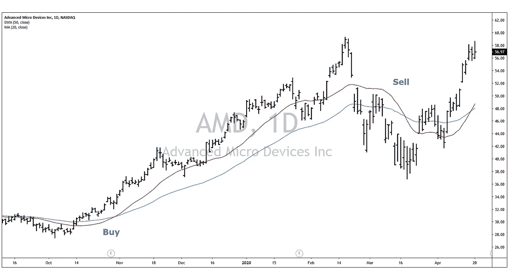
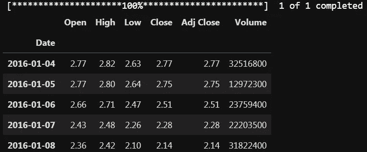
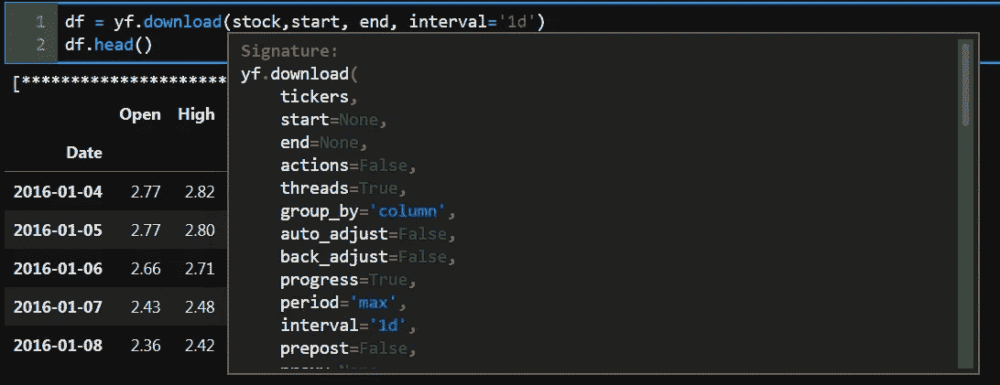
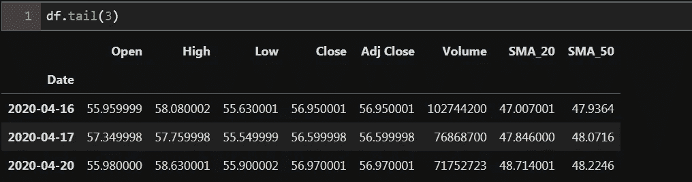
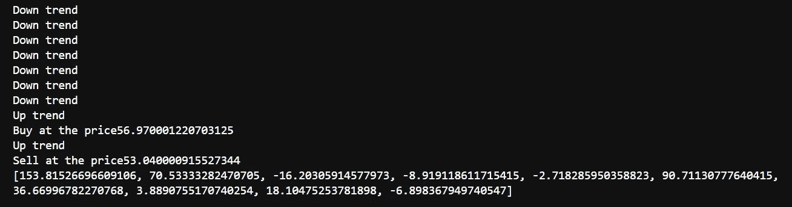
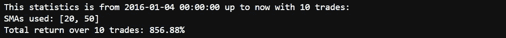
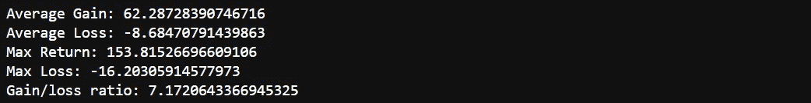
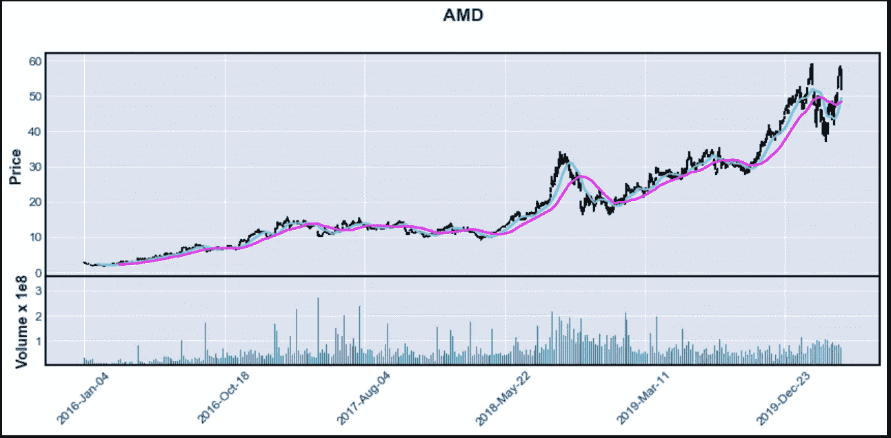

# 金融中的数据科学

> 原文：<https://towardsdatascience.com/data-science-in-finance-56a4d99279f7?source=collection_archive---------18----------------------->

## Python 中历史股价数据的移动平均策略回溯测试


马库斯·斯皮斯克在 [Unsplash](https://unsplash.com?utm_source=medium&utm_medium=referral) 上的照片

在这项工作中，我将从 Yahoo Finance 中提取特定股票代码的历史价格数据，并检查一个简单的策略，看看它是否可以盈利。你可以通过我的 Github [账号](https://github.com/mardani72/Finance_Moving_Ave_Strategy)访问这部作品的源代码。

几年前，当我想投资股票市场时，在没有 python 知识的情况下测试一个策略会花费我在各种网站上订阅的费用。坦率地说，在大多数情况下，我对数据筛选和入围的标准并不满意。

让我们定义一些将在这项工作中使用的概念:
简单移动平均线(SMA):这是一个趋势跟踪指标，可以通过对一组给定的值进行算术平均来计算。换句话说，一组数字或者金融工具的价格相加，然后除以这组数字中的价格数(更多细节请参见 i [nvestpedia](https://www.investopedia.com/terms/m/movingaverage.asp) )。

例如:如果我们想计算当前点的 SMA_20 值，我们可以将过去 20 天(或其他时间间隔)的收盘价相加，然后除以 20。

移动平均线策略建议当短均线穿过长均线时买入，当短均线穿过长均线时卖出。下图是买入信号(SMA_20，红线穿越蓝线，SMA_50)和出场点，反之亦然。



# **1-数据提取和准备**

历史股价数据可以从各种来源找到，但最简单的是雅虎财经。为此，我们需要导入 *yfinance* 库和其他相关的库，它们将用于使用 pandas 进行数据操作。

```
import numpy as np
import pandas as pd
import yfinance as yf
import datetime as dt
import matplotlib.pyplot as plt
import mplfinance as mpf
```

首先，我们需要定义我们将检查策略的时间范围。要使用 *yfinace* 库，日期格式应为 YYYY-MM-DD。将开始日期定义为你最喜欢的时间。你可以对结束日期做同样的事情，但是我更喜欢今天作为结束日期。我们可以将其定义如下:

```
start = '2016-01-01'                # format: YYYY-MM-DD
end = dt.datetime.now()             # today
```

在下一步中，将您最喜欢的股票代码 ticker 字符串存储在 stock 变量中。我们打算用它在雅虎财经库中作为数据框下载:

```
stock='AMD'
df = yf.download(stock,start, end, interval='1d')
df.head()
```



在这里，我选择了 AMD ticker (Advanced Micro Devices，semiconductor)并使用 *yfinance* 的下载属性将价格数据存储在数据帧中。有几个参数，我们应该包括如股票名称，开始和结束日期。默认的采样间隔是一天，但是您也可以选择其他间隔。数据框的最后一列是开盘价、最高价、最低价、收盘价、调整后收盘价和交易量。

要查看我们可以为下载功能定义哪些参数，我们可以在 jupyter 笔记本(如下图)中点击功能括号内的 *shift* + *Tab* 键。如果你向下滚动，它也有每个参数的解释。



# 2- **移动平均计算**

我们来定义短、长简单移动平均线，SMA 变量，并把它们存储在这里名为 SMAs 的列表中。

```
short_sma= 20
long_sma = 50
SMAs=[short_sma, long_sma]
```

我们可以使用滚动和均值函数逐个计算每个 SMA 的移动平均值，但是为了使它更灵活地用于两个以上的 SMA，我们可以使用 for 循环，例如:

```
for i in SMAs:
    df["SMA_"+str(i)]= df.iloc[:,4].rolling(window=i).mean()
```

这一行代码表示，将在预定义的时间窗口中使用滚动函数计算每个 SMAs，调整后的收盘价位于数据框的第 5 列。然后，每个 SMA 将被添加为一个新列，名称为 SMA，后缀为我们准备的时间窗口。

为了检查结果，我们可以调用 tail 函数来查看数据帧的最后几行。增加了 SMA_20 和 SMA_50。



# 3- **SMAs 相对位置识别**

这部分是均线策略回溯测试的主干。应该定义这两个 SMA 的相对位置，以识别趋势方向。它有简单的基本原则:如果短均线高于长均线，我们在上升趋势区域，在相反的条件下建仓卖出。让我们看看代码:

```
position=0 # 1 means we have already entered poistion, 0 means not already entered
counter=0
percentChange=[]   # empty list to collect %changes 
for i in df.index:
    SMA_short=df['SMA_20']
    SMA_long =df['SMA_50']
    close=df['Adj Close'][i]

    if(SMA_short[i] > SMA_long[i]):                          #line 9
        print('Up trend')
        if(position==0):
            buyP=close   #buy price
            position=1   # turn position
            print("Buy at the price"+str(buyP))

    elif(SMA_short[i] < SMA_long[i]):
        print('Down trend')
        if(position==1):   # have a poistion in down trend
            position=0     # selling position
            sellP=close    # sell price
            print("Sell at the price"+str(sellP))
            perc=(sellP/buyP-1)*100
            percentChange.append(perc)                      #line 23
    if(counter==df["Adj Close"].count()-1 and position==1):
        position=0
        sellP=close
        print("Sell at the price"+str(sellP))
        perc=(sellP/buyP-1)*100
        percentChange.append(perc)counter+=1
print(percentChange)
```

这是一个 for 循环代码块，它将迭代我们先前读入 df 变量的数据集。在从数据框架中定义收盘价、短和长 SMA 后，它将根据短和长 SMA 值使用 if 语句进入两个不同的分支(第 9 行)。如果短均线在长均线之上，它打印出趋势方向(“上升趋势”)，如果投资组合中没有现有头寸，它将根据当天的收盘价买入头寸(信号)。如果短 SMA 的读数比长 SMA 的读数小，则它处于下降趋势。如果我们已经有头寸，我们应该以调整后的收盘价卖出。使用 pandas 中的 append 函数(第 23 行)，我们将把结果存储到一个 *percentChange* 变量列表中，如前一行所定义的。块代码的最后一部分，从第 24 行开始，是检查是否有一个开放位置，我们正在向下计数到数据帧的末尾。



在上图中，你可以看到屏幕打印的 lat 部分，它显示了趋势打印、买入和卖出信号以及存储在列表中的所有交易。

# 4-统计

在定义了一些变量(如收益和损失)和它们的数量后，我们可以对 *perecntChange* 中的单个值再次使用 for 循环来找出统计信息。列表中的正值表示增益，将在增益变量中累加。负值是损耗，将存储在损耗变量中。我们可以将总回报以百分比的形式打印出来，并将数值四舍五入到小数点后两位。

```
gains=0
numGains=0
losses=0
numLosses=0
totReturn=1
for i in percentChange:
    if(i>0):
        gains+=i
        numGains+=1
    else:
        losses+=i
        numLosses+=1
    totReturn = totReturn*((i/100)+1)
totReturn=round((totReturn-1)*100,2)
print("This statistics is from "+str(df.index[0])+" up to now with "+str(numGains+numLosses)+" trades:")
print("SMAs used: "+str(SMAs))
print("Total return over "+str(numGains+numLosses)+ " trades: "+ str(totReturn)+"%" )
```



在这个例子中，这个策略建议了 2016 年初的 10 笔交易。这只股票的总回报率超过 850%。

为了计算平均收益和损失，我们可以简单地使用 if 语句来查看收益的数量是否大于零。如果是这样，平均增益可以通过增益除以增益数来计算。如果损失数量为正值，它还会计算平均损失。最大的收益和损失也是交易策略的一个吸引人的地方。

```
if (numGains>0):
    avgGain=gains/numGains
    maxReturn= str(max(percentChange))
else:
    avgGain=0
    maxReturn='unknown'if(numLosses>0):
    avgLoss=losses/numLosses
    maxLoss=str(min(percentChange))
    ratioRR=str(-avgGain/avgLoss)  # risk-reward ratio
else:
    avgLoss=0
    maxLoss='unknown'
    ratioRR='inf'
print("Average Gain: "+ str(avgGain))
print("Average Loss: "+ str(avgLoss))
print("Max Return: "+ maxReturn)
print("Max Loss: "+ maxLoss)
print("Gain/loss ratio: "+ ratioRR)
```



在这个例子中，一支股票的平均收益是 62 美元，平均损失几乎是 8 美元。最大收益 153，最大亏损 16 美元。

击球率的计算方法是将收益数除以总交易数。对于 0 到 1 之间的位置范围，这可能是输入准确性的标志。1 是最准的蝙蝠。

```
if(numGains>0 or numLosses>0):
    batAvg=numGains/(numGains+numLosses)
else:
    batAvg=0
print("Batting Avg: "+ str(batAvg))
```

在这个例子中，击球率是 0.6。

# 5-绘图

虽然您可以使用 seaborn 或 matplotlib 库来绘制股票价格，但是 mplfinance 库是专门为绘制股票价格而设计的。它的函数接受各种属性，如图形大小、价格绘图类型(直线、蜡烛线等)和移动平均线。

```
mpf.plot(df, type = 'ohlc',figratio=(16,6), 
         mav=(short_sma,long_sma), 
         volume=True, title= str(stock), 
         style='default')
```



# **结论**

使用 python 和其他库，我们能够提取历史股票价格数据，并检查数据上的各种策略。均线策略是一个简单的概念，基于短期和长期均线的价格趋势以及它们之间的相对位置。在这项工作中，我们展示了使用 for 循环和 if 语句方法，我们可以很容易地在历史数据集上检查这种策略。

如果您有问题或需要更多的澄清，请随时与我联系。

> 声明:这篇文章不是财务建议。它有教育目的。